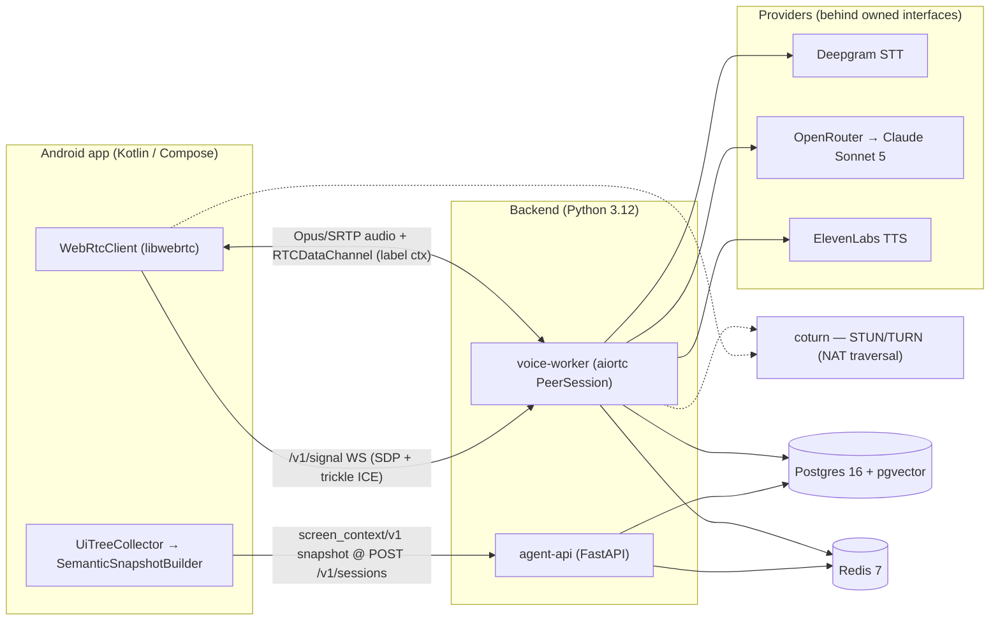

# VyaparPay Voice Support Agent

> A voice AI support agent that can **see the user's screen** — raw WebRTC voice (libwebrtc ↔ aiortc, own signaling), live Android app context, and a typed LLM tool layer, so it opens a support call already knowing what went wrong.


**VyaparPay** is a demo "Paytm for Business"-style merchant payments app (India, INR); **Asha** is the AI support agent embedded in its Android app. The signature capability is *screen-aware context*: before the merchant says a word, Asha holds a ≤300-token semantic snapshot of the live screen, the last ~15 user actions, and the most recent API error. This repo is a portfolio project — the agent stack (voice, context, memory, tools, safety) is real engineering; the business it serves is seeded fixtures, marked honestly throughout.

**Read this with:** [docs/01](docs/01-product-and-use-case.md) for the product and canonical incident, [docs/07](docs/07-ui-semantic-context.md) for the screen-to-context transform (the headline), [docs/06](docs/06-voice-pipeline.md) for the sub-second voice loop, and [docs/16](docs/16-tech-stack.md) for the stack, ADRs, and cost model.

---

## 🎬 Demo

**Demo video coming with Phase 3.** Until then, the canonical call — Rajesh Kumar's declined ₹245 vendor payment — reads like the transcript below. The entire greeting was composed *before Rajesh spoke*, from what the app sent at session creation:

> **What Asha holds at t = 0 — zero tool calls, straight from `POST /v1/sessions`:**
> - 🖥️ **Screen** — `PaymentScreen` / `vendor_payment`: ₹245 → "Amazon Business"; "Daily Limit Exceeded" dialog + "Payment Failed" snackbar visible
> - ⚠️ **Failed API** — `POST /payments → 402 DAILY_LIMIT_EXCEEDED` (a fact never rendered on screen)
> - 🧭 **Event trail** — `tap "Pay Now" → api_error → nav Help → tap "Call Support"`

```text
Asha   (speaks first, ~2 s after the tap — no user speech yet)
       "Hi Rajesh, I can see your ₹245 payment to Amazon Business didn't go
        through — your daily transaction limit was exceeded. Would you like me
        to request a limit increase, or retry the payment tomorrow?"

Rajesh "Wait, that can't be right. I have more than eighteen thousand in my
        wallet. Why would a ₹245 payment fail?"

Asha   (two read tools — every figure is fetched, never hallucinated)
       "Your wallet balance is fine, ₹18,450. The block is your bank's daily
        limit: ₹25,000, and ₹24,890 has already gone through today."

Rajesh "Get the limit increased."

Asha   (confirm-gated mutation — executes only after an explicit "yes")
       "To confirm: raise your daily limit from ₹25,000 to ₹50,000. Go ahead?"
Rajesh "Yes, do it."
Asha   "Done — request LMT-2026-0724-0913 submitted, reviewed within 4 hours."
```

The full 9-turn annotated transcript — with per-turn *Knew / Tool / Latency* boxes — is [docs/01](docs/01-product-and-use-case.md) §8.

---

## Why this is interesting

- **The agent sees the screen, cheaply.** A raw Compose semantics tree is ~214 nodes / **~4,000+ tokens**; `SemanticSnapshotBuilder` compresses it on-device to a **≤300-token** role-based IR (`screen_context/v1`) — a >13× reduction that is *more* informative than the raw tree, because it carries the `402` decline code that was never drawn. This is a domain-specific compiler, not a JSON dump ([docs/07](docs/07-ui-semantic-context.md)).
- **The voice loop is sub-second, with barge-in.** Everything streams — STT partials, LLM tokens, sentence-chunked TTS — for a turn budget of **p50 ≤ 1.0 s, p95 ≤ 2.0 s**, and interruption (TTS stop) within **≤ 250 ms** ([docs/06](docs/06-voice-pipeline.md)).
- **The tool layer does not hallucinate.** Sixteen typed (Pydantic in/out) tools; the LLM never states an account fact a read tool can fetch, and every mutating tool (`request_limit_increase`, `block_card`, …) requires a voiced confirmation and an explicit "yes" before it runs — idempotency-keyed and scoped to the authenticated session user ([docs/10](docs/10-tool-calling.md)).
- **The WebRTC stack is hand-rolled, both ends.** No managed platform: the Android app (libwebrtc via `org.webrtc`) and the Python agent (aiortc) are two direct peers, with an owned WebSocket signaling protocol (SDP offer/answer + trickle ICE), self-hosted coturn for STUN/TURN, and a native `RTCDataChannel` — the protocol-level engineering most voice stacks outsource ([docs/06](docs/06-voice-pipeline.md)).

---

## The signature feature: before → after

**Before** — raw Compose semantics, 6-line excerpt of a 214-node tree (**≈4,000+ tokens** serialized):

```json
{"nodeId": 61, "type": "ComposeNode(TextField)", "config": {"TestTag": "amount_input",
  "EditableText": "245", "TextSelectionRange": "TextRange(3, 3)", "Focused": false,
  "ImeAction": "Number", "SetText": "AccessibilityAction(...)", "OnClick": "..."}},
{"nodeId": 102, "config": {"TestTag": "pay_now_cta", "Role": "Button", "Text": ["Pay Now"], "Enabled": true}},
{"nodeId": 131, "type": "ComposeNode(Dialog)", "config": {"IsDialog": true,
  "PaneTitle": "Daily Limit Exceeded", "TestTag": "limit_dialog"}}
```

**After** — the semantic IR the model actually receives (**≈300 tokens**), enriched with the API error and event context no tree walk can produce:

```json
{
  "v": "screen_context/v1",
  "screen": "PaymentScreen",
  "flow": "vendor_payment",
  "components": [
    {"role": "amount_field", "label": "Amount", "value": "₹245"},
    {"role": "recipient", "label": "To", "value": "Amazon Business"},
    {"role": "primary_cta", "label": "Pay Now", "enabled": true},
    {"role": "dialog", "label": "Daily Limit Exceeded", "visible": true},
    {"role": "snackbar", "label": "Payment Failed", "visible": true}
  ],
  "last_action": {"type": "tap", "target": "Pay Now", "ts": 1784536440000},
  "last_api": {"method": "POST", "path": "/payments", "status": 402,
               "error_code": "DAILY_LIMIT_EXCEEDED"},
  "dirty_fields": [], "loading": false
}
```

The transform runs on the UI thread in ≤2 ms, redacts sensitive fields (card/PIN/PAN) at source, and is deterministic — same tree in, same IR out. Rule-by-rule spec and the wire schema live in [docs/07](docs/07-ui-semantic-context.md) and [protocol/](protocol/).

---

## Architecture at a glance



Two backend services share one `app/` package: **agent-api** (sessions — mints the signaling token and HMAC TURN credentials — seeded business APIs, context ingestion) and **voice-worker** (hosts the `/v1/signal` WebSocket, owns the aiortc peer, runs the pipeline). The initial snapshot rides REST so the greeting is ready before the peer connection exists; in-call deltas ride the `ctx` data channel. Full topology in [docs/02](docs/02-system-architecture.md).

---

## Tech stack

| Layer | Choice | Why (one line) |
|---|---|---|
| Android | Kotlin + Jetpack Compose | Compose's accessibility semantics tree is exactly what `UiTreeCollector` mines for ScreenContext |
| Realtime transport | Raw WebRTC — libwebrtc (`org.webrtc`) ↔ aiortc | Two direct 1:1 peers, no media server; we own SDP offer/answer, trickle ICE, and DTLS-SRTP end to end (ADR-001) |
| NAT traversal | coturn (self-hosted STUN/TURN) | Symmetric NAT on Indian mobile carriers needs TURN; per-session HMAC time-limited credentials (ADR-006) |
| Backend | Python 3.12 + FastAPI | Voice-AI ecosystem gravity; async-native, Pydantic validation at the boundary |
| Voice pipeline | Hand-rolled asyncio — Silero VAD, own endpointing + barge-in | The pipeline is the deliverable; agent frameworks would re-hide it (ADR-002) |
| STT | Deepgram Nova-3 (streaming) | Streaming partials, ~80 ms finalization after endpoint |
| Dialogue LLM | Claude Sonnet 5 via OpenRouter | Tool-calling + tone; one wire format, per-request fallback arrays |
| Utility LLM | Claude Haiku 4.5 | Summarization every 6 turns, intent classification, context compression |
| TTS | ElevenLabs Flash v2.5 | Lowest-latency tier (~75 ms model latency), the second-largest turn cost |
| Data | Postgres 16 + pgvector · Redis 7 | One durable store incl. vectors; Redis carries hot `session:{id}` state (ADR-003) |
| Observability | OpenTelemetry → Tempo · Grafana | One trace per conversation turn; the demo closes on a Grafana trace + cost row (ADR-005) |

Full ADRs with flip conditions, the model/pricing table, and the **≈ $0.30 (~₹25) per call** cost model are in [docs/16](docs/16-tech-stack.md).

---

## Documentation

A seventeen-document architecture set, complete for Phase 1. Start at the [docs index](docs/README.md), which also carries reading paths and a glossary.

| # | Document | Covers |
|---|---|---|
| 01 | [Product & Use-Case](docs/01-product-and-use-case.md) | Weighted domain choice, product surface, Rajesh's incident, the 9-turn transcript |
| 02 | [System Architecture](docs/02-system-architecture.md) | The two-service split, component map, call/request topology |
| 03 | [Android Architecture](docs/03-android-architecture.md) | Gradle module graph, call UI, foreground call service |
| 04 | [Backend Architecture](docs/04-backend-architecture.md) | FastAPI layout, async discipline, the `app/` package split |
| 05 | [Agent Architecture](docs/05-agent-architecture.md) | The intelligence loop: context → prompt → tool → route → safety |
| 06 | [Voice Pipeline](docs/06-voice-pipeline.md) | Raw WebRTC transport (signaling, ICE, aiortc), streamed STT→LLM→TTS, barge-in, **the latency budget** |
| 07 | [UI Semantic Context](docs/07-ui-semantic-context.md) | Compose tree → ScreenContext IR (**owns `screen_context/v1`**) |
| 08 | [Context & Events](docs/08-context-and-events.md) | Snapshot/delta/event ingestion, the ring buffer, data-channel envelope |
| 09 | [Memory Architecture](docs/09-memory-architecture.md) | Short-term / session / profile / semantic tiers, rolling summary, pgvector |
| 10 | [Tool-Calling](docs/10-tool-calling.md) | The 16-tool catalog, typed contracts, confirm-required mutations, idempotency |
| 11 | [Prompt Engineering](docs/11-prompt-engineering.md) | The slot budget, prefix caching, persona/voice rules (**owns token numbers**) |
| 12 | [Data Models](docs/12-data-models.md) | Pydantic + SQLAlchemy schemas, seeded fixtures, the Redis keyspace |
| 13 | [API Contracts](docs/13-api-contracts.md) | REST endpoints, `POST /v1/sessions`, the `/v1/signal` protocol, wire formats (**co-owns schemas**) |
| 14 | [Security](docs/14-security.md) | Prompt-injection fencing, PII redaction, token TTL, tool authorization |
| 15 | [Scalability & Reliability](docs/15-scalability-and-reliability.md) | Failure-mode tables, degradation ladder, single-machine → multi-node |
| 16 | [Tech Stack & ADRs](docs/16-tech-stack.md) | Six ADRs with flip conditions, model/pricing, **cost per call** |
| 17 | [Roadmap](docs/17-roadmap.md) | Six phases, the MVP line, the post-Phase-6 catalog |

---

## Repository structure

```text
voice-calling-agent/
├── android/                 # Kotlin + Jetpack Compose merchant app + call UI
│   ├── app/                 # :app — application shell, Hilt DI wiring
│   ├── core/
│   │   ├── screencontext/   # UiTreeCollector, SemanticSnapshotBuilder (the signature transform)
│   │   ├── network/         # last_api interceptor feeding ScreenContext
│   │   ├── analytics/       # EventTracker — 50-entry action ring buffer
│   │   └── ui/              # shared Compose components
│   ├── feature/             # dashboard, payments, support (SupportButton, ConversationOverlay)
│   └── voice/               # WebRtcClient (org.webrtc), SignalingClient, VoiceCallService, CallStateMachine
├── backend/                 # Python 3.12 — agent-api + voice-worker share one app/ package
│   ├── app/
│   │   ├── agent/           # SessionManager, ContextBuilder, PromptBuilder, ToolExecutor, LLMRouter, SafetyLayer
│   │   ├── context/         # SnapshotIngestor, EventLog, ContextCompressor
│   │   ├── memory/          # short-term / session / profile / semantic (pgvector)
│   │   ├── tools/           # 16-tool catalog, typed Pydantic contracts
│   │   ├── providers/       # OpenRouterLLM, DeepgramStt, ElevenLabsTts, OpenAIEmbeddings
│   │   ├── voice/           # SignalingServer, PeerSession (aiortc), VadEndpointer — hand-rolled WebRTC + voice pipeline
│   │   ├── api/             # FastAPI routes (POST /v1/sessions, seeded business APIs)
│   │   └── models/          # Pydantic + SQLAlchemy
│   └── tests/
├── protocol/                # Cross-language wire schemas (screen_context/v1, app_event/v1)
├── infra/                   # docker-compose stack: coturn, Postgres, Redis, Grafana/Tempo
└── docs/                    # 17-document architecture set (start at docs/README.md)
```

---

## Roadmap

| Phase | Scope | Status |
|---|---|---|
| 1 — Architecture | This documentation set; the design a reviewer can audit before code | ✅ |
| 2 — Backend MVP | Compose stack, seeded business APIs, text-chat agent loop, tools end-to-end | ⬜ |
| 3 — Voice MVP (raw WebRTC) | SignalingServer + coturn + aiortc PeerSession, Silero VAD pipeline, Deepgram/ElevenLabs streaming, Android `org.webrtc` call UI | ⬜ |
| 4 — Screen-aware context | `UiTreeCollector` → ScreenContext → prompt | ⬜ |
| 5 — Memory + RAG | Memory tiers, pgvector retrieval, observability dashboard | ⬜ |
| 6 — Production hardening | Security pass, evals, load tests, CI/CD, docs polish | ⬜ |

Phase sizing and the post-Phase-6 enhancement catalog are in [docs/17](docs/17-roadmap.md).

---

## License

Released under the [MIT License](LICENSE).

Built by Bibekananda Nayak — [github.com/your-handle](https://github.com/your-handle) *(profile link placeholder)*.
