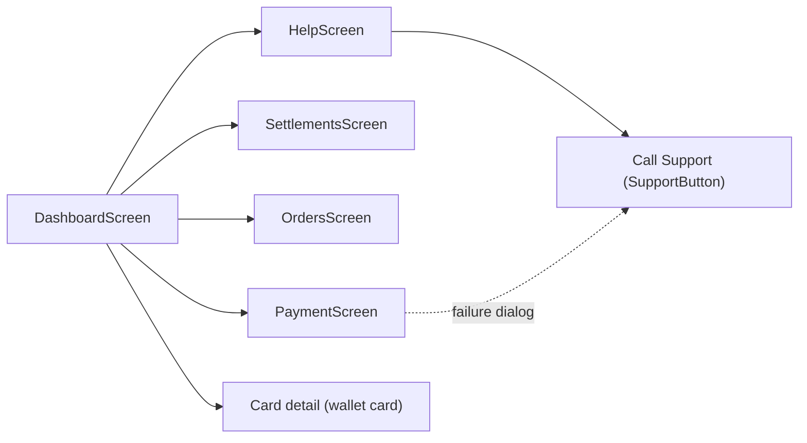
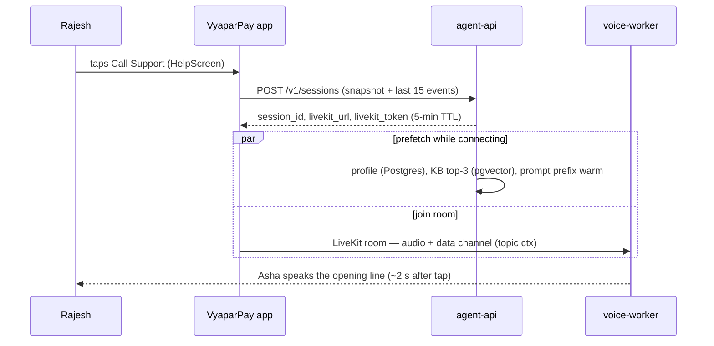

# Product & Use-Case Selection

This document records how we chose the business domain for the project's demo product and defines that product — **VyaparPay**, a "Paytm for Business"-style merchant payments app for the Indian market — in enough detail that every later document can reference its screens, personas, and canonical support incident by name. It covers the weighted industry comparison, the shortlist deep-dive, the recommendation rationale, the product surface, the two personas, the end-to-end user journey, and the annotated demo call transcript.

**Read this with:** [docs/02](02-system-architecture.md) for the system that serves this product, [docs/07](07-ui-semantic-context.md) for how the screen becomes agent context, and [docs/10](10-tool-calling.md) for the tool contracts the transcript exercises.

---

## 1. Framing: the agent is the product, the app is the stage

This is a portfolio project. Its purpose is to demonstrate one thing at production-credible depth: an **AI voice support agent that already knows what is on the user's screen before the user says a word**. The demo app exists to give that agent something worth knowing.

That inverts the usual product question. We are not asking "which industry needs a support bot?" — every industry has answered yes to that. We are asking: **in which domain is the screen-aware voice agent load-bearing** — where the agent's signature capability (screen context + event timeline + live tool execution) is the difference between a useful call and a useless one, and where a recruiter watching a 90-second demo immediately understands why the capability matters?

A domain fails this test if:

- Most support contacts are answerable from server-side state alone (the screen adds nothing).
- The demo cannot be shown honestly (regulated data, consent walls).
- The tool surface is thin (one lookup tool is a FAQ bot, not an agent).

### Scoring criteria

Six criteria, scored 1–5 per industry. Weights are published up front so the table cannot be quietly tuned after the fact.

| Criterion | Weight | 1 means | 5 means |
|---|---|---|---|
| AI usefulness | 20% | Support contacts are trivially answerable; agent is decoration | Contacts are high-stakes, context-dependent, tool-heavy; agent resolves what a FAQ cannot |
| Technical depth | 20% | CRUD + one lookup | Rich state machines, money movement, error taxonomies, multi-step resolution flows |
| Recruiter appeal | 20% | Niche domain a reviewer must have explained | Domain a fintech/product recruiter recognizes in one sentence |
| Demo value | 15% | Incident is abstract; needs narration | Incident is visceral; a viewer feels the user's problem instantly |
| Extensibility | 15% | Two or three plausible tools, then it's done | 15+ natural tools, multiple flows, obvious roadmap |
| Architecture complexity | 10% | Little to exercise beyond the voice pipeline | Naturally exercises auth, idempotency, async jobs, event timelines |

**Why these weights:** the artifact is a portfolio, so the 60% block goes to what it must prove — that the AI is genuinely useful, that the engineering is deep, and that a hiring reviewer cares — while presentation and runway (demo value, extensibility, complexity) share the remaining 40%. Architecture complexity gets the smallest weight deliberately: the voice pipeline supplies complexity regardless of domain, so the domain's own complexity is a bonus, not a requirement.

---

## 2. Industry comparison

Fourteen candidate industries, scored honestly. Sorted by weighted total.

| # | Industry | AI useful (20%) | Tech depth (20%) | Recruiter (20%) | Demo (15%) | Extens. (15%) | Arch (10%) | **Weighted** |
|---|---|---|---|---|---|---|---|---|
| 1 | Business payments (B2B) | 5 | 4 | 5 | 4 | 5 | 4 | **4.55** |
| 2 | Banking (consumer) | 4 | 4 | 5 | 3 | 4 | 5 | **4.15** |
| 3 | Healthcare | 5 | 5 | 4 | 2 | 3 | 5 | **4.05** |
| 4 | Fintech consumer (P2P/wallet) | 4 | 4 | 4 | 4 | 4 | 4 | **4.00** |
| 5 | Merchant dashboard (SaaS) | 4 | 4 | 4 | 4 | 4 | 3 | **3.90** |
| 6 | Travel (OTA) | 4 | 3 | 3 | 4 | 3 | 3 | **3.35** |
| 7 | Food delivery | 3 | 3 | 3 | 5 | 3 | 3 | **3.30** |
| 8 | E-commerce | 3 | 3 | 3 | 4 | 4 | 3 | **3.30** |
| 9 | CRM | 4 | 3 | 3 | 2 | 4 | 3 | **3.20** |
| 10 | Insurance | 4 | 3 | 3 | 2 | 3 | 4 | **3.15** |
| 11 | Ride sharing | 3 | 3 | 3 | 5 | 2 | 3 | **3.15** |
| 12 | Inventory management | 3 | 3 | 2 | 2 | 3 | 3 | **2.65** |
| 13 | HR platform | 3 | 2 | 3 | 2 | 3 | 2 | **2.55** |
| 14 | Subscription services | 3 | 2 | 2 | 3 | 3 | 2 | **2.50** |

Reading the table honestly — the winner does **not** sweep:

- **Healthcare wins technical depth outright** (5): triage protocols, clinical state, drug interactions — nothing else comes close. It loses on demo value (2): you cannot show a credible healthcare demo without either fabricating PHI or drowning the demo in consent and compliance caveats, and a portfolio reviewer cannot verify clinical correctness anyway.
- **Ride sharing and food delivery win demo value** (5 each): "where is my order/driver" is instantly visceral. Both lose on AI usefulness (3) — a tracking widget solves the top contact reason without any agent, so the signature capability is not load-bearing.
- **Consumer banking and healthcare win architecture complexity** (5): KYC, card lifecycles, disputes, clinical workflows.
- **Business payments wins on breadth**: first or tied-first in AI usefulness, recruiter appeal, and extensibility; second tier everywhere else. It loses technical depth to healthcare, demo value to delivery/ride-sharing, and architecture complexity to banking. It wins the weighted total because it has no weak column, not because it dominates any single one.

### Scoring notes per industry

One honest sentence each, so the numbers can be audited rather than trusted.

| Industry | Why these scores |
|---|---|
| Business payments | Wins AI usefulness (failed money movement is high-stakes and tool-resolvable), recruiter appeal (fintech-legible in one sentence), and extensibility (16 natural tools); loses depth to healthcare and demo punch to delivery. |
| Banking (consumer) | Recruiter 5 and architecture 5 for regulatory and card-lifecycle machinery; demo 3 because the differentiating flows live in back-office systems no portfolio demo can show. |
| Healthcare | Technical depth 5 and AI 5 — triage is the hardest support problem there is; demo 2 because PHI cannot be shown honestly and a reviewer cannot verify clinical correctness. |
| Fintech consumer | Solid 4s across the board and a winner of nothing: a wallet user has no operational surface, so flows saturate early. |
| Merchant dashboard | The operational half of the winning product; alone it is read-mostly (architecture 3) — dashboards look at money rather than move it. |
| Travel (OTA) | Disruption rebooking is a genuine agent story (AI 4, demo 4), but the hard work happens in inventory APIs off-screen (depth 3). |
| Food delivery | Demo 5, uncontested; AI 3 because the top contact reason is solved by a tracking widget, not a conversation. |
| E-commerce | Returns and refunds extend well (4), but every column reads "seen it before" — the most crowded portfolio domain on GitHub. |
| CRM | Extensible and AI-useful for data hygiene, but pipeline-stage screens excite nobody outside a buyer committee (demo 2). |
| Insurance | Claim filing is agent-worthy (AI 4), yet a claim takes days and a demo takes minutes (demo 2). |
| Ride sharing | Shares delivery's demo strength with the thinnest extensibility in the table (2): after trip status and fare disputes, the tool list ends. |
| Inventory management | Real operational pain, but the reviewer needs the domain explained before the demo can begin (recruiter 2). |
| HR platform | Leave balances and payslips are lookup-shaped; nothing here needs a conversation (depth 2). |
| Subscription services | Cancel/upgrade/pause saturates at three tools (depth 2, extensibility 3). |

Rows 1 and 5 (business payments, merchant dashboard) describe two halves of the same real product — money movement and the operational surface around it — so the shortlist merges them.

### Sensitivity check: does the winner depend on the weights?

Published weights invite the obvious attack — "you tuned them" — so we ran the arithmetic the other way:

- **Demo-first weighting** (demo 30%, the four 20% criteria cut to 15%): food delivery rises to 3.60, business payments still scores 4.45. Food delivery cannot overtake until demo value alone carries **somewhere above 60% of total weight** — at 50% it still loses 4.30 to 4.00. The demo-first argument fails on arithmetic, not taste.
- **Depth-first weighting** (technical depth 40%, recruiter cut to 10%, demo to 10%, extensibility to 10%): healthcare climbs to 4.40 — and ties business payments at 4.40. Healthcare wins only when technical depth alone carries **more than ~40%** of the decision, which would be the right weighting for a research post, not a portfolio.
- **Any weighting that keeps the six criteria within 10–30% each** leaves business payments first. The win is robust because it has no column below 4, and robustness-to-weights is itself the strongest argument for the choice.

---

## 3. Shortlist deep-dive

Three candidates advanced: the merged merchant-payments concept, consumer banking (rank 2), and food delivery (the demo-value champion, kept in to force the demo-vs-substance argument into the open). Healthcare (rank 3) was not shortlisted despite its score: its demo-value 2 is a hard disqualifier for a portfolio whose primary artifact *is* a demo, and no deep-dive changes that.

The deciding lens for the shortlist is the signature feature itself:

| Finalist | Screen-state density | Does the screen explain what the server can't? | Natural tool surface | Verdict |
|---|---|---|---|---|
| Merchant payments | High — amounts, counterparties, statuses, decline codes | **Yes**: visible wallet balance contradicts an invisible bank limit; the contradiction *is* the call | 16 tools, all mapped to screens | Selected |
| Consumer banking | Medium — account states, card statuses | Rarely: the common incidents are account-state, fully server-visible | ~10 tools | Runner-up |
| Food delivery | Low — a map and an ETA, both server-derived | No: the screen mirrors the order record | 5–6 tools, then saturation | Demo appeal only |

### 3.1 Merchant payments (business payments + merchant dashboard, merged)

**Why merge the two rows:** in every real Indian product in this space — Paytm for Business, PhonePe Business, BharatPe — payouts, settlements, QR collections, hardware orders, and the merchant wallet live in **one app used by one persona**. Splitting them was an artifact of the comparison taxonomy. Merging lifts extensibility to 5: the combined surface is a natural home for the full 16-tool catalog in [docs/10](10-tool-calling.md) without inventing a single contrived feature.

**Strengths**

- **Failed money movement is the highest-stakes support contact that is still demoable.** A merchant with a declined vendor payout has an urgent, concrete, tool-resolvable problem. Healthcare's stakes are higher but undemoable; delivery's stakes are lower.
- **Every screen carries machine-readable state**: amounts, counterparties, settlement statuses, API error codes. The ScreenContext IR ([docs/07](07-ui-semantic-context.md)) is dense with signal here — a payments screen snapshot contains `₹245`, `Amazon Business`, `402 DAILY_LIMIT_EXCEEDED`. A content feed or a map contains almost nothing an agent can act on.
- **The tool catalog maps 1:1 to screens** (see §5). No tool exists solely to pad the demo.
- **Error taxonomy is real engineering**: limits, insufficient settlement, bank downtime, KYC holds — a genuine decline-code taxonomy, exactly what support agents exist for.

**Weaknesses**

- Business data must be **seeded fixtures** — there is no public sandbox with realistic merchant history. We mark this honestly in every doc (demo vs production columns) rather than pretending otherwise.
- Domain rules (daily limits, T+1 settlement cycles, limit-increase SLAs) are invented. Mitigation: model them on published UPI/PSP norms so they are plausible to anyone who has worked in the space.
- Less universally relatable than food delivery; the demo needs one sentence of setup ("a shop owner paying a supplier").

**Screen-aware fit: maximal.** The failure state on screen is precisely the thing the user cannot self-diagnose — Rajesh sees "Daily Limit Exceeded" while his wallet shows ₹18,450, and the contradiction is the call. The agent resolving that contradiction in its opening sentence *is* the demo.

### 3.2 Consumer banking

**Strengths:** highest recruiter recognition alongside payments; architecture complexity 5 (KYC states, card lifecycle, disputes, regulatory holds); `block_card` / `reset_pin`-style tools are native to the domain.

**Weaknesses:** demo value 3 — a consumer neobank demo looks like every neobank clone on GitHub, and differentiation depends on back-office flows a demo cannot show. The security story is also hardest to tell honestly: a demo that "verifies identity" with seeded data invites exactly the scrutiny a portfolio should not lose.

**Screen-aware fit: good but not load-bearing.** The dominant consumer-banking contacts — card blocked, KYC pending, unrecognized charge — are **account-state** problems fully visible to any server-side bot. The screen snapshot adds marginal value over a plain account lookup. The signature feature would work, but a reviewer could fairly ask why it was needed.

### 3.3 Food delivery

**Strengths:** demo value 5, uncontested. "Where is my order" needs zero setup; a live tracking screen is fun to snapshot; barge-in and interruption handling demo well against an impatient-customer script.

**Weaknesses:** AI usefulness 3 — the top three contact reasons (late order, wrong item, refund) are one-lookup-plus-one-policy flows. The tool surface saturates at five or six tools. Technical depth 3: the hard engineering in delivery (dispatch, routing) is invisible to a support agent. A reviewer reads the result as "CRUD app with a chatbot," which is the exact outcome this project exists to avoid.

**Screen-aware fit: weak.** The screen shows a map and an ETA — both server-derived. The agent gains nothing from seeing the screen that it did not already have from the order record. The signature capability becomes ornamental, which disqualifies the domain regardless of its demo appeal.

---

## 4. Recommendation: VyaparPay

**Decision: build the demo as VyaparPay, a B2B merchant payments app (India, INR), with the AI voice support agent — persona "Asha" — embedded in its Android app.** Four reasons, in order of weight:

1. **The canonical dialogue is natively merchant-payments.** The incident that best showcases screen-aware support — a payment that failed for a reason the user cannot see (bank daily limit vs. visible wallet balance) — is a merchant-payments incident by construction. No adaptation, no stretch.
2. **One app hosts every tool naturally.** Wallet, payouts, settlements, device orders, complaints, card controls: all 16 tools in the catalog ([docs/10](10-tool-calling.md)) correspond to a real screen a real merchant uses. Extensibility is structural, not aspirational.
3. **Screen-aware support is strongest exactly here.** A merchant staring at a "Daily Limit Exceeded" dialog with money visibly in his wallet has a contradiction only context can resolve. Asha's opening line — naming the amount, the payee, and the real cause before the merchant speaks — is the entire value proposition compressed into one sentence of audio.
4. **Recruiter appeal spans India and global fintech.** The UPI/merchant-payments framing is immediately legible to Indian fintech (Paytm, PhonePe, Razorpay, BharatPe) and translates directly for global reviewers (Stripe, Square, Adyen all run the same support problems).

**Honesty note:** VyaparPay's business backend is seeded fixtures served by `agent-api` — there is no real bank, no real settlement rail. Every later doc marks which pieces are demo-only and what the production evolution is. The agent stack itself (voice pipeline, context, memory, tools, safety) is built as real engineering, not mocked.

### What the 90-second demo shows

The recruiter-facing cut of the canonical incident, timed:

| Clock | On screen / on audio | Capability proven |
|---|---|---|
| 0:00–0:15 | Rajesh pays ₹245 on `PaymentScreen`; decline dialog appears | Realistic app, realistic failure |
| 0:15–0:25 | Help → Call Support; `ConversationOverlay` opens | One-tap voice entry, foreground call service |
| 0:25–0:35 | Asha's opening line names amount, payee, and root cause unprompted | **Screen-aware context — the headline** |
| 0:35–1:00 | "Why? I have money" → Asha explains limit vs wallet with tool-fetched figures | Live tool calls, no hallucinated numbers |
| 1:00–1:20 | Voiced confirmation → `request_limit_increase` → reference read back | Confirm-gated mutation, idempotency |
| 1:20–1:30 | Call ends; summary card; Grafana trace + cost row shown | Observability and cost honesty |

Every row exercises a different layer of the architecture; no row needs narration to land. That property — the demo explains itself — is what demo-value 4 meant in the scoring table.

---

## 5. Product surface

VyaparPay is an Android app (Jetpack Compose) with five top-level screens. Later docs reference these names verbatim; `ScreenContext.screen` values match the identifiers below.



| Screen | What the merchant does | State worth capturing in ScreenContext | Tools that act here |
|---|---|---|---|
| `DashboardScreen` | Today's QR/UPI collections, wallet balance (₹18,450 for Rajesh), next settlement ETA, alerts | Balance, collection total, alert banners | `get_wallet_balance`, `get_settlements` |
| `PaymentScreen` (flow: `vendor_payment`) | Pay vendors from wallet or bank; amount field, recipient picker, "Pay Now" CTA; failure dialogs and snackbars surface here | Amount, recipient, CTA state, visible dialogs, `last_api` error code | `get_payment_status`, `get_transactions`, `retry_payment`, `request_limit_increase` |
| `SettlementsScreen` | T+1 settlement batches, per-batch status, shortfall flags | Batch id in view, status chips, disputed amounts | `get_settlements`, `raise_complaint`, `generate_invoice` |
| `OrdersScreen` | Soundbox and QR-kit orders, delivery tracking | Order id, tracking state, ETA | `get_orders`, `track_device_order` |
| `HelpScreen` | FAQ, complaint status, **Call Support** entry point | Complaint ids in view | `get_complaint_status`, `raise_complaint`, `escalate_to_human` |

Cross-screen notes:

- **Card controls** (`block_card`, `reset_pin` — both sensitive) live one tap below the dashboard on the wallet card detail view; they are agent-reachable from any screen because they are account-scoped, not screen-scoped.
- `update_business_address` acts on the profile section under `HelpScreen`.
- The **`SupportButton`** (floating call affordance, module `:feature:support`) is available on every screen; during a call the **`ConversationOverlay`** renders the live transcript with mute and end-call controls. Component naming is frozen in [docs/02](02-system-architecture.md).
- Support and call screens are **excluded from snapshot capture** — when the merchant navigates to Help mid-incident, the agent receives the last *operational* screen (the one with the problem), not the Help menu. See §7 step 4 and [docs/07](07-ui-semantic-context.md).

### ScreenContext component roles by screen

The IR describes components by **role**, not by Compose node type ([docs/07](07-ui-semantic-context.md) owns the schema; `screen_context/v1`). Roles each screen is expected to emit:

| Screen | Typical roles in a snapshot |
|---|---|
| `DashboardScreen` | `balance`, `collection_total`, `settlement_eta`, `alert_banner` |
| `PaymentScreen` | `amount_field`, `recipient`, `primary_cta`, `dialog`, `snackbar` (the canonical snapshot uses exactly these five) |
| `SettlementsScreen` | `batch_row`, `status_chip`, `shortfall_flag` |
| `OrdersScreen` | `order_row`, `tracker_state`, `eta` |
| `HelpScreen` | `faq_item`, `complaint_row` (captured for navigation history only — see exclusion rule above) |

### Demo vs production: the business backend

The agent stack is real; the *business* it serves is staged. This table is the honesty contract every later doc inherits.

| Piece | Demo (this repo) | Production evolution |
|---|---|---|
| Merchant data | Seeded fixtures in Postgres (`agent-api`), reset script included | Real merchant DB, read replicas, PII controls |
| Payment rail | `POST /payments` returns scripted decline codes from the seed | PSP/bank integrations, webhooks, reconciliation |
| Limit increase | Auto-approves after a seeded 4-business-hour SLA | Real bank workflow, async status webhooks |
| Auth | Demo JWT on `POST /v1/sessions` | Full OAuth + device binding + step-up for sensitive tools |
| Business rules | Static table modeled on published UPI/PSP norms | Policy service, per-bank rule sets |
| Distribution | Side-loaded debug APK | Play Store, staged rollout |

---

## 6. Personas

### Primary: Rajesh Kumar

| Field | Value |
|---|---|
| Business | Kumar General Store, Jaipur (single outlet, kirana) |
| On VyaparPay since | 2022 |
| Account type | Merchant Pro |
| Preferred language | English (Hinglish/Hindi: future enhancement) |
| Wallet balance (canonical) | ₹18,450 |
| Daily bank transaction limit | ₹25,000 |
| Typical day | 120–180 QR collections, 2–5 vendor payouts, checks settlements each evening |

Rajesh is comfortable with the app but not with payment-rail internals. When something fails he wants a phone call, not a chatbot text thread — he is usually mid-transaction at the counter with a customer waiting. This is why the project is a *voice* agent: the persona's hands and eyes are busy; his ears are free.

His plausible contact reasons map directly onto the tool catalog, which is the practical test that the domain choice was right:

| Contact reason (frequency-ordered) | Tools exercised |
|---|---|
| A payment failed and the error is opaque | `get_payment_status`, `get_transactions`, `retry_payment`, `request_limit_increase` |
| Settlement is late or short | `get_settlements`, `raise_complaint` |
| Soundbox/QR kit hasn't arrived | `get_orders`, `track_device_order` |
| Refund to a customer is stuck | `get_refund_status`, `raise_complaint` |
| Card lost or PIN forgotten | `block_card`, `reset_pin` (both sensitive, confirm-gated) |
| Needs a GST invoice for the month | `generate_invoice` (async job) |
| Anything the agent cannot resolve | `escalate_to_human` |

### Secondary: Meena Iyer (brief)

Meena runs three outlets of Iyer Sweets in Chennai on a single owner account. Her support contacts are reconciliation-shaped — "settlement for store 2 is short ₹1,140" — spanning multiple stores and staff-initiated transactions. She is not served by the demo build; she exists to keep the architecture honest about extensibility: multi-store filters on `get_settlements`/`get_transactions` and staff-role scoping are roadmap items ([docs/17](17-roadmap.md)), and nothing in the tool contracts precludes them.

---

## 7. User journey: the canonical incident, end to end

This is the single scenario used in every worked example across the doc set (frozen in the canon). Visible actions are what Rajesh experiences; **behind the screen** lines are what the system does invisibly at each step.

1. **2:14 PM — Rajesh taps "Pay Now" on `PaymentScreen`**: ₹245 vendor payment to Amazon Business, from wallet.
   *Behind the screen:* `EventTracker` (`:core:analytics`) appends `{"type":"tap","name":"Pay Now"}` to its 50-entry ring buffer.

2. **The payment is declined.** `POST /payments` returns `402 DAILY_LIMIT_EXCEEDED` — Rajesh's bank daily limit is ₹25,000 and ₹24,890 is already used today. A "Payment Failed" snackbar and a "Daily Limit Exceeded" dialog appear.
   *Behind the screen:* `EventTracker` records the `api_error` event; the dialog's appearance triggers `UiTreeCollector` to capture the Compose semantics tree, and `SemanticSnapshotBuilder` compresses it (raw tree ≈ 4,000+ tokens → ScreenContext IR ≤ 300 tokens — the signature transform, [docs/07](07-ui-semantic-context.md)).

3. **Rajesh is confused** — the dashboard showed ₹18,450 in his wallet minutes ago. He opens `HelpScreen` and taps **Call Support**.
   *Behind the screen:* `NavigationTracker` records the back-stack (`Dashboard → Payments → Help`); `PermissionManager` confirms mic permission (granted at onboarding — no prompt interrupts the flow).

4. **Session creation.** The app calls `POST /v1/sessions` with `{user_id, screen_context, recent_events}`.
   *Behind the screen:* the `screen_context` payload is the **retained `PaymentScreen` snapshot** from step 2, not the Help menu — support screens are excluded from capture so the agent sees the problem, not the act of asking for help. `recent_events` carries the last ~15 timeline entries. Response: `{session_id, livekit_url, livekit_token}`; the token is short-lived (5-min TTL) and room-scoped ([docs/14](14-security.md)).

5. **Speculative context prefetch.** Before any audio flows, `SessionManager` creates `session:{id}` in Redis and `ContextBuilder` pre-warms the turn context: user profile from Postgres, top-3 KB snippets for `DAILY_LIMIT_EXCEEDED` from pgvector, and the stable prompt prefix for cache reuse ([docs/09](09-memory-architecture.md), [docs/11](11-prompt-engineering.md)).

6. **Call setup.** `VoiceCallService` starts as a foreground service; `WebRtcClient` joins the LiveKit room; `CallStateMachine` walks `Requesting → Connecting → InCall`; the `ConversationOverlay` appears with a live transcript. Server-side, the `voice-worker`'s `VoiceAgentWorker` joins the same room.

7. **~2 seconds after the tap, Asha speaks first** — the canonical opening (transcript, §8, turn 1). No user speech was needed; the greeting is composed entirely from prefetched context during connection setup, so perceived wait is the connection time, not a model round-trip.

8. **Explanation turn.** Rajesh challenges the failure ("I have money in my wallet"); Asha resolves the wallet-vs-bank-limit contradiction using two read tools (§8, turn 3). Per the canon rule, the agent never states an account fact a read tool can fetch — no hallucinated balances.

9. **Confirm-gated action.** Rajesh chooses the limit increase. `request_limit_increase` is a mutating tool, so Asha voices an explicit confirmation, waits for "yes", and only then executes — server-side, `ToolExecutor` applies the allowlist, per-user authorization, and an idempotency key ([docs/10](10-tool-calling.md), [docs/14](14-security.md)).

10. **Wrap-up.** Asha reads back the reference number and next steps; Rajesh ends the call. `CallStateMachine → Ended`; the overlay collapses into a call-summary card.

11. **Post-call (all invisible).** `Summarizer` (Haiku) writes the conversation summary and resolution to Postgres and embeds it into pgvector for future retrieval; `UserProfileMemory` records durable facts; `CostTracker` finalizes the per-call cost row. Each turn already emitted one OpenTelemetry trace (`turn → stt.final → context.build → llm.ttft → tool.exec.<name> → tts.first_byte`) viewable in Grafana/Tempo.

12. **Next day.** The limit increase is approved (seeded 4-business-hour SLA); Rajesh retries the payment from `PaymentScreen` — or calls Asha, who can run `retry_payment` with the same confirm gate.

Steps 3–7 compressed into the call-setup handshake (pipeline detail belongs to [docs/06](06-voice-pipeline.md); this is the product-level view):



What the agent knows at t = 0, before Rajesh has said a word — mapped to the prompt slots budgeted in [docs/11](11-prompt-engineering.md):

| Prompt slot | Contents at call start | Source |
|---|---|---|
| ScreenContext snapshot (≤ 300 tokens) | `PaymentScreen`, `vendor_payment` flow, ₹245 → Amazon Business, failure dialog + snackbar, `402 DAILY_LIMIT_EXCEEDED` | `POST /v1/sessions` body |
| Event timeline (~15 entries) | `tap "Pay Now"` → `api_error` → `nav Help` → `tap "Call Support"` | `POST /v1/sessions` body |
| User profile (compact) | Merchant Pro, merchant since 2022, English, Jaipur | Postgres, prefetched |
| Retrieved knowledge (top-3) | Daily-limit policy, limit-increase SLA article, decline-code KB entry | pgvector, prefetched on the error code |
| Rolling summary | Empty — first call of this session | — |
| Conversation window | Empty | — |

The greeting turn therefore costs zero tool calls and zero user patience: the entire opening line is derivable from the two payload fields the app sent at session creation. That is the signature capability, demonstrated at second zero of every call.

### The same capability on other screens

The journey above is payments-flavored, but the greeting mechanism is screen-generic — the IR's `screen`/`flow`/`last_api` fields drive it, not payment-specific logic. Two examples of what the opening line becomes elsewhere (illustrative, not canon-frozen):

| Screen state at call time | Asha's opening |
|---|---|
| `SettlementsScreen`, batch row with `status_chip: "processing"` for yesterday | "Hi Rajesh, I can see yesterday's settlement is still processing — it's inside the T+1 window, expected by 6 PM. Want me to check the batch status?" |
| `OrdersScreen`, `tracker_state: "in_transit"` on a soundbox order | "Hi Rajesh, I see you're tracking your soundbox order. Let me pull the latest scan for you." |

### Journey variants (product-level failure paths)

The full failure catalog lives with the owning docs ([docs/06](06-voice-pipeline.md) for pipeline, [docs/10](10-tool-calling.md) for tools); these are the variants that change the *user journey*, in the canonical failure-table format:

| Failure | Detection | Impact | Mitigation | Degradation |
|---|---|---|---|---|
| Mic permission denied at Call Support tap | `PermissionManager` result callback | No voice call possible | Rationale dialog + settings deep-link | Merchant files a complaint from `HelpScreen` manually |
| Snapshot missing or stale (app restarted after the error) | `SnapshotIngestor` validation; `seq` gap on data channel | Opening line degrades to a generic greeting | Agent asks one clarifying question; event timeline usually survives | Context-blind but fully functional call |
| Network drop between confirmation and execution | `CallStateMachine → Reconnecting`; LiveKit session resume | Merchant fears a double submission | Idempotency key + pending-confirmation state in Redis `session:{id}` | On reconnect Asha restates the pending action before executing |
| Business API down during a tool call | `tool.exec.<name>` span error | Cannot fetch decline detail | Agent answers from screen context only, offers `raise_complaint` or `escalate_to_human` | Partial-knowledge answer, honestly labeled |

---

## 8. Annotated demo dialogue

Full canonical call: 9 turns, 5 of them Asha's. Each agent turn carries an annotation box: **Knew** (context available before generating), **Tool** (calls made inside the turn), **Latency class**.

Latency classes (budget figures are owned by [docs/06](06-voice-pipeline.md); this doc only references them):

| Class | Meaning |
|---|---|
| greeting | Composed during call setup from prefetched context; perceived wait ≈ connection time, not a turn |
| fast | No tool call; turn budget p50 ≈ 1.0 s, p95 ≈ 2.0 s |
| tool | Read tool(s) execute inside the turn; adds `tool.exec.<name>` span — small against seeded local APIs, budgeted explicitly for production |
| confirm-gated | Mutating tool; adds one full conversational round-trip *by design*, not by latency |

---

**Turn 1 — Asha** (agent speaks first):

> "Hi Rajesh, I can see your ₹245 payment to Amazon Business didn't go through — your daily transaction limit was exceeded. Would you like me to request a limit increase, or retry the payment tomorrow?"

> **Knew:** ScreenContext — `screen: PaymentScreen`, `flow: vendor_payment`, dialog `"Daily Limit Exceeded"` visible, snackbar `"Payment Failed"` visible, amount `₹245`, recipient `Amazon Business`, `last_api: POST /payments → 402 DAILY_LIMIT_EXCEEDED`. Event timeline: `tap "Pay Now" → api_error → nav Help → tap "Call Support"`. User profile: Merchant Pro, English, merchant since 2022.
> **Tool:** none — everything came with `POST /v1/sessions` and the prefetch (step 5 above).
> **Latency class:** greeting.

**Turn 2 — Rajesh:**

> "Wait, that can't be right. I have more than eighteen thousand in my wallet. Why would a ₹245 payment fail?"

**Turn 3 — Asha:**

> "Good question — your wallet balance is fine, ₹18,450. The block is your *bank's* daily transaction limit: it's ₹25,000, and ₹24,890 has already gone through today. So any payment over ₹110 will be declined until midnight, whatever your wallet holds."

> **Knew:** everything from turn 1, plus the transcript so far (conversation window slot, [docs/11](11-prompt-engineering.md)).
> **Tool:** `get_wallet_balance` → `₹18,450`; `get_payment_status(payment_id)` → decline detail `{limit: ₹25,000, used_today: ₹24,890}`. Canon rule applied: both figures are tool-fetched, never asserted from the model.
> **Latency class:** tool (two reads, executed in parallel).

**Turn 4 — Rajesh:**

> "Okay. I need to pay Amazon Business today, not tomorrow. Get the limit increased. How long does that take?"

**Turn 5 — Asha:**

> "For Merchant Pro accounts, a limit increase to the ₹50,000 tier is usually reviewed within 4 business hours. To confirm: I'll submit a request to raise your daily limit from ₹25,000 to ₹50,000. Shall I go ahead?"

> **Knew:** RAG slot — top-3 KB snippets retrieved for `DAILY_LIMIT_EXCEEDED` at prefetch, including the limit-increase SLA article; business-rules slot (static tier table).
> **Tool:** none yet — `request_limit_increase` is mutating and confirm-required, so the turn *ends* with the voiced confirmation instead of executing.
> **Latency class:** fast (knowledge was prefetched; no tool ran).

**Turn 6 — Rajesh:**

> "Yes, do it."

**Turn 7 — Asha:**

> "Done — your limit increase request is submitted, reference L-M-T 2026, 0724, 0913. You'll get a notification when the bank approves it, typically within 4 business hours. After that you can retry the ₹245 payment from your Payments screen — or call me and I'll retry it for you. Anything else?"

> **Knew:** confirmed user intent (explicit "yes" in the previous user turn — the `SafetyLayer` requires it before any mutating tool runs).
> **Tool:** `request_limit_increase(current: 25000, requested: 50000)` → `{request_id: "LMT-2026-0724-0913", status: "submitted", eta_hours: 4}`. Idempotency-keyed: a retried call with the same key cannot double-submit.
> **Latency class:** tool + confirm-gated (the gate cost one round-trip at turn 5/6; the execution itself is one write).

**Turn 8 — Rajesh:**

> "No, that's all. Thanks."

**Turn 9 — Asha:**

> "You're welcome, Rajesh. Summary: your ₹245 payment failed on your bank's daily limit, and I've requested an increase to ₹50,000 — reference ending 0913. Have a good day!"

> **Knew:** full conversation window; rolling summary not yet triggered (fires every 6 turns — this call ends at 9, so the post-call `Summarizer` handles it instead).
> **Tool:** none. Call teardown follows: `CallStateMachine → Ended`.
> **Latency class:** fast.

---

### Turn accounting

Illustrative per-turn figures from a demo run, shown against the budgets their owning docs define (input ≤ 2,500 tokens and output ≤ 150 per [docs/11](11-prompt-engineering.md); turn latency per [docs/06](06-voice-pipeline.md)):

| Agent turn | Class | Tool calls | Input tokens | Output tokens | Notable spans |
|---|---|---|---|---|---|
| 1 (greeting) | greeting | 0 | ~1,750 (no window, no summary yet) | ~55 | `context.build` only — LLM ran during connect |
| 3 (explain) | tool | 2 reads | ~1,950 | ~85 | `llm.ttft` ×2 (tool loop), `tool.exec.get_wallet_balance`, `tool.exec.get_payment_status` |
| 5 (options + confirm ask) | fast | 0 | ~2,100 | ~70 | `llm.ttft` once; RAG slot already resident |
| 7 (execute) | tool + confirm-gated | 1 write | ~2,200 | ~80 | `tool.exec.request_limit_increase` |
| 9 (close) | fast | 0 | ~2,300 | ~45 | teardown follows |

Two things worth noticing: input grows ~550 tokens across the call (the conversation-window slot filling up — the rolling summary would reclaim it at turn 6+ in longer calls), and no turn approaches the 3,000-token hard cap. The stable prefix (system, persona, business rules) is byte-identical across all five turns, which is what makes prompt caching pay for itself.

### Post-call artifacts

Three durable artifacts exist within seconds of hang-up, none requiring human action:

**1. Conversation summary** (Haiku-generated, written to Postgres, embedded into pgvector via `text-embedding-3-small`, 1536-dim — retrievable in Rajesh's future calls):

```text
2026-07-24 14:16 IST · session 9f3c… · resolved, no escalation
Rajesh Kumar's ₹245 vendor payment to Amazon Business failed at 2:14 PM with
DAILY_LIMIT_EXCEEDED (₹24,890 of ₹25,000 daily bank limit used; wallet balance
₹18,450 was sufficient). Agent explained bank-limit vs wallet-balance, then
submitted limit increase LMT-2026-0724-0913 (₹25,000 → ₹50,000) after voiced
confirmation. Merchant declined further help; sentiment positive.
```

**2. Action record** — the limit-increase request row (seeded business DB):

| Field | Value |
|---|---|
| `request_id` | `LMT-2026-0724-0913` |
| `type` | `limit_increase` |
| `user_id` | Rajesh Kumar (Merchant Pro) |
| `change` | ₹25,000 → ₹50,000 daily |
| `status` | `submitted` (demo: auto-approves after seeded SLA) |
| `initiated_by` | `agent`, session-scoped, idempotency-keyed |

**3. Cost row** — finalized by `CostTracker`. The canonical per-call budget is owned by [docs/16](16-tech-stack.md) (5-minute call, ~15 agent turns): STT ≈ $0.04, LLM ≈ $0.10 with prompt caching, TTS ≈ $0.15, LiveKit self-hosted ≈ $0 — **total ≈ $0.30 (~₹25)**. This demo call is shorter (about 3 minutes, 5 agent turns) and lands below that budget; the per-call row records actuals per provider alongside the per-turn OTel spans.

---

## 9. Non-goals and honest scope

Product decisions this document deliberately makes *against* breadth, so later docs do not have to re-litigate them:

| Not building | Why not | Where it lives if ever |
|---|---|---|
| Real payment execution | The agent is the project; a real rail adds risk and zero demo signal | Production evolution table, §5 |
| Hindi/Hinglish voice at launch | Doubles STT/TTS evaluation surface before the English pipeline is proven | Future enhancement (canon), post-Phase 6 |
| iOS app | One client is enough to prove the screen-context contract; the IR is platform-neutral by design | After Phase 6, if ever |
| Multi-store accounts (Meena) | Tool contracts already permit the filters; building the UI now is speculative | Roadmap, [docs/17](17-roadmap.md) |
| Human agent console behind `escalate_to_human` | The tool returns a stub handoff in the demo; a real console is a second product | Marked as stub in [docs/10](10-tool-calling.md) |
| In-app text chat with Asha | Text mode exists only as the Phase 2 development harness, not a shipped surface | [docs/17](17-roadmap.md), Phase 2 |

Each row follows the same logic as the industry table: everything cut either fails to exercise the signature capability or duplicates signal the demo already produces.

### Decisions this document exports

What the rest of the doc set may treat as settled, with the doc that consumes each decision most heavily:

| Fixed here | Value | Heaviest consumer |
|---|---|---|
| Demo product and market | VyaparPay, B2B merchant payments, India/INR | Everything |
| Agent persona | Asha — warm, concise, short TTS-friendly sentences, English | [docs/11](11-prompt-engineering.md) |
| Screen names | `DashboardScreen`, `PaymentScreen`, `SettlementsScreen`, `OrdersScreen`, `HelpScreen` | [docs/07](07-ui-semantic-context.md) |
| Primary persona and canonical incident | Rajesh Kumar; ₹245 → Amazon Business, `402 DAILY_LIMIT_EXCEEDED` at 2:14 PM | All worked examples |
| Canonical transcript | 9 turns, §8, resolution via `request_limit_increase` | [docs/10](10-tool-calling.md), [docs/11](11-prompt-engineering.md) |
| Demo/production honesty contract | §5 table — seeded business backend, real agent stack | Every doc's Demo vs Production columns |
| Support-screen snapshot exclusion | Agent sees the problem screen, not the Help menu | [docs/07](07-ui-semantic-context.md) |

That closes the loop on the framing in §1: the domain makes every part of the agent load-bearing — the screen supplied the problem, the timeline supplied the story, the tools supplied the facts and the fix, and the whole call cost about as much as the UPI fees on a single day of Rajesh's collections.
