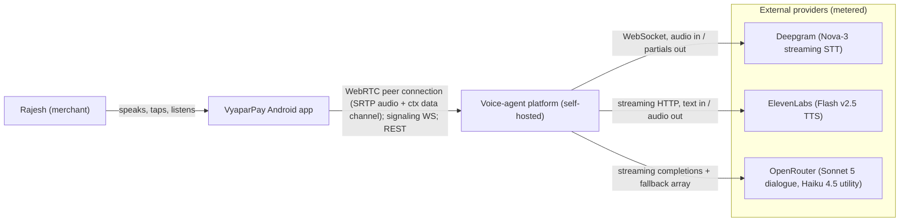
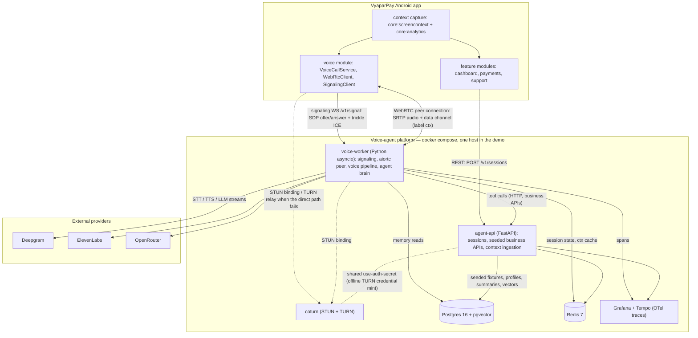
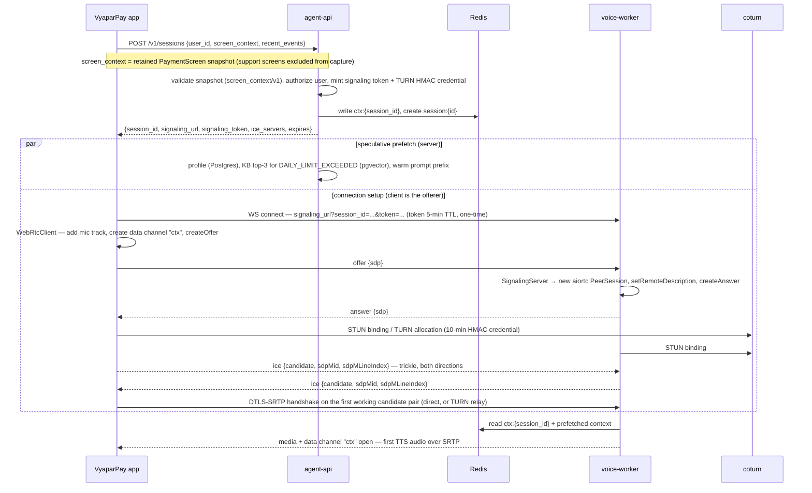
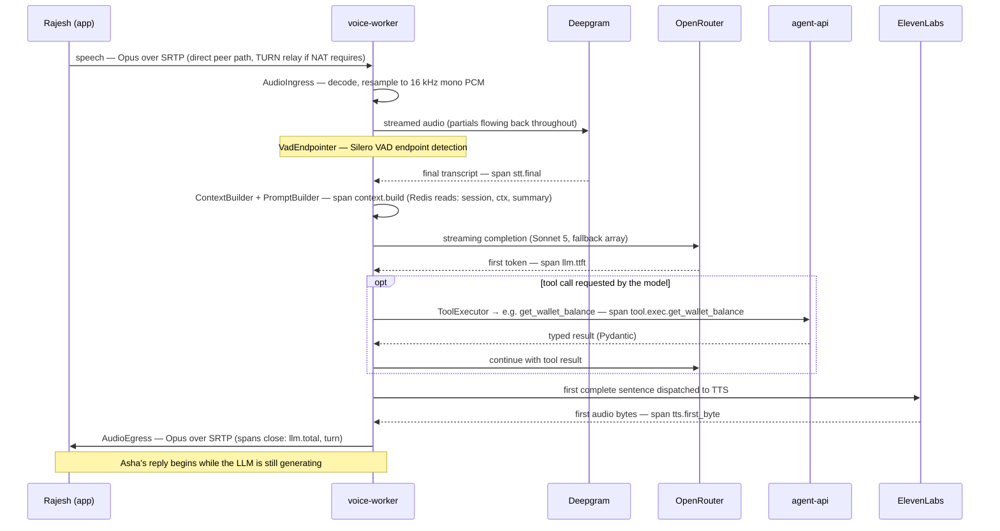
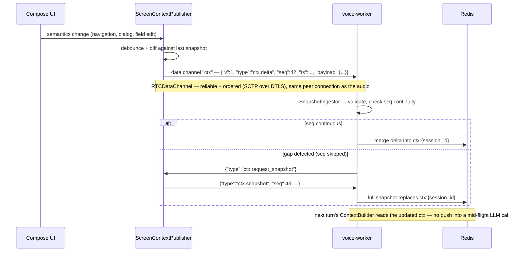

# System Architecture

This document is the structural map of the system: the C4-style context and container views, the three runtime sequences that everything else hangs off (call setup, one conversation turn, in-call context delta), the design principles that decided the shape, and the repository layout that mirrors it. It defines *where things run and how they talk*; the behavior inside each box belongs to the owning doc — the voice pipeline to [docs/06](06-voice-pipeline.md), the screen-context transform to [docs/07](07-ui-semantic-context.md), tools to [docs/10](10-tool-calling.md).

**Read this with:** [docs/01](01-product-and-use-case.md) for the product this serves, [docs/06](06-voice-pipeline.md) for the latency budgets the setup and turn sequences must hit, [docs/07](07-ui-semantic-context.md) for the context payloads on the data channel, and [docs/15](15-scalability-and-reliability.md) for how the containers are actually run.

---

## 1. System context (C4 Level 1)

One user, one app, one self-hosted platform, three metered external providers. Everything the project *owns* sits inside the platform boundary; everything metered by the minute or the token sits outside it, behind a provider interface.



Three boundary facts worth stating once, here, because every later doc assumes them:

1. **The app never talks to a provider.** No Deepgram key, no ElevenLabs key, no OpenRouter key ever ships in the APK. All provider traffic originates server-side, so keys rotate in one place and per-call cost is attributable in one place (`CostTracker`).
2. **The platform is one trust boundary.** Screen content and user speech cross into it as *untrusted input* — the injection defenses in [docs/14](14-security.md) apply at this line, not deeper.
3. **Providers are replaceable by config.** Each sits behind an interface in `backend/app/providers/` (`SttProvider`, `TtsProvider`, `LLMProvider`, `EmbeddingProvider`). Model IDs are env-config (`OPENROUTER_DIALOGUE_MODEL`), not constants. The rejected alternative — calling vendor SDKs directly from pipeline code — saves a week and costs every future migration; ADR discussion in [docs/16](16-tech-stack.md).

---

## 2. Container view (C4 Level 2)



The load-bearing shape: **the app and the voice-worker are the two WebRTC peers.** There is no media server between them — audio and context flow over one direct DTLS-SRTP session (relayed by coturn only when NAT forces it), and coturn never sees anything above ICE.

### The three paths from the app

The app maintains exactly three independent northbound paths, and only two of them carry data — the signaling WebSocket is control plane only. Keeping them separate is deliberate: the REST channel exists before and after the call, the other two exist only for it.

| | WebRTC peer connection (app ↔ voice-worker) | Signaling WS (voice-worker `/v1/signal`) | agent-api (REST) |
|---|---|---|---|
| Carries | Bidirectional Opus audio over SRTP; `ctx.delta` / `ctx.event` / `ctx.snapshot` client→server and `transcript.*` / `agent.state` server→client on the reliable+ordered `RTCDataChannel`, label `ctx` | SDP offer/answer, trickle ICE candidates, `bye`, ping/pong keepalive — never context, never audio | `POST /v1/sessions` (initial ScreenContext snapshot + last ~15 events ride in the body); session teardown; non-call app traffic |
| Lifetime | Call only — negotiated during `CallStateMachine → Signaling/Connecting`, closed at `Ended` | Opened at call setup, held for the call (10 s ping/pong); reused for ICE restarts | Always available |
| Auth | DTLS-SRTP; the peer is bound to the session by the signaling handshake that produced it | `signaling_token`, 5-min TTL, one-time use, minted by agent-api | Demo JWT ([docs/14](14-security.md)) |
| Ordering | Client-monotonic `seq` per envelope; backend detects gaps and requests a full snapshot | WebSocket message order | Request/response |

**Rejected alternative — a context channel of its own.** Two early sketches put context somewhere else: reuse the signaling WebSocket for `ctx.*` traffic, or open a dedicated context WebSocket. Both are backwards. Context deltas are *only* useful during a call, so they belong to the media session's lifecycle, not the signaling connection's — the `ctx` data channel dies exactly when the call dies, for free. And a dedicated socket means a third connection and a second reconnect state machine on flaky Indian mobile networks, for zero gain over a channel that is already reliable and ordered. Locked as ADR-4 in [docs/16](16-tech-stack.md); the initial snapshot rides on `POST /v1/sessions` precisely so the data channel never has to exist before the peer connection does.

### Container responsibilities

| Container | Owns | Deliberately does not own |
|---|---|---|
| coturn | STUN binding + TURN relay (UDP, TCP, TLS fallback); validates 10-min HMAC credentials (`use-auth-secret`, secret shared with agent-api) | Anything above ICE — it never sees SDP, DTLS keys, media plaintext, or context |
| agent-api (FastAPI) | Session mint (`POST /v1/sessions` → `{session_id, signaling_url, signaling_token, ice_servers, expires}` — mints both the signaling token and the TURN HMAC credential), seeded business APIs the tools call, initial-snapshot ingestion, post-call persistence | Audio; it never touches SDP or media |
| voice-worker (Python asyncio) | `SignalingServer` (WS `/v1/signal`); one aiortc `PeerSession` per call — SDP answer, trickle ICE, DTLS-SRTP, the `ctx` data channel; the hand-rolled pipeline in `app/voice/` (`AudioIngress`, `VadEndpointer` — Silero, `AudioEgress`); runs *our* brain — `ConversationManager`, `ContextBuilder`, `PromptBuilder`, `ToolExecutor`, `SafetyLayer` | Business data authority — tool calls go to agent-api, not straight to tables |
| Postgres 16 + pgvector | Seeded business fixtures, user profiles, conversation summaries, KB embeddings (1536-dim), per-call cost rows | Hot per-turn state |
| Redis 7 | `session:{id}` (transcript window, tool results, state), `ctx:{session_id}` (latest ScreenContext), `rate:{user_id}` | Anything durable |
| Grafana + Tempo | One OTel trace per turn: `turn` → `stt.final`, `context.build`, `llm.ttft`, `llm.total`, `tool.exec.<name>`, `tts.first_byte` | Alerting/SLOs — explicitly deferred |

Both backend services import the same `app/` package; they differ in entrypoint, not codebase. This is a demo-honest simplification: one repo, one Docker image built twice with different commands. The production split (separate images, independent scaling) is a build-pipeline change, not a code change — see §6.

Android module structure is coarse here by intent (`:app`, `:core:*`, `:feature:*`, `:voice` — full graph in [docs/03](03-android-architecture.md)): the architectural point is that `core:screencontext` and `core:analytics` observe the app, and `:voice` transports what they observe.

### Where the named components run

The doc set names components precisely (naming freeze in the canon); this table places each on a container so later docs never have to re-explain topology. "Both" means the shared `app/` package is imported by both services, but the listed service is where the component actually executes.

| Component | Executes in | When |
|---|---|---|
| `SessionManager` | agent-api | Session mint and teardown |
| `SnapshotIngestor` | agent-api (initial REST snapshot) and voice-worker (data-channel deltas) | Call setup; every delta |
| `SignalingServer`, `PeerSession`, `AudioIngress`, `VadEndpointer`, `AudioEgress`, `VoiceAgentWorker` | voice-worker | Call lifetime |
| `ConversationManager`, `ContextBuilder`, `PromptBuilder`, `LLMRouter` | voice-worker | Every turn |
| `ToolExecutor`, `SafetyLayer` | voice-worker (calls agent-api business APIs over HTTP) | Turns with tool calls |
| `EventLog`, `ContextCompressor` | voice-worker | As `ctx.event` messages arrive; on budget pressure |
| `Summarizer` (Haiku), `CostTracker` finalization | voice-worker | Every 6 turns; post-call |
| Memory modules (`SessionMemory`, `SemanticMemory`, ...) | Both read; voice-worker writes during call, post-call persistence via agent-api | Per [docs/09](09-memory-architecture.md) |
| `UiTreeCollector`, `SemanticSnapshotBuilder`, `ScreenContextPublisher` | Android (`core:screencontext`) | Continuously while a call is live |
| `VoiceCallService`, `WebRtcClient`, `SignalingClient`, `CallStateMachine` | Android (`:voice`) | Call lifetime |

The one placement worth defending: **tool execution lives in the worker, but tool *authority* lives in agent-api.** `ToolExecutor` in the worker decides *when* to call a tool; the business API in agent-api decides *whether the session's user may* and owns the data. Executing tools directly against Postgres from the worker would be faster (one hop fewer) and was rejected: it would smear authorization across two services and make the [docs/14](14-security.md) invariant — "tool execution is allowlisted + server-side authorized per session user" — unenforceable at a single point.

---

## 3. Runtime views

Three sequences carry the whole system. Everything else — memory, RAG, safety — plugs into one of these three.

### 3.1 Call setup

The contract: from Rajesh's tap to Asha's first word is ~2 s, and the agent is context-complete *before* audio flows — the greeting needs zero tool calls ([docs/01 §7](01-product-and-use-case.md)). The setup path itself (session POST + WS connect + SDP exchange + trickle ICE to first media) is budgeted at ≤ 1.5 s p50, TURN-relayed worst case ≤ 3 s — budget owned by [docs/06](06-voice-pipeline.md).



Three structural decisions visible here:

- **The snapshot rides on session creation, not the data channel.** The agent must know the screen before the peer connection exists; putting the snapshot in the REST body removes an entire class of "peer connected before context arrived" races.
- **Prefetch and connection setup run in parallel.** The offer/answer exchange, ICE, and DTLS take long enough to hide the profile fetch, the pgvector query, and prompt-prefix warming entirely. The greeting's perceived latency is the *connection* time, not a model round-trip.
- **Trickle ICE, not gather-then-send.** Candidates stream over the signaling WS as they are found, and media starts on the first working pair rather than after full gathering — this is what makes the ≤ 1.5 s p50 setup budget reachable on mobile networks. The same WS stays open for the call (10 s ping/pong) so a mid-call network change can re-offer with `iceRestart: true` without re-minting a session.

### 3.2 One conversation turn

The turn is the unit of everything: one OTel trace, one latency budget, one prompt build. Stage names below are the canonical span names; the millisecond budget per stage (p50 ≤ 1.0 s, p95 ≤ 2.0 s end-to-end) is owned by [docs/06](06-voice-pipeline.md) and not restated here.



The load-bearing property is that **no stage waits for the previous stage to finish** — STT emits partials during speech, the LLM streams tokens, TTS receives sentence one while sentence two is still being generated, and audio plays while TTS is still synthesizing. A blocking pipeline with these same providers would stack the full latencies serially and roughly double the turn time; the streamed overlap is what makes the [docs/06](06-voice-pipeline.md) budget reachable at all. Barge-in (Rajesh interrupts mid-reply) cancels the TTS stream, the in-flight LLM generation, and `AudioEgress` playout — mechanics in [docs/06](06-voice-pipeline.md).

### 3.3 Screen-context delta during the call

Rajesh navigates mid-call — the agent's picture of the screen must follow. Deltas flow over the `ctx` data channel, peer to peer with no server hop in between; the full envelope and IR schemas are owned by [docs/07](07-ui-semantic-context.md) and [docs/13](13-api-contracts.md).



Deltas update *state*, not conversation: an arriving delta never interrupts a generating turn. The agent's knowledge is "the screen as of the moment the turn started," which is the honest semantic — injecting UI changes into a half-generated sentence produces incoherent replies and untraceable prompts. `ctx.event` messages (taps, API errors) flow the same path into `EventLog`. The client-monotonic `seq` exists because reliable+ordered delivery is guaranteed per SCTP association, not across an ICE restart or a re-created peer connection — the gap request is the recovery path for the [docs/01 §7](01-product-and-use-case.md) reconnection failure mode.

### 3.4 What breaks where (architecture-level failure modes)

Per-stage pipeline failures belong to [docs/06](06-voice-pipeline.md) and tool failures to [docs/10](10-tool-calling.md); these are the *container-level* failures — a whole box in §2 going away.

| Failure | Detection | Impact | Mitigation | Degradation |
|---|---|---|---|---|
| voice-worker unreachable at setup | Signaling WS connect fails or offer gets no answer; `CallStateMachine` stuck in `Signaling` | No call possible | Bounded retry with backoff (signaling token TTL 5 min leaves room) | App falls back to `HelpScreen` complaint flow |
| coturn down | TURN allocation errors; ICE stuck in `checking` on restrictive NATs | Calls behind symmetric NAT (common on Indian mobile carriers) cannot connect; direct and STUN-free host paths still work | Health check; host/server-reflexive candidates are still tried — same-LAN demo unaffected | Setup fails only for relay-dependent networks |
| voice-worker process dies mid-call | ICE state → `disconnected`/`failed` on the client; signaling WS drops | The remote peer *is* the worker, so Asha goes silent and media stops | `CallStateMachine → Reconnecting`: fresh `POST /v1/sessions`, new peer connection to a healthy worker; the new worker rehydrates from Redis `session:{id}` (transcript window, summary, pending-confirmation state) | The in-flight turn is lost; the conversation is not |
| Client network change (Wi-Fi ↔ 4G) | ICE `disconnected` on both peers | Media stalls | ICE restart — `WebRtcClient` re-offers with `iceRestart: true` over the (reconnected) signaling WS; new candidate pair, same call | A brief audio gap; no session loss |
| agent-api down during a call | `tool.exec.<name>` span errors; health check | Tools fail; *new* calls cannot mint sessions | In-call media is unaffected — the app↔worker peer connection and provider streams do not route through agent-api by design | Agent answers from screen context, offers `escalate_to_human` |
| Redis down | Connection errors inside `context.build` | Session memory and ctx cache unreachable | Turn proceeds on the in-process short-term working set | Context-degraded turns; ctx deltas dropped until recovery, then full-snapshot request |
| OpenRouter primary model outage | Completion error/timeout | Turn would fail | Fallback array in the request routes to the configured fallback model — no code path change | Marginally different reply style for the affected turns |
| Deepgram stream drops | WebSocket close mid-utterance | One utterance lost | Reconnect the STT stream; audio keeps flowing over the peer connection | Asha asks Rajesh to repeat — once, honestly |

The pattern across these rows: the media path (app ↔ voice-worker peer connection, coturn relay when NAT requires) and the REST/data path (app ↔ agent-api ↔ stores) fail independently, which is the payoff of the topology in §2 — a database problem never drops the call audio, and a NAT-traversal problem never corrupts session state. The signaling WS matters only at setup and ICE restart: a mid-call signaling blip touches nothing, because DTLS-SRTP and the data channel keep flowing peer to peer without it.

---

## 4. Design principles

Four principles decided nearly every box and arrow above. They are stated here once; ADRs in [docs/16](16-tech-stack.md) carry the full trade-offs.

**Streaming-first.** Every hop that can stream, streams: STT partials, LLM tokens, sentence-level TTS dispatch, chunked audio out. This is not an optimization pass applied later — interfaces were designed as streams from day one, because retrofitting streaming onto request/response interfaces means rewriting them. The cost is real: streaming code paths are harder to test and cancellation (barge-in) must be threaded through every stage. We pay it because a voice agent that responds in 3+ seconds is a demo nobody finishes watching.

**Provider abstraction.** Deepgram, ElevenLabs, and OpenRouter are current defaults, not commitments. `providers/` defines one interface per capability with exactly one implementation each today (`DeepgramStt`, `ElevenLabsTts`, `OpenRouterLLM`, `OpenAIEmbeddings`) — YAGNI says don't build the second implementation, but the *seam* costs one file and buys provider-swap-by-config. OpenRouter itself is a second abstraction layer for LLMs specifically: the fallback array in the request handles model outages without any code on our side.

**We own the media path end to end.** The transport is not a framework choice here — it is part of the project's point. `WebRtcClient` (libwebrtc via `org.webrtc`) and the aiortc `PeerSession` are two direct peers; the signaling protocol (SDP offer/answer, trickle ICE over our own WebSocket), NAT traversal (self-hosted coturn with HMAC time-limited credentials), and the voice pipeline (Silero VAD, endpointing, barge-in cancellation) are all our code. A managed platform — LiveKit, Daily, Agora — would ship all of this in a weekend, and hide exactly the protocol-level engineering this project exists to demonstrate; that trade is ADR-1 and ADR-2 in [docs/16](16-tech-stack.md). The confinement discipline still applies, just one level down: transport code lives in `app/voice/` (and `:voice` on Android), and the brain — `ConversationManager`, `ContextBuilder`, `PromptBuilder`, `ToolExecutor`, `SafetyLayer` — never imports aiortc and would survive a transport swap unchanged.

**Contracts in `protocol/`.** Every payload that crosses the Android/backend boundary — the signaling envelope, the data-channel envelope, `screen_context/v1`, `app_event/v1`, the session REST shapes — is defined once in [protocol/](../protocol/) and consumed by both sides. Neither the Kotlin serializers nor the Pydantic models are authoritative; the schema files are. A contract change is therefore a visible, reviewable diff in one directory, not a drift between two codebases discovered at runtime.

---

## 5. Repository structure

The repo is a monorepo mirroring the container diagram: one directory per deployable surface, plus the shared contract directory both depend on.

```text
voice-calling-agent/
├── android/                  # VyaparPay app (Kotlin, Jetpack Compose)
│   ├── app/                  #   :app — wiring, DI, navigation host
│   ├── core/                 #   :core:ui, :core:network, :core:analytics, :core:screencontext
│   ├── feature/              #   :feature:dashboard, :feature:payments, :feature:support
│   └── voice/                #   :voice — VoiceCallService, WebRtcClient, SignalingClient, CallStateMachine
├── backend/                  # Python services (shared app/ package, two entrypoints)
│   ├── app/
│   │   ├── agent/            #   ConversationManager, PromptBuilder, ToolExecutor, SafetyLayer, ...
│   │   ├── context/          #   SnapshotIngestor, EventLog, ContextCompressor
│   │   ├── memory/           #   short-term / session / profile / semantic (pgvector)
│   │   ├── tools/            #   registry + one module per tool (contracts in docs/10)
│   │   ├── providers/        #   LLMProvider, SttProvider, TtsProvider, EmbeddingProvider
│   │   ├── voice/            #   SignalingServer, PeerSession, AudioIngress, VadEndpointer, AudioEgress,
│   │   │                     #   VoiceAgentWorker — the hand-rolled WebRTC + voice pipeline
│   │   └── models/           #   Pydantic + SQLAlchemy
│   ├── seeds/                #   fixture data + reset script (the staged business)
│   └── tests/
├── protocol/                 # shared contracts: JSON Schemas + canonical examples
│   ├── signaling/            #   WS signaling envelope (offer / answer / ice / bye / ping / pong)
│   ├── screen_context/       #   screen_context/v1
│   ├── events/               #   app_event/v1
│   ├── channel/              #   data-channel envelope (label ctx)
│   └── rest/                 #   /v1/sessions request/response shapes
├── infra/                    # docker-compose.yml, coturn/turnserver.conf, otel-collector, grafana dashboards
├── docs/                     # this doc set (01–17)
└── .github/                  # CI: android build, backend lint+test, schema validation
```

Rationale per top-level directory:

| Directory | Why it exists as a top-level unit |
|---|---|
| `android/` | One deployable (the APK), one toolchain (Gradle), one reviewer mental model; its internal module graph is [docs/03](03-android-architecture.md)'s concern |
| `backend/` | Both services share `app/` deliberately — `ConversationManager` and `SnapshotIngestor` are used by voice-worker and agent-api; splitting into two packages now would force a shared-library third package for zero benefit at this scale |
| `protocol/` | The load-bearing directory: language-neutral schemas both `android/` and `backend/` consume. CI validates the canonical examples against the schemas and both codebases' serializers against the examples, so a breaking change fails the build on *both* sides in the same PR |
| `infra/` | Everything needed to run the platform is declarative and versioned next to the code it runs; `docker compose up` is the entire local setup ([docs/15](15-scalability-and-reliability.md)) |
| `docs/` | The doc set is a first-class deliverable of this portfolio project, not an afterthought; it is reviewed like code |
| `.github/` | CI is split per surface (Android build, backend tests, schema validation) so an Android-only PR never waits on a Python test matrix |

**Why a monorepo at all:** the alternative — separate app and backend repos — was rejected because the project's hardest correctness problem is the cross-boundary contract, and a monorepo makes every contract change atomic: schema, Kotlin consumer, Python consumer, and docs move in one reviewable commit. Multi-repo coordination overhead buys nothing for a single-team (single-person) project.

**On `protocol/` specifically**, since it is the one non-obvious directory: it is the source-of-truth answer to "who owns the wire format?" Without it, the Pydantic models would quietly become authoritative (backend-defined contracts) and the Android side would chase them. With it, `screen_context/v1` is a schema file plus the canonical Rajesh-incident example from [docs/07](07-ui-semantic-context.md); the Kotlin `SemanticSnapshotBuilder` output and the Python `SnapshotIngestor` input are both *tested against the same fixture*. The signaling envelope gets the same treatment: `SignalingClient` and `SignalingServer` are tested against the same offer/answer/ice fixtures. Versioned schema names (`/v1`) make evolution explicit: v2 is a new file and a migration note, never an in-place edit.

---

## 6. Deployment views

### Local (demo — what this repo actually ships)

One machine, one command. `infra/docker-compose.yml` starts seven containers; the Android debug APK is side-loaded and pointed at the machine's LAN IP.

| Container | Image basis | Notes |
|---|---|---|
| `coturn` | coturn OSS | STUN + TURN (UDP, TCP, TLS fallback); `use-auth-secret` HMAC — secret shared with agent-api via env; relay port range pinned in `infra/coturn/turnserver.conf` |
| `agent-api` | `backend/` image, uvicorn entrypoint | Serves sessions (signaling token + TURN credential mint) + seeded business APIs |
| `voice-worker` | same `backend/` image, worker entrypoint | Hosts the `/v1/signal` WS and one aiortc peer per call; UDP exposed for SRTP |
| `postgres` | postgres:16 + pgvector | Seeded on first start from `backend/seeds/` |
| `redis` | redis:7 | No persistence configured — session state is disposable in the demo |
| `tempo` + `grafana` | Grafana stack | Pre-provisioned dashboard: per-turn traces, token counts, cost |

Demo-honest caveats: single host means coturn, the worker, and the databases share CPU — turn latency figures measured locally exclude real internet RTT to providers only partially (provider calls do leave the machine); with the app and backend on the same LAN, ICE normally selects a direct host-candidate pair and coturn sits idle, so the TURN relay path is exercised by testing from a mobile network; the signaling WS is plain `ws://` locally, while WSS is a production invariant in [docs/14](14-security.md); there is no TLS between containers; secrets are a local `.env` from `.env.example`.

### Production evolution (sketch — full treatment in [docs/15](15-scalability-and-reliability.md))

The container boundaries are already the scaling boundaries; production is a topology change, not an architecture change.

| Concern | Demo | Production evolution |
|---|---|---|
| Topology | 1:1 peers, no media server | Unchanged until multi-party (supervisor whisper, conference) — the ADR-1 flip condition for introducing an SFU such as LiveKit |
| NAT traversal | One coturn container | coturn fleet behind geo DNS; `turns:` on 443 for restrictive networks; managed TURN (e.g. Twilio NTS) at global-traffic scale — ADR-6 flip condition |
| voice-worker | One process | Horizontally scaled pool behind a session router — agent-api assigns each session's `signaling_url` to a worker with capacity; one call pins one worker process (it terminates the peer connection), so scaling is concurrent-call-linear |
| agent-api | One uvicorn | Stateless replicas behind a load balancer; separate image from the worker |
| Postgres | One container | Managed Postgres + read replicas; pgvector holds until ~10M vectors (flip condition, ADR-3) |
| Redis | One container | Managed Redis with persistence; Redis Streams → Kafka only at event-bus scale (ADR-3 flip condition) |
| Secrets | `.env` file | Secret manager, per-service scoping, key rotation |
| Observability | Compose Tempo/Grafana | Managed tracing + the deferred items: alerting, SLOs, eval platform |

The single riskiest production delta is the worker pool: a voice call is a long-lived stateful process (minutes) that terminates a live peer connection, not a stateless request — so deploys need connection draining, and capacity planning is concurrent-calls-based, not RPS-based. [docs/15](15-scalability-and-reliability.md) owns that analysis.

---

## Decisions this document exports

| Fixed here | Value | Heaviest consumer |
|---|---|---|
| Client topology | WebRTC peer connection (SRTP audio + `ctx` data channel) app ↔ voice-worker; signaling WS control plane; REST to agent-api; no dedicated context channel | [docs/03](03-android-architecture.md), [docs/13](13-api-contracts.md) |
| Snapshot-on-session-create | Initial ScreenContext rides `POST /v1/sessions`, deltas ride the data channel | [docs/07](07-ui-semantic-context.md) |
| Shared `app/` package, two entrypoints | One backend image, two commands | [docs/04](04-backend-architecture.md), [docs/15](15-scalability-and-reliability.md) |
| Turn-boundary context semantics | Deltas update Redis state; never injected mid-generation | [docs/08](08-context-and-events.md), [docs/11](11-prompt-engineering.md) |
| `protocol/` as contract authority | Schemas + fixtures, CI-enforced on both sides | Every cross-boundary doc |
| Repo layout | §5 tree, verbatim | Contributing, CI, [docs/17](17-roadmap.md) |
