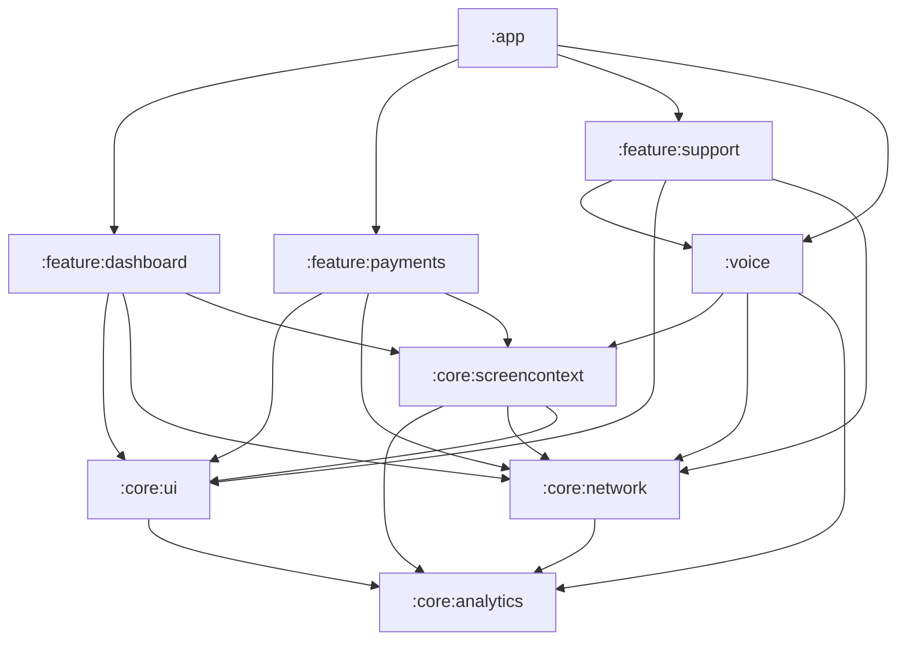
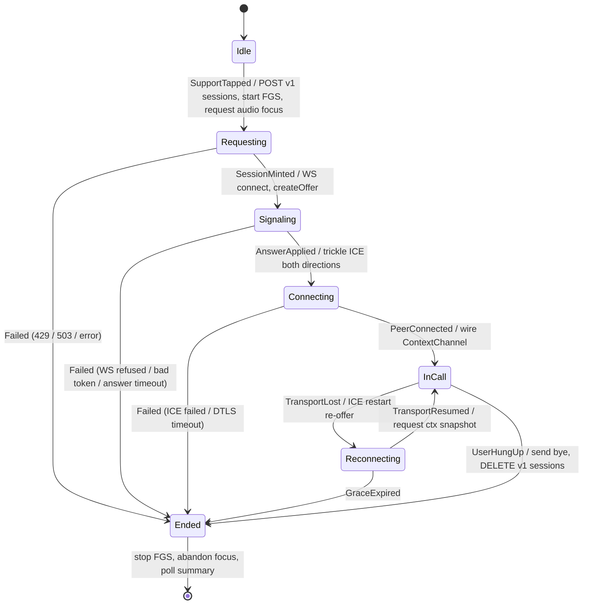

# Android Architecture

This document owns the client half of VyaparPay: the Gradle module graph and the dependency rule that keeps it acyclic, the MVVM + unidirectional-data-flow pattern every screen follows, and the thirteen components that turn "Rajesh taps Call Support" into a live, screen-aware voice call — the support button, the call state machine, the foreground service that holds the call, the raw `org.webrtc` peer, the signaling client that carries SDP and ICE, the permission flows, the on-device context capture chain, and the in-call overlay. The signature transform that produces the semantic IR (`UiTreeCollector` → `SemanticSnapshotBuilder`) is *specified* in [docs/07](07-ui-semantic-context.md); this doc covers how those components are *wired* into the app's lifecycle, threading model, and DI graph.

**Read this with:** [docs/07](07-ui-semantic-context.md) for the view-tree collection strategy and IR schema this app produces, [docs/13](13-api-contracts.md) for the REST envelope, session lifecycle, signaling protocol, and server→client data-channel messages the client consumes, [docs/06](06-voice-pipeline.md) for the audio path and barge-in the `:voice` module plugs into, and [docs/08](08-context-and-events.md) for the event taxonomy the `EventTracker` emits.

---

## 1. Module graph

The app is nine Gradle modules (canon §3). The split follows one rule that a build-time check (a dependency-analysis Gradle plugin) enforces: **features depend on `:core:*`, never on each other; `:voice` depends on `:core:*` only.** `:voice` is deliberately *not* a `:feature:*` — it is a mid-tier module above core and below features, so the one feature that needs the call machinery (`:feature:support`) may depend on it without any feature-to-feature edge.



| Module | Owns | Key components |
|---|---|---|
| `:app` | Assembly, `Application`, root nav host, Hilt graph root | `VyaparApp`, `MainActivity`, `AppNavHost` |
| `:core:ui` | Design system, theme, shared composables, the click-hook clickable modifier | `VyaparTheme`, `trackedClickable` (fires `tap` events) |
| `:core:network` | Retrofit, OkHttp, the response-envelope adapter, the `api_error` interceptor, repositories | `VyaparApi`, `*Repository`, `EnvelopeAdapter` |
| `:core:analytics` | The user-action timeline | `EventTracker` (§3.9) |
| `:core:screencontext` | On-device context capture + the IR transform + aggregation | `UiTreeCollector`, `SemanticSnapshotBuilder`, `NavigationTracker`, `AppStateManager`, `ScreenContextPublisher` |
| `:feature:dashboard` | Home/dashboard screen | `DashboardScreen`, `DashboardViewModel` |
| `:feature:payments` | Payments + settlements + orders screens | `PaymentScreen`, `SettlementsScreen`, `OrdersScreen` |
| `:feature:support` | The support entry point and in-call UI | `SupportButton`, `ConversationOverlay`, `CallViewModel` |
| `:voice` | The call itself — service, transport, signaling, state, focus | `VoiceCallService`, `WebRtcClient`, `SignalingClient`, `CallStateMachine`, the `ContextChannel` adapter |

Three edges are worth defending. `:core:screencontext → :core:analytics` and `:core:screencontext → :core:network` exist because `SemanticSnapshotBuilder` reads the `EventTracker` ring buffer (for `last_action`) and the network interceptor's last non-2xx (`last_api`) — both facts no view-tree walk can produce ([docs/07 §5](07-ui-semantic-context.md) rule 7). `:core:screencontext → :core:ui` exists because `RoleMapper` (rule 3 tier (a)) resolves testTags through `TestTagRoles.roleFor`, the exact same function `:core:ui`'s own lint check and every screen already use — not a parallel, divergent mapping (`:core:screencontext`'s own `build.gradle.kts` carries the identical rationale inline). `:voice → :core:screencontext` (not the reverse) is what keeps WebRTC out of the capture path: `ScreenContextPublisher` speaks to a `ContextChannel` *interface* declared in `:core:screencontext`, and `:voice` provides the data-channel-backed implementation. The diff/debounce logic stays framework-free and unit-testable; only the byte-shipping adapter imports `org.webrtc` — the same boundary discipline the backend applies to `VoiceAgentWorker` ([docs/05 §1.1](05-agent-architecture.md)).

---

## 2. Architecture pattern

Every screen is **MVVM with unidirectional data flow**: a `ViewModel` exposes a single `StateFlow<UiState>`, Compose renders it, and user intent travels back up as plain function calls. There is no two-way binding and no mutable state shared between layers — state flows down, events flow up, and the `ViewModel` is the only writer of its `UiState`.

```kotlin
@HiltViewModel
class PaymentViewModel @Inject constructor(
    private val payments: PaymentRepository,
    private val events: EventTracker,
) : ViewModel() {
    private val _state = MutableStateFlow(PaymentUiState())
    val state: StateFlow<PaymentUiState> = _state.asStateFlow()

    fun onPayNowClicked() = viewModelScope.launch {
        _state.update { it.copy(loading = true) }
        when (val r = payments.pay(_state.value.toRequest())) {
            is ApiResult.Success -> _state.update { it.render(r.data) }
            is ApiResult.Failure -> _state.update { it.render(r.error) } // e.g. DAILY_LIMIT_EXCEEDED
        }
    }
}
```

Compose collects with lifecycle awareness so a backgrounded screen stops recomposing:

```kotlin
@Composable
fun PaymentScreen(vm: PaymentViewModel = hiltViewModel()) {
    val state by vm.state.collectAsStateWithLifecycle()
    PaymentContent(state = state, onPayNow = vm::onPayNowClicked)
}
```

**Why `StateFlow`, not `LiveData`:** the whole app is Compose and Kotlin coroutines; `StateFlow` is conflated, has an always-available `.value` for the session-create snapshot builder to read synchronously, and composes with `combine`/`.conflate()` for the context pipeline (§5). `LiveData` would force a lifecycle-owner dependency into `:core:screencontext`, which has no `Activity`.

### 2.1 Repository pattern in `:core:network`

Every business API is fronted by a repository interface with a Retrofit-backed implementation. The implementation's job is the boring, load-bearing one: unwrap the response envelope ([docs/13 §1](13-api-contracts.md)) and map it onto a sealed `ApiResult`, so no `ViewModel` ever sees an HTTP status code or a raw envelope.

```kotlin
interface WalletRepository { suspend fun getWallet(): ApiResult<Wallet> }

sealed interface ApiResult<out T> {
    data class Success<out T>(val data: T) : ApiResult<T>
    data class Failure(val code: ApiError, val message: String, val details: JsonObject?) : ApiResult<Nothing>
}

enum class ApiError {                    // mirrors the docs/13 §1.1 taxonomy, one-to-one
    DAILY_LIMIT_EXCEEDED, INSUFFICIENT_BALANCE, RATE_LIMITED, SESSION_CAPACITY,
    AUTH_EXPIRED_TOKEN, VALIDATION_SCHEMA, /* … */ UNKNOWN,
}
```

The envelope adapter is a single OkHttp/Retrofit `CallAdapter` shared by every repository — it reads `{success, data, error, meta}`, returns `data` on success, and maps `error.code` to the `ApiError` enum on failure. Unknown codes fold to `UNKNOWN` rather than crashing (the client-side "ignore unknown" rule, [docs/13 §8](13-api-contracts.md)). Money crosses this boundary as integer paise and is converted to a domain `Money` type in exactly one place — the mapper — so a float rupee never exists in the app ([docs/13 §1](13-api-contracts.md)).

```kotlin
class WalletRepositoryImpl @Inject constructor(
    private val api: VyaparApi,
) : WalletRepository {
    override suspend fun getWallet(): ApiResult<Wallet> = api.getWallet().unwrap { dto ->
        Wallet(balance = Money.ofPaise(dto.balancePaise), card = dto.card.toDomain())
    }
}
```

### 2.2 Dependency injection with Hilt

Hilt binds interfaces to implementations and scopes the long-lived singletons. The scoping is deliberate and maps to lifetime:

| Scope | Holds | Why |
|---|---|---|
| `@Singleton` | `EventTracker`, `AppStateManager`, `UiTreeCollector`, `NavigationTracker`, repositories, `VyaparApi` | App-lifetime; the context ring buffer and aggregated state must outlive any one screen |
| `@ViewModelScoped` | per-screen use-case collaborators | Bound to the `ViewModel` that owns them |
| Service-held (manual) | `WebRtcClient`, `SignalingClient`, `CallStateMachine`, the `ContextChannel` adapter | Call-scoped — created when `VoiceCallService` starts, torn down when the call ends; a leaked `PeerConnection` is a live mic |

`WebRtcClient` is intentionally **not** a `@Singleton`: the `PeerConnectionFactory` bootstrap is a cheap once-per-process static, but the `PeerConnection` it creates lives exactly one call. It is constructed and released by `VoiceCallService`, which owns the call's lifecycle (§3.3). Everything else that must survive across screens — the ring buffer, the aggregated app state — is a `@Singleton` interface so a screen swap never loses the timeline that the next call's context depends on.

---

## 3. Components

Each subsection gives the component's responsibility, its module, the key Kotlin surface, its lifecycle, and its threading rules.

### 3.1 `SupportButton` (`:feature:support`)

**Responsibility.** The floating call entry point — an in-app overlay FAB, present on operational screens, that launches the call. It is a Compose `FloatingActionButton` drawn *inside the app's own window*, not a system overlay.

**No `SYSTEM_ALERT_WINDOW`.** A draw-over-other-apps overlay was rejected outright: it requires the `SYSTEM_ALERT_WINDOW` special-access grant (a settings-screen toggle framed as a security risk), it is a Play-policy flag for a fintech app, and the agent only ever needs *our* screens for context anyway ([docs/07 §2.3](07-ui-semantic-context.md) rejects the analogous AccessibilityService for the same trust-scope reason). An in-app FAB needs zero special permissions and sees exactly the surface it should.

```kotlin
@Composable
fun SupportButton(visible: Boolean, onClick: () -> Unit)
```

**Visibility rules.** Shown on operational screens (dashboard, payments, settlements, orders); **hidden** on `HelpScreen` and while `ConversationOverlay` is up — support surfaces are excluded from capture ([docs/07 §2.1](07-ui-semantic-context.md)), and a call button on the call screen is noise. Visibility is derived from `NavigationTracker`'s current route, so it is one `StateFlow` read, not per-screen bookkeeping.

**Lifecycle / threading.** Pure Compose, main thread; stateless — `onClick` dispatches to `CallViewModel`, which starts `VoiceCallService`.

### 3.2 `CallStateMachine` (`:voice`)

**Responsibility.** The single source of truth for call state: `Idle → Requesting → Signaling → Connecting → InCall → Reconnecting → Ended` (canon §3). It is a pure state reducer — events in, `(state, side-effects)` out — with no `org.webrtc` or Android imports, so it is exhaustively unit-testable. The two connection phases are deliberately distinct because they fail differently: **Signaling** is the control plane coming up (WS connect, offer sent, answer applied), **Connecting** is the media plane coming up (ICE candidate checks, DTLS-SRTP handshake). A `Signaling` failure means the voice-worker refused or never answered; a `Connecting` failure means NAT traversal broke — different error copy, different logs.

```kotlin
sealed interface CallState { object Idle; object Requesting; object Signaling; object Connecting
    object InCall; object Reconnecting; data class Ended(val reason: EndReason) }

sealed interface CallEvent { object SupportTapped; data class SessionMinted(val session: SessionCredentials)
    object AnswerApplied; object PeerConnected; object TransportLost; object TransportResumed
    object GraceExpired; data class Failed(val error: ApiError); object UserHungUp }

class CallStateMachine {
    val state: StateFlow<CallState>
    fun dispatch(event: CallEvent): List<CallEffect>   // effects executed by VoiceCallService
}
```



| Transition | Trigger | Side effects (executed by the service) |
|---|---|---|
| `Idle → Requesting` | user taps `SupportButton` (perms granted) | build session body from `AppStateManager.value`; start FGS; request audio focus (ahead of `WebRtcClient.start()` opening the mic on the next transition, §3.4); show overlay |
| `Requesting → Signaling` | `201` from `POST /v1/sessions` | `SignalingClient.connect(signaling_url, signaling_token)`; `WebRtcClient.start(ice_servers)` — mic track added, `ctx` channel created, offer sent |
| `Requesting → Ended` | `429`/`503`/network error | show "couldn't start the call"; stop FGS (nothing to tear down, [docs/13 §2.1](13-api-contracts.md)) |
| `Signaling → Connecting` | `answer` received, `setRemoteDescription` applied | trickle ICE continues in both directions; candidate pairs start checking |
| `Signaling → Ended` | WS refused / `error` frame / answer timeout | dispose the half-built peer; show "couldn't start the call" |
| `Connecting → InCall` | `PeerConnectionState.CONNECTED` — ICE pair selected, DTLS-SRTP up, `ctx` channel open | bind `ScreenContextPublisher` to the data channel (audio focus was already requested at `Idle → Requesting`, not here) |
| `InCall → Reconnecting` | ICE `disconnected`/`failed`, or network-change callback (§3.4) | `WebRtcClient.restartIce()` → re-offer with `iceRestart: true` over the WS; overlay shows "reconnecting"; notification updated |
| `Reconnecting → InCall` | ICE re-established on the new candidate pair | publisher sends a fresh full snapshot (seq re-sync, [docs/08 §3.3](08-context-and-events.md)) |
| `Reconnecting → Ended` | 30 s grace elapsed ([docs/06 §6](06-voice-pipeline.md)) | tear down; next attempt mints a fresh session |
| `InCall → Ended` | user taps End, or `bye` from the server | send `bye`; close peer + WS; `DELETE /v1/sessions/{id}` |
| `* → Ended` | any terminal | abandon audio focus; stop foreground service; poll `GET /v1/sessions/{id}/summary` for the summary card |

**Lifecycle.** Owned by `VoiceCallService`; dies with the call. **Threading.** All `dispatch` calls are marshalled onto a single call-scoped dispatcher so the reducer is never re-entered concurrently — libwebrtc observer callbacks arrive on its internal signaling thread, `SignalingClient` frames on the OkHttp reader thread, UI intents on main, and all three funnel through one `Channel`.

### 3.3 `VoiceCallService` (`:voice`)

**Responsibility.** The foreground service that *is* the call. It hosts `WebRtcClient`, `SignalingClient`, `CallStateMachine`, and the publisher binding, so the call survives the user navigating away from `ConversationOverlay` (the minimized-chip case, §3.12). The call lives in a service, not a `ViewModel`, precisely because a `ViewModel` dies with its screen and a call must not.

```kotlin
@AndroidEntryPoint
class VoiceCallService : LifecycleService() {
    override fun onStartCommand(intent: Intent?, flags: Int, startId: Int): Int {
        when (intent?.action) {
            ACTION_START -> startCall(intent.sessionArgs())
            ACTION_MUTE  -> webRtc.setMuted(true)
            ACTION_END   -> stateMachine.dispatch(CallEvent.UserHungUp)
        }
        return START_STICKY
    }
}
```

**FGS type and Android 14+.** The service declares `android:foregroundServiceType="microphone|mediaPlayback"` — `microphone` because it captures uplink audio, `mediaPlayback` because it plays Asha's downlink. On Android 14 (API 34) this additionally requires the `FOREGROUND_SERVICE_MICROPHONE` normal permission in the manifest **and** that the mic-type FGS is started from a valid foreground context with `RECORD_AUDIO` already granted — a background start throws. The service is therefore always started from the `SupportButton` tap (a guaranteed-foreground moment) after `PermissionManager` confirms the grant, never speculatively.

**START_STICKY.** If the OS kills the process under memory pressure, the system recreates the service with a null intent. On that re-entry the service does **not** silently resurrect a call — the `PeerConnection` is gone with the process — it checks whether a session is still within its 30 s grace and either drives a reconnect or transitions to `Ended` and shows the summary (§7). START_STICKY buys the re-entry *hook*; the state machine decides what re-entry means.

**Notification.** An ongoing, non-dismissable call notification with mute and end-call actions (`PendingIntent`s that fire `ACTION_MUTE`/`ACTION_END` back into `onStartCommand`), plus the live call duration. On Android 13+ this notification only appears if `POST_NOTIFICATIONS` was granted; the call still runs without it (§3.6), controlled from the in-app overlay.

**Lifecycle / threading.** Started on `Idle → Requesting`, stopped on entering `Ended`. Owns a `SupervisorJob` call scope cancelled at teardown; libwebrtc and OkHttp callbacks are received on their own threads and forwarded to the state machine's single dispatcher.

### 3.4 `WebRtcClient` (`:voice`)

**Responsibility.** The `org.webrtc` peer — the only class in the app that imports `org.webrtc` (libwebrtc via the maintained `io.github.webrtc-sdk:android` Gradle artifact, canon ADR-1). It builds the `PeerConnectionFactory`, owns the one `PeerConnection` per call, runs the offer side of the SDP exchange, trickles ICE candidates out through `SignalingClient`, creates and services the `ctx` data channel, restarts ICE on network change — and it owns audio routing and focus.

```kotlin
interface WebRtcClient {
    val events: SharedFlow<RtcEvent>            // IceCandidateFound, PeerConnected, TransportLost, TransportResumed, Closed
    suspend fun start(iceServers: List<IceServer>): Sdp   // factory + peer + mic track + "ctx" channel → local offer
    suspend fun applyAnswer(sdp: Sdp)                     // setRemoteDescription(answer)
    fun addRemoteCandidate(candidate: IceCandidateDto)    // from SignalingClient "ice" frames
    suspend fun restartIce(): Sdp                         // re-offer with iceRestart = true
    fun setMuted(muted: Boolean)
    suspend fun sendContext(bytes: ByteArray)             // data channel "ctx", reliable + ordered
    val incoming: Flow<ByteArray>                         // "ctx" downlink: transcript.* / agent.state
    fun route(device: AudioRoute)                         // Earpiece | Speaker | Bluetooth
    suspend fun close()
}
```

**Factory and audio device module.** `PeerConnectionFactory` is initialized once per process with a `JavaAudioDeviceModule` configured for **hardware AEC and NS** — `setUseHardwareAcousticEchoCanceler(true)`, `setUseHardwareNoiseSuppressor(true)` — falling back to libwebrtc's software AEC3/NS where the handset lacks the DSP ([docs/06 §2.3](06-voice-pipeline.md)). The mic `AudioTrack` comes from an `AudioSource` with `echoCancellation`, `noiseSuppression`, and `autoGainControl` constraints all on — the client-side half of the audio-processing contract in canon §10.

**Offer flow (the client is the offerer, canon §10).** `start(iceServers)` creates the `PeerConnection` from the session response's `ice_servers` — the coturn STUN URL plus TURN URLs with the HMAC time-limited credential ([docs/13 §2.1](13-api-contracts.md)) — adds the mic track, and **creates the data channel before the offer**: `createDataChannel("ctx", init)` with default init (reliable, ordered; no `maxRetransmits`/`maxPacketLifeTime`), so the SCTP m-line is negotiated in the initial offer rather than a renegotiation. Then `createOffer` → `setLocalDescription` → the offer SDP is handed to `SignalingClient`. Every `onIceCandidate` callback is forwarded immediately as an `ice` frame — **trickle ICE**, so media starts on the first working candidate pair instead of after full gathering; this is most of the ≤ 1.5 s call-setup budget (canon §7). The server's `answer` applies via `applyAnswer`; remote `ice` frames apply via `addIceCandidate`.

**Data channel.** `sendContext` writes the client→server frames (`ctx.snapshot`/`ctx.delta`/`ctx.event`); `incoming` exposes the server→client stream on the same channel (`ctx.request_snapshot`, `transcript.partial`/`transcript.final`, `agent.state` — [docs/13 §4](13-api-contracts.md)). The client never gap-checks the downlink; a lost caption is repaired by the next partial. Gap detection is a server-side job on the uplink `seq` ([docs/08 §3.2](08-context-and-events.md)).

**ICE restart on network change.** A `ConnectivityManager.NetworkCallback` registered for the call's duration fires when the default network changes (Wi-Fi ↔ cellular — a daily event for a merchant walking out of the shop). The client responds with `restartIce()` — a new offer with `iceRestart: true` sent over the same (or a reconnected) signaling WS — rather than tearing the call down: ICE re-gathers on the new interface, DTLS re-keys on the new candidate pair, and media resumes on the same session (canon §10). The state machine sees this as `TransportLost → Reconnecting`, bounded by the 30 s grace.

**Audio focus and routing.** Focus is requested at `Idle → Requesting` — ahead of this class opening the mic on `Requesting → Signaling` — with `AudioFocusRequest(AUDIOFOCUS_GAIN_TRANSIENT)` over `AudioAttributes` with `USAGE_VOICE_COMMUNICATION` / `CONTENT_TYPE_SPEECH`, and sets `AudioManager.mode = MODE_IN_COMMUNICATION` — which engages the device's hardware AEC via the `VOICE_COMMUNICATION` capture preset, the single most load-bearing DSP block in the system ([docs/06 §2.3](06-voice-pipeline.md)). Default route is **earpiece** (best AEC, least false barge-in); the user toggles speakerphone via `AudioManager` (`setCommunicationDevice` on API 31+, `isSpeakerphoneOn` below). **Bluetooth SCO note:** on API 31+ routing to a headset uses `setCommunicationDevice(TYPE_BLUETOOTH_SCO)`; the legacy `startBluetoothSco()` path is retained only as a pre-31 fallback and is known-flaky on cheap handsets — an honest limitation, mirrored by the AEC caveat in [docs/06 §2.3](06-voice-pipeline.md).

**Lifecycle.** Constructed by `VoiceCallService` on start, released on `Ended` — `close()` disposes the data channel, the tracks, and the `PeerConnection`, abandons focus, and restores `AudioManager.mode`. **Threading.** libwebrtc delivers observer callbacks (`onIceCandidate`, `onConnectionChange`, data-channel `onMessage`) on its internal signaling thread; they are re-emitted onto `events`/`incoming` and consumed on the call scope — no libwebrtc thread ever touches app state directly.

### 3.5 `SignalingClient` (`:voice`)

**Responsibility.** The control plane: one OkHttp WebSocket to the voice-worker at `wss://<voice-worker>/v1/signal?session_id=<id>&token=<signaling_token>`, speaking the canonical envelope `{"v":1, "type":"offer"|"answer"|"ice"|"bye"|"error"|"ping"|"pong", "payload":{...}}` (canon §10, [docs/13](13-api-contracts.md)). It sends `offer`/`ice`/`bye`/`ping` and delivers `answer`/`ice`/`error`/`pong`. It carries SDP and ICE **only** — context, transcripts, and agent state ride the data channel, never this socket (canon ADR-4): the signaling connection's lifetime is not the media session's lifetime, and coupling them would make a WS blip look like a context outage.

```kotlin
class SignalingClient(private val okHttp: OkHttpClient) {
    val frames: SharedFlow<SignalFrame>   // Answer(sdp) | RemoteIce(candidate, sdpMid, sdpMLineIndex) | ServerError(code) | Closed
    suspend fun connect(url: String, token: String)   // resolves on WS open; throws on refusal
    fun send(frame: SignalFrame)                      // Offer(sdp) | LocalIce(...) | Bye
    fun close()
}
```

**Connect and retry.** The signaling token is 5-min TTL and **one-time use** ([docs/14](14-security.md)), so `connect` is attempted exactly once per token: a refused *initial* connect surfaces as `Failed` and ends the attempt. A WS *drop mid-call* is different — the media plane is independent of this socket, so the call keeps flowing while the client reconnects with capped exponential backoff (500 ms → 1 s → 2 s), fetching a fresh token via `POST /v1/sessions/{id}/token` first ([docs/13 §6](13-api-contracts.md)). The socket is only *needed* again for an ICE restart or a clean `bye`, so a quick reconnect is invisible to the user.

**Keepalive.** Application-level `ping` every 10 s over the envelope, `pong` expected before the next ping; two misses mark the socket dead and trigger the reconnect path (canon §10). Envelope pings are deliberate over WS protocol pings: they round-trip through the voice-worker's session routing, so they prove the *session* is alive, not merely the TCP path.

**Lifecycle / threading.** Service-held, call-scoped; the WS stays open for the whole call and closes with `bye` (normal end) or is dropped at teardown. OkHttp `WebSocketListener` callbacks arrive on OkHttp's reader thread and are re-emitted onto `frames`; envelope encode/decode is kotlinx.serialization, and unknown `type` values are ignored (the same forward-compatibility rule as the REST envelope, [docs/13 §8](13-api-contracts.md)).

### 3.6 `PermissionManager` (`:feature:support`)

**Responsibility.** Drive the two runtime permission flows the call needs — `RECORD_AUDIO` (hard requirement) and `POST_NOTIFICATIONS` (API 33+, soft) — with rationale UI and honest degradation on denial.

```kotlin
sealed interface PermissionState { object Granted; object Denied; object PermanentlyDenied }

class PermissionManager @Inject constructor(...) {
    fun state(permission: String): PermissionState
    fun shouldShowRationale(permission: String): Boolean
    suspend fun request(vararg permissions: String): Map<String, PermissionState>
}
```

**Flows and degradation.**

| Permission | On grant | On denial | Degradation |
|---|---|---|---|
| `RECORD_AUDIO` | proceed to `Requesting` | show rationale ("Asha needs your mic to hear you"); on permanent denial, deep-link to settings | **Text-chat fallback CTA** — the call cannot happen, so the button offers `HelpScreen` chat instead of a broken call |
| `POST_NOTIFICATIONS` | full call-control notification | proceed anyway | Call runs headless; controls only in `ConversationOverlay`; a one-line in-app nudge explains the missing notification |

The design rule: a denied **mic** permission degrades to *a different working feature* (text chat), never a dead button; a denied **notification** permission degrades to *fewer controls*, never a blocked call. Rationale is shown only when `shouldShowRationale` is true (a prior soft denial), so a first-time user is not pre-nagged.

**Lifecycle / threading.** `request` bridges the `ActivityResultContracts.RequestMultiplePermissions` launcher into a suspend function; main thread.

### 3.7 `UiTreeCollector` + `SemanticSnapshotBuilder` (`:core:screencontext`)

**Wiring summary only — the transform is specified in [docs/07](07-ui-semantic-context.md); this is how it plugs in.** `UiTreeCollector` reads the Compose **unmerged** semantics tree per window via `RootForTest.semanticsOwner`, tracking window attach/detach so dialogs (separate windows) are captured. It marks the tree dirty on composition commits (`Snapshot.registerApplyObserver`) and schedules a walk on the next choreographer frame, **debounced 300 ms trailing-edge**, with navigation changes and dialog attach bypassing the debounce for immediate capture ([docs/07 §2.1](07-ui-semantic-context.md)).

```kotlin
class UiTreeCollector @Inject constructor(...) {
    val rawTrees: Flow<RawSemanticsTree>     // emitted post-debounce, off the walk
    fun attach(owner: SemanticsOwner)
    fun detach(owner: SemanticsOwner)
}
```

**Main-thread budget.** The semantics walk must run on the UI thread; it is budgeted **≤ 2 ms** for a ~200-node tree ([docs/07 §2.1](07-ui-semantic-context.md)), and a **Macrobenchmark** asserts the full on-main capture cost stays under a 5 ms slice of the frame budget (§6). Everything after the walk — the `SemanticSnapshotBuilder` transform (prune → merge → role-map → rank → redact → enrich → bound) that produces `screen_context/v1` — runs off-main on `Dispatchers.Default` over the walk's immutable output (§5). Redaction happens *inside* the builder, before the IR exists anywhere off the UI thread ([docs/07 §5](07-ui-semantic-context.md) rule 6).

### 3.8 `NavigationTracker` (`:core:screencontext`)

**Responsibility.** Track the current destination and back stack, map the route to a `flow` name for the IR, and emit `nav` events into the timeline.

```kotlin
class NavigationTracker @Inject constructor(private val events: EventTracker) {
    val route: StateFlow<String>       // current destination route
    val flow: StateFlow<String>        // nav-graph group → screen_context.flow
    fun bind(controller: NavController) // addOnDestinationChangedListener
}
```

On each destination change it (a) updates `route`/`flow`, (b) fires a `nav` event with `from` = previous route into `EventTracker`, and (c) triggers an immediate context capture (the debounce bypass). The route → flow mapping is a static table:

| Route | `flow` | Captured? |
|---|---|---|
| `PaymentScreen` (vendor-payment graph) | `vendor_payment` | yes |
| `SettlementsScreen` | `settlements_review` | yes |
| `OrdersScreen`, `OrderTrackingScreen` | `device_orders` | yes |
| `DashboardScreen` | `home` | yes |
| `HelpScreen`, `ConversationOverlay` | `support` | **no** — excluded from capture ([docs/07 §2.1](07-ui-semantic-context.md)) |

The canonical IR's `flow: "vendor_payment"` comes straight from this table for the `PaymentScreen` route. **Lifecycle / threading.** Bound once to the root `NavController` in `:app`; listener fires on main.

### 3.9 `EventTracker` (`:core:analytics`)

**Responsibility.** The user-action timeline: a **50-entry ring buffer** of `app_event/v1` entries, in-memory and process-lifetime, feeding both the session-create `recent_events` and the in-call `ctx.event` stream. The five event types (`nav`/`tap`/`input`/`api_error`/`dialog`), their fields, and what is deliberately *not* tracked (keystrokes, sensitive values, biometrics) are owned by [docs/08 §2](08-context-and-events.md).

```kotlin
@Singleton
class EventTracker @Inject constructor() {
    fun record(event: AppEvent)          // synchronized append, evict-oldest at 50
    fun recent(n: Int = 15): List<AppEvent>   // newest-first copy under lock
    val lastAction: AppEvent?            // read by SemanticSnapshotBuilder for last_action
}
```

**Thread-safety.** Appends arrive from more than one thread — `nav`/`tap`/`input`/`dialog` on main, `api_error` from the OkHttp dispatcher — so the buffer is a fixed-capacity `ArrayDeque` guarded by a lock; `record` and `recent` are both synchronized, and `recent` returns a defensive copy so callers never iterate a mutating buffer. At ~100 bytes/entry the whole buffer is ~5 KB — not worth making lock-free ([docs/08 §2.2](08-context-and-events.md)).

### 3.10 `ScreenContextPublisher` (`:core:screencontext`)

**Responsibility.** Own what leaves the device in-call: debounce, diff snapshot-vs-delta, assign client-monotonic `seq`, and hand bytes to the transport. The transport is a `ContextChannel` interface (the `:voice` implementation writes to the WebRTC data channel), so the diffing logic is testable without a peer connection.

```kotlin
interface ContextChannel { suspend fun send(bytes: ByteArray) }   // impl in :voice over the data channel

class ScreenContextPublisher @Inject constructor(
    private val appState: AppStateManager,
) {
    fun start(channel: ContextChannel, scope: CoroutineScope)   // bound on InCall
}
```

**Snapshot-vs-delta decision** (full flowchart in [docs/07 §6](07-ui-semantic-context.md)): a new screen → full `ctx.snapshot`; same screen with changes → structural diff, and if the delta is smaller than a full IR, `ctx.delta` (changed components + removals + changed top-level fields, `base_seq`-tagged), else a snapshot. `ctx.event`s are published immediately, no debounce. One `seq` counter spans all three types so the backend runs a single gap detector ([docs/08 §3.2](08-context-and-events.md)). **Threading.** Collects `AppStateManager.state` on the call scope; the flow is `.conflate()`d so a slow channel drops intermediate states rather than queueing them (§5).

### 3.11 `AppStateManager` (`:core:screencontext`)

**Responsibility.** Aggregate the three capture sources into one observable `StateFlow<AppContextState>` — the single object the session-create request builder and the publisher both read. It is the app-side analogue of the backend's `ContextBuilder`: many inputs, one deterministic bundle.

```kotlin
data class AppContextState(
    val screen: ScreenContextIr?,      // from SemanticSnapshotBuilder
    val route: String, val flow: String, // from NavigationTracker
    val recentEvents: List<AppEvent>,  // from EventTracker
)

@Singleton
class AppStateManager @Inject constructor(
    collector: SemanticSnapshotBuilder, nav: NavigationTracker, events: EventTracker,
) {
    val state: StateFlow<AppContextState> =
        combine(collector.ir, nav.flow, events.stream) { ir, flow, evs -> AppContextState(...) }
            .stateIn(scope, SharingStarted.Eagerly, AppContextState())

    fun sessionCreateBody(userId: String): SessionCreateRequest   // {user_id, screen_context, recent_events}
}
```

`sessionCreateBody` reads `state.value` synchronously (the `StateFlow` always has a value) and produces the exact `POST /v1/sessions` payload in [docs/13 §2.1](13-api-contracts.md) — the retained *operational* screen, not `HelpScreen`, with the newest 15 events. **Lifecycle.** App-singleton; survives screen changes so the timeline that a call depends on is never lost. **Threading.** `combine` runs on a background dispatcher; `.value` reads are safe from the service on any thread.

### 3.12 `ConversationOverlay` (`:feature:support`)

**Responsibility.** The in-call UI: a bottom sheet with live captions, an agent-state indicator, and mute + end-call controls, rendered entirely from the server→client data-channel stream ([docs/13 §4](13-api-contracts.md)). It renders state; it never infers it.

```kotlin
@Composable
fun ConversationOverlay(state: CallUiState, onMute: () -> Unit, onEnd: () -> Unit, onMinimize: () -> Unit)

data class CallUiState(
    val agentState: AgentState,                    // Listening | Thinking | Speaking, from agent.state
    val captions: List<Caption>,                   // keyed on (turn, role)
    val muted: Boolean, val callState: CallState,
)
```

**Live captions.** `transcript.partial` replaces the previous partial for its `(turn, role)` key; `transcript.final` freezes it. Agent-side captions arrive sentence-by-sentence (the pipeline's real granularity), so the caption leads the audio by roughly the TTS TTFB — which reads as responsive ([docs/13 §4](13-api-contracts.md)). **Agent-state indicator.** Driven by `agent.state` transitions (`listening`/`thinking`/`speaking`); a barge-in's ≤ 250 ms cancel must *visibly* kill the speaking indicator even if a final audio chunk is still draining ([docs/06 §5](06-voice-pipeline.md)).

**Minimized chip.** When the user navigates away mid-call (e.g. to check a settlement Asha mentioned), the overlay collapses to a small persistent chip; **the call continues in `VoiceCallService`**, capture keeps running, and tapping the chip re-expands the sheet. This is the entire reason the call lives in a service and not the overlay's `ViewModel` (§3.3). **Lifecycle / threading.** Stateless Compose bound to `CallViewModel`, which collects `WebRtcClient.incoming` and `CallStateMachine.state`; main thread.

---

## 4. Demo app screens

VyaparPay ships five seeded screens so the agent has a realistic surface to be screen-aware about ([docs/07](07-ui-semantic-context.md), [docs/01 §5](01-product-and-use-case.md)). All data is seeded fixtures, marked as such.

| Screen | One-liner |
|---|---|
| `DashboardScreen` | Wallet balance (₹18,450), today's collections, quick actions, alert banners |
| `PaymentScreen` | The vendor-payment flow — amount, recipient, Pay Now; the canonical 402 lives here |
| `SettlementsScreen` | Settlement batches with status badges and net/fee breakdown; long list (34 batches) |
| `OrdersScreen` | Device orders (soundbox, QR kit) with courier tracking state |
| `HelpScreen` | Support hub; hosts `SupportButton` and the text-chat fallback; excluded from capture |

**testTag conventions → role mapping.** Every captured screen tags its interactive nodes with a convention that makes IR role assignment a lookup, not a guess ([docs/07 §4](07-ui-semantic-context.md)). A `:core:screencontext` lint check warns on a Material `Button` in a captured screen without a role-resolvable tag.

| testTag pattern | Example | IR role |
|---|---|---|
| `*_cta` | `pay_now_cta` | `primary_cta` |
| `*_secondary` | `cancel_secondary` | `secondary_cta` |
| `amount_input` / `*_amount` | `amount_input` | `amount_field` |
| `recipient_*` / `vendor_*` | `recipient_row` | `recipient` |
| `*_balance` | `wallet_balance` | `balance_display` |
| `*_status` | `settlement_status` | `status_badge` |
| `*_snackbar` | `payment_snackbar` | `snackbar` |
| `*_error` | `pin_error` | `error_banner` |
| `*_alert` | `kyc_alert` | `alert_banner` |

The tags double as the anchors for Compose UI tests (§6), so one convention serves both testing and context capture — the reason the app carries testTags at all is UI tests; screen-awareness rides on that existing investment ([docs/07 §4](07-ui-semantic-context.md)).

---

## 5. Threading and performance

The context pipeline is the app's one real performance constraint because part of it must run on the UI thread. The rule is: **do the minimum on main, everything else off it, and never let a slow consumer stall the producer.**

| Stage | Thread | Bound |
|---|---|---|
| Semantics walk (`UiTreeCollector`) | Main (required — the tree lives there) | ≤ 2 ms / ~200 nodes ([docs/07 §2.1](07-ui-semantic-context.md)) |
| Transform + serialize + diff (`SemanticSnapshotBuilder`, publisher) | `Dispatchers.Default` over the walk's immutable output | off critical path |
| Redaction | Inside the builder, off-main, before the IR exists elsewhere | — |
| Publish (`ContextChannel.send`) | Call scope, I/O | conflated |

**Backpressure via `conflate`.** The publisher collects `AppStateManager.state` with `.conflate()`: if the data channel is momentarily slow, intermediate app-states are dropped and only the latest is sent. This is correct, not lossy — the IR is a *photo of current state*, so an obsolete intermediate snapshot has no value the current one lacks. It also composes with the 300 ms capture debounce: the debounce collapses recomposition bursts before the walk, `conflate` collapses state bursts before the wire, and the two together mean a keystroke storm in the amount field produces one capture and one publish, not dozens. Events, which are discrete facts, bypass both and publish immediately ([docs/08 §3.2](08-context-and-events.md)).

The immutability discipline from the coding standard pays off exactly here: the walk emits an immutable `RawSemanticsTree`, so handing it to a `Default` dispatcher needs no copy and no lock — the producer (main) is done with it the instant the walk returns.

---

## 6. Testing

Four layers, in priority order.

| Layer | Tool | What it covers |
|---|---|---|
| `ViewModel` unit tests | JUnit + Turbine + `StandardTestDispatcher` | State transitions: `onPayNowClicked` → loading → success/`DAILY_LIMIT_EXCEEDED`; envelope failures mapped to `ApiResult.Failure` |
| **`SemanticSnapshotBuilder` golden tests** | JUnit + `protocol/` fixtures | **The highest-value tests in the app** — given a semantics-tree fixture, assert the exact `screen_context/v1` IR JSON |
| Compose UI tests | `createAndroidComposeRule`, testTags | The call flow: tap `SupportButton` → overlay appears → captions render from a fake data-channel downlink → end-call tears down |
| Macrobenchmark | `androidx.benchmark.macro` | Capture cost on-device: the walk stays inside its main-thread budget under real recomposition load |

**Why the golden tests matter most.** `SemanticSnapshotBuilder` is a deterministic compiler from an implementation-shaped AST (the Compose tree) to a bounded, token-priced IR ([docs/07 §9](07-ui-semantic-context.md)). Determinism is its contract — same tree in, byte-identical IR out — which makes it perfectly golden-testable: a fixture tree, an expected IR file from [protocol/](../protocol/), and a diff. These tests catch the failure that everything downstream depends on and nothing else can catch — a role misassigned, a sensitive field un-redacted, the drop ladder firing at the wrong rung, the token estimate drifting over 300. The same fixtures are the backend's conformance suite ([docs/13 §7](13-api-contracts.md)), so a golden test failure here and a Pydantic-validation failure there are the same bug caught on two sides of the wire.

The macrobenchmark exists because the ≤ 2 ms walk budget is a *claim*, and an unmeasured performance claim in a doc is a wish; it runs on the 214-node `PaymentScreen` fixture under a scripted recomposition storm and fails CI if the main-thread capture cost regresses past the 5 ms slice.

---

## 7. Failure modes

Per the doc-set convention: **Failure | Detection | Impact | Mitigation | Degradation.** These are the *client-side* call failures; pipeline-level media/provider failures are [docs/06 §7](06-voice-pipeline.md)'s, and context-pipeline failures are [docs/08 §7](08-context-and-events.md)'s.

| Failure | Detection | Impact | Mitigation | Degradation |
|---|---|---|---|---|
| Service killed by OS (memory pressure) | `START_STICKY` re-entry with null intent | The `PeerConnection` is gone with the process; the call is dead | On re-entry the service reads persisted `session_id` + start time; if within the 30 s grace ([docs/06 §6](06-voice-pipeline.md)) it drives a reconnect — fresh signaling token via `POST /v1/sessions/{id}/token`, new offer, same session — else transitions to `Ended` | If grace passed: overlay shows "call ended" + the summary card; the user re-taps to start fresh |
| Signaling WS drops mid-call | Two missed `pong`s, or OkHttp `onFailure` | Media keeps flowing — DTLS-SRTP is independent of the WS — but ICE restart and clean `bye` are unavailable until reconnected | Reconnect with capped backoff using a fresh token (§3.5) | Invisible unless a network change lands in the gap; then the ICE restart waits on the WS reconnect, eating into the 30 s grace |
| Signaling-token expiry | `exp` reached; the token gates WS *connect* only — an established media path does not depend on the signaling socket ([docs/13 §6](13-api-contracts.md)) | An established call is unaffected; only a signaling *reconnect* after the 5 min TTL fails | On a reconnect past TTL, call `POST /v1/sessions/{id}/token` for a fresh signaling token — same session, same Redis state | None if the WS held; a brief re-mint round trip on a reconnect |
| Permission revoked mid-call | Android kills the process when `RECORD_AUDIO` is revoked in settings → looks like process death | Call is force-ended by the platform | On restart there is no live call; `PermissionManager.state` now reads denied | `SupportButton` degrades to the text-chat CTA (§3.6) until the mic permission is re-granted |
| Process death (backgrounded, then reclaimed) | `MainActivity` recreated; `SavedStateHandle` restored, but the call scope is gone | UI state restorable; the WebRTC call is not — a `PeerConnection` cannot cross process death | `CallViewModel` restores `session_id`/`callState` from `SavedStateHandle`; if the session is still in grace, offer one-tap reconnect (new token, same session), else show the summary | Worst case identical to the service-killed row: an honest "call ended," never a frozen fake-live overlay |

The pattern mirrors the whole system's rule, translated to the client: **end the call honestly, never fake a live one.** A dead `PeerConnection` cannot be resurrected across process death, so every row converges on the same two truthful outcomes — reconnect if the session's 30 s grace still holds, or a clean `Ended` with a summary if it does not. The overlay never shows a listening indicator over a call that no longer exists.

---

## Decisions this document exports

| Fixed here | Value | Heaviest consumer |
|---|---|---|
| Module graph + dependency rule | 9 modules; features → core only; `:voice` → core only; `:feature:support` → `:voice` | build-time dependency check, [docs/16](16-tech-stack.md) |
| MVVM + UDF pattern | `ViewModel` `StateFlow<UiState>` down, function-call events up; Compose + `collectAsStateWithLifecycle` | every feature module |
| Repository + `ApiResult` | Interface + Retrofit impl; envelope unwrap; `error.code` → `ApiError` enum; paise → `Money` once | [docs/13](13-api-contracts.md), all business screens |
| Call ownership | Call lives in `VoiceCallService` (FGS `microphone\|mediaPlayback`, `START_STICKY`), not a `ViewModel` | [docs/06](06-voice-pipeline.md), `:feature:support` |
| `CallStateMachine` | `Idle→Requesting→Signaling→Connecting→InCall→Reconnecting→Ended`, pure reducer, effects executed by the service | `:voice`, [docs/13](13-api-contracts.md) |
| WebRTC isolation | `WebRtcClient` is the only `org.webrtc` importer (`io.github.webrtc-sdk:android`); `ContextChannel` port keeps `:core:screencontext` framework-free | [docs/06](06-voice-pipeline.md), [docs/07](07-ui-semantic-context.md) |
| Owned signaling client | `SignalingClient`: one OkHttp WS, canon §10 envelope, 10 s envelope ping/pong, reconnect-with-fresh-token; SDP/ICE only — never context | [docs/13](13-api-contracts.md), [docs/04](04-backend-architecture.md) |
| Data channel before offer | `createDataChannel("ctx")` precedes `createOffer` so SCTP is negotiated without renegotiation; trickle ICE from first candidate | [docs/06](06-voice-pipeline.md), [docs/08](08-context-and-events.md) |
| Context wiring | `UiTreeCollector`/`SemanticSnapshotBuilder`/`NavigationTracker`/`EventTracker` → `AppStateManager` → `ScreenContextPublisher` | [docs/07](07-ui-semantic-context.md), [docs/08](08-context-and-events.md) |
| No `SYSTEM_ALERT_WINDOW`, no AccessibilityService | In-app FAB + in-process semantics only | [docs/07 §2.3](07-ui-semantic-context.md), [docs/14](14-security.md) |
| Threading model | Walk ≤ 2 ms on main; transform on `Dispatchers.Default`; publisher `conflate` | §5, [docs/07](07-ui-semantic-context.md) |
| Golden tests as the app's test spine | `SemanticSnapshotBuilder` tree-fixture → IR-JSON, shared `protocol/` fixtures | [docs/13 §7](13-api-contracts.md), CI |
