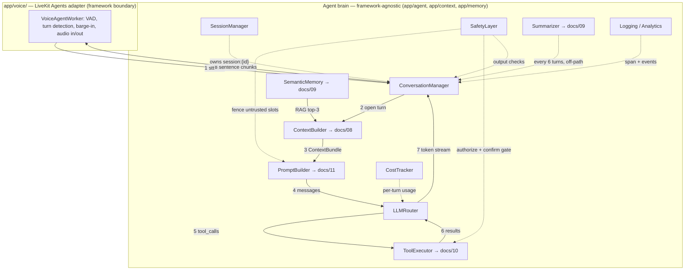
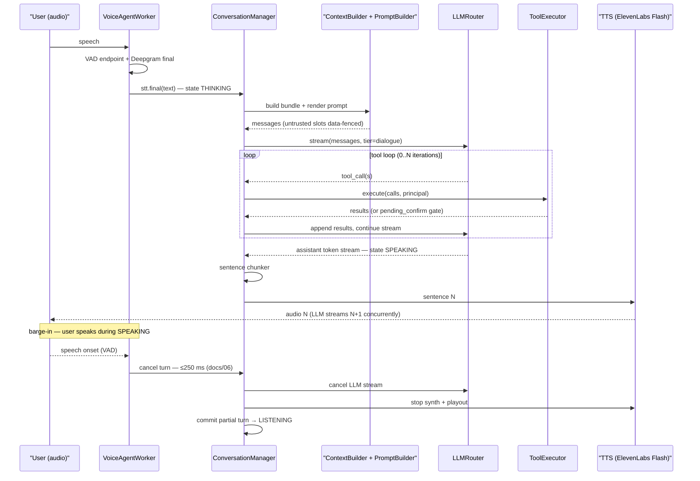
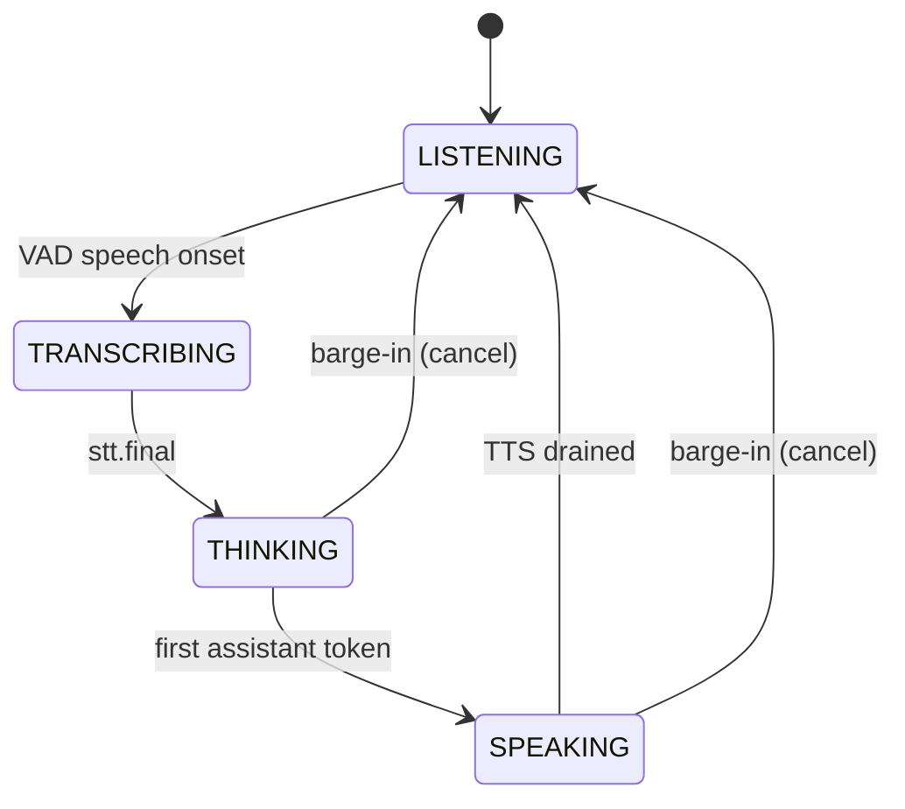
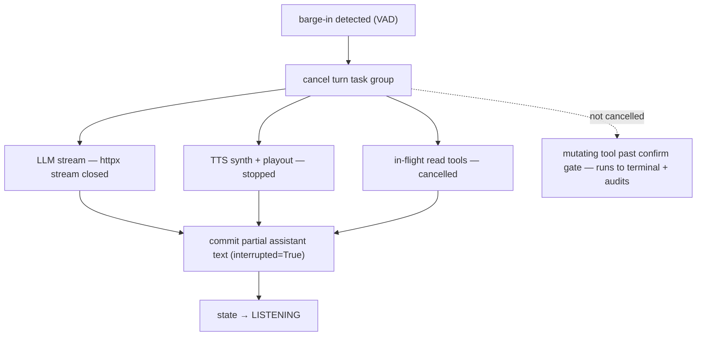

# AI Agent Architecture

This document owns the agent "brain": the fourteen modules that turn a final transcript into spoken words, how they compose into one turn, and where the framework ends and our code begins. It is the map — each module gets a responsibility, a Python interface, its collaborators, and its failure behavior, with deep mechanics delegated to the specialist docs it links. The single load-bearing idea: **the framework moves audio; we own the intelligence.** LiveKit Agents ([docs/06](06-voice-pipeline.md)) handles VAD, turn detection, and barge-in inside `app/voice/`; everything that decides *what Asha says* — context, memory, prompts, routing, tools, safety, cost — is framework-agnostic custom code that could be lifted onto a different transport with only `VoiceAgentWorker` rewritten.

**Read this with:** [docs/06](06-voice-pipeline.md) for the audio pipeline and barge-in mechanics this brain plugs into, [docs/08](08-context-and-events.md) for the `ContextBuilder` that feeds each turn, [docs/09](09-memory-architecture.md) for the memory layers behind `SemanticMemory` and `Summarizer`, and [docs/10](10-tool-calling.md) for the `ToolExecutor` pipeline summarized here.

---

## 1. The agent brain: module map

One turn touches ten modules inside the brain plus two that observe it. The boundary that matters is the box: `VoiceAgentWorker` is the only class that imports LiveKit; everything below it speaks in `ContextBundle`, `Message`, `ToolResult`, and `TurnCost`, not in audio frames or room events.



Solid arrows are the turn's critical path (numbered in execution order); dashed arrows are cross-cutting concerns that run around every turn. The module-to-canon mapping, and who owns the authoritative spec:

| Module | Canon component | Package | This doc | Deep-dive doc |
|---|---|---|---|---|
| `VoiceAgentWorker` | `VoiceAgentWorker` | `app/voice/` | boundary only | [docs/06](06-voice-pipeline.md) |
| `SessionManager` | `SessionManager` | `app/agent/` | §3.1 owns | — |
| `ConversationManager` | `ConversationManager` | `app/agent/` | §3.2 owns | — |
| `ContextBuilder` | `ContextBuilder` | `app/context/`+`app/agent/` | §3.3 references | [docs/08](08-context-and-events.md) |
| `PromptBuilder` | `PromptBuilder` | `app/agent/` | §3.3 references | [docs/11](11-prompt-engineering.md) |
| `LLMRouter` | `LLMRouter` | `app/agent/` | §3.4 owns | — |
| `ToolExecutor` | `ToolExecutor` | `app/agent/`+`app/tools/` | §3.5 references | [docs/10](10-tool-calling.md) |
| `SafetyLayer` | `SafetyLayer` | `app/agent/` | §3.6 owns | [docs/14](14-security.md) |
| `SemanticMemory` | `SemanticMemory` (retriever) | `app/memory/` | §3.7 references | [docs/09](09-memory-architecture.md) |
| `CostTracker` | `CostTracker` | `app/agent/` | §3.8 owns | [docs/16](16-tech-stack.md) |
| `Summarizer` | `Summarizer` | `app/agent/` | §3.9 references | [docs/09](09-memory-architecture.md) |
| Logging / Analytics | structlog + OTel | cross-cutting | §3.10 owns | [docs/04](04-backend-architecture.md) |

Business Knowledge / Retriever is `SemanticMemory` (canon §11); Cost Optimizer is `CostTracker` (canon §9); Conversation Summary is `Summarizer` (canon §11). The names are frozen — this doc renames nothing.

### 1.1 The framework boundary, and why it is where it is

`app/voice/` is the only package that imports LiveKit. `VoiceAgentWorker` adapts the framework's callbacks (VAD fired, turn detected, transcript final, barge-in) into calls on `ConversationManager`, and adapts the brain's sentence chunks back into the framework's audio sink. That is the entire surface. The rule bought two concrete things:

- **The brain is testable without a room.** Every module below the boundary is exercised in unit and replay tests by feeding a `stt.final` string and asserting on the emitted sentences, tool calls, and span — no LiveKit server, no audio, no WebRTC. The canonical call's eval fixtures ([docs/10 §8](10-tool-calling.md)) run this way.
- **The transport is swappable.** LiveKit Agents was chosen for VAD/turn-detection/barge-in maturity (canon ADR-2), but if it were replaced — a different Agents SDK, or a telephony bridge — only `VoiceAgentWorker` is rewritten. The rejected alternatives are instructive: raw aiortc/libwebrtc ("never ships" — too much transport plumbing to own), and Pipecat, which is an *orchestration* framework that would have wanted to own the turn loop, context, and tool calls — exactly the intelligence this boundary keeps in our code. We took LiveKit for transport and turn mechanics and declined every framework that reached past that line.

---

## 2. Turn lifecycle

A turn is: user stops speaking → agent audio starts, target **p50 ≤ 1.0 s / p95 ≤ 2.0 s** (canon §7, [docs/06](06-voice-pipeline.md) owns the budget). The brain's job runs between `stt.final` and the first sentence chunk; everything before and after is the framework's.



Three properties the diagram encodes. First, the **tool loop is inside the turn** — the LLM may call tools, read the results, and continue speaking, all before the merchant hears a word; the loop bound is small (typically 0–2 iterations) and each read batch is parallel ([docs/10 §2](10-tool-calling.md)). Second, **TTS and LLM overlap**: sentence N plays while the router streams N+1, which is what keeps a multi-sentence answer inside the p95 budget (§4). Third, **barge-in is a cancellation, not a pause** — the mechanics live in [docs/06](06-voice-pipeline.md), but the brain's contribution is committing the half-spoken turn to the transcript honestly (§3.2) so the next turn knows Asha was interrupted mid-sentence.

### 2.1 One turn, attributed

Turn 3 of the canonical call — Rajesh has asked whether his wallet even has the money, and Asha must resolve the wallet-vs-limit contradiction (₹18,450 balance, but a ₹245 payment declined on the *daily limit*). This is a tool turn: two parallel reads, then speech. Latency line items are canon §7 (owned by [docs/06](06-voice-pipeline.md)); the point here is *which module owns each*.

| Step | Owner | Work | p50 (ms) |
|---|---|---|---|
| `stt.final` delivered | `VoiceAgentWorker` | Deepgram finalization after VAD endpoint | 80 (post-endpoint) |
| Open turn, state → THINKING | `ConversationManager` | State transition, `turn_started` event | ~0 |
| Assemble context | `ContextBuilder` | 3 pipelined Redis reads → `ContextBundle` | 15 |
| Render + fence prompt | `PromptBuilder` + `SafetyLayer` | Template fill, untrusted slots data-fenced | (within build) |
| Stream dialogue, first token | `LLMRouter` | Sonnet 5 via OpenRouter, cached prefix | 450 (TTFT) |
| Emit `get_wallet_balance` + `get_payment_status` | `LLMRouter` → `ConversationManager` | Two read-tier `tool_call`s | — |
| Execute both in parallel | `ToolExecutor` | `asyncio.gather`; `get_payment_status` joins `merchant_limits` ([docs/10 §3.1](10-tool-calling.md)) | ~10 (both) |
| Continue stream with results | `LLMRouter` | Reason over ₹18,450 balance + ₹24,890/₹25,000 limit | — |
| Output check | `SafetyLayer` | Both voiced amounts trace to tool results → pass (§3.6) | ~0 |
| Chunk + speak sentence 1 | `ConversationManager` → TTS | ElevenLabs Flash first byte, LLM streams sentence 2 | 120 (TTFB) |
| Record cost + events | `CostTracker`, Logging | Usage → span attrs; `turn_completed` | off hot path |

The two reads costing one round-trip is the parallel-tool payoff ([docs/10 §2](10-tool-calling.md)); the `SafetyLayer` output check passing is the "no unverified account facts" invariant doing its job — both numbers Asha is about to say exist in results logged one span earlier. The turn lands comfortably inside the p50 ≤ 1.0 s target because the only serial costs that matter are STT finalization, TTFT, and TTS first byte; everything the brain adds on top is single-digit to low-double-digit milliseconds.

---

## 3. Modules

Each section: responsibility, key interface (illustrative signatures, not the literal source), collaborators, failure behavior.

### 3.1 SessionManager

**Responsibility.** Owns the session lifecycle and the Redis session state (`session:{id}` hash, canon §11). One session per call, no exceptions — the session is created by agent-api at `POST /v1/sessions` before the LiveKit room exists ([docs/13](13-api-contracts.md)), attached by voice-worker when it joins the room, kept alive by heartbeats, and closed exactly once on hang-up, escalation, or timeout.

```python
class SessionManager:
    async def create(self, user_id: str, screen_context: ScreenContext,
                     recent_events: list[AppEvent]) -> Session: ...   # agent-api, pre-room
    async def attach(self, session_id: str) -> Session: ...           # worker joins the room
    async def heartbeat(self, session_id: str) -> None: ...           # liveness ping, no TTL touch
    async def end(self, session_id: str, reason: EndReason) -> None: ...  # idempotent; triggers post-call
```

**Collaborators.** `ConversationManager` (reads/writes the hash it created), the post-call pipeline ([docs/09 §8](09-memory-architecture.md)) which `end()` kicks off, `VoiceAgentWorker` (attaches on room-join, calls `end` on room-close).

**Failure behavior.** `create` is the only synchronous dependency before audio; if Postgres is slow the profile prefetch degrades but the session still forms. `end` is idempotent (keyed on `session_id`) so a double hang-up — room-close plus an explicit `escalate_to_human` — fires the post-call pipeline once, not twice. The `session:{id}` TTL is 24 h and never refreshed to infinity: if the worker dies the session expires on its own, the call was already dropped, and nothing leaks ([docs/09 §3](09-memory-architecture.md)).

### 3.2 ConversationManager

**Responsibility.** Drives the per-turn state machine, assembles the transcript, and owns interruption policy. It is the orchestrator every solid arrow in §1 passes through — the one place that knows a turn is in flight and can cancel it.



```python
class ConversationManager:
    state: TurnState  # LISTENING | TRANSCRIBING | THINKING | SPEAKING
    async def on_stt_final(self, text: str) -> None: ...   # opens a turn, runs the critical path
    async def on_barge_in(self) -> None: ...               # cancels THINKING/SPEAKING subtree
    def append_turn(self, role: Role, text: str, *, interrupted: bool = False) -> None: ...
```

**Interruption policy.** Barge-in is only meaningful in `THINKING` and `SPEAKING`; an onset in `LISTENING` just starts the next turn normally. On barge-in the manager cancels the turn's asyncio subtree (§4) and calls `append_turn(role="assistant", text=<partial>, interrupted=True)` — the half-spoken sentence is recorded as interrupted, not as if Asha finished it, so the rolling summary and the next prompt reflect reality. The one thing barge-in does **not** cancel is a mutating tool already past its confirm gate and executing ([docs/10 §4](10-tool-calling.md)); it has an idempotency key and must reach a terminal audited state (§4).

**Collaborators.** `ContextBuilder`/`PromptBuilder`, `LLMRouter`, `ToolExecutor`, `SafetyLayer` (output checks on the token stream), the sentence chunker that feeds `VoiceAgentWorker`.

**Failure behavior.** If the critical path raises anywhere, the manager degrades to a spoken apology plus an `escalate_to_human` offer rather than dropping silence on the call. State transitions are the source of truth for "is a turn cancellable" — a bug that leaves the machine in `SPEAKING` after TTS drains would swallow the next barge-in, so the transition on TTS-drain is asserted in the voice-pipeline tests ([docs/06](06-voice-pipeline.md)).

### 3.3 ContextBuilder + PromptBuilder

**Responsibility.** `ContextBuilder` assembles the nine-slot `ContextBundle` from Redis and pgvector each turn ([docs/08 §5](08-context-and-events.md)); `PromptBuilder` renders it into the message list and **data-fences the untrusted slots** — screen content, event names, the user utterance — so injected text in a screen label is never read as an instruction ([docs/11](11-prompt-engineering.md), [docs/14](14-security.md)). This doc does not restate the template or the slot budget; both are owned elsewhere.

```python
class ContextBuilder:
    async def build(self, session: Session) -> ContextBundle: ...   # docs/08 owns assembly

class PromptBuilder:
    def render(self, bundle: ContextBundle) -> list[Message]: ...   # docs/11 owns the template
```

**Collaborators.** Reads `session:{id}`, `ctx:{session_id}`, and the event list ([docs/08](08-context-and-events.md)); pulls the RAG slot from `SemanticMemory` (§3.7); consumes the rolling summary from `Summarizer` (§3.9). Hands `PromptBuilder`'s output to `LLMRouter`.

**Failure behavior.** The assembly is mechanical and inside a 15/40 ms budget (canon §7) — no LLM on this path. Every context failure degrades context, never the turn: a lost data channel drops to screen-name-only (~25 tokens) and Asha shifts to past tense ([docs/08 §7](08-context-and-events.md)). The never-drop set (system, business rules, current utterance, pending-confirmation state) is what keeps a degraded turn *correct* even when it is thin.

### 3.4 LLMRouter

**Responsibility.** Chooses a model tier per task, streams completions through `LLMProvider`→`OpenRouterLLM`, and owns the fallback / retry / timeout policy. All model IDs are config-driven defaults, never hardcoded constants (canon §5).

```python
class LLMRouter:
    def route(self, task: TaskKind) -> ModelTier: ...   # DIALOGUE -> sonnet, UTILITY -> haiku
    async def stream(self, messages: list[Message], *, tier: ModelTier,
                     tools: list[ToolSchema] | None = None,
                     ttft_deadline_s: float = 1.5) -> AsyncIterator[LLMEvent]: ...
```

**Tier rules.** Two tiers, one decision each, chosen so the merchant-facing turn gets the best model and the invisible bookkeeping gets the cheap one:

| Task | Tier | Model (current default) | Why this tier |
|---|---|---|---|
| Dialogue turn (reasoning + tool calls the caller hears) | dialogue | Claude Sonnet 5 (`anthropic/claude-sonnet-5`) | Quality + tool-use reliability on the only text the merchant experiences |
| Rolling-summary fold ([docs/09 §4](09-memory-architecture.md)) | utility | Claude Haiku 4.5 (`anthropic/claude-haiku-4-5`) | Off-path, structured, fires ~twice/call |
| Intent classification (retrieval gate, affirmation aid) | utility | Claude Haiku 4.5 | Single-label, fast, cheap |
| Post-call summary + profile extraction | utility | Claude Haiku 4.5 | Structured JSON, off the critical path |
| Context compression (the summary fold *is* the only LLM compressor) | utility | Claude Haiku 4.5 | Hot-path shaping stays mechanical ([docs/08 §4.3](08-context-and-events.md)); LLM compression only off-path |

Pricing (canon §5): Sonnet 5 $3/M in, $15/M out (intro $2/$10 through 2026-08-31); Haiku 4.5 $1/M in, $5/M out. The tier split is why a 5-minute call's LLM spend is ≈ $0.10 (canon §9) rather than paying Sonnet rates for summaries nobody hears.

**Fallback array.** Every OpenRouter request carries a `models: [...]` fallback list, so a primary-model 5xx or capacity error re-routes to the next model **at the provider edge**, transparently, within the same HTTP call. Slugs are config, not code:

```python
# illustrative — real values from OPENROUTER_DIALOGUE_MODEL etc.
request = {
    "models": [settings.dialogue_model,          # anthropic/claude-sonnet-5
               settings.dialogue_fallback_1,      # a GPT-class model
               settings.dialogue_fallback_2],     # a Gemini-class model
    "stream": True, "messages": messages, "tools": tools,
}
```

The router logs which model actually served the turn as a span attribute, so a silent fallback shows up in the trace instead of as a mysterious quality dip.

**Retry / timeout policy.** The fallback array covers *routing* failures; the router's own logic covers *latency* failures — a first token that never comes. TTFT p50/p95 is 450/900 ms (canon §7); the deadline is set well beyond that at **1.5 s**:

1. No first token by 1.5 s → emit a filler phrase to TTS ("Let me pull that up for you…") to hold the voice channel, and **retry the request once** on the same tier.
2. The retry also stalls or errors → **degrade**: fall through the fallback array and, if needed, answer from a shortened screen-context-only prompt (drop RAG and shrink the window) rather than keep the caller in silence.
3. Total failure of the array → graceful spoken apology plus an `escalate_to_human` offer.

The filler-then-retry beats a hard timeout because a voice caller reads two seconds of dead air as a dropped call; a spoken "let me pull that up" buys the retry its second chance without the merchant noticing.

### 3.5 ToolExecutor

**Responsibility.** Everything between the LLM emitting a `tool_call` and a formatted result returning to the stream: allowlist lookup, Pydantic validation, principal injection, tier policy (read / confirm-required / sensitive / control), the voiced-confirmation gate, idempotency, execution under a 2 s budget, synchronous audit, and result truncation. **[docs/10](10-tool-calling.md) is authoritative and this doc does not restate it.**

```python
class ToolExecutor:
    async def execute(self, calls: list[ToolCall],
                      principal: SessionUser) -> list[ToolResult]: ...   # docs/10 §2
```

**Collaborators.** `ConversationManager` (calls it inside the tool loop), `SafetyLayer` (affirmation classification for the confirm gate, §3.6), the 16 tool modules in [backend/app/tools/](../backend/app/tools/), Redis (idempotency), Postgres (`tool_invocations` audit, [docs/12](12-data-models.md)).

**Failure behavior.** Errors are results, not exceptions — a tool failure returns a structured `{ok: false, error: {...}}` the LLM recovers from conversationally, and every outcome (ok, denied, error, pending, cancelled) writes one audit row ([docs/10 §5](10-tool-calling.md)). The two invariants this doc leans on elsewhere: no tool accepts a `user_id` (the executor injects the session principal), and mutating tools cannot fire without a voiced affirmation.

### 3.6 SafetyLayer

**Responsibility.** The guardrail that wraps every turn on three sides — input, output, and action. It is deliberately one component so the security boundary lives in one place ([docs/14](14-security.md) owns the threat model). Screen content and user speech are untrusted (canon §12); the safety layer is what makes acting on them safe.

```python
class SafetyLayer:
    def fence_input(self, bundle: ContextBundle) -> ContextBundle: ...        # data-fence untrusted slots
    def screen_output(self, text: str, tool_results: list[ToolResult]) -> SafetyVerdict: ...
    def classify_affirmation(self, utterance: str, pending: PendingConfirm | None) -> bool: ...
    def authorize_tool(self, call: ToolCall, principal: SessionUser) -> bool: ...
```

| Check | Stage | Action on fail |
|---|---|---|
| Screen text rendered inside a data fence, never as instructions | input | Structural — always applied; a label that reads like a command stays inert text |
| Injection heuristics (imperative patterns, "ignore previous", tool-name strings) in screen labels / utterance | input | Flag the slot suspicious, neutralize, record on the trace |
| No unverified account facts — every ₹ amount / reference id Asha voices must trace to a tool result this session | output | Block the utterance, force a read tool or a hedge ("let me check that") |
| PII mask — card / Aadhaar / PAN patterns | output | Mask before TTS and before any log or persist ([docs/09 §10](09-memory-architecture.md)) |
| Forbidden-content filter | output | Block, replace with a safe deflection |
| Tool allowlist — name in the 16-entry registry | action | `status=denied` audit row, typed refusal to the LLM ([docs/10 §2](10-tool-calling.md)) |
| Confirm gate — mutating tool needs a voiced affirmation | action | Hold execution, instruct the model to voice the action + consequence ([docs/10 §4](10-tool-calling.md)) |
| Principal scoping — no `user_id` in tool args | action | Reject the call (invariant 3, [docs/10 §1](10-tool-calling.md)) |

**Collaborators.** `PromptBuilder` (input fencing), `ConversationManager` (output verdict on the stream), `ToolExecutor` (authorization + affirmation).

**Failure behavior.** The output "no unverified account facts" check is the enforcement arm of canon's headline rule — it is *checkable*, and a CI replay eval fails any turn that voices a number absent from that session's tool results ([docs/10 §1](10-tool-calling.md)). If the check itself errors, the turn fails closed: hedge and re-fetch rather than voice an unverified amount.

### 3.7 SemanticMemory / Retriever

**Responsibility.** The Business Knowledge retriever: pgvector cosine top-3 over the seeded support KB plus this merchant's past-call summaries, embedded with `text-embedding-3-small` (1536-dim). [docs/09 §6](09-memory-architecture.md) owns the corpus, schema, and retrieval contract.

```python
class SemanticMemory:
    async def retrieve(self, query: str, principal: SessionUser, *,
                       k: int = 3, floor: float = 0.70) -> list[Chunk]: ...
```

**When retrieval fires vs skips.** Retrieval is intent-gated, not per-turn — embedding every utterance adds a network hop to turns that gain nothing from it:

| Turn kind | Retrieval | Reason |
|---|---|---|
| Informational ("how do I raise my limit?", "why was I charged this fee?") | **Fires** | KB context makes the answer specific and correct |
| Topic shift (classified intent changes) | **Fires** — re-query | The old RAG slot is now off-topic |
| Call setup (speculative prefetch) | **Fires once** — query is error-code + screen (`DAILY_LIMIT_EXCEEDED PaymentScreen`) | Context-complete before the first word ([docs/08 §1](08-context-and-events.md)) |
| Transactional turn (confirm/execute a tool, read a balance) | **Skipped** | Ground truth is the tool result, not a KB article; a marginal snippet only adds noise |

**Collaborators.** `ContextBuilder` (consumes the top-3 into the RAG slot), `EmbeddingProvider`→`OpenAIEmbeddings`.

**Failure behavior.** An embedding outage skips the RAG slot entirely — it is advisory (drop-rung 1, [docs/08 §5.2](08-context-and-events.md)) — and the agent runs on screen + tools + business rules, losing KB color but not correctness. Below-floor (< 0.70) results are dropped, not padded: an empty slot beats a plausibly-wrong one the model would over-trust ([docs/09 §6.2](09-memory-architecture.md)).

### 3.8 CostTracker

**Responsibility.** Per-turn token and cost attribution from provider usage fields, a running per-call counter, the budget guard, and the finalized `call_costs` row. Cost Optimizer in the deliverable maps here (canon §9; [docs/16](16-tech-stack.md) owns the cost model).

```python
class CostTracker:
    def record_turn(self, usage: ProviderUsage, model: str, span: Span) -> TurnCost: ...
    def call_total(self) -> Decimal: ...
    def over_budget(self, cap_usd: Decimal = Decimal("1.00")) -> bool: ...
    async def finalize(self, session_id: str) -> None: ...   # writes call_costs (docs/09 §8)
```

**Attribution.** Each LLM response carries `usage` (input tokens, output tokens, and cached-prefix counts); `record_turn` multiplies by the model's per-token price and writes the result two places: as OTel span attributes on the turn (`llm.input_tokens`, `llm.output_tokens`, `llm.cost_usd`, and the model that served it) and into the running `cost_usd` field of `session:{id}`. STT and TTS cost are attributed at their own spans. The canonical 5-minute call lands at ≈ $0.30 (~₹25): STT ≈ $0.04, LLM ≈ $0.10 with prompt caching (vs $0.16 without), TTS ≈ $0.15, LiveKit self-hosted ≈ $0 (canon §9).

**Budget guard.** The per-call cap is **$1** — roughly 3× a normal call, a runaway guard, not a normal-operation throttle. On `call_total() > $1`: log a warning, emit a span event, and signal `ContextBuilder` to **degrade to a shorter context** (drop RAG, shrink the conversation window) so further turns cost less. A call that keeps climbing after the degrade is a signal to offer `escalate_to_human` — a call that expensive is not going well anyway.

**Collaborators.** `LLMRouter` (usage per completion), the voice pipeline (STT/TTS cost), the post-call pipeline (`finalize` writes the durable row, [docs/09 §8](09-memory-architecture.md)).

**Failure behavior.** If a provider omits usage fields, the tracker estimates from the `chars/3.5` token proxy and marks the turn `cost_estimated=true` on the span — an approximate cost beats a missing one for the dashboard. A finalize failure is retried inside the 24 h Redis window with the rest of the post-call pipeline (idempotent on `session_id`).

### 3.9 Summarizer

**Responsibility.** Two summaries. The **rolling summary** compresses a long call in-flight — fired at turn 9 then every 6 turns, on the utility model, off the turn path ([docs/09 §4](09-memory-architecture.md) owns the algorithm). The **post-call summary** writes the durable `conversation_summaries` row and its embedding at hang-up. This doc does not restate the fold algorithm.

```python
class Summarizer:
    async def maybe_fold(self, session: Session) -> None: ...              # every 6 turns, detached task
    async def final_summary(self, session: Session) -> ConversationSummary: ...  # post-call
```

**Collaborators.** `LLMRouter` (utility tier), `SessionMemory` (reads transcript, writes the `summary` field), the post-call pipeline and `SemanticMemory` (embeds the final summary for future recall).

**Failure behavior.** The fold is off the critical path — kicked after turn N's TTS dispatch, landing before turn N+1 at a ~20 s cadence — so a slow or failed fold never stalls a turn; the next turn just uses the prior summary. The preservation contract (money, IDs, tool outcomes, voiced commitments kept verbatim) plus the fact that `pending_confirm` and tool digests live *outside* the summary is what bounds summary drift ([docs/09 §11](09-memory-architecture.md)).

### 3.10 Logging / Analytics

**Responsibility.** The structlog JSON event stream and its OTel span backbone — one trace per turn (canon §5). The event catalog is the contract the Grafana dashboard reads ([docs/04](04-backend-architecture.md) owns the dashboard itself).

| Event | Emitted when | Key fields |
|---|---|---|
| `turn_started` | `on_stt_final` opens a turn | `session_id`, `turn_no`, `state` |
| `stt_final` | Deepgram returns a final transcript | `text_len`, `stt_ms`, `is_endpoint` |
| `llm_first_token` | First dialogue token arrives | `ttft_ms`, `model`, `tier`, `cache_hit` |
| `tool_executed` | Each tool reaches a terminal state | `tool`, `tier`, `status`, `latency_ms`, `idempotency_key` |
| `tts_first_byte` | ElevenLabs returns first audio | `tts_ttfb_ms`, `sentence_no` |
| `turn_completed` | TTS drains, state → LISTENING | `turn_ms`, `input_tokens`, `output_tokens`, `cost_usd`, `interrupted` |
| `call_ended` | `SessionManager.end` | `duration_s`, `turn_count`, `resolution`, `call_cost_usd` |

**Collaborators.** Every brain module logs into the current turn's span context, so a field like `cost_usd` on `turn_completed` and the `llm.cost_usd` span attribute (§3.8) are the same number seen two ways. Spans are named per canon §5 (`turn` → `stt.final`, `context.build`, `llm.ttft`, `llm.total`, `tool.exec.<name>`, `tts.first_byte`); the structlog events above hang off those spans.

**Failure behavior.** Logging is best-effort and never on the critical path — a dropped log line loses a dashboard data point, never a turn. PII is masked by `SafetyLayer` *before* anything is logged (canon §12), so the event stream is safe to ship to Grafana/Tempo without a second redaction pass.

---

## 4. Concurrency model

One call is one **asyncio task group** (structured concurrency), rooted in `VoiceAgentWorker`'s call handler. The task group is the cancellation boundary: when the call ends or the worker crashes, the whole subtree tears down together, and no turn task outlives the call that spawned it.

**What runs concurrently within a turn:**

| Concurrent work | Mechanism | Payoff |
|---|---|---|
| TTS of sentence N while LLM streams N+1 | Sentence chunker dispatches each completed sentence to TTS as the stream continues | Multi-sentence answers stay inside the p95 budget instead of serializing synth after generation |
| Parallel read-tools in one LLM response | `asyncio.gather` over read-tier calls ([docs/10 §2](10-tool-calling.md)) | Two reads cost one tool round-trip in the latency budget |
| Rolling-summary fold | Detached background task, off the turn path (§3.9) | A ~1.5 s Haiku call never touches turn latency |
| Cost + log writes | Awaited at turn close, not on the hot path | Attribution complete before the next turn opens |

Mutating tools are the deliberate exception — never parallelized, and a mutating call in a batch serializes the whole batch ([docs/10 §2](10-tool-calling.md)).

**Cancellation tree on barge-in.** Barge-in (VAD detects caller speech during `SPEAKING`) cancels the turn's task subtree, target ≤ 250 ms (canon §7, mechanics [docs/06](06-voice-pipeline.md)):



The one node that resists cancellation is a mutating tool already past its confirm gate: it holds an idempotency key and a half-open business write, so it must reach a terminal, audited state ([docs/10 §4](10-tool-calling.md)) — its result is simply dropped from the cancelled turn and surfaces as a tool digest the next turn can voice ("that limit request did go through"). Cancelling it instead would risk a write with no audit row, which the whole tool layer is built to prevent.

### 4.1 Task-group lifecycle

The call's task group is spawned by `VoiceAgentWorker` on room-join and lives exactly as long as the call. Its children are few and named:

| Child task | Lifetime | Cancelled by |
|---|---|---|
| Turn task (the §2 critical path) | One turn | Barge-in, or completes on TTS drain |
| Detached summary fold | ~1.5 s, fires every 6 turns | Runs to completion or call-end teardown |
| Session heartbeat | Whole call | Call-end teardown |
| Context ingestion (data-channel consumer) | Whole call | Call-end teardown ([docs/08 §3.2](08-context-and-events.md)) |

Two teardown paths. **Clean end** (hang-up, `escalate_to_human`, or timeout): `SessionManager.end` marks `state = ended`, the task group cancels its remaining children in reverse-spawn order, and the post-call pipeline runs from the still-live Redis hash ([docs/09 §8](09-memory-architecture.md)). **Worker crash**: the group dies with the process, the call drops, and there is nothing to clean up in-band — the `session:{id}` and `ctx:{session_id}` keys expire on their TTLs (24 h / 60 min), and the post-call pipeline simply never runs for that call. Structured concurrency is what makes the crash case boring: there are no orphaned turn tasks to leak because a turn task cannot outlive the group that owns it.

---

## 5. Extensibility recipes

The framework boundary earns its keep here: three common changes touch a bounded, predictable set of modules.

**Add a tool.** Four mechanical steps, fully specified in [docs/10 §8](10-tool-calling.md): JSON Schema in [protocol/](../protocol/), a Pydantic module in [backend/app/tools/](../backend/app/tools/) (input model, output model, async handler that receives the injected principal), the `@tool` decorator that auto-registers name/tier/gating, and a replay eval fixture. Nothing in the brain changes — prompt tool definitions are generated from the registry, and the executor is tool-agnostic. Roughly 120 lines including the fixture.

**Swap the TTS vendor.** Implement `TtsProvider` for the new vendor (streaming synth, first-byte and chunk callbacks), flip `TTS_PROVIDER` in config, done. Because TTS lives behind the provider interface in `app/providers/` and the brain only ever emits sentence strings to the chunker, no brain module knows or cares which vendor speaks. The same shape applies to `SttProvider` and `EmbeddingProvider` (canon §3).

**Add a language (e.g. Hinglish / Hindi).** Three coordinated slots, no code paths forked: a persona variant in the system slot ([docs/11](11-prompt-engineering.md)) so Asha's register fits the language; the Deepgram STT and ElevenLabs TTS locale config for that language; and the prompt's voice-style rules for it. The tool contracts, memory layers, and routing are language-neutral — they move rupees and read screens the same way regardless of the spoken language. Hinglish/Hindi is listed as a future enhancement (canon §1), and this is the seam it plugs into.

---

## 6. Failure modes

Doc-set convention: Failure | Detection | Impact | Mitigation | Degradation. These are the brain-level failures; context, memory, and tool failures are owned by [docs/08 §7](08-context-and-events.md), [docs/09 §11](09-memory-architecture.md), and [docs/10 §5](10-tool-calling.md) respectively.

| Failure | Detection | Impact | Mitigation | Degradation |
|---|---|---|---|---|
| LLM timeout (no first token by the 1.5 s deadline) | `LLMRouter` TTFT timer vs the 900 ms p95 baseline (canon §7) | The caller hears silence where the answer should start | Filler phrase to TTS to hold the channel + one retry same tier (§3.4); if it also stalls, fall through the fallback array | Shortened screen-context-only prompt — a correct thin answer over dead air |
| Tool timeout mid-speech (2 s ceiling hit while Asha is already talking) | `asyncio.wait_for` in `ToolExecutor` ([docs/10 §5](10-tool-calling.md)) | The in-flight sentence promised data that did not arrive | `TOOL_TIMEOUT` returns as a result, not an exception; the LLM recovers conversationally ("that's taking longer than it should") and retries once or answers from screen context | The turn completes with a hedge + retry offer; the audit row records the timeout |
| Provider 5xx cascade (primary model erroring repeatedly) | HTTP status from `OpenRouterLLM`; error rate on the `llm.total` span | Dialogue turns fail at the model layer | OpenRouter `models: [...]` fallback re-routes to the next model at the provider edge, transparent to the turn (§3.4); the served model is logged | Answer served by a fallback model — logged as a quality-watch signal, invisible to the caller |
| OpenRouter fallback fired (primary unavailable, secondary served) | Served-model span attribute ≠ configured primary | A GPT- or Gemini-class model answered instead of Sonnet 5 — subtly different phrasing / tool-use | None needed in the moment — the fallback *is* the mitigation; the invariant checks (no unverified facts, confirm gate) apply identically to any model | Continuity preserved; a dashboard panel counts fallback rate so a persistent primary outage surfaces as ops signal, not user complaints |

The shape across all four rows mirrors the rest of the system: **the brain degrades the answer, never the call.** A slow model, a timed-out tool, a cascading provider — each has a spoken degradation that keeps Asha honest and the voice channel alive, and none of them can make her state an account fact a tool did not confirm.

---

## Decisions this document exports

| Fixed here | Value | Heaviest consumer |
|---|---|---|
| Framework boundary | `VoiceAgentWorker` is the only LiveKit-aware class; the brain is transport-agnostic | [docs/06](06-voice-pipeline.md), [docs/02](02-system-architecture.md) |
| Turn state machine | LISTENING → TRANSCRIBING → THINKING → SPEAKING → LISTENING; barge-in is a cancel, not a pause | [docs/06](06-voice-pipeline.md) |
| Interruption policy | Partial turn committed `interrupted=True`; mutating tool past the gate runs to terminal | [docs/09](09-memory-architecture.md), [docs/10](10-tool-calling.md) |
| LLM tiering | Dialogue → Sonnet 5; summarize/classify/compress → Haiku 4.5; IDs config-driven | [docs/16](16-tech-stack.md) |
| Router resilience | 1.5 s TTFT deadline → filler + retry once → degrade; OpenRouter `models:[...]` fallback array | [docs/06](06-voice-pipeline.md), [docs/16](16-tech-stack.md) |
| SafetyLayer surface | Three sides (input fence / output checks / action gate); check-stage-action table | [docs/14](14-security.md) |
| Retrieval gating | RAG on informational + topic-shift + setup; skipped on transactional turns | [docs/09](09-memory-architecture.md) |
| Cost attribution + guard | Per-turn from provider usage → span attrs + `call_costs`; $1 call cap → warn + shorten context | [docs/16](16-tech-stack.md), [docs/04](04-backend-architecture.md) |
| structlog event catalog | 7 events (turn_started … call_ended) with fields, hung off named OTel spans | [docs/04](04-backend-architecture.md) |
| Concurrency model | One task group per call; TTS N ‖ LLM N+1; parallel reads; barge-in cancellation tree | [docs/06](06-voice-pipeline.md) |
