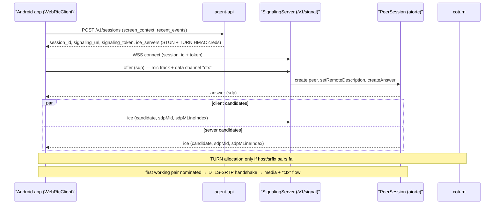
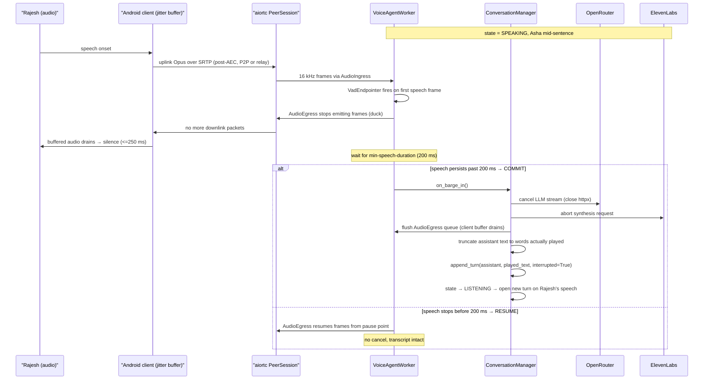

# WebRTC Voice Pipeline

This document owns the path a sound wave takes from Rajesh's phone microphone to Asha's spoken reply and back — the connection that carries it (raw WebRTC: libwebrtc on the phone, aiortc in the voice-worker, coturn in between when NAT demands it), the codecs, the hand-rolled VAD and endpointing, the streaming STT/LLM/TTS hops, and the two mechanics that decide whether a voice agent feels alive or feels like a walkie-talkie: **the latency budget** (which this doc defines and every other doc references) and **barge-in** (interrupting Asha mid-sentence). There is no framework in this path. `app/voice/` — `SignalingServer`, `PeerSession`, `AudioIngress`, `VadEndpointer`, `AudioEgress`, `VoiceAgentWorker` — is ours end to end; the intelligence it drives lives in the brain ([docs/05](05-agent-architecture.md)). This doc is the seam between the wire and the brain — what the audio path hands us, when, and in what shape.

**Read this with:** [docs/05](05-agent-architecture.md) for the agent brain the transcript feeds and the cancellation tree barge-in triggers, [docs/02](02-system-architecture.md) for the two-channel topology and container-level failures this pipeline runs on, and [docs/13](13-api-contracts.md) for the session mint and the signaling-token TTL that bound reconnection.

---

## 1. End-to-end pipeline

One turn is a chain of streaming hops, no stage waiting for the previous one to finish. The mic path and the speaker path are independent audio tracks on the same `RTCPeerConnection`; the worker sits at the far end translating between the wire format (Opus 48 kHz over SRTP, what WebRTC speaks) and the provider formats (16 kHz PCM for Deepgram, whatever ElevenLabs streams back).

```mermaid
flowchart LR
    MIC["Phone mic"] --> APM["libwebrtc APM: AEC / NS / AGC / HPF"]
    APM --> OENC["Opus encode 48 kHz mono, 20 ms frames"]
    OENC --> NET["SRTP: P2P or coturn relay"]
    NET --> PS["aiortc PeerSession"]
    PS --> ING["AudioIngress: Opus decode + resample to 16 kHz mono PCM"]
    ING --> VAD["VadEndpointer (Silero, 30 ms frames)"]
    ING --> DG["Deepgram Nova-3 stream (partials + finals)"]
    VAD -->|"endpoint"| BRAIN["Agent brain (docs/05): context, LLM, tools, safety"]
    DG --> BRAIN
    BRAIN --> CHUNK["sentence chunker"]
    CHUNK --> EL["ElevenLabs Flash v2.5 stream"]
    EL --> EGR["AudioEgress: resample to 48 kHz, Opus AudioStreamTrack"]
    EGR --> NET2["SRTP: same nominated pair back"]
    NET2 --> SPK["Phone speaker"]
    VAD -. "speech during SPEAKING = barge-in (section 6)" .-> BRAIN
```



Three facts the diagram fixes for the rest of the doc:

- **The worker is the only format translator.** The phone and the worker only ever speak Opus 48 kHz over SRTP; Deepgram's `linear16`/16 kHz requirement and ElevenLabs' output rate are hidden inside `app/voice/` behind `SttProvider` and `TtsProvider` (canon §3). Swapping either vendor never touches the wire format the peers negotiated.
- **`VadEndpointer` and Deepgram consume the same audio, concurrently.** `AudioIngress` fans the 16 kHz stream out to both. Silero decides *when the turn ends* (endpointing, §5) off raw frames; Deepgram decides *what was said*. The endpoint decision does not wait for a final transcript, and vice versa.
- **The dashed arrow is the whole reason this pipeline is hard.** During `SPEAKING`, the uplink VAD is still live, and a speech onset is a barge-in, not a new turn. Section 6 is that arrow.

### 1.1 What aiortc provides, what we own

aiortc is a protocol library, not a voice framework — it implements SDP, ICE, DTLS-SRTP, Opus RTP, and SCTP data channels, and stops there. Everything above the packet layer is ours, and it is worth naming exactly, because "raw WebRTC" is otherwise a hand-wave in the other direction.

| Concern | aiortc (library) | Our code (`app/voice/`) |
|---|---|---|
| SDP / ICE / DTLS-SRTP machinery | `RTCPeerConnection` state machines | `SignalingServer` + `PeerSession` drive them: answer, trickle ICE, teardown (§2) |
| Opus decode/encode + RTP + inbound jitter buffer | Built in | `AudioIngress` drains the remote track; `AudioEgress` feeds the outbound one, paced (§7) |
| Voice activity + endpointing | — | `VadEndpointer`: Silero via onnxruntime, 30 ms frames, endpoint policy (§5) |
| Barge-in | — | Duck-then-commit cancellation tree, transcript truncation, `[interrupted]` marker (§6) |
| STT transport | — | `DeepgramStt` behind `SttProvider` (canon §3) |
| TTS transport | — | `ElevenLabsTts` behind `TtsProvider`; the sentence chunker that feeds it |
| Data channel | SCTP transport, `createDataChannel` | The `ctx` protocol — envelopes, seq, snapshot recovery ([docs/08](08-context-and-events.md)) |
| Turn loop | — | `VoiceAgentWorker` task group; `ConversationManager` drives the brain ([docs/05 §3.2](05-agent-architecture.md)) |

The rule that keeps this honest: `PeerSession` is the *only* class that imports aiortc, and `VoiceAgentWorker` is the only class that wires it to the rest. Everything to the right of the audio classes speaks in transcripts, sentences, and `TurnState`, never in RTP packets or peer-connection events. That is what lets the entire brain be tested by feeding a `stt.final` string with no peer, no ICE, and no WebRTC ([docs/05 §1.1](05-agent-architecture.md)).

---

## 2. Connection establishment

Before any of §1 flows, two peers that have never met — a phone behind a carrier NAT and a worker in a container — must find a packet path and agree on keys. This is the part a managed platform hides and the part we now own: the signaling protocol, the ICE dance, and the DTLS-SRTP handshake. The wire format of every message below is canon §10; [docs/13](13-api-contracts.md) holds the REST contract, [docs/14](14-security.md) the token rules.



**Roles are fixed: the client offers.** The client knows at connect time exactly what the call needs — one mic track, one data channel labeled `ctx` — so it runs `createOffer` and the server answers. Fixed roles eliminate glare (both sides offering at once) by construction, and they keep `PeerSession` simple: it never initiates, it mirrors.

**Trickle ICE is the setup-latency lever.** Non-trickle ICE waits for *complete* candidate gathering — including TURN allocations and their timeouts, seconds on a mobile network — before the offer can even be sent. With trickle, the offer goes out immediately and `ice` messages stream both directions as candidates are found; connectivity checks start on the first arrivals, and media starts on the first working pair, not after the full gathering completes. This single decision is most of the difference between a call that connects in about a second and one that makes the caller stare at a spinner.

**Candidate-pair selection.** Each side gathers up to three candidate flavors: **host** (direct LAN — the demo's compose network), **srflx** (public address discovered via coturn's STUN — typical home/office NAT), and **relay** (coturn forwards the media — the guaranteed path through symmetric and carrier-grade NAT, which is the norm on Indian mobile carriers). ICE checks pairs in priority order (host > srflx > relay) and nominates the first that works. A relayed call adds one hop each way through coturn; the §4 budget's network line already covers it.

**DTLS-SRTP.** Once a pair is nominated, the peers run a DTLS handshake over it and derive SRTP keys from it; the `ctx` data channel's SCTP association rides the same DTLS session. Each side's certificate fingerprint is pinned in the SDP, so a compromised signaling channel cannot silently MITM the media without breaking the fingerprint check ([docs/14](14-security.md)).

After setup, the signaling WebSocket stays open for the life of the call as control plane only — trickle ICE for restarts (§8), `bye`, and a 10 s ping/pong keepalive. Context and captions ride the data channel, never the WS (canon §4.4).

### 2.1 Call-setup budget

Separate from the per-turn budget (§4), fixed by canon §7:

| Path | Session POST + WS connect + SDP exchange + trickle ICE to first media |
|---|---|
| Target, p50 | **≤ 1.5 s** |
| TURN-relayed worst case | **≤ 3 s** |

The TURN case pays extra round-trips for the relay allocation and permission handshake before checks can succeed on the relay pair — that is the gap between the two numbers. The caller does not experience this as dead air: the session POST returns instantly with seeded context, the client shows the connecting state, and the platform spends the same window on speculative context prefetch (§4.2) so Asha's greeting is ready the moment media opens.

---

## 3. Audio specifications

Opus in VoIP mode, mono, 48 kHz on the wire in both directions — the WebRTC default, and the format libwebrtc and aiortc negotiate without hand-munged SDP. The internal formats differ per provider and are the worker's problem.

### 3.1 Wire format (Android ↔ worker, P2P or via coturn relay)

| Property | Uplink (mic → worker) | Downlink (worker → speaker) |
|---|---|---|
| Codec | Opus (VoIP mode) | Opus (VoIP mode) |
| Sample rate | 48 kHz | 48 kHz |
| Channels | Mono | Mono |
| Frame size (ptime) | 20 ms | 20 ms |
| Target bitrate | ~24 kbps | ~24 kbps |
| In-band FEC | On | On |
| DTX (silence suppression) | On | On |
| PLC (packet loss concealment) | On | On |

Why these numbers: 24 kbps mono Opus is transparent for speech and survives the loss profile of Indian mobile networks with FEC on; pushing to 32 kbps buys nothing a caller can hear and costs headroom when the pipe narrows (§9). 20 ms frames are the latency/overhead sweet spot — 10 ms halves per-packet audio latency but doubles packet rate and header overhead, and 60 ms frames add audible lag to barge-in. DTX matters more than it looks: it stops sending frames during silence, which both saves uplink bandwidth *and* means `VadEndpointer` sees a clean gap rather than encoded comfort noise.

### 3.2 Internal formats (inside the worker)

| Hop | Format | Reason |
|---|---|---|
| Deepgram ingest | 16 kHz, mono, `linear16` PCM | Nova-3 streaming ingest; 16 kHz is the STT sweet spot — 48 kHz adds bytes and latency with no accuracy gain for speech |
| ElevenLabs egress | PCM 24 kHz mono (Flash streaming) | Lowest-latency Flash output tier; `AudioEgress` upsamples to 48 kHz and hands frames to the Opus `AudioStreamTrack` |

Downsampling 48 k → 16 k (`AudioIngress`) and upsampling 24 k → 48 k (`AudioEgress`) are cheap fixed-ratio resamples (sub-millisecond, inside the `context.build`/`tts.first_byte` accounting, not a separate budget line).

### 3.3 Client-side audio processing (WebRTC APM)

The single most load-bearing DSP block in the whole system is client-side and easy to overlook: **acoustic echo cancellation.** Without it, Asha's own voice coming out of the phone speaker is captured by the same phone's microphone, travels up the uplink, and the worker's VAD reads it as the caller speaking — a self-interrupt loop where the agent barges in on itself the moment it opens its mouth. AEC is what makes the dashed arrow in §1 safe to arm.

| APM stage | Purpose | Provided by |
|---|---|---|
| AEC | Remove Asha's TTS echoed through the speaker so barge-in VAD only fires on the *caller* | Android `VOICE_COMMUNICATION` audio source (hardware AEC where present) + libwebrtc APM software AEC |
| NS | Suppress shop background — Kumar General Store is a noisy counter (customers, street) | libwebrtc APM noise suppressor |
| AGC | Normalize mic level so a soft-spoken caller and a loud one both clear the VAD threshold | libwebrtc APM auto gain |
| HPF | High-pass filter — drop sub-80 Hz rumble (handling noise, motor hum) | libwebrtc APM |

`WebRtcClient` configures the `JavaAudioDeviceModule` for the `VOICE_COMMUNICATION` capture preset and `MODE_IN_COMMUNICATION` so the device's hardware echo canceller engages; the libwebrtc software APM is the floor for devices whose hardware AEC is weak (canon §3). This is a **demo-honest** area: hardware AEC quality varies wildly across the cheap Android handsets a real merchant base carries, and a phone with poor AEC on speakerphone is the most likely source of false barge-in in the field (§6.5). Headset or earpiece use sidesteps it entirely.

### 3.4 Why Opus, and codec negotiation

Opus is not a choice so much as the WebRTC default done right (mandatory-to-implement, RFC 7874), but three of its properties are load-bearing enough to state as the reason we do not fight it:

- **One codec spans narrowband to fullband.** The §9 degradation path — drop to ~12–16 kbps under sustained loss — is a *parameter* change inside Opus, not a codec renegotiation. A pipeline built on a fixed-rate codec would have to tear down and re-offer to degrade.
- **FEC and PLC are in the codec.** In-band forward error correction and packet-loss concealment ship with Opus; a lossy Indian-mobile leg recovers without us bolting on a separate loss-recovery scheme.
- **Low algorithmic latency.** 20 ms frames with ~26 ms total algorithmic delay, versus the 100+ ms an AAC/mp3 path would add — latency that would eat straight into the §6 barge-in budget.

Rejected alternatives: **G.711** (µ-law) — 64 kbps, narrowband, no FEC, and it would need its own loss handling; **AAC/mp3** — not WebRTC-native, higher latency, licensing friction; **raw PCM** — bandwidth-prohibitive on mobile. We do not hand-munge SDP: libwebrtc offers Opus by default, aiortc answers with it, and the only knobs we turn — mono, DTX on, ~24 kbps target — are set through `org.webrtc` track and sender options in `WebRtcClient`. The one option worth calling out is **mono** — a stereo capture would double the uplink bytes for a source that is one mouth on one phone.

---

## 4. Latency budget

The turn is the unit: **user stops speaking → agent audio starts.** Targets are **p50 ≤ 1.0 s, p95 ≤ 2.0 s**; barge-in (user interrupts → TTS stops) is a separate budget, **≤ 250 ms** (§6.2); call setup is a third, **≤ 1.5 s p50** (§2.1). This table is canon §7. **Every other doc references it; this is the only place it is derived.**

| Stage | p50 (ms) | p95 (ms) |
|---|---|---|
| VAD endpoint detection (Silero, 30 ms frames) | 250 | 400 |
| Deepgram STT finalization after endpoint | 80 | 150 |
| Context assembly + prompt build (Redis reads) | 15 | 40 |
| LLM time-to-first-token via OpenRouter (cached prefix) | 450 | 900 |
| First sentence chunked → TTS dispatch | 10 | 20 |
| ElevenLabs Flash TTFB | 120 | 250 |
| Opus encode + network path (P2P or TURN relay) + client jitter buffer | 75 | 140 |
| **Total** | **~1,000** | **~1,900** |

### 4.1 How each number is hit, and how it is measured

Every stage below the VAD line maps to a named OTel span under the per-turn `turn` trace (canon §4.5). The instrument column is not decoration — it is how a regression in any single stage shows up as one panel moving on the Grafana board ([docs/04](04-backend-architecture.md)) instead of a vague "calls feel slow."

| Stage | How the number is achieved | OTel span / instrument |
|---|---|---|
| VAD endpoint (250/400) | `VadEndpointer` runs Silero on 30 ms frames and endpoints at ≥ 250 ms of trailing silence, held open by the completeness check (§5) so we endpoint on a real turn boundary, not the first gap. This is the largest single line and it is a **deliberate** cost — it is the price of not cutting the caller off mid-sentence | The endpoint decision is what *opens* the `turn` span, so it is recorded as an `endpoint_ms` attribute on it, not a child span |
| STT finalization (80/150) | Deepgram streams partials throughout the utterance; on endpoint only the *tail* needs finalizing, not the whole utterance — the partials already arrived | `stt.final` span |
| Context + prompt (15/40) | Three pipelined Redis reads (`session:{id}`, `ctx:{session_id}`, rolling summary); no LLM, no network beyond Redis; assembly is mechanical ([docs/08](08-context-and-events.md)) | `context.build` span |
| LLM TTFT (450/900) | The dominant model cost, held down by **prompt prefix caching** — the stable slots (system, persona, business rules) are ordered first so the provider serves them from cache (canon §8, [docs/11](11-prompt-engineering.md)); a cold prefix roughly doubles this line | `llm.ttft` span; `cache_hit` attribute |
| Chunk → dispatch (10/20) | The sentence chunker emits the first complete sentence the instant a terminal token (`.`/`?`/`!` or a safe clause break) lands, without waiting for the full generation | span-adjacent; measured as the gap between first token and first TTS request |
| ElevenLabs Flash TTFB (120/250) | Flash v2.5 is the lowest-latency tier (~75 ms model latency, canon §5); we pay only for the *first sentence's* first byte because later sentences overlap generation (§4.2) | `tts.first_byte` span |
| Opus + network + jitter buffer (75/140) | Encode is sub-ms; the network path is one direct P2P hop, or two legs through coturn when relayed; the client jitter buffer depth dominates and is the term that makes barge-in perceptibly ≥ jitter depth, not instant | Measured client-side via WebRTC `getStats` (RTT, jitter); no worker span — see the caveat below |

**Measurement honesty.** The first six stages are worker-side and land in the OTel trace exactly. The last row is client-side and network — the worker cannot see the phone's jitter buffer, so that 75/140 is estimated from WebRTC stats sampled on the client, not a Tempo span. The demo numbers were measured on a LAN (where ICE lands on a host pair and the coturn relay never engages) with providers reached over the public internet; a real merchant on 4G adds tens of milliseconds of RTT to the media path and the STT/LLM/TTS legs that a single-host demo understates ([docs/02 §6](02-system-architecture.md) deployment caveats). The budget is a target with instrumentation behind it, not a guarantee.

### 4.2 Techniques that make the budget reachable

A blocking pipeline with these exact providers would stack the full stage latencies serially and land near 3–4 s per turn. Five techniques collapse that; a sixth does the same for call setup:

- **Stream everything.** STT partials flow during speech, LLM tokens stream, TTS receives sentence one while the LLM generates sentence two, and Opus audio plays while TTS is still synthesizing. Nothing in the chain does request/response. This is a day-one interface decision, not a later optimization — retrofitting streaming means rewriting every stage ([docs/02 §4](02-system-architecture.md)).
- **Sentence-level TTS dispatch.** The chunker sends the *first sentence* to ElevenLabs the moment it is complete, so the caller hears Asha begin while the rest of the answer is still being generated and synthesized. Only the first sentence's TTFB is on the critical path; every later sentence is hidden behind the audio of the one before it. This is why a three-sentence answer stays inside the p95 budget instead of paying TTS TTFB three times.
- **Prompt prefix caching.** Stable prompt slots first → the provider serves the prefix from cache → TTFT drops and per-call LLM cost drops to ≈ $0.10 with caching vs $0.16 without (canon §9, [docs/16](16-tech-stack.md)). The 450 ms p50 TTFT line assumes a warm prefix.
- **Speculative context prefetch at call setup.** During the WS connect, SDP exchange, and ICE/DTLS negotiation (§2) — dead time the caller is already waiting through — the platform fetches the profile, runs the pgvector KB query for the error code (`DAILY_LIMIT_EXCEEDED PaymentScreen`), and warms the prompt prefix ([docs/02 §3.1](02-system-architecture.md), [docs/08 §1](08-context-and-events.md)). The greeting needs zero tool calls and zero cold model round-trips because the context was assembled before the first word.
- **Filler phrases on a stalled turn.** When the answer cannot start in time, silence reads as a dropped call. If the LLM produces no first token by the router's 1.5 s TTFT deadline, *or* a tool round-trip inside the turn exceeds 1 s, the pipeline emits a short filler to TTS — *"Let me check that for you…"* — to hold the voice channel while the brain recovers (retry, fallback array; router mechanics in [docs/05 §3.4](05-agent-architecture.md)). **Policy: at most once per turn.** A second filler in the same turn would sound like stalling; if the retry also stalls, the turn degrades to a shorter prompt or a spoken apology rather than a second filler.
- **Trickle ICE at setup.** The same philosophy applied to the §2.1 budget: candidates stream to the peer as they are found and media starts on the first working pair instead of waiting for full gathering. It is why the ≤ 1.5 s setup p50 is reachable at all on mobile networks.

### 4.3 A turn on the clock

The budget table is a stack of independent p50s; a real turn is those stages laid end to end with the streaming overlaps applied. Here is a single-sentence, no-tool turn — Rajesh asks a question Asha can answer from prefetched context — traced as cumulative milliseconds from the instant he stops speaking. Times are p50; the span column is the OTel span that closes at that mark.

| Cumulative t (ms) | Event | Δ | Span |
|---|---|---|---|
| 0 | Rajesh stops speaking | — | — |
| 250 | `VadEndpointer` declares the turn over; `turn` span opens | +250 | `turn` (endpoint_ms) |
| 330 | Deepgram returns the final transcript | +80 | `stt.final` |
| 345 | `ContextBuilder` + `PromptBuilder` done (3 Redis reads) | +15 | `context.build` |
| 795 | First LLM token arrives (warm cached prefix) | +450 | `llm.ttft` |
| 805 | First sentence chunked, dispatched to ElevenLabs | +10 | — |
| 925 | ElevenLabs Flash returns first audio bytes | +120 | `tts.first_byte` |
| ~1,000 | Opus-encoded audio reaches Rajesh's ear over the nominated pair | +75 | (client stats) |

The turn lands at the ~1,000 ms p50 target because the only *serial* costs are the ones physics and the model impose — endpoint, STT tail, TTFT, TTS TTFB, and the audio hop. Everything the brain adds (context build, chunk dispatch) is single- to low-double-digit milliseconds hiding between them. A **tool turn** (Turn 3 of the canonical call, where Asha reconciles the ₹18,450 balance against the ₹24,890/₹25,000 daily limit) inserts one `tool.exec.*` round-trip — two parallel read tools resolve in ~10 ms together ([docs/05 §2.1](05-agent-architecture.md)) — plus a short LLM continuation to reason over the results before the first sentence. Sentence-level dispatch (§4.2) keeps even that turn near the p50 line, because the caller hears sentence one while the continuation is still generating sentence two.

---

## 5. Turn-taking

Endpointing is the hardest human-factors problem in the pipeline and the biggest single latency line (§4). It used to be a framework callback; now it is ~200 lines of ours in `VadEndpointer`, and every threshold below is a decision we own and can tune. Pure silence-based VAD forces a bad trade: a short silence threshold cuts callers off mid-thought; a long one makes every turn feel sluggish. The design gates the endpoint on **two** signals — trailing silence from Silero, plus a lightweight completeness check on the live Deepgram partial that decides whether the utterance looks finished.

| Parameter | Value | Rationale |
|---|---|---|
| Frame size | 30 ms | Silero's streaming hop — a speech-probability decision every 30 ms (canon §3) |
| VAD activation threshold | ~0.5 speech probability | Silero default, workable after client-side NS has cleaned the shop background |
| min-speech-duration | 200 ms | Reject coughs, door slams, single-syllable counter noise — nothing under 200 ms opens a turn or fires a barge-in (§6) |
| min-silence-duration (endpoint) | ≥ 250 ms | Trailing silence before the turn is *considered* over |
| completeness hold | heuristic on the Deepgram partial | Holds the endpoint open when the utterance is obviously unfinished (§5.1) |
| max-endpoint-delay | ~2,000 ms | Hard cap — even if the utterance looks incomplete, endpoint after 2 s of silence so a trailing-off caller is never stranded |
| filler-only suppression | drop-if-only-filler | A final transcript of only `hmm`/`uh`/`um` stays in `LISTENING` — no empty turn to the LLM |

The completeness check is deliberately a heuristic, not a model: the latest Deepgram partial is inspected for a terminal shape — ends with terminal punctuation, does not end on a filler, a conjunction, or a dangling preposition/verb (*"I want to"*, *"and then"*, *"send it to"*). It is honest engineering at demo scale — cheap, inspectable, wrong at the margins — and the §10 production row names the upgrade path (a learned turn-boundary model trained on real calls).

### 5.1 Mid-utterance pauses

The failure this design targets: Rajesh says *"I want to… [pause 400 ms] …pay a vendor."* A 250 ms silence timer alone endpoints inside that pause and ships *"I want to"* to the LLM — a broken turn. The completeness hold keeps the turn open because *"I want to"* is syntactically unfinished: the 250 ms silence elapsed, but the check said *not done*, so no endpoint fires. When *"pay a vendor"* lands and the next silence arrives, both signals agree and the turn ends. The `max-endpoint-delay` cap is the backstop for the caller who genuinely trails off and never finishes — after 2 s Asha takes the turn regardless, and either answers or asks a gentle clarifier.

### 5.2 Filler suppression

Deepgram will transcribe *"hmm"* and *"uh"*. Two rules keep them from polluting the conversation. First, the completeness check treats fillers as **non-terminal** — a caller thinking aloud with *"uh…"* does not endpoint. Second, if a turn does endpoint and the final transcript is *only* filler tokens, `ConversationManager` discards it and stays in `LISTENING` rather than opening a turn that would send the LLM nothing worth answering ([docs/05 §3.2](05-agent-architecture.md)). The result: Asha does not respond to a throat-clear, and does not interrupt a caller who is mid-thought.

### 5.3 The endpoint decision

The endpoint fires on the **conjunction** of the two signals, with the silence timer capped so a completeness check that never says "done" cannot strand the caller:

| Trailing silence ≥ 250 ms | Completeness check: finished? | Silence ≥ 2,000 ms | Action |
|---|---|---|---|
| No | — | No | Keep listening — the caller is still speaking |
| Yes | No | No | Keep listening — a mid-thought pause (§5.1) |
| Yes | Yes | — | **Endpoint** — open the turn |
| — | — | Yes | **Force endpoint** — `max-endpoint-delay` backstop |

The middle two rows are the whole point: a 250 ms gap alone is ambiguous, and it is the completeness check that disambiguates *"I want to…"* (hold) from *"…pay a vendor."* (go). The bottom row is the honesty valve — no heuristic is perfect, so a caller who genuinely trails off is never held hostage past two seconds.

False positives run through the same defenses in the other direction: the 200 ms min-speech gate keeps transients from *opening* turns, DTX means silence arrives as a clean packet gap rather than comfort noise Silero must classify, and the client-side NS/AGC (§3.3) keeps the 0.5 threshold meaningful in a noisy shop. What survives all of that is the barge-in false-positive problem, which §6.5 treats explicitly.

---

## 6. Barge-in

Barge-in is the deliverable centerpiece and the difference between a voice agent and a voice *menu*. The caller must be able to cut Asha off mid-sentence and be heard immediately — a system that finishes its sentence before listening is one every caller learns to hate. The requirement: **from the caller's speech onset to Asha going silent at the caller's ear, ≤ 250 ms**, while the expensive teardown (cancelling generation, truncating the transcript) happens behind that perceived stop.

### 6.1 Mechanism: duck-first, then commit

The tension is real: §5 sets `min-speech-duration` to 200 ms to reject coughs, but the barge-in budget is 250 ms — waiting the full 200 ms to *confirm* real speech before doing anything leaves almost no room to actually stop the audio. The resolution is a two-phase response that separates the cheap reversible action from the expensive irreversible one:

1. **Duck immediately (phase 1, reversible).** On the *first* VAD speech frame during `SPEAKING`, `AudioEgress` stops emitting frames into the outbound `AudioStreamTrack`. Nothing cancels the LLM or TTS yet. The already-buffered audio in the client jitter buffer drains (~100 ms) and the caller perceives Asha stop — this is the ≤ 250 ms path, dominated by jitter-buffer depth (§6.2).
2. **Commit or resume (phase 2, at the 200 ms mark).** If speech persists past `min-speech-duration` (200 ms — canon §3's barge-in detection rule), the barge-in **commits**: cancel the turn's asyncio subtree, flush buffers, truncate the transcript, open a new turn. If speech *stopped* before 200 ms — a cough, a background transient — `AudioEgress` **resumes** emitting from where it paused. Nothing was cancelled, so the recovery is free and the transcript is untouched.

The commit path is exactly the cancellation tree the brain owns ([docs/05 §4](05-agent-architecture.md)): the LLM token task's `httpx` stream is closed, the ElevenLabs synthesis request is aborted, and the `AudioEgress` outbound queue is flushed — with the client's playout buffer either draining naturally or force-flushed (§6.4).



### 6.2 Barge-in latency budget

The ≤ 250 ms is perceived stop, not teardown. It is dominated by the same jitter-buffer term as the last row of §4:

| Step | Budget (ms) |
|---|---|
| Speech onset → first VAD speech frame flagged | 30–60 |
| Flag → `AudioEgress` halts outbound frames | ~10 |
| Buffered downlink audio drains from client jitter buffer | ~100 (75–140) |
| **Perceived stop at the caller's ear** | **≤ 250** |

The jitter buffer is why this is 250 ms and not 50 ms — audio already in flight to the phone plays out before silence, and no amount of worker speed shortens frames the client already holds. The commit-phase teardown (cancel + flush + truncate) runs *after* the 200 ms confirmation, i.e. behind the perceived stop, so it never appears in this budget. The outbound pacing design (§7) is what keeps the server-side contribution to ~10 ms: `AudioEgress` holds the synthesis lead in its own queue, so halting is a flag flip, not a buffer hunt.

### 6.3 Transcript truncation via character-timing alignment

When a turn is interrupted, the transcript must record **what Asha actually said, not what she was going to say.** If the generated sentence was *"Your daily limit is twenty-five thousand rupees and you've used twenty-four thousand"* but the caller cut in after *"Your daily limit is twenty-five thousand"*, recording the full sentence corrupts the rolling summary and the next prompt — the next turn would "remember" Asha stating a figure she never voiced.

ElevenLabs Flash streams **character-level timing alignment** (which characters map to which output-audio timestamps). The worker tracks how many milliseconds of audio actually entered the outbound track before the flush, maps that back through the alignment to a character offset, snaps to the nearest word boundary, and truncates the assistant text there. `ConversationManager.append_turn(role="assistant", text=<played_words>, interrupted=True)` records the truncated text plus an `[interrupted]` marker ([docs/05 §3.2](05-agent-architecture.md)). The rolling summary and next prompt now reflect reality: Asha was cut off after "twenty-five thousand," and the next turn can pick up honestly.

### 6.4 Where the audio actually stops

"Cancel the TTS" is two flushes on two machines, and getting only one of them wrong leaves Asha talking after the caller thinks she stopped. At commit the pipeline flushes both ends:

- **Server-side (`AudioEgress`).** ElevenLabs streams ahead of playout — at any instant `AudioEgress` holds a lead of already-synthesized frames queued for the outbound track. On commit that queue is dropped immediately; if it were not, a ~300 ms synthesis lead would keep playing after the LLM and TTS were cancelled, and Asha would finish a sentence nobody asked her to. This flush is what makes the cancel *audible*, not just internal.
- **Client-side (jitter buffer).** The phone's jitter buffer holds the last ~100 ms of audio already sent (the §6.2 tail). Default behavior is to let it **drain naturally** — that drain *is* the ≤ 250 ms perceived stop, and it is smoother than a hard cut. A forced client flush is available for the case where hearing the tail is actively confusing — the caller barged in to *correct* Asha and the stale audio contradicts what they just said: the `agent.state → listening` message on the `ctx` data channel (canon §10) is the client's cue, and `WebRtcClient` can drop its queued playout frames on that transition. It clicks, so it is the exception, not the default.

The asymmetry is deliberate: the server flush is always immediate (stop synthesizing into the void), the client flush is usually a graceful drain (the tail is short and smooth). The duck phase (§6.1) only ever touches the server side — it stops *new* frames while leaving the LLM and TTS untouched — which is exactly why a false-positive resume is free.

### 6.5 Race analysis

Three races the two-phase design has to survive.

**Barge-in during tool execution.** The caller interrupts while a tool is in flight. A *read* tool is cancelled with the rest of the subtree — its result is discarded, and if the new turn needs it, the LLM re-requests it. A *mutating* tool already **past its confirm gate** is the deliberate exception: it holds an idempotency key and a half-open business write, so it is **not** cancelled — it runs to a terminal, audited state ([docs/05 §4](05-agent-architecture.md), [docs/10 §4](10-tool-calling.md)). Its result is held out of the cancelled turn and surfaces as a tool digest the next turn can voice (*"that limit request did go through"*). Critically, **the agent responds to the interruption first** — the caller's new utterance drives the next turn, and the completed tool's outcome is folded in as context, not as a turn that steamrolls what the caller just said. Cancelling the write instead would risk a business mutation with no audit row, which the tool layer exists to prevent.

**Double barge-in.** The caller interrupts, Asha starts a new turn and begins speaking, and the caller interrupts *again* before she finishes. Each barge-in targets the single turn currently in flight; the state machine has exactly one. Two guards keep it clean: `on_barge_in` is **idempotent** — a barge-in that arrives while a turn is already tearing down is a no-op — and a short **debounce (~100 ms)** after a commit ignores barge-in signals so the *tail* of the caller's own first utterance (still draining up the uplink) cannot re-trigger a barge-in on the turn it just opened. The second genuine interruption cancels the second turn exactly like the first.

**False-positive VAD.** Background noise at a busy counter is the real-world adversary. The `min-speech-duration` 200 ms gate plus duck-then-resume (§6.1) means a sub-200 ms transient — a cough, a dropped coin, a single word from a nearby customer — only briefly ducks the audio and then resumes with the transcript intact; the caller barely notices. The **hard** case is sustained directed-sounding background speech (another person talking near the phone on speaker). AEC removes Asha's echo but not a third party, and NS attenuates but does not erase it. This is an **honest limitation**: on a poor-AEC handset on speakerphone in a loud shop, sustained background speech *can* false-commit a barge-in. Mitigations are aggressive NS, the 200 ms gate, and graceful degradation — Asha ducks, hears nothing directed at her, and either resumes or asks *"sorry, were you saying something?"* rather than melting down. Earpiece or headset use eliminates it; the product nudges toward it when it detects repeated false barge-ins.

### 6.6 Worked example: truncation in the canonical call

Asha is answering Turn 3 and the LLM has generated the sentence:

> *"Your daily limit is twenty-five thousand rupees, and you've already used twenty-four thousand eight hundred and ninety today."*

Rajesh cuts in right after *"twenty-five thousand rupees"* to ask something else. The commit path resolves the truncation from ElevenLabs' character-timing alignment:

| Signal | Value |
|---|---|
| Audio actually sent into the outbound track before the flush | ~1,180 ms |
| Alignment maps 1,180 ms → character offset | 41 |
| Snap to nearest word boundary | after *"rupees,"* |
| Stored assistant turn | *"Your daily limit is twenty-five thousand rupees,"* `[interrupted]` |

The stored turn now reflects that Asha stated the *limit* but never voiced the *used* figure. If Rajesh's interruption was *"yeah, but how much have I actually used?"*, the next turn answers ₹24,890 cleanly. Had the pipeline stored the full generated sentence instead, the prompt would show Asha *already* said 24,890 — and the model, seeing its own prior line, might reply *"as I just mentioned, ₹24,890"*, which is both wrong and grating. Truncation is not bookkeeping tidiness; it is what keeps the next turn from gaslighting the caller.

---

## 7. Jitter and pacing

Owning both peers means owning both buffering problems: absorbing the network's timing noise on the way in, and imposing real-time discipline on audio that arrives faster than real time on the way out.

**Inbound: aiortc's jitter buffer, our clean frames.** aiortc reorders and de-jitters incoming RTP before decoding, and Opus PLC conceals what loss FEC could not recover — so by the time `AudioIngress` sees PCM, moderate network misbehavior is already hidden. `AudioIngress` slices that stream into the two shapes its consumers need: contiguous PCM for the Deepgram socket, and exact 30 ms hops for Silero. DTX gaps (the client sending nothing during silence) are surfaced to `VadEndpointer` as silence frames rather than skipped time, so the trailing-silence clock keeps honest time even when no packets arrive.

**Outbound: pacing is ours, and it is load-bearing.** aiortc pulls one 20 ms frame from the outbound `AudioStreamTrack` every 20 ms of wall-clock time — but ElevenLabs synthesizes faster than real time and delivers in bursts. `AudioEgress` sits between them as a paced queue: TTS audio lands in the queue as fast as it streams in, and frames leave at exactly the 20 ms cadence the track demands. Two properties of that queue matter beyond smoothness:

- **The queue is the barge-in flush target.** Everything Asha has synthesized but not yet spoken lives in one place, so the §6.4 server-side flush is a single queue drop — bounded, instant, and complete. A design that pushed synthesis directly into the encoder would smear that lead across layers we do not control.
- **Underrun degrades to silence, not starvation.** If a sentence is slow to synthesize (TTS hiccup, §9), `AudioEgress` emits silence frames rather than starving the track — a starved track means missing RTP, which the client's PLC would "conceal" as artifacts. A clean gap sounds like a pause; concealed starvation sounds like a broken call.

The client side of the same story is libwebrtc's adaptive playout buffer — the 75–140 ms term the §4 and §6.2 budgets both carry. It is adaptive: on a jittery cellular path it deepens, which is why the barge-in budget quotes a range and not a constant.

---

## 8. Reconnection

Indian mobile networks hand off between towers and between WiFi and cellular constantly, so a mid-call transport blip is the norm, not an edge case. Reconnection is layered — each layer covers a wider gap than the one below — and with no SDK in the way, every layer is explicitly ours: `WebRtcClient` watches the ICE connection state and the platform's network-change callback, and `CallStateMachine` drives `Reconnecting` transitions.

| Layer | Covers | Mechanism | Typical window |
|---|---|---|---|
| Transport (ICE restart) | A network blip, WiFi↔cellular handoff | Client re-offers with `iceRestart: true` over the signaling WS (canon §10); same `RTCPeerConnection`, fresh candidates trickle, a new pair is nominated, DTLS-SRTP resumes | sub-second to ~3 s |
| Signaling WS reconnect | The signaling WebSocket dropping (missed 10 s ping/pong) | `SignalingClient` redials `wss…/v1/signal` with the same `session_id` and signaling token; an ICE restart follows if the media path moved too | a few seconds |
| Session grace | The caller vanishing entirely (app backgrounded, dead zone) | Worker holds `session:{id}` and turn state in Redis for **30 s** after media and signaling are lost | 30 s |

The signaling token is one-time-use for *establishing* a session — but reconnects are the deliberate, narrow extension of that rule: the token stays bound to its `session_id`, and re-attaching to a still-live session is accepted until the token's 5-min TTL; a token whose session has ended is rejected ([docs/13](13-api-contracts.md), [docs/14](14-security.md)). Media never rides the WS, so a signaling drop alone does not interrupt audio — an established candidate pair keeps flowing while the control plane redials.

### 8.1 Resume vs new session

When the caller reconnects, the worker decides whether to resume the held session or start fresh. The decision hinges on the 30 s agent-side grace period and the 5-minute signaling-token TTL (canon §12, [docs/13](13-api-contracts.md)):

| Condition | Decision | What happens |
|---|---|---|
| Reconnect < 30 s, token still valid | **Resume** | WS re-attaches to the live session; ICE restart renegotiates the media path on the same peer; `ctx:{session_id}` re-synced via `ctx.request_snapshot` (seq gap recovery, [docs/02 §3.3](02-system-architecture.md)); Asha bridges: *"I'm back — you were asking about your daily limit."* |
| Reconnect 30 s–5 min (grace expired, token still valid) | **New session** | Grace elapsed → `SessionManager.end` finalized the session and ran the post-call pipeline; the app mints a fresh session via `POST /v1/sessions`; new `session_id`, context re-sent in the body |
| Reconnect > 5 min (token expired; TURN credential expired too) | **New session** | Full setup; agent-api mints a fresh signaling token and fresh HMAC TURN credentials |
| **Worker** crashed (not the caller) | **Resume, new peer** | The aiortc peer died with the process, so the client's ICE fails; it reconnects the signaling WS and sends a fresh offer; a new `PeerSession` rehydrates transcript window, rolling summary, and pending-confirmation state from the still-live `session:{id}` — session state lives in Redis, not the process ([docs/02 §3.4](02-system-architecture.md)) |

The 30 s grace is a deliberate middle ground. Zero grace makes every tunnel or elevator drop a lost conversation — the caller reconnects to a stranger who has forgotten the last two minutes. An unbounded grace leaks worker capacity holding dead sessions and keeps per-call resources pinned for callers who simply hung up. 30 s covers the overwhelming majority of real network blips (handoffs, brief dead zones) while capping the cost. The one invariant reconnection must never break: a **mutating tool that committed** before the drop stays committed and audited — resume surfaces its outcome as a tool digest, and a new session sees it in the post-call record, so a limit-increase that went through is never silently lost or double-applied across a reconnect.

### 8.2 Reconnection in sequence

The grace timer starts when the worker loses both media (ICE state `disconnected`/`failed`, inbound RTP stopped) and signaling (missed pings), and is the only thing standing between a network blip and a lost conversation. The full-snapshot re-sync on resume is not optional: reliable+ordered delivery guarantees `seq` order *per data-channel lifetime*, so a renegotiated connection is exactly the case where `seq` can jump, and the worker recovers by asking for a fresh snapshot rather than trusting a possibly-stale `ctx:{session_id}` ([docs/02 §3.3](02-system-architecture.md)).

```mermaid
sequenceDiagram
    participant App as "Android client"
    participant W as "voice-worker (SignalingServer + PeerSession)"
    participant RD as Redis
    App--xW: network drop (WiFi to cellular handoff)
    W->>W: ICE state disconnected; WS pings unanswered
    W->>W: start 30 s grace timer; hold session + turn state
    Note over W,RD: session:{id} kept live — transcript, summary, pending-confirm
    alt reconnect within 30 s
        App->>W: WS reconnect (same session_id + token)
        App->>W: offer with iceRestart true
        W-->>App: answer + trickle ICE (new candidate pair, DTLS-SRTP resumes)
        W->>RD: read session:{id}
        W->>App: ctx.request_snapshot (seq re-sync)
        W-->>App: "I'm back — you were asking about your daily limit."
    else grace expires
        W->>W: SessionManager.end(reason=dropped)
        W->>RD: post-call pipeline from the live hash
        Note over App: next attempt = fresh POST /v1/sessions, new session_id
    end
```

The resume greeting is generated, not canned — the brain has the full transcript window in Redis, so Asha bridges back to the actual topic rather than restarting cold. That is the whole payoff of holding the session: the caller experiences a hiccup, not an amnesiac.

---

## 9. Failure modes

Container-level failures (whole boxes disappearing) are [docs/02 §3.4](02-system-architecture.md)'s; brain-level failures (LLM timeout, tool timeout, provider cascade) are [docs/05 §6](05-agent-architecture.md)'s. These are the **pipeline-level** failures — the connection failing to form, or a media/provider stream breaking mid-turn.

| Failure | Detection | Impact | Mitigation | Degradation |
|---|---|---|---|---|
| ICE fails at setup (no working candidate pair) | ICE checking → `failed`; client-side setup timer blows the §2.1 budget | No media — the call never starts | Retry once with `iceTransportPolicy: relay` (TURN-only) — skip host/srflx pairs the NAT is eating and force the coturn path that survives symmetric NAT | If the relay retry also fails, a clear error plus the `HelpScreen` text chat — never a dialer that rings forever |
| coturn outage | TURN allocation errors; relay candidates absent; container health check | Relay-dependent callers (symmetric/carrier NAT) cannot establish — or continue — relayed calls; P2P-capable calls unaffected | Compose restart policy; TURN credentials are stateless HMAC (`use-auth-secret`), so a restarted coturn honors already-minted credentials with no re-mint | Relay-dependent callers get the text-mode suggestion; single-node SPOF acknowledged in §10 |
| Mid-call candidate-pair loss (path dies under the call) | ICE consent freshness fails; ICE state `disconnected`/`failed`; inbound RTP stops | Audio stalls both directions | ICE restart over the signaling WS (§8); 30 s session grace held while candidates renegotiate | Brief silence, then resume on the new pair; grace expiry → new session |
| STT stream drops mid-utterance | Deepgram WebSocket close event; partials stop arriving | The in-flight utterance's transcription is lost | Worker reconnects the Deepgram stream immediately; audio keeps flowing over the peer connection and `AudioIngress` buffers briefly during the reconnect | Asha asks Rajesh to repeat — **once**, honestly: *"sorry, I missed that — could you say it again?"* |
| TTS 5xx mid-sentence | HTTP error / stream abort on `tts.first_byte` or mid-stream from ElevenLabs | One sentence's audio cuts out or never starts | Retry **that sentence** on a backup voice (config'd fallback voice id, or fallback TTS via `TtsProvider`); because dispatch is per-sentence, only the failed sentence is re-synth'd, not the whole turn; `AudioEgress` emits silence, not starvation, while it waits (§7) | A brief gap, then the sentence resumes in the backup voice; if the retry also fails, skip the sentence and continue, or offer `escalate_to_human` |
| Sustained packet loss > 15% | WebRTC `getStats` — RTCP receiver reports, loss %, rising jitter | Choppy audio both directions; garbled uplink degrades STT accuracy | Opus in-band FEC + PLC absorb moderate loss; at sustained >15% the worker **degrades the codec** (drop toward ~12–16 kbps, narrower band) to fit the shrinking pipe | If loss persists past the degrade, **suggest text mode** — the app's `HelpScreen` chat — rather than pretend a garbled voice call is working |

The pattern is the pipeline's version of the whole system's rule: **degrade the audio, never fake the call.** A NAT that eats direct pairs gets a forced relay, a dead candidate pair restarts ICE rather than the call, a dropped STT stream earns one honest re-ask, a dead TTS sentence swaps voices rather than swallowing the answer, and a pipe too lossy for voice hands the caller to text with their conversation context intact — Asha never talks over a call the caller can no longer hear.

---

## 10. Demo vs production

The container topology already scales ([docs/02 §6](02-system-architecture.md), [docs/15](15-scalability-and-reliability.md)); these are the *audio-specific* gaps between what this repo ships and what a real merchant base on Indian mobile networks would need. They are called out here so no reader mistakes the demo's measured numbers for field numbers.

| Concern | Demo (what ships) | Production evolution |
|---|---|---|
| NAT traversal | One self-hosted coturn container: STUN + TURN over UDP/TCP/TLS, HMAC time-limited credentials (canon §4.6) | A TURN fleet near callers — multi-region, load-balanced, monitored for allocation capacity; the flip condition to managed TURN (Twilio NTS) is global production traffic |
| Media path siting | voice-worker + coturn co-located on one compose host | Region-pinned workers and TURN edges so the relay and the peer are near the caller — shrinking the audio-hop RTT the §4 budget assumes small |
| Echo cancellation | Trust device AEC + libwebrtc APM; validated on a couple of handsets | Device-matrix AEC testing, an earpiece nudge, and a residual-echo guard for the long tail of poor-AEC phones (§6.5) |
| Bitrate adaptation | Fixed ~24 kbps with a manual step-down above 15% loss (§9) | Full Opus adaptive bitrate driven continuously by RTCP feedback |
| VAD / endpointing tuning | One English threshold set plus the heuristic completeness hold, tuned by hand (§5) | Per-locale endpointing (Hinglish/Hindi pause rhythms differ) and a learned turn-boundary model, trained on recorded real calls rather than intuition |
| Provider RTT | Measured from one host; providers reached over public internet | Region-pinned provider endpoints — the TTFT/TTFB budget lines assume low provider RTT, which a single demo host only partly reflects |
| Concurrency | One worker; effectively one live call at a time | Worker pool, one call pins one worker; capacity planning is concurrent-calls, not RPS ([docs/15](15-scalability-and-reliability.md)) |

The honest headline: the §4 budget was measured on a LAN — where ICE lands on a host pair and coturn sits idle — with providers over the internet, so it is a *credible target with instrumentation behind it*, not a field SLA. The single riskiest production delta is the lone coturn node: every other row degrades quality, but with TURN down, the symmetric-NAT fraction of callers — large on Indian mobile carriers — gets no call at all.

---

## Decisions this document exports

| Fixed here | Value | Heaviest consumer |
|---|---|---|
| Turn latency budget | Canon §7 table; p50 ≤ 1.0 s, p95 ≤ 2.0 s; derived once, referenced everywhere | [docs/02](02-system-architecture.md), [docs/05](05-agent-architecture.md), [docs/16](16-tech-stack.md) |
| Call-setup budget | WS + SDP + trickle ICE to first media ≤ 1.5 s p50; TURN-relayed worst case ≤ 3 s | [docs/02](02-system-architecture.md), [docs/13](13-api-contracts.md) |
| Wire audio format | Opus VoIP, 48 kHz mono, 20 ms frames, ~24 kbps, FEC + DTX on, over DTLS-SRTP | [docs/02](02-system-architecture.md) |
| Client APM requirement | AEC (mandatory — prevents self-barge-in) + NS + AGC + HPF via `JavaAudioDeviceModule` / `VOICE_COMMUNICATION` | Android `:voice` module |
| Endpointing policy | Silero on 30 ms frames; 200 ms min-speech; ≥ 250 ms trailing-silence endpoint + completeness hold; 2 s cap; filler suppression | [docs/05](05-agent-architecture.md) |
| Barge-in mechanism | Duck-first then commit at 200 ms; ≤ 250 ms perceived stop; character-timing transcript truncation + `[interrupted]` marker | [docs/05](05-agent-architecture.md), [docs/09](09-memory-architecture.md) |
| Filler policy | ≤ once per turn; on 1.5 s TTFT deadline or >1 s tool round-trip; *"Let me check that for you…"* | [docs/05](05-agent-architecture.md) |
| Outbound pacing | 20 ms cadence from a single paced queue; bounded synthesis lead; silence on underrun | `app/voice/` (`AudioEgress`), §6 flush semantics |
| Reconnection policy | Layered ICE-restart / WS-reconnect / 30 s session grace; resume-vs-new-session table | [docs/13](13-api-contracts.md), [docs/15](15-scalability-and-reliability.md) |
