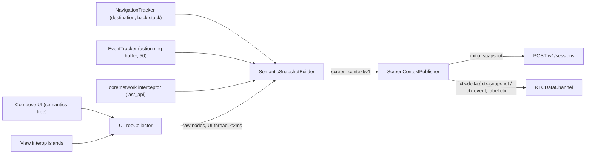
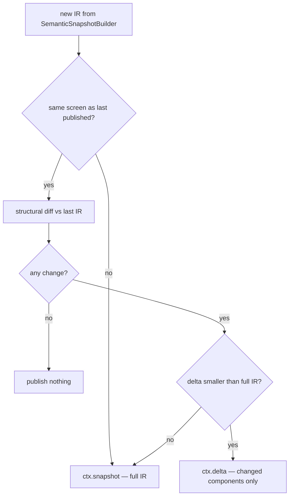

# UI Semantic Context — View-Tree Parsing & Intermediate Representation

This is the signature document of the set: it defines how the live VyaparPay UI becomes something an LLM can reason about. It covers the two deliverables that make the agent screen-aware — the **view-tree collection strategy** (how `UiTreeCollector` reads the Compose semantics tree without an accessibility service) and the **semantic intermediate representation** (`screen_context/v1`, the ≤300-token summary distilled from a 4,000+-token raw tree). The transform between them, `SemanticSnapshotBuilder`, is specified here rule by rule. This document and [docs/13](13-api-contracts.md) jointly own the wire schemas; the JSON Schema files live in [protocol/](../protocol/).

**Read this with:** [docs/02](02-system-architecture.md) for how snapshots and deltas travel (REST at session create, data channel in-call), [docs/08](08-context-and-events.md) for what the backend does with them, [docs/11](11-prompt-engineering.md) for the 300-token prompt slot this IR must fit, and [docs/14](14-security.md) for why screen text is treated as untrusted input.

---

## 1. Two representations of one screen

At 2:14 PM, Rajesh's `PaymentScreen` shows an amount field with ₹245, a recipient row reading "Amazon Business", a disabled-looking "Pay Now" he just tapped, a "Payment Failed" snackbar, and a "Daily Limit Exceeded" dialog. A support agent who can see that screen opens the call already knowing the problem. The question is what "see" means for an LLM.

The representation Android actually maintains is the Compose semantics tree (plus classic View hierarchies for interop). Here is what the `PaymentScreen` looks like in that form — an excerpt, 31 of 214 nodes:

```json
// Raw Compose semantics (unmerged tree), PaymentScreen — excerpt.
// Full tree: 214 nodes, ≈4,000+ tokens serialized.
{"nodeId": 1, "type": "ComposeNode(root)", "boundsInRoot": [0, 0, 1080, 2280],
 "children": [
  {"nodeId": 47, "type": "ComposeNode(Column)", "boundsInRoot": [0, 66, 1080, 2280],
   "config": {"TestTag": "payment_screen_root", "IsTraversalGroup": true},
   "children": [
    {"nodeId": 52, "type": "ComposeNode(Row)", "boundsInRoot": [0, 66, 1080, 224],
     "children": [
      {"nodeId": 53, "config": {"Role": "Button", "ContentDescription": ["Navigate up"],
       "OnClick": "AccessibilityAction(label=null, action=Function0<Boolean>)"}},
      {"nodeId": 55, "config": {"Text": ["Pay Vendor"], "GetTextLayoutResult": "..."}}]},
    {"nodeId": 61, "type": "ComposeNode(TextField)", "boundsInRoot": [48, 310, 1032, 468],
     "config": {"TestTag": "amount_input", "EditableText": "245",
      "TextSelectionRange": "TextRange(3, 3)", "Focused": false,
      "ImeAction": "Number", "SetText": "AccessibilityAction(...)",
      "SetSelection": "AccessibilityAction(...)", "OnClick": "...", "OnLongClick": "..."}},
    {"nodeId": 63, "config": {"Text": ["₹"], "GetTextLayoutResult": "..."}},
    {"nodeId": 64, "config": {"Text": ["Amount"], "GetTextLayoutResult": "..."}},
    {"nodeId": 71, "type": "ComposeNode(Row)", "boundsInRoot": [48, 512, 1032, 660],
     "config": {"TestTag": "recipient_row", "OnClick": "AccessibilityAction(...)"},
     "children": [
      {"nodeId": 72, "config": {"Text": ["To"], "GetTextLayoutResult": "..."}},
      {"nodeId": 74, "config": {"Text": ["Amazon Business"], "GetTextLayoutResult": "..."}},
      {"nodeId": 75, "config": {"ContentDescription": ["Change recipient"], "Role": "Button"}}]},
    {"nodeId": 88, "type": "AndroidView(interop)",
     "viewClass": "androidx.constraintlayout.widget.ConstraintLayout",
     "note": "legacy fee-breakdown widget; walked via View hierarchy, see §2.2"},
    {"nodeId": 102, "config": {"TestTag": "pay_now_cta", "Role": "Button",
     "Text": ["Pay Now"], "Enabled": true, "OnClick": "AccessibilityAction(...)"}},
    {"nodeId": 119, "config": {"LiveRegion": "Polite", "Text": ["Payment Failed"],
     "TestTag": "payment_snackbar"}},
    {"nodeId": 131, "type": "ComposeNode(Dialog)", "config": {"IsDialog": true,
     "PaneTitle": "Daily Limit Exceeded", "TestTag": "limit_dialog"},
     "children": ["... 12 nodes: title, body text runs, two buttons ..."]}]}]}
```

Four things are wrong with shipping this to the model, and each one independently kills it:

1. **Token cost.** ≈4,000+ tokens serialized, against a total per-turn input budget of ≤2,500 (canon; owned by [docs/11](11-prompt-engineering.md)). The raw tree alone would overrun the entire prompt — before the system prompt, memory, tools, or the user's words. And it would be re-sent (or re-diffed) every time the screen changes.
2. **Implementation-flavored, not semantic.** `ComposeNode(TextField)`, `AccessibilityAction(label=null, action=Function0<Boolean>)`, `TextRange(3, 3)`, a `ConstraintLayout` interop island. The model must *infer* that node 102 is the screen's primary action and nodes 63/64/61 together mean "an amount field labeled Amount holding ₹245". Inference costs reasoning tokens and fails at exactly the wrong moments.
3. **Noise dominates signal.** Of 214 nodes, roughly 20 carry information a support agent would ever use. Traversal groups, text-layout accessors, selection ranges, IME actions, decorative icons — all faithfully serialized, all useless.
4. **It leaks by default.** A raw dump ships whatever is on screen — including a card number if one were visible — off the device verbatim. Redaction bolted onto a raw format is a losing game; redaction belongs in a transform that already understands fields ([docs/14](14-security.md), and rule 6 in §5).

The LLM needs "what the user sees and can do," not "how Android renders it." That sentence is the design brief for everything below.

---

## 2. Collection strategy: where the tree comes from

### 2.1 Primary path — Compose semantics via `SemanticsOwner`

VyaparPay is a Compose app, and Compose already maintains exactly the tree we want as its accessibility substrate: every composable that sets semantics (explicitly, or implicitly via Material components) contributes a `SemanticsNode` with typed properties — `Text`, `Role`, `EditableText`, `Focused`, `Enabled`, `TestTag`. `UiTreeCollector` (module `:core:screencontext`) reads this tree in-process:

- **Per window.** Each attached `ComposeView` root (`AndroidComposeView`) implements `RootForTest`, which exposes `semanticsOwner`. The collector tracks window attach/detach so dialogs — which are separate windows in Compose — are captured, not lost. The "Daily Limit Exceeded" dialog is the canonical reason this matters.
- **Unmerged tree.** We read `unmergedRootSemanticsNode`: the merged (accessibility-facing) tree collapses children into parents, which is right for TalkBack but destroys the label/value distinction the IR needs (the "Amount" label and the "245" editable text merge into one blob).
- **Honesty note:** `RootForTest` is test-oriented API used in production here. That is a deliberate, documented risk: the demo pins the Compose BOM version, and a CI canary test walks the fixture screens on every dependency bump so a Compose upgrade that breaks the cast fails the build, not the demo. The production evolution is the same code plus that canary — there is no blessed non-accessibility API for this, which is precisely why this component is interesting.

**Trigger and cadence.** The collector marks the tree dirty on Compose state commits (`Snapshot.registerApplyObserver`) and schedules a walk on the next choreographer frame after commit, **debounced 300 ms trailing-edge**. Rationale for 300 ms: typing "245" into the amount field produces one recomposition per keystroke; the debounce collapses the burst into one capture, and 300 ms is far below the multi-second cadence of conversation turns, so the agent never reasons about a stale screen at turn boundaries ([docs/02 §3.3](02-system-architecture.md)). Two events bypass the debounce and force immediate capture: navigation destination changes (from `NavigationTracker`, via `NavController.addOnDestinationChangedListener`) and dialog window attach — the two moments when staleness would actually mislead the agent.

**Capture cost budget:** ≤2 ms for the walk of a ~200-node tree on the UI thread (the semantics tree must be read there); serialization, diffing, and redaction run off the main thread on the walk's immutable output. A spike on the 214-node fixture measured the walk well inside that budget; the CI canary asserts it stays there.

**Exclusion rule.** Support surfaces — `HelpScreen`, `ConversationOverlay` — are excluded from capture ([docs/01 §5](01-product-and-use-case.md)). When Rajesh navigates to Help mid-incident, the retained snapshot is the last *operational* screen (`PaymentScreen` with the decline dialog), which is what rides in `POST /v1/sessions`. An agent that sees "the user is on the Help menu" knows nothing; an agent that sees the failed payment knows everything.

### 2.2 Secondary path — classic View hierarchy walk

Interop islands (`AndroidView`, node 88 above) and any legacy screens are walked as View hierarchies: visible `TextView` text, `contentDescription`, `isEnabled`, resource entry names (`R.id.fee_breakdown` → tag-equivalent `fee_breakdown`). The walker maps what it can into the same role vocabulary and emits an opaque `list`-role component with a merged text summary for what it cannot. This path is deliberately second-class: VyaparPay is ~95% Compose, and the View walker exists so one legacy widget does not blind the whole capture, not to reach parity.

### 2.3 Rejected alternatives

**AccessibilityService — rejected, and worth dwelling on because it is the "obvious" answer.** Every screen-reader-style tool uses one, and it would hand us a ready-made tree for any app. Three independent disqualifiers:

1. **Wrong permission model.** An `AccessibilityService` requires the user to enable it in *system settings* under a permission framed as an assistive-technology grant. For a fintech app, walking a merchant through system-level accessibility enablement to use support is a conversion cliff and an unacceptable ask.
2. **Wrong trust scope.** The service sees *every app's* screen — the user's banking apps, messages, everything. Our requirement is strictly narrower: our own process, our own windows. Taking cross-app read access to solve an in-app problem is the wrong trust model, and a security reviewer at any fintech would (correctly) block it.
3. **Distribution red flag.** Google Play's accessibility-API policy requires a declared assistive purpose; "context for our support agent" is not one. Best case: extended review. Realistic case: rejection. Either way it is a dependency on a policy exception we do not need, since the in-process semantics tree is *richer* than the accessibility projection anyway (unmerged tree, testTags, typed properties).

**Screenshot + vision model — rejected.** Feeding screen captures to a multimodal model would be collection-strategy-free, but: an image of a fintech screen leaving the device is a strictly worse privacy posture than a redacted-at-source text IR; vision tokens are an order of magnitude costlier than the ≤300-token IR per look; and the added inference latency lands inside the [docs/06](06-voice-pipeline.md) turn budget, which has 15–40 ms allocated for context assembly, not 1,000+.

**Ship the raw tree, compress server-side — rejected.** Letting Haiku summarize raw trees on the backend keeps the client dumb, but it ships unredacted screen content off-device (violating the redact-at-source invariant in [docs/14](14-security.md)), adds a per-snapshot utility LLM call (cost and latency on every 300 ms-debounced change, not every turn), and turns a deterministic transform into a stochastic one. The IR must be produced where the typed semantics still exist.

### 2.4 On-device pipeline



`SemanticSnapshotBuilder` is the only component that sees both the raw tree and the outside world's schema; everything upstream is capture, everything downstream is transport ([docs/02 §3.3](02-system-architecture.md) owns the transport sequence).

---

## 3. The intermediate representation: `screen_context/v1`

Here is the same `PaymentScreen` — the 214-node, ≈4,000+-token tree from §1 — after the transform. This is the canonical example, verbatim from [protocol/screen_context/](../protocol/):

```json
{
  "v": "screen_context/v1",
  "screen": "PaymentScreen",
  "flow": "vendor_payment",
  "components": [
    {"role": "amount_field", "label": "Amount", "value": "₹245"},
    {"role": "recipient", "label": "To", "value": "Amazon Business"},
    {"role": "primary_cta", "label": "Pay Now", "enabled": true},
    {"role": "dialog", "label": "Daily Limit Exceeded", "visible": true},
    {"role": "snackbar", "label": "Payment Failed", "visible": true}
  ],
  "last_action": {"type": "tap", "target": "Pay Now", "ts": 1784536440000},
  "last_api": {"method": "POST", "path": "/payments", "status": 402,
               "error_code": "DAILY_LIMIT_EXCEEDED"},
  "dirty_fields": [], "loading": false
}
```

**≈300 tokens** (budget ≤300 — the [docs/11](11-prompt-engineering.md) prompt slot), versus ≈4,000+ raw: a >13× reduction, and the version the model receives is *more* informative, not less — `last_api` alone (the 402 and its decline code) is something no amount of raw-tree reading reveals, because it was never rendered. This before/after pair is the project's signature comparison; the root README leads with it.

Four design principles produced this shape:

**Roles over widget classes.** `primary_cta`, not `ComposeNode(Button)`. The model should reason in interaction vocabulary — "the screen's main action is Pay Now and it is enabled" — with zero Android knowledge. A role vocabulary also survives a UI rewrite: if `PaymentScreen` moves from Material 2 to Material 3, or from Compose to anything else, the IR is unchanged and every prompt, eval, and fixture keeps working. Widget classes would couple the prompt layer to the rendering framework, which is the dependency direction this whole design exists to prevent.

**Values over structure.** The tree's nesting, bounds, and ordering are rendering concerns; the IR keeps only reading order (via ranking, §5 rule 5) and drops geometry entirely. The one structural fact preserved is containment for lists (`list` / `list_item`), because "3 of 47 settlement batches are visible" is semantic; pixel positions are not. Rejected micro-alternative: including normalized bounds "in case the agent needs layout." It never does — the agent speaks, it does not tap — and bounds are ~40% of raw serialized bulk.

**Only actionable or informative components.** A component earns a slot by being something the user can *do* (CTA, field, toggle, tab) or something the user is being *told* (dialog, snackbar, error banner, balance, status). Decoration, spacers, icons with no action, and navigation chrome are pruned. The test applied in review: "would a human support agent mention this node on the phone?"

**Bounded size, always.** Hard cap of 20 components, hard budget of 300 tokens, deterministic drop order (§7). An IR that is *usually* small but occasionally explodes on a busy screen would blow the prompt budget precisely on the complex screens where the agent is most needed. Boundedness is a schema property here, not an aspiration.

---

## 4. Role vocabulary

The vocabulary is a closed enum in `protocol/screen_context/` — sixteen core roles. Assignment is by explicit testTag convention first, semantics properties second, heuristics last (§5 rule 3). "Carries" lists the attributes each role serializes; attributes at their default (`enabled: true` on non-CTA roles, `visible: true` on non-transient roles) are omitted to save tokens — the canonical example shows the exact policy.

| Role | Assigned when | Carries |
|---|---|---|
| `amount_field` | testTag `amount_input` / suffix `_amount`; else editable text matching a currency pattern | label, value, focused (if true) |
| `recipient` | testTag prefix `recipient_` / `vendor_`; else row with contact-shaped merged text adjacent to an amount field | label, value |
| `primary_cta` | testTag suffix `_cta`; else the single filled `Role.Button` in the bottom action area | label, enabled |
| `secondary_cta` | testTag suffix `_secondary`; else outlined/text buttons adjacent to a `primary_cta` | label, enabled |
| `text_field` | `SetText` semantics with no more specific rule matching | label, value (per-class redaction, §5 rule 6), focused (if true) |
| `list` | `CollectionInfo` semantics (LazyColumn/LazyRow) | label, visible_count, total_count |
| `list_item` | `CollectionItemInfo` child of a `list`; capped at 3 (§7) | label, value |
| `dialog` | `IsDialog` / dialog window root; label from `PaneTitle` or first text run | label, visible |
| `snackbar` | `LiveRegion` node inside a SnackbarHost; testTag suffix `_snackbar` | label, visible |
| `tab` | `Role.Tab` semantics | label, selected |
| `toggle` | `ToggleableState` semantics | label, value (`"on"`/`"off"`), enabled |
| `balance_display` | testTag suffix `_balance`; else non-editable currency text outside a field | label, value |
| `status_badge` | testTag suffix `_status`; else chip-shaped node with enum-like text (`SETTLED`, `PENDING`, ...) | label, value |
| `error_banner` | testTag suffix `_error`; else assertive `LiveRegion` outside a SnackbarHost | label, visible |
| `alert_banner` | testTag suffix `_alert` (dashboard notices; informational, not error) | label, visible |
| `image` | Icon/graphic *with* a `ContentDescription` and an `OnClick` (otherwise pruned) | label |

**Extension roles.** Screens may register domain extensions in the same enum — [docs/01 §5](01-product-and-use-case.md) lists the expected per-screen emissions (`collection_total`, `settlement_eta`, `batch_row`, `shortfall_flag`, `tracker_state`, ...). Extensions follow the same assignment machinery (testTag conventions declared next to the enum) and count against the same caps. Where docs/01's per-screen table uses shorthand (`balance`), the enum name here (`balance_display`) is authoritative — this document owns the vocabulary. The core/extension split exists so the transform generalizes beyond VyaparPay: the core sixteen describe any app; the extensions describe *this* one.

**Why testTag as the primary signal:** VyaparPay's screens already carry testTags for UI tests, the tags are string literals (immune to R8 minification), and a naming convention (`pay_now_cta` → `primary_cta`) makes role assignment a lookup instead of a guess. The convention is enforced by a lint check in `:core:screencontext`: a Material `Button` inside a screen under capture without a role-resolvable tag is a build warning. Heuristics exist as a fallback tier, not the plan — every heuristic in the table above is a documented admission that some node lacked a tag.

---

## 5. The transform: `SemanticSnapshotBuilder` rules

The builder applies eight rules in order. They are deterministic — same tree in, same IR out — which is what makes the protocol fixtures in [protocol/](../protocol/) testable on both sides of the wire ([docs/02 §5](02-system-architecture.md)).

**Rule 1 — Prune.** Drop nodes that are invisible (`alpha == 0`, off-screen bounds, `visible == false`), zero-size, or decorative (no text, no action, no content description — spacers, dividers, un-labeled icons). On the 214-node fixture this removes 131 nodes before any other rule runs. Pruning is subtree-aware: an invisible parent removes its children in one cut.

**Rule 2 — Merge text runs.** Adjacent sibling text nodes inside one visual component collapse into a single string in reading order: nodes 63 + 64 + 61 (`"₹"`, `"Amount"`, editable `"245"`) become label `"Amount"`, value `"₹245"`. The merge respects the label/value split: static text runs feed `label`, editable/state text feeds `value`. Without this rule the dialog's body would arrive as four fragments the model must reassemble.

**Rule 3 — Map to roles.** Three tiers, first match wins: (a) testTag convention lookup (`pay_now_cta` → `primary_cta`, `amount_input` → `amount_field`, `limit_dialog` → `dialog`); (b) semantics properties (`IsDialog`, `Role.Tab`, `ToggleableState`, `CollectionInfo`); (c) heuristics (the "else" column of the §4 table). Unmappable nodes that survive rule 1 are folded into their nearest mapped ancestor's label. The tier a role came from is recorded in debug builds — the ratio of heuristic assignments is the tag-coverage metric the lint check drives down.

**Rule 4 — Extract state.** For each mapped component, pull the typed properties: `label`, `value`, `enabled`, `focused`, `selected`, `visible`. Editable fields with uncommitted edits are additionally listed in top-level `dirty_fields` — "the user typed a new amount but hasn't paid yet" is a fact the agent needs when suggesting a retry. Top-level `loading` is set when any visible progress indicator survives pruning.

**Rule 5 — Rank and cap.** Order components by support-relevance, then truncate to **20**: (1) `dialog`, `error_banner` — interruptions the user is staring at; (2) `snackbar`; (3) the focused field; (4) `primary_cta`, then `secondary_cta`; (5) value-bearing fields and displays (`amount_field`, `recipient`, `balance_display`, `status_badge`); (6) everything else in traversal order. The rank order encodes one opinion: *what the app is telling the user outranks what the user can do next*, because support calls are about the former. The canonical example's ordering (fields before dialog) reflects reading order within rank ties — deterministic, so fixtures are stable.

**Rule 6 — Redact at source.** Field classes marked sensitive (card number, CVV, PIN, Aadhaar, PAN — declared per-field via a semantics modifier, plus pattern matching as backstop) serialize as `value: "[REDACTED]"` *inside the builder*, before the IR exists anywhere off the UI thread. A card-detail screen snapshot therefore ships `{"role": "text_field", "label": "Card number", "value": "[REDACTED]"}` — the agent knows the user is looking at a card field without ever seeing the number. This is the [docs/14](14-security.md) invariant "PII masked before the LLM" implemented at the earliest possible point; redacting later (backend, prompt build) would mean the raw value already crossed the network. Values are also normalized here — zero-width and control characters stripped, length-capped at 120 chars — which doubles as injection-surface reduction: screen text is untrusted input and gets data-fenced in the prompt, but the fence is stronger when the payload cannot contain invisible characters.

**Rule 7 — Attach context beyond the tree.** Three fields no tree walk can produce: `last_action` (most recent entry of `EventTracker`'s 50-entry ring buffer — the tap on "Pay Now"), `last_api` (from a `core:network` interceptor recording the most recent non-2xx response for this screen: `POST /payments → 402 DAILY_LIMIT_EXCEEDED`), and `flow` (from `NavigationTracker`: the nav-graph route group, `vendor_payment`). `last_api` is the single highest-value field in the IR — it is the fact that resolves the wallet-balance-vs-limit contradiction, and it was never on screen.

**Rule 8 — Serialize and hand off.** Emit `screen_context/v1`, compute the token estimate (§7), apply the drop ladder if over budget, and pass to `ScreenContextPublisher` for diffing and transport (§6).

The rules compose into a one-line summary of the whole document: *prune → merge → name → read → rank → redact → enrich → bound.*

---

## 6. Snapshots, deltas, and the wire

`ScreenContextPublisher` owns what leaves the device. All messages use the data-channel envelope (canon; transport sequence in [docs/02 §3.3](02-system-architecture.md)):

```json
{"v": 1, "type": "ctx.snapshot" | "ctx.delta" | "ctx.event", "seq": 42, "ts": 1784536440000, "payload": {}}
```

`seq` is client-monotonic across all three types; the backend's `SnapshotIngestor` detects gaps (the `RTCDataChannel`'s reliable+ordered guarantee holds per peer connection, not across reconnects) and requests a full snapshot.



**Delta contents.** Component identity for diffing is testTag when present, else `role` + `label`. A delta carries only components whose serialized form changed, plus removals by identity, plus any changed top-level fields:

```json
{"v": 1, "type": "ctx.delta", "seq": 43, "ts": 1784536447210, "payload": {
  "base_seq": 42,
  "changed": [{"role": "dialog", "label": "Daily Limit Exceeded", "visible": false}],
  "removed": [],
  "last_action": {"type": "tap", "target": "Dismiss", "ts": 1784536447102}
}}
```

(Rajesh dismissed the dialog mid-call: one component, ~40 tokens on the wire instead of ~300.) A component whose *label* changed fails identity matching and appears as remove + add — accepted, because label changes on a stable screen are rare and the alternative (synthetic stable IDs in the IR) costs tokens on every component to optimize a corner case.

**Screen change → always a full snapshot.** Diffing `PaymentScreen` against `SettlementsScreen` is meaningless; `base_seq` in every delta lets the backend verify it is merging onto the snapshot the client diffed against.

**Backend semantics** (owned by [docs/08](08-context-and-events.md), restated in one line): deltas merge into `ctx:{session_id}` in Redis; the *next* turn's `ContextBuilder` reads the merged state; nothing is ever pushed into a mid-flight LLM generation. The initial snapshot rides `POST /v1/sessions` so the agent is context-complete before the peer connection exists ([docs/02 §3.1](02-system-architecture.md)).

`ctx.event` messages — the `app_event/v1` entries (`nav` / `tap` / `input` / `api_error` / `dialog`) from `EventTracker`'s ring buffer — share the envelope and feed `EventLog`; the last ~15 become the 150-token event-timeline prompt slot. Events are not deltas: a tap that changes nothing on screen still tells the agent the user is trying something.

---

## 7. Token accounting

The IR's budget is **≤300 tokens** — its slot in the ≤2,500-token per-turn input ([docs/11](11-prompt-engineering.md) owns the slot table). Enforcement has two tiers:

- **CI (exact):** every fixture in `protocol/screen_context/` is counted against the tokenizer via the provider's count-tokens endpoint on schema changes; a fixture exceeding 300 fails the build. The canonical `PaymentScreen` example sits comfortably inside budget; a dense `SettlementsScreen` fixture with capped lists approaches it — which is the point of having both as fixtures.
- **On-device (estimate):** the builder uses a `chars / 3.5` proxy with a 10% safety margin (the exact tokenizer is not available on-device, and shipping one for a guard rail is not worth the APK bytes). The proxy over-estimates slightly on JSON punctuation, which is the safe direction.

When the estimate exceeds budget, the **drop ladder** applies, in order, re-estimating after each rung:

| Rung | Drops | Typical saving |
|---|---|---|
| 1 | `list_item`s beyond the top 3 per list; the `list` keeps `visible_count`/`total_count` | 30–100 tokens on list screens |
| 2 | Labels and values truncated to 48 chars with ellipsis | 10–40 |
| 3 | Disabled, non-primary interactive components | 10–30 |
| 4 | Navigation chrome: `tab`, `toggle`, `secondary_cta` | 15–40 |
| 5 | Minimal snapshot: only `dialog`, `error_banner`, `snackbar`, `amount_field`, `recipient`, `primary_cta` + top-level fields (~120 tokens) | to ~120 |
| 6 | Screen-name-only: `{"v", "screen", "flow", "last_api"}` (~25 tokens) | to ~25 |

The ladder is ordered by the same opinion as §5 rule 5: interruptions and money-facts survive longest. Rung 6 is deliberately shared with the failure-mode degradation floor (§8): "the agent knows which screen and which API error, nothing else" is the guaranteed minimum in *both* the over-budget and the capture-failure case, so downstream prompt code has exactly one worst case to handle.

---

## 8. Failure modes

Per the doc-set convention: Failure | Detection | Impact | Mitigation | Degradation. The shared floor for every row is the rung-6 screen-name-only context — the agent still opens usefully ("I can see you're on the payments screen — what happened?") and every tool still works, because tools read server state, not the screen. The full degradation ladder across the system is owned by [docs/15](15-scalability-and-reliability.md).

| Failure | Detection | Impact | Mitigation | Degradation |
|---|---|---|---|---|
| Obfuscated or garbage labels (third-party SDK screens, missing content descriptions) | Heuristic-tier role assignments spike; label entropy check (non-dictionary ratio > 0.5) flags the snapshot | IR carries roles with meaningless labels; agent might read gibberish aloud | Lint-enforced tag coverage on first-party screens; entropy-flagged labels replaced with role-generic text ("a button") | Snapshot marked `low_confidence`; prompt instructs the agent not to quote labels; floor: screen-name-only |
| Long dynamic lists (47 settlement batches, transaction history) | `CollectionInfo` totals vs the 3-item cap | Unbounded IR without the cap; agent sees 3 of 47 items | Rule 5 cap + drop-ladder rung 1; `visible_count`/`total_count` keep the truncation honest; agent uses `get_settlements` for the rest — tools, not the screen, are the data path | List summarized to counts only |
| WebView screens (KYC flows, bank redirect pages) | Semantics tree contains a single opaque `AndroidView(WebView)` node | Page content invisible to capture | Emit `{"role": "list", "label": "web view", "value": <page title + URL host>}` from WebView APIs; never inject JS to scrape the page — bank-page scraping is a trust-model violation, same reasoning as §2.3 | Screen-name + page-title context; agent says what it can and cannot see |
| Custom canvas widgets (QR code renderer, collections chart) | Drawn content produces zero semantics nodes | Widget invisible to the IR | Repo rule: custom-drawn composables must set `Modifier.semantics` (contentDescription + role tag); the `:core:screencontext` lint check fails the build on bare `Canvas` in captured screens | Widget absent from IR until annotated — visible in the tag-coverage metric, not silent |
| Rapid screen churn (fast navigation, animation storms) | Capture requests arriving faster than the 300 ms debounce window | Wasted walks; stale intermediate snapshots on the wire | Trailing-edge debounce publishes only the settled state; navigation bypass ensures the *final* destination captures immediately; `seq` keeps ordering under churn | Intermediate screens never published — by design, not as a loss |

The row worth re-reading is WebView: it is the one place where the honest answer is "the agent cannot see this, and we say so" rather than a clever workaround. A support agent that admits "I can't see the bank's page — can you read me the error?" is trustworthy; one that scrapes a bank redirect page is a headline.

---

## 9. Why this is the hard part

Strip the Android specifics and what this document describes is a **domain-specific compiler**: source language, the Compose semantics tree (an implementation-shaped AST); target language, a bounded semantic IR optimized for a token-priced consumer; with pruning as dead-code elimination, text-run merging as peephole optimization, role mapping as typed lowering, the rank-and-cap pass as register allocation under a hard budget, and redaction as a mandatory security pass that must run before anything escapes. The fixtures in [protocol/](../protocol/) are its conformance suite; the drop ladder is its optimizer's cost model.

That framing is why this component is the portfolio's signature rather than the voice pipeline: STT, TTS, and WebRTC are assembled from excellent vendors ([docs/16](16-tech-stack.md)), but no vendor ships "turn what the user sees into what a model should know." It is also why the design generalizes: the core role vocabulary, the transform rules, the delta protocol, and the token accounting contain nothing VyaparPay-specific — pointed at any Compose app (or any UI toolkit with a semantics substrate: iOS accessibility, the web's ARIA tree), the same architecture produces the same ≤300-token screen awareness. The extension roles and testTag conventions are the only per-app work, and they are declarative.

---

## Decisions this document exports

| Fixed here | Value | Heaviest consumer |
|---|---|---|
| Collection mechanism | In-process Compose `SemanticsOwner` (unmerged tree) per window + View-walk fallback; AccessibilityService rejected | [docs/03](03-android-architecture.md) |
| Capture cadence | Dirty-on-commit, 300 ms trailing debounce; nav and dialog attach bypass | [docs/02](02-system-architecture.md) §3.3 |
| IR schema | `screen_context/v1`, canonical fixture verbatim in [protocol/](../protocol/) | [docs/08](08-context-and-events.md), [docs/11](11-prompt-engineering.md), [docs/13](13-api-contracts.md) |
| Role vocabulary | 16 core roles + registered extensions; testTag conventions primary, heuristics fallback | [docs/01](01-product-and-use-case.md) §5, app lint rules |
| Size bounds | ≤20 components, ≤300 tokens, deterministic 6-rung drop ladder | [docs/11](11-prompt-engineering.md) |
| Redaction point | At source, inside `SemanticSnapshotBuilder` (rule 6) | [docs/14](14-security.md) |
| Delta protocol | Identity = testTag else role+label; screen change forces full snapshot; `base_seq` merge check | [docs/08](08-context-and-events.md), [docs/13](13-api-contracts.md) |
| Degradation floor | Screen-name-only context (~25 tokens), shared by over-budget and capture-failure paths | [docs/15](15-scalability-and-reliability.md) |
