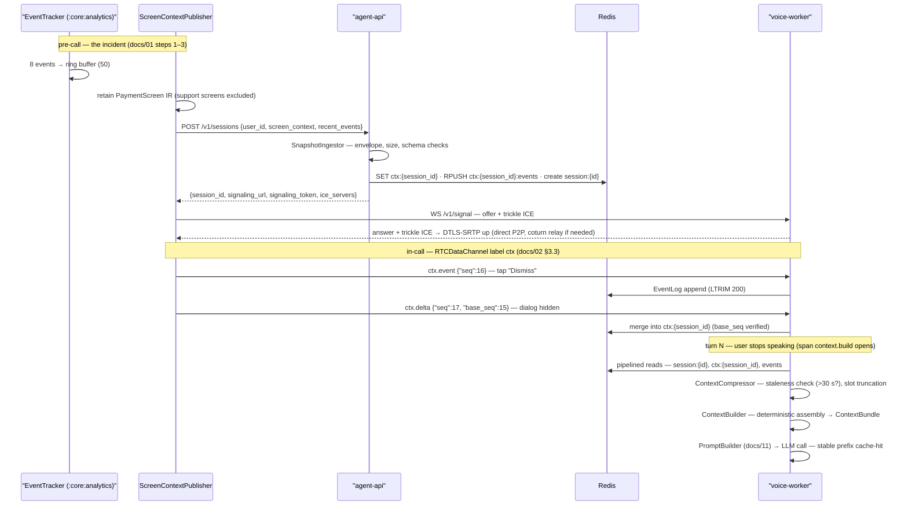

# Context Building Pipeline & Event Tracking

This document owns the middle of the context story: everything between "an IR exists on the device" ([docs/07](07-ui-semantic-context.md)) and "a prompt template gets filled" ([docs/11](11-prompt-engineering.md)). Concretely: the inventory of context sources and their freshness classes, the `EventTracker` action timeline in `:core:analytics`, the transport of snapshots and events over REST and the `RTCDataChannel`, the backend ingestion trio in `app/context/` (`SnapshotIngestor`, `EventLog`, `ContextCompressor`), and the turn-time assembly in `ContextBuilder` that hands a deterministic, budget-enforced bundle to `PromptBuilder`.

**Read this with:** [docs/07](07-ui-semantic-context.md) for how the ScreenContext IR is produced, [docs/02](02-system-architecture.md) for the two-channel topology this pipeline rides on, [docs/09](09-memory-architecture.md) for the memory slots assembled alongside it, and [docs/11](11-prompt-engineering.md) for the template that consumes the output.

---

## 1. Context sources inventory

The agent's context at any turn is drawn from seven sources. They differ most usefully along one axis — **freshness class**: static (changes at deploy time), session-scoped (fixed at call start), or live (changes during the call). The class dictates the transport, and the transport dictates the failure modes in §7.

| Source | Freshness | Transport | Owner module |
|---|---|---|---|
| Business rules (limits, fees, tiers, policies) | Static — versioned with the deploy, seeded from published UPI/PSP norms | None — resident config, rendered into the stable prompt prefix | `PromptBuilder` (`app/agent/`) |
| User profile (account type, tenure, language, city) | Session-scoped — fetched once at call start, stable for the call | Postgres read during speculative prefetch ([docs/02 §3.1](02-system-architecture.md)) | `UserProfileMemory` (`app/memory/`) |
| RAG snippets (KB articles, past-call summaries) | Session-scoped with refresh — prefetched on the error code at setup, re-queried on topic shift | pgvector cosine top-3, 1536-dim embeddings | `SemanticMemory` (`app/memory/`) |
| ScreenContext snapshot (`screen_context/v1`) | Live — ≤300 ms behind the actual UI while the channel is healthy | Initial: `POST /v1/sessions` body. In-call: `ctx.snapshot`/`ctx.delta` on the data channel | `SnapshotIngestor` (`app/context/`) |
| Event timeline (`app_event/v1`) | Live — published per action, no debounce | Initial: `recent_events` in the session body (last ~15). In-call: `ctx.event` | `EventTracker` (`:core:analytics`) → `EventLog` (`app/context/`) |
| Conversation memory (window + rolling summary) | Live — window per turn, summary every 6 turns | Redis `session:{id}` hash | `SessionMemory`, `Summarizer` ([docs/09](09-memory-architecture.md)) |
| Business data (balances, payment status, orders) | Live and authoritative — fetched inside the turn, never cached into the prompt | HTTP tool call, worker → agent-api | `ToolExecutor` + `tools/` ([docs/10](10-tool-calling.md)) |

Two boundaries in this table are deliberate and load-bearing:

- **Business data is not a prompt slot.** Balances and statuses reach the model only through tool results inside a turn, never through context assembly. The canon rule — the LLM never states an account fact a read tool can fetch — is enforceable precisely because `ContextBuilder` refuses to pre-bake business data into the prompt. The rejected alternative (prefetch the wallet balance into the profile slot, save a tool call) was tried in an early sketch and cut: a balance cached at call start is wrong the moment a settlement lands, and a "screen-aware" agent confidently reciting a stale balance is worse than one that pauses 200 ms to fetch it.
- **The screen and the timeline are separate sources with separate value.** The snapshot is a photo; the timeline is the film. A tap that changes nothing on screen ("Pay Now" pressed a second time on a disabled button) never appears in any delta but tells the agent the user is retrying in frustration. This is why `ctx.event` exists as its own message type rather than being folded into deltas ([docs/07 §6](07-ui-semantic-context.md)).

---

## 2. Event tracking: `EventTracker` (`:core:analytics`)

### 2.1 Taxonomy

Five event types, frozen as `app_event/v1` in [protocol/events/](../protocol/). Every entry carries `{"type", "name", "ts"}` (canon); types add the fields listed. The taxonomy is intentionally closed — a new event type is a protocol version bump, not a config flag.

| Type | Fired by | `name` carries | Extra fields | Example |
|---|---|---|---|---|
| `nav` | `NavigationTracker` destination-changed listener | Destination route (screen identifier from [docs/01 §5](01-product-and-use-case.md)) | `from` — previous route | `{"type":"nav","name":"PaymentScreen","from":"DashboardScreen","ts":…}` |
| `tap` | Click hook in `:core:ui`'s shared clickable modifier | Target label, or testTag when the label is empty | `screen` | `{"type":"tap","name":"Pay Now","screen":"PaymentScreen","ts":…}` |
| `input` | Field **commit** — focus loss or IME done action, never per keystroke | Field testTag/label | `value` — **only for non-sensitive field classes**; omitted entirely otherwise | `{"type":"input","name":"amount","value":"₹245","ts":…}` |
| `api_error` | `core:network` interceptor, any non-2xx | `METHOD path` | `status`, `code` | `{"type":"api_error","name":"POST /payments","status":402,"code":"DAILY_LIMIT_EXCEEDED","ts":…}` |
| `dialog` | Dialog window attach/detach (same hook as the [docs/07 §2.1](07-ui-semantic-context.md) capture bypass) | Dialog title | `visible` | `{"type":"dialog","name":"Daily Limit Exceeded","visible":true,"ts":…}` |

Sensitivity for `input` values reuses the field classification from [docs/07 §5](07-ui-semantic-context.md) rule 6 — the same per-field semantics modifier that drives snapshot redaction drives event value omission. One classification, two consumers; a field cannot be redacted in the snapshot yet leak through the timeline. The event *omits* the value rather than sending `"[REDACTED]"`: "the user edited the PIN field" is timeline signal, and the redaction marker would add tokens for zero information.

### 2.2 The ring buffer

`EventTracker` holds a **50-entry ring buffer**, in-memory, process-lifetime. Numbers behind the choices:

- **Why 50:** at Rajesh's observed counter pace (~1 action per 3–5 s during active use), 50 entries is roughly 3–4 minutes of history. The prompt slot consumes the last ~15 (150-token budget, canon §8); the remaining 35 are headroom for the session-create payload, gap-recovery context, and debug dumps. At ~100 bytes per entry the whole buffer is ~5 KB — not worth making configurable.
- **Why a ring:** old actions are worthless to a support call. An event from ten minutes ago describes a different problem. Eviction-by-age was rejected as needless machinery — count-based eviction at this cadence *is* age-based eviction.
- **Why memory-only:** the buffer is never persisted to disk. An app restart clears it, which is honest — the timeline claims "what the user just did," and across a restart that claim is false. The stale-context journey variant in [docs/01 §7](01-product-and-use-case.md) covers the restart case: the agent opens with one clarifying question instead of a wrong assertion.

### 2.3 What is deliberately not tracked

The tracker's restraint is a feature with a spec, not an omission. Each exclusion below was considered and rejected for the same two-part test: does it add prompt value a support agent would use, and does it survive the privacy bar of a fintech app?

| Not tracked | Why not |
|---|---|
| Raw keystrokes / per-character edits | Surveillance-grade data with zero prompt value — the committed field value is what the agent needs, and a keystroke stream would flood 50 slots in seconds. `input` fires on commit only. |
| Values of sensitive fields (card, CVV, PIN, Aadhaar, PAN) | The [docs/14](14-security.md) invariant "PII masked before the LLM" — applied here by omission, at the same classification point as snapshot redaction. |
| Scroll positions, view impressions | Geometry, not intent. "The user scrolled 340 px" answers no support question. |
| Typing cadence, hesitation timing | Behavioral biometrics. Collecting it in a payments app invites exactly the scrutiny this project should not lose, for a signal the prompt cannot use. |
| Anything outside VyaparPay's process | Same trust-scope argument that rejected the AccessibilityService in [docs/07 §2.3](07-ui-semantic-context.md): the requirement is our app's context, and taking more is the wrong trust model regardless of how useful it might be. |

Demo/production honesty: in production this tracker would dual-feed a real analytics pipeline (the ADR-3 flip condition — Kafka at event-bus scale). In the demo, its only consumer is the agent, and the only sinks are the ring buffer and the wire formats below.

### 2.4 Worked example: the canonical timeline

The eight events behind the [docs/01 §7](01-product-and-use-case.md) journey, exactly as they sit in the ring buffer when Rajesh taps Call Support. Timestamps are epoch ms; the "Pay Now" tap matches the canonical `last_action.ts` in the IR.

```json
[
  {"type": "nav",       "name": "PaymentScreen", "from": "DashboardScreen", "ts": 1784536395000},
  {"type": "input",     "name": "amount", "value": "₹245",                  "ts": 1784536417000},
  {"type": "tap",       "name": "Amazon Business", "screen": "PaymentScreen", "ts": 1784536428000},
  {"type": "tap",       "name": "Pay Now", "screen": "PaymentScreen",       "ts": 1784536440000},
  {"type": "api_error", "name": "POST /payments", "status": 402,
   "code": "DAILY_LIMIT_EXCEEDED",                                          "ts": 1784536440820},
  {"type": "dialog",    "name": "Daily Limit Exceeded", "visible": true,    "ts": 1784536440900},
  {"type": "nav",       "name": "HelpScreen", "from": "PaymentScreen",      "ts": 1784536452000},
  {"type": "tap",       "name": "Call Support", "screen": "HelpScreen",     "ts": 1784536458000}
]
```

`ContextCompressor` renders this into the 150-token prompt slot as compact lines, oldest first, relative times:

```text
[timeline — last 8 actions]
-63s  nav → PaymentScreen
-41s  input amount = "₹245"
-30s  tap "Amazon Business"
-18s  tap "Pay Now"
-18s  api_error POST /payments 402 DAILY_LIMIT_EXCEEDED
-18s  dialog "Daily Limit Exceeded" shown
 -6s  nav → HelpScreen
  0s  tap "Call Support"
```

Read as a story, the timeline carries what no snapshot can: intent (entered ₹245, chose a payee, tried to pay), failure (the 402, three lines later), and the user's response to failure (went to Help, pressed Call Support). The snapshot says *where the user is stuck*; these eight lines say *how they got stuck*. Asha's opening line needs both.

---

## 3. Transport: two paths, one sequence space

The topology is fixed by [docs/02 §2](02-system-architecture.md) (two channels, no third) and ADR-4; this section owns the message-level behavior on top of it.

### 3.1 Session create: context before audio

The initial snapshot and the last ~15 events ride in the `POST /v1/sessions` body — `{user_id, screen_context, recent_events}` — so the agent is context-complete before the peer connection is even offered. The `screen_context` field is the *retained* last operational screen (support surfaces are excluded from capture, [docs/07 §2.1](07-ui-semantic-context.md)); `recent_events` is trimmed client-side to the newest 15 because that is all the 150-token prompt slot can hold — shipping all 50 would be bytes the server immediately discards.

### 3.2 In-call: the `ctx` data channel

All in-call context messages share the canonical envelope on the native `RTCDataChannel` — reliable, ordered, label `ctx`, created by the client as part of the SDP offer so it exists the moment the peer connection does:

```json
{"v": 1, "type": "ctx.event", "seq": 17, "ts": 1784536501340,
 "payload": {"type": "tap", "name": "Dismiss", "screen": "PaymentScreen", "ts": 1784536501322}}
```

Three message types flow client → server (`ctx.snapshot`, `ctx.delta`, `ctx.event`) and one flows server → client (`ctx.request_snapshot`). Behavioral rules:

- **Snapshots and deltas are debounced; events are not.** The publisher's 300 ms trailing debounce ([docs/07 §2.1](07-ui-semantic-context.md)) applies to screen state, which settles. Events are discrete facts about actions — a `tap` is published immediately, ~60–120 bytes on the wire, and delaying it would only reorder the story.
- **One `seq` counter across all three client types.** `seq` is client-monotonic over snapshots, deltas, *and* events, so the backend runs exactly one gap detector instead of three, and the relative order of "screen changed" and "user tapped" survives transport intact. A per-type counter was rejected for exactly the interleaving ambiguity it would create.
- **Server messages use the envelope with their own counter, which the client does not gap-check.** The only server-originated type is `ctx.request_snapshot`; losing one costs nothing, because the next client message with a gapped `seq` re-triggers it.

### 3.3 Gap detection and the snapshot round trip

The channel's SCTP reliable+ordered guarantee holds **per peer connection, not across an ICE restart or a torn-down-and-rebuilt connection** — the reason `seq` exists at all. When `SnapshotIngestor` sees `seq` jump (expects `n+1`, receives `n+k`):

1. The received message is **discarded, not merged** — a delta applied over a gap can produce a screen state that never existed (a dialog marked dismissed merging onto a snapshot where it never appeared).
2. The worker publishes `{"v":1, "type":"ctx.request_snapshot", "seq":<server counter>, "ts":…, "payload":{"last_good_seq": n}}` on the `ctx` channel.
3. The client responds with a full `ctx.snapshot` at its current `seq` — a fresh capture, not a replay (walk ≤2 ms, [docs/07 §2.1](07-ui-semantic-context.md)).
4. The snapshot **replaces** `ctx:{session_id}` wholesale; delta merging resumes from its `seq`.

Cost of the round trip: one data-channel RTT plus capture — tens of milliseconds on the demo LAN, well under one turn even on a mobile RTT. The rejected alternative was a TCP-style client resend buffer of unacknowledged messages. It loses on both simplicity and correctness: per-connection loss is already covered by the channel, so only reconnects create gaps — and after a reconnect the screen has usually changed anyway, making a fresh snapshot strictly more truthful than a faithful replay of stale deltas.

---

## 4. Backend ingestion: `app/context/`

Three components, one direction of flow: validate → store → shape. Per the [docs/02 §2](02-system-architecture.md) placement table, `SnapshotIngestor` runs in agent-api for the REST snapshot and in voice-worker for data-channel traffic — same class, same validation, two entrypoints.

### 4.1 `SnapshotIngestor`

Every inbound snapshot or delta passes four checks before touching Redis, in order of cheapness:

| Check | Rule | On failure |
|---|---|---|
| Envelope shape | `v == 1`, known `type`, integer `seq`, epoch-ms `ts` | Drop + count metric |
| Size cap | Serialized payload ≤ 8 KiB (a rung-compliant snapshot is ~1.2 KiB; the cap is client-bug detection, not tuning) | Route to `ContextCompressor` re-compression (§7) |
| Schema validation | jsonschema against [protocol/](../protocol/) — `screen_context/v1` for snapshots, delta shape for deltas, `app_event/v1` for events | Drop + `ctx.request_snapshot` |
| Sequence continuity | `seq == last + 1`; deltas additionally `base_seq == ` seq of the state being merged onto | §3.3 round trip |

Valid snapshots are written to Redis as `ctx:{session_id}` — the IR plus ingest metadata `{seq, received_ts, screen}` — with a 60-minute TTL (Redis holds nothing durable; a call is minutes). Deltas are merged read-modify-write in the worker process; this is safe without locking because one call pins one worker ([docs/02 §6](02-system-architecture.md)) — the demo's single-writer property is structural, not lucky. The `base_seq` check makes the merge refuse to apply a diff against a state the client did not diff against.

### 4.2 `EventLog`

`ctx.event` payloads append to a Redis list, `ctx:{session_id}:events` (extending the canonical `ctx:` prefix), via `RPUSH` + `LTRIM` to the newest **200** entries. Sizing: a 5-minute call at the observed ~0.2 events/s produces ~60 entries; 200 covers a pathological churn burst without becoming a session archive. The log is append-only from the pipeline's perspective — nothing rewrites history, the trim only forgets it. The prompt consumes the newest 15 through `ContextCompressor`; the surplus exists for gap forensics and the post-call trace. Production evolution: the same append stream feeds a durable analytics bus (the ADR-3 Kafka flip condition); the demo deliberately stops at Redis.

### 4.3 `ContextCompressor`

The compressor is the shaping layer between raw stored context and prompt-ready slot text. It is **mechanical on the hot path** — string work, no LLM — because it runs inside the `context.build` span with a 15/40 ms p50/p95 budget (canon §7). The only LLM-backed compression in the system is the rolling summary, and it belongs to `Summarizer` off the turn path, every 6 turns ([docs/09](09-memory-architecture.md)). An early design had Haiku compress the timeline per turn; it was rejected on arithmetic — even a fast utility call is ~300 ms, twenty times the entire context-assembly budget.

Its three jobs:

- **Staleness marking.** If `now - received_ts > 30 s` for `ctx:{session_id}`, the rendered snapshot slot gains a header: `note: screen snapshot is 47s old — may be stale`. Why 30 s: the publisher only sends on change, so an old snapshot *usually* means a quiet screen, which is fine — but a silently dead data channel looks identical from the backend. The flag makes the prompt honest about that ambiguity; [docs/11](11-prompt-engineering.md) turns it into language ("the last screen I could see" instead of "I can see"). Thirty seconds is several turn-cadences of silence — long enough that quiet-screen is no longer the safe assumption, short enough that the hedge appears before the agent asserts something wrong.
- **Slot truncation.** Enforces the canon §8 budgets on the volatile slots before assembly: timeline rendered to the newest 15 events and ≤150 tokens, snapshot re-verified ≤300 (defense in depth — the client already enforces this, but the server does not trust the client, per [docs/14](14-security.md)), summary ≤250, RAG ≤300.
- **Oversize recovery.** A snapshot over budget — a client bug by contract — is re-compressed server-side by re-applying the [docs/07 §7](07-ui-semantic-context.md) drop ladder from rung 1, landing at the minimal form (~120 tokens) or the shared floor (~25 tokens, screen-name-only) in the worst case. One drop-ladder definition, two enforcement points.

Token measurement uses the same `chars / 3.5` proxy with 10% margin as the client — the constant is documented in [protocol/](../protocol/) so both sides over-estimate identically — and CI validates the protocol fixtures against the provider's count-tokens endpoint exactly as [docs/07 §7](07-ui-semantic-context.md) describes.

---

## 5. Turn-time assembly: `ContextBuilder`

`ContextBuilder` runs once per turn inside `context.build` (budget 15 ms p50 / 40 ms p95 — owned by [docs/06](06-voice-pipeline.md), referenced here). The span is dominated by three pipelined Redis reads (`session:{id}`, `ctx:{session_id}`, `ctx:{session_id}:events` — one round trip, not three) followed by pure string assembly.

### 5.1 Deterministic slot ordering

Slot order is fixed, total, and stable-first — the canon §8 table, annotated with volatility and cache behavior:

| # | Slot | Budget | Changes | Prefix-cache role |
|---|---|---|---|---|
| 1 | System + persona + voice-style rules | 350 | Per deploy | Cached — byte-identical across all calls |
| 2 | Business rules (limits, fees, policies) | 250 | Per deploy | Cached — byte-identical across all calls |
| 3 | User profile (compact) | 200 | Per call | Cached within a call — cache breakpoint sits after this slot |
| 4 | ScreenContext snapshot | 300 | Per delta | Volatile |
| 5 | Event timeline (last ~15) | 150 | Per event | Volatile |
| 6 | Rolling conversation summary | 250 | Every 6 turns | Semi-stable |
| 7 | Retrieved knowledge (RAG top-3) | 300 | On topic shift | Semi-stable |
| 8 | Conversation window (last 6–8 turns) | 600 | Per turn | Volatile |
| 9 | Current user utterance | 50 | Per turn | Volatile |

The ordering rationale is entirely economic. Provider-side prompt caching keys on a byte-identical prefix; slots 1–3 change never, per-deploy, and per-call respectively, so every turn after the first hits the cache for ~800 tokens of prefix. That cache hit is a named line item in the latency budget (the `llm.ttft` row in canon §7 assumes a cached prefix) and in the cost budget (LLM ≈ $0.10 per call with caching vs $0.16 without, canon §9). Ordering by semantic priority instead — screen first, since it matters most — was the intuitive alternative and was rejected because it puts the most volatile content at the top of the prompt, invalidating the cache every delta. The model does not care where in the prompt the screen lives; the cache cares enormously.

Determinism is a tested property, not a habit: same `ContextBundle` in, byte-identical prompt prefix out, asserted against the [protocol/](../protocol/) fixtures in CI. Non-determinism here (dict-ordering leaks, timestamps rendered into stable slots) silently destroys the cache hit rate and shows up only as a mysteriously slower and costlier agent — the test exists because that failure mode is otherwise invisible.

### 5.2 Budget enforcement and the drop order

The per-slot budgets sum to 2,450 against a 2,500 target and a 3,000 hard cap, so pressure is the exception: it arises when the conversation window carries long verbatim turns before the 6-turn summary fires, or when tool-result payloads ride in the window. Under pressure, slots shrink in fixed order:

| Rung | Action | Rationale |
|---|---|---|
| 1 | RAG top-3 → top-1 | Retrieval is advisory; the screen and tools are ground truth |
| 2 | Event timeline 15 → 5 events | The newest actions carry nearly all the signal |
| 3 | Conversation window 8 → 4 turns | The rolling summary already covers what gets cut |
| 4 | Snapshot → minimal form ([docs/07 §7](07-ui-semantic-context.md) rung 5, ~120 tokens) | Interruptions and money facts survive longest |
| — | Never dropped: system, business rules, current utterance, pending-confirmation state | Correctness and safety — a confirm-gated tool must never lose its pending state to token pressure |

The rungs applied on a turn are recorded as attributes on the `context.build` span, alongside per-slot token estimates and snapshot age — so a latency or quality regression can be read straight off the trace ([docs/02 §2](02-system-architecture.md), observability row).

### 5.3 Hand-off

`ContextBuilder` emits a typed `ContextBundle`: nine slot strings plus metadata (`snapshot_seq`, `snapshot_age_ms`, `stale` flag, `dropped_rungs`, per-slot token estimates). `PromptBuilder` owns everything after that — the template, and critically the **data-fencing of untrusted slots**: screen content, event names, and the user utterance are untrusted input ([docs/14](14-security.md)) and are fenced as data, never interpolated as instructions. The bundle/template split exists so that this security boundary lives in exactly one component: `ContextBuilder` decides *what* the model sees, `PromptBuilder` decides *how* it is framed, and [docs/11](11-prompt-engineering.md) owns the latter entirely.

---

## 6. End-to-end sequence

The full pipeline across one incident — pre-call capture, session create, in-call updates, and assembly at turn N:



The property to notice: context flows continuously, but the *agent's* context is sampled at turn boundaries only. A delta arriving mid-generation updates Redis and nothing else — the [docs/02 §3.3](02-system-architecture.md) rule "never push into a mid-flight LLM call" means this pipeline's output is always "the world as of the moment the turn started," which is the only version of the world a coherent sentence can be about.

---

## 7. Failure modes

Per the doc-set convention. The shared floor is inherited from [docs/07 §8](07-ui-semantic-context.md): screen-name-only context (~25 tokens), with the timeline and all tools unaffected — tools read server state, not the screen.

| Failure | Detection | Impact | Mitigation | Degradation |
|---|---|---|---|---|
| Data-channel drop mid-call (peer connection degrades — ICE disconnected on a flaky mobile network, or an ICE restart tearing the channel down) | PeerConnection/ICE connection-state callbacks on both ends (`org.webrtc` observer, aiortc `connectionstatechange`); backend-side, snapshot age crossing 30 s while events also stop | Agent reasons over a screen the user may have left; deltas and events queued during the outage are lost | On reconnect the publisher sends an unsolicited full `ctx.snapshot` at its next `seq` (fresh capture, cheap); until then the `ContextCompressor` staleness flag hedges every prompt | Asha shifts to past tense — "the last screen I could see" — and asks rather than asserts; audio and tools continue unaffected (independent-failure payoff, [docs/02 §3.4](02-system-architecture.md)) |
| Sequence gap (`seq` skips after a reconnect) | `SnapshotIngestor` continuity check — expects `n+1` | A merged delta over a gap would fabricate a screen state that never existed | Discard the gapped message; `ctx.request_snapshot` round trip (§3.3); `ctx:{session_id}` holds the last *consistent* state throughout — the merge is all-or-nothing | One round trip of staleness (tens of ms on LAN, ≤1 mobile RTT); no turn is blocked waiting for it |
| Malformed snapshot (schema validation fails — client/serializer version skew, corrupted payload) | jsonschema validation against [protocol/](../protocol/) in `SnapshotIngestor`; failure counter per session | None if handled — the risk is the *unhandled* path: garbage entering the prompt | Reject wholesale, never partially ingest; request a fresh snapshot (a re-capture usually validates); persistent failures mark the session context-degraded and flag the client version in the trace | Last valid `ctx` remains in use with its honest timestamp — the staleness flag applies to it as normal |
| Oversized snapshot (payload > 8 KiB or token estimate > 300 — a client-contract violation) | Size cap and token re-verification in `SnapshotIngestor` / `ContextCompressor` | Unchecked, a single busy screen blows the 2,500-token turn budget and the cost model | Server-side re-application of the [docs/07 §7](07-ui-semantic-context.md) drop ladder from rung 1; logged as a client bug with the fixture-diff attached, because the client's own ladder should have prevented it | Minimal snapshot (~120 tokens) or the ~25-token floor — the same two worst cases downstream prompt code already handles |

The common shape across all four rows: **the pipeline degrades context, never conversation.** No context failure blocks a turn, drops audio, or disables a tool — the worst case is an agent that honestly knows less about the screen, which is precisely the pre-context baseline every other support bot lives at permanently.

---

## Decisions this document exports

| Fixed here | Value | Heaviest consumer |
|---|---|---|
| Context source inventory and freshness classes | §1 table — static / session-scoped / live; business data reaches the model only via tools | [docs/11](11-prompt-engineering.md), [docs/10](10-tool-calling.md) |
| Event taxonomy and payloads | Five types per `app_event/v1`, §2.1 fields; closed enum, version-bump to extend | [protocol/](../protocol/), [docs/13](13-api-contracts.md) |
| Tracking exclusions | No keystrokes, no sensitive values (omitted, not masked), no biometrics, in-process only, memory-only buffer | [docs/14](14-security.md) |
| Canonical 8-event timeline | §2.4 verbatim — the fixture for the [docs/01](01-product-and-use-case.md) journey | [docs/11](11-prompt-engineering.md) worked examples, protocol fixtures |
| Gap-recovery protocol | Discard-on-gap, `ctx.request_snapshot` round trip, fresh capture over replay | [docs/13](13-api-contracts.md) |
| Server-side storage shapes | `ctx:{session_id}` (60-min TTL, ingest metadata), `ctx:{session_id}:events` (LTRIM 200) | [docs/09](09-memory-architecture.md), [docs/15](15-scalability-and-reliability.md) |
| Staleness rule | Snapshot age > 30 s → flagged in prompt; hedged language downstream | [docs/11](11-prompt-engineering.md) |
| Slot order and drop order | Stable-first for prefix caching (cache breakpoint after slot 3); pressure rungs §5.2; never-drop set includes pending-confirmation state | [docs/11](11-prompt-engineering.md), [docs/16](16-tech-stack.md) cost model |
| Hot-path constraint | `ContextCompressor`/`ContextBuilder` are mechanical — no LLM calls inside `context.build` | [docs/06](06-voice-pipeline.md) |
