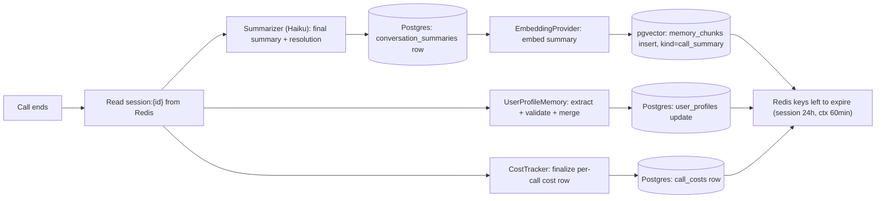
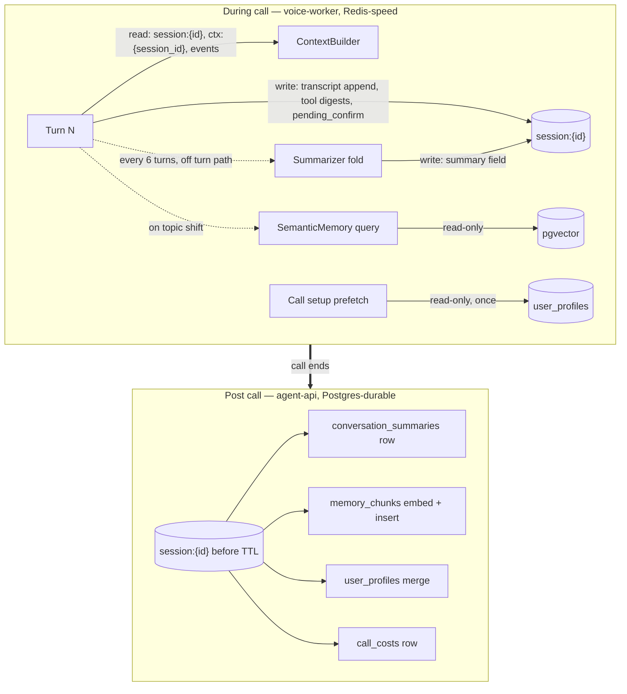

# Memory Architecture

This document owns the memory model (canon §11): what the agent remembers, where each kind of memory lives, who writes it, and how it is compressed to fit a 2,500-token prompt. It defines the seven memory layers, the Redis and Postgres shapes behind them, the rolling-summary algorithm, the semantic retrieval contract, and the post-call persistence pipeline. The prompt slots these layers fill are budgeted in [docs/11](11-prompt-engineering.md); the turn-time assembly that reads them is [docs/08](08-context-and-events.md).

**Read this with:** [docs/08](08-context-and-events.md) for the `ContextBuilder` that consumes these layers each turn, [docs/11](11-prompt-engineering.md) for the slot budgets the layers must fit, [docs/02](02-system-architecture.md) for which process reads and writes what, and [docs/14](14-security.md) for the privacy invariants that shape every write path.

---

## 1. Seven layers, one table

The deliverable names seven layers; this system implements them as five stores plus one in-process workspace plus one cross-cutting policy. The mapping is explicit — no layer is hand-waved into another:

| # | Layer | Implementation | Store | Lifetime | Written by | Read by | Prompt cost |
|---|---|---|---|---|---|---|---|
| 1 | Short-term memory | `ShortTermMemory` (`app/memory/`) | Worker process heap | One turn (some fields one call) | Turn loop, `ToolExecutor` | `ContextBuilder`, `SafetyLayer` | 0 — it is the assembly workspace, not a slot |
| 2 | Session memory | `SessionMemory` | Redis hash `session:{id}` | Call + 24 h TTL | voice-worker per turn | `ContextBuilder`, post-call pipeline | 600 (conversation window slot) |
| 3 | Conversation summary | `Summarizer` (rolling) + `ConversationSummaryStore` (final) | Redis field in-call → Postgres `conversation_summaries` post-call | In-call rolling; durable after call | `Summarizer` (Haiku, every 6 turns) | `ContextBuilder`; semantic memory post-call | 250 (summary slot) |
| 4 | Long-term memory | Postgres 16 — the durable umbrella: `user_profiles` + `conversation_summaries` + `memory_chunks` | Postgres | Retention policy (§10) | Post-call pipeline only | Call setup prefetch, retrieval | 0 direct — reaches the prompt only via layers 5 and 6 |
| 5 | User profile memory | `UserProfileMemory` | Postgres `user_profiles` | Durable, merge-updated post-call | Post-call merge (policy §5.2) | Call-setup prefetch ([docs/02 §3.1](02-system-architecture.md)) | 200 (profile slot) |
| 6 | Semantic memory | `SemanticMemory` (retriever) | pgvector `memory_chunks`, 1536-dim | KB: per deploy; call summaries: retention policy | Seed scripts (KB), post-call embed (summaries) | Setup prefetch + topic-shift re-query | 300 (RAG slot, top-3) |
| 7 | Context compression | Not a store — four strategies (§7) applied across layers 2–6 and the screen | — | — | `Summarizer`, `ContextCompressor`, `SemanticSnapshotBuilder`, `ToolExecutor` | — | Negative — it is why the other six fit |

Two structural rules fall out of this table and hold everywhere:

- **Redis is fast and forgettable; Postgres is slow and durable.** Nothing in Redis survives its TTL, and nothing the product must remember lives only in Redis. The post-call pipeline (§8) is the one bridge, and it runs inside the 24 h TTL window by construction.
- **During-call writes go to Redis from voice-worker; durable writes go to Postgres from agent-api, post-call.** One writer per store per phase ([docs/02](02-system-architecture.md) placement table). The turn path never blocks on Postgres.

---

## 2. Layer 1 — short-term memory

`ShortTermMemory` is the working set of the turn currently executing: the assembled `ContextBundle`, streaming STT partials, in-flight tool calls and their raw results, and the pending-confirmation record for confirm-gated tools ([docs/10](10-tool-calling.md)). It is a plain in-process object, never serialized, discarded when the turn's TTS dispatch completes — except `pending_confirm`, which is immediately mirrored into the session hash because it must survive anything short of the process dying (a confirm-gated `block_card` losing its pending state to a blip is a correctness bug, not a degradation).

The rejected alternative was to make even turn-scoped state Redis-resident for uniformity. It loses on arithmetic: the `context.build` span has a 15/40 ms p50/p95 budget (canon §7) and already spends it on one pipelined Redis round trip; adding writes for state that no other process ever reads buys resilience nobody needs — if the worker dies mid-turn the call drops anyway ([docs/02 §3.4](02-system-architecture.md)).

---

## 3. Layer 2 — session memory: the `session:{id}` hash

One Redis hash per call, created by agent-api at `POST /v1/sessions`, thereafter written only by the worker that owns the call. Fields, with values as they stand at turn 9 of the canonical Rajesh call:

```text
HGETALL session:a1f3c9
user_id            "usr_rajesh01"
state              "in_call"                  # created → in_call → wrap_up → ended
turn_count         "9"
transcript         [{"role":"user","text":"...","ts":...,"tok":48}, ...]   # last 8 turns max
summary            "Rajesh's ₹245 vendor payment to Amazon Business was declined at 2:14 PM..."
summary_thru_turn  "3"                        # summary covers turns 1..3
tool_results       [{"tool":"get_wallet_balance","digest":"balance ₹18,450","idem":"...","ts":...}]
pending_confirm    {"tool":"request_limit_increase","args":{"new_limit":50000},"ts":...}
cost_usd           "0.1420"                   # running CostTracker counter
started_ts         "1784536470000"
last_turn_ts       "1784536905000"
```

Design choices that matter:

- **`transcript` is capped at the last 8 turns** — the same 6–8 the window slot can render at 600 tokens. Older turns are not archived here; they exist only inside `summary`. Keeping a full transcript in Redis was rejected: it grows without bound, it duplicates what the summary already preserves, and it creates a second copy of PII-bearing text that the retention story (§10) would then have to chase.
- **`tool_results` stores digests, not payloads** (§7, strategy 4). The full `get_transactions` JSON lives in `ShortTermMemory` for the turn that fetched it; what persists is a ≤120-token digest plus the idempotency key, which is what a later turn actually needs ("you already retried that payment").
- **TTL is 24 h**, set at creation and never refreshed to infinity. The call is minutes; the extra hours are the retry window for the post-call pipeline (§8) and the debugging window for a same-day trace investigation. Contrast `ctx:{session_id}` at 60 min ([docs/08 §4.1](08-context-and-events.md)) — screen state is worthless within the hour; conversation state has one day of operational value.

---

## 4. Layer 3 — the rolling conversation summary

### 4.1 Algorithm

The summary exists to make a 15-turn call fit an 850-token conversation allowance (250 summary + 600 window). The rule set is small and exact:

1. While `turn_count ≤ 8`, no summary exists. The window slot holds every turn verbatim — 8 short voice turns ≈ 550–600 tokens, inside budget.
2. When `turn_count` first exceeds 8 (i.e., at turn 9), `Summarizer` fires: summarize turns `1..N−6` with the utility model (Haiku), keep the last 6 turns verbatim. At N=9 that means summarize turns 1–3.
3. Thereafter it re-fires every 6 turns (N=15, 21, …) as an **incremental fold**: input = previous summary + the turns now leaving the window (at N=15: summary-of-1–3 + turns 4–9); output = a new summary ≤250 tokens covering `1..N−6`. `summary_thru_turn` records the boundary so window rendering and summary coverage never overlap or gap.
4. The fold runs **off the turn path** — kicked after turn N's TTS dispatch, written to the hash when done. The next turn uses whichever summary is current; at a ~20 s/turn conversational cadence, a ~1.5 s Haiku call always lands before turn N+1. This is the only LLM-backed compression in the system; everything on the hot path is string work ([docs/08 §4.3](08-context-and-events.md)).

Cost, so nobody re-derives it: one fold ≈ 1,000 input + 250 output tokens on Haiku = $0.001 + $0.00125 ≈ **$0.0023**. A 15-turn call fires twice: ~half a cent, invisible inside the canonical ≈ $0.30/call (canon §9).

### 4.2 The summarization contract

The Haiku prompt (owned by [docs/11](11-prompt-engineering.md); contract stated here) requires the output to preserve, verbatim and never paraphrased: money amounts, transaction/order IDs, tool calls made and their outcomes, and any commitment the agent voiced. Everything else may compress freely. The canonical summary at `summary_thru_turn = 9`:

```text
Rajesh's ₹245 vendor payment to Amazon Business was declined at 2:14 PM —
daily limit exceeded (₹24,890 of ₹25,000 used). Agent confirmed wallet
balance ₹18,450 via get_wallet_balance and explained the limit resets at
midnight. Rajesh asked about raising the limit; agent described the
Merchant Pro increase process (₹25,000 → ₹50,000, within 4 business hours) and
offered to submit the request. No mutating tool executed yet.
```

That is ~90 tokens against a 250 budget — headroom is normal; the cap exists for pathological calls, not typical ones.

### 4.3 Rejected alternatives

- **Summarize every turn**: 15 Haiku calls per call instead of 2, for a summary that mostly restates itself. Cost is still small; the real objection is drift — every re-summarization is a lossy generation, and §11 treats fold count as the drift budget.
- **No summary, bigger window**: 15 verbatim turns ≈ 1,300+ tokens, blowing the window slot by 2× and starving the screen and RAG slots. The summary is what makes screen-awareness affordable in a long call.
- **Client-side summary**: the transcript lives server-side; shipping it to the device to summarize is a privacy regression with zero benefit.

---

## 5. Layer 5 — user profile memory

### 5.1 Schema

```sql
CREATE TABLE user_profiles (
    user_id         TEXT PRIMARY KEY,
    facts           JSONB NOT NULL DEFAULT '{}',   -- durable, stated-or-confirmed only
    preferences     JSONB NOT NULL DEFAULT '{}',
    open_issues     JSONB NOT NULL DEFAULT '[]',
    updated_at      TIMESTAMPTZ NOT NULL DEFAULT now(),
    updated_by_call TEXT                            -- session_id of last merge, for provenance
);
```

Rajesh's row after the canonical call:

```json
{
  "facts": {
    "business_name": "Kumar General Store",
    "city": "Jaipur",
    "merchant_since": "2022",
    "account_type": "Merchant Pro"
  },
  "preferences": { "language": "English" },
  "open_issues": [
    { "id": "iss_071", "summary": "Daily limit increase requested: ₹25,000 → ₹50,000",
      "status": "pending", "opened_call": "a1f3c9", "opened_at": "2026-07-24T14:29:00+05:30" }
  ]
}
```

At call setup this renders into the 200-token profile slot (canon §8) — compact prose, not JSON, per [docs/11](11-prompt-engineering.md). `open_issues` is the field that makes the *next* call feel continuous: "Hi Rajesh — checking on your limit increase?" is a profile read, not a semantic search.

### 5.2 Post-call update policy

The merge, run by `UserProfileMemory` in the post-call pipeline, is deliberately narrow:

- **Only facts the user stated or a tool confirmed.** "My shop is closed on Tuesdays" (stated) merges; `request_limit_increase` succeeding (tool-confirmed) opens an issue. An inference — "sounds frustrated", "probably a small merchant", anything demographic — never merges. This is the [docs/14](14-security.md) no-inferred-PII line applied at the write boundary, where it is enforceable, rather than at read time, where it is not.
- **Extraction is Haiku with a closed JSON schema**, validated by Pydantic before merge. Keys outside the schema are dropped, not stored — the allowlist is the defense against the extractor inventing fields.
- **Newest-stated wins on conflict**, with `updated_by_call` as provenance. No merge history table in the demo; production evolution is an append-only `profile_events` log if audit requires it.
- The rejected alternative was free-form LLM profile append ("add anything useful about the user"). It reads well in a demo and rots in production: unbounded growth, unauditable claims, and a profile slot that fills with plausible fiction. A profile the agent voices back to a merchant must contain only what the merchant could recognize as true.

---

## 6. Layer 6 — semantic memory

### 6.1 Corpus and schema

Two content kinds share one table and one index:

| Kind | Source | Chunking | Demo scale |
|---|---|---|---|
| `kb_article` | Seeded support KB (limits, settlements, refunds, device orders, KYC) | Heading-aware, ~300-token chunks, 50-token overlap | ~40 articles → ~180 chunks |
| `call_summary` | `conversation_summaries` rows, embedded post-call | Whole — already ≤250 tokens by construction | Grows ~1 row/call |

```sql
CREATE TABLE memory_chunks (
    id         BIGSERIAL PRIMARY KEY,
    kind       TEXT NOT NULL CHECK (kind IN ('kb_article', 'call_summary')),
    user_id    TEXT,                  -- NULL for KB; REQUIRED for call_summary (scoping)
    source_id  TEXT NOT NULL,         -- article slug or session_id
    content    TEXT NOT NULL,
    embedding  vector(1536) NOT NULL, -- text-embedding-3-small
    created_at TIMESTAMPTZ NOT NULL DEFAULT now()
);
CREATE INDEX ON memory_chunks USING hnsw (embedding vector_cosine_ops);
```

Honesty note: at ~200 rows the HNSW index is decoration — a sequential scan is sub-millisecond. It exists so the schema is production-shaped; the ADR-3 flip condition ("pgvector until ~10M vectors") is when this table leaves Postgres, not before.

### 6.2 Retrieval contract

- **Query construction**: current utterance + the turn's classified intent, concatenated as one string and embedded ("how do I raise it \n intent: limit_increase"). At call setup, before any utterance exists, the prefetch query is the active error code + screen name (`DAILY_LIMIT_EXCEEDED PaymentScreen`) — this is the speculative prefetch [docs/08 §1](08-context-and-events.md) references. Re-query fires on topic shift (intent class changes), not every turn — embedding every utterance costs little money but adds a network hop to turns that don't need it.
- **Top-3 by cosine similarity, floor 0.70.** Below-floor results are dropped, not padded — a 300-token slot of marginally related KB text is worse than an empty slot, because the model treats retrieved text as more authoritative than it is. Top-3 fits the slot budget: 3 × ~100-token renderings ≈ 300 tokens (canon §8).
- **Scoping is a WHERE clause, not a hope**: `kind = 'kb_article' OR user_id = :session_user`. A `call_summary` from another merchant must be unreachable by construction — in a fintech context this filter is a security invariant ([docs/14](14-security.md)), and it lives in the one function that issues the query.
- **Rejected**: a cross-encoder reranker (~150 ms for marginal gain at a 200-chunk corpus; revisit with corpus growth), and embedding raw transcripts instead of summaries (noisy vectors, PII multiplication, and the summary already exists).

---

## 7. Layer 7 — context compression, enumerated

Compression is not one mechanism; it is four, each owned by a different component, each chosen to be the cheapest thing that works at its position in the pipeline:

| # | Strategy | Mechanism | Runs | Owner |
|---|---|---|---|---|
| 1 | Rolling summarization | LLM (Haiku) fold, §4 — lossy, semantic | Off turn path, every 6 turns | `Summarizer` |
| 2 | Slot-budget truncation | Mechanical trim to canon §8 budgets; pressure rungs in [docs/08 §5.2](08-context-and-events.md) | Hot path, every turn | `ContextCompressor` |
| 3 | ScreenContext relevance capping | The [docs/07 §7](07-ui-semantic-context.md) drop ladder — 4,000-token raw tree → ≤300-token IR, degrading to ~120 and ~25-token forms | On device per snapshot; re-applied server-side on oversize | `SemanticSnapshotBuilder`, re-run by `ContextCompressor` |
| 4 | Tool-result truncation | Large results digested before entering the transcript: `get_transactions` returning 50 rows becomes the 5 relevant rows + one aggregate line, ≤120 tokens; full payload stays in `ShortTermMemory` for the current turn only | Hot path, per tool call | `ToolExecutor` |

The division of labor is deliberate: **the only LLM in the list is strategy 1, and it is the only one off the hot path.** Strategies 2–4 are string work inside latency budgets measured in milliseconds. An early sketch had Haiku compressing tool results per call; it died on the same arithmetic as per-turn timeline compression ([docs/08 §4.3](08-context-and-events.md)) — a ~300 ms utility call has no place inside a turn whose entire context budget is 40 ms p95.

---

## 8. Post-call pipeline

When the call ends (user hangs up, `escalate_to_human`, or timeout), voice-worker marks `state = ended` and notifies agent-api, which runs persistence — per the [docs/02](02-system-architecture.md) rule that durable writes belong to agent-api:



The durable summary row:

```sql
CREATE TABLE conversation_summaries (
    session_id  TEXT PRIMARY KEY,
    user_id     TEXT NOT NULL,
    summary     TEXT NOT NULL,             -- final fold, ≤250 tokens
    resolution  TEXT NOT NULL CHECK (resolution IN
                ('resolved', 'escalated', 'pending', 'abandoned')),
    intents     TEXT[] NOT NULL,           -- e.g. {payment_failure, limit_increase}
    tools_used  TEXT[] NOT NULL,           -- e.g. {get_wallet_balance, request_limit_increase}
    turn_count  INT NOT NULL,
    duration_s  INT NOT NULL,
    cost_usd    NUMERIC(8, 4) NOT NULL,
    created_at  TIMESTAMPTZ NOT NULL DEFAULT now()
);
```

Three properties worth stating:

- **The pipeline is idempotent** — `session_id` is the primary key everywhere it writes, and the profile merge re-applied is a no-op. A crash mid-pipeline is retried whole from the still-live Redis hash; the 24 h TTL is the retry deadline.
- **The raw transcript does not persist.** What survives a call is the summary, the resolution, the profile delta, and the cost row. This is a deliberate demo-scope privacy choice, not an accident — §10 covers the production variant.
- **Each stage is independently skippable.** An embedding outage (§11) queues the `memory_chunks` insert for retry without blocking the summary row or the cost row.

---

## 9. Memory lifecycle: during-call vs post-call



The asymmetry is the architecture: **during the call, Postgres is read-only and Redis is hot; after the call, Redis is read-once and Postgres is the destination.** No turn ever waits on a durable write, and no durable store ever holds half-finished conversational state.

---

## 10. Privacy, TTLs, and deletion

Full treatment in [docs/14](14-security.md); the memory-layer facts live here:

| Store | Retention | Delete path |
|---|---|---|
| Redis `session:{id}` | 24 h TTL, automatic | Expiry; immediate `DEL` on right-to-delete |
| Redis `ctx:{session_id}`, `:events` | 60 min TTL ([docs/08 §4.1](08-context-and-events.md)) | Expiry |
| Raw transcript | Demo: never persisted — dies with the session hash. Production evolution: 90-day encrypted retention if support audit requires it, as an explicit opt-in decision | n/a in demo |
| `conversation_summaries` | Demo: indefinite. Production: retention config (e.g. 24 months) | `DELETE WHERE user_id = ?` |
| `memory_chunks` (`call_summary`) | Follows `conversation_summaries` | `DELETE WHERE user_id = ?` |
| `user_profiles` | Life of the account | `DELETE WHERE user_id = ?` |

Right-to-delete is one function in agent-api: three Postgres deletes in a transaction, plus a `DEL` of any live `session:*`/`ctx:*` keys for the user's active sessions. It is small because the write paths were designed for it — every durable row carries `user_id`, and the transcript's non-persistence means the hardest deletion problem (free text scattered across logs) is mostly avoided by never creating it. PII redaction (card/Aadhaar/PAN masking, canon §12) runs **before** any write to transcript, summary input, or logs — deletion is the backstop, not the primary control.

---

## 11. Failure modes

Doc-set convention: Failure | Detection | Impact | Mitigation | Degradation.

| Failure | Detection | Impact | Mitigation | Degradation |
|---|---|---|---|---|
| Redis eviction or restart mid-call (`session:{id}` gone) | `HGETALL` returns empty on turn start; distinguishable from expiry by uptime check | Window, summary, tool digests, pending confirmation all lost mid-conversation | Rebuild a minimal session: re-read profile from Postgres, re-request a screen snapshot ([docs/08 §3.3](08-context-and-events.md)), restart `turn_count`; **any pending confirm is cancelled, never guessed** — a mutating tool must not fire on reconstructed state | Asha says so honestly — "I've lost my notes for a moment, let me re-confirm where we were" — and re-asks; audio and tools keep working. Demo runs Redis with `noeviction` + AOF, so this path is drill, not expectation |
| Summary drift (each fold is a lossy generation; errors compound) | Fold count per call as a span attribute; eval fixtures replay canned 20-turn calls and diff anchor facts (amounts, IDs) against ground truth in CI | Agent confidently misremembers earlier turns — the worst version is a wrong amount voiced back | Bounded folds (2–3 per realistic call); the §4.2 verbatim-preservation contract for money/IDs; `pending_confirm` and tool digests live outside the summary, so the highest-stakes facts are never summarized at all | Facts the summary carries degrade gracefully to "let me double-check that" plus a read tool call — the canon rule that tools, not memory, state account facts is the real backstop |
| Embedding outage (OpenAI embeddings down or timing out) | `EmbeddingProvider` timeout/5xx; circuit-breaks after 3 consecutive failures | No retrieval query can be embedded; post-call summary can't be indexed | In-call: **skip the RAG slot entirely** — it is advisory by design (drop-rung 1 in [docs/08 §5.2](08-context-and-events.md)); no fallback keyword search in the demo. Post-call: queue the embed for retry; the summary row itself is unaffected | Agent runs on screen + tools + business rules — the exact configuration of drop-rung 1, already tested. Answers lose KB color, not correctness |
| Postgres down at post-call time | Write failure in the §8 pipeline | Durable memory of this call at risk | Retry with backoff inside the 24 h Redis TTL window; pipeline idempotency (§8) makes whole-pipeline retry safe | Worst case after 24 h: the call is forgotten — profile un-updated, summary lost, cost row missing. Ugly for analytics, invisible to the next conversation's correctness |

---

## Decisions this document exports

| Fixed here | Value | Heaviest consumer |
|---|---|---|
| Seven-layer mapping | §1 table — five stores + workspace + compression policy | [docs/11](11-prompt-engineering.md), [docs/02](02-system-architecture.md) |
| `session:{id}` hash shape | §3 fields; transcript capped at 8 turns; digests not payloads; 24 h TTL | [docs/13](13-api-contracts.md), [docs/15](15-scalability-and-reliability.md) |
| Rolling-summary algorithm | Fire at turn 9 then every 6 turns; fold summary + departing turns; keep last 6 verbatim; ≤250 tokens; off turn path | [docs/11](11-prompt-engineering.md), [docs/06](06-voice-pipeline.md) |
| Summary preservation contract | Amounts, IDs, tool outcomes, voiced commitments — verbatim, never paraphrased | [docs/11](11-prompt-engineering.md), eval fixtures |
| Profile schema + merge policy | §5 — stated-or-tool-confirmed only, closed extraction schema, no inferred PII | [docs/14](14-security.md) |
| Semantic retrieval contract | utterance + intent query; top-3 cosine, floor 0.70; `user_id` scoping as WHERE clause | [docs/10](10-tool-calling.md), [docs/14](14-security.md) |
| Compression strategy inventory | §7 — one LLM strategy (off-path), three mechanical (on-path) | [docs/06](06-voice-pipeline.md), [docs/16](16-tech-stack.md) |
| Post-call pipeline + schemas | §8 — idempotent, retryable within 24 h; `conversation_summaries`, `call_costs` | [docs/12](12-data-models.md), [docs/16](16-tech-stack.md) |
| Transcript non-persistence | Demo persists summary + resolution + profile delta + cost, never raw transcript | [docs/14](14-security.md) |
| Right-to-delete path | One transactional function over three tables + live Redis keys | [docs/14](14-security.md) |
