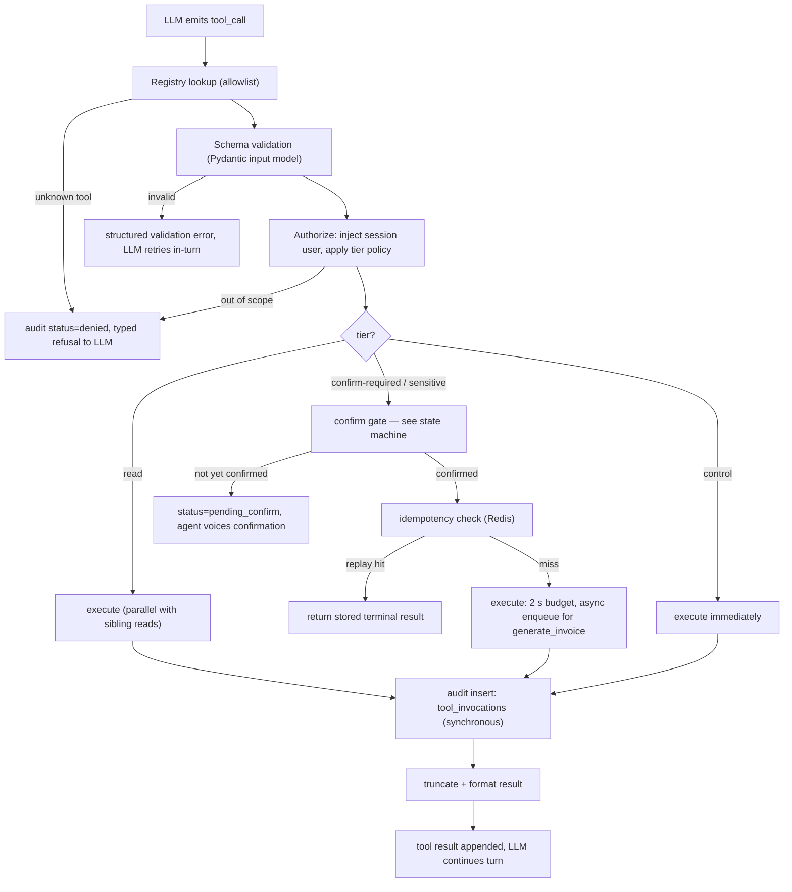
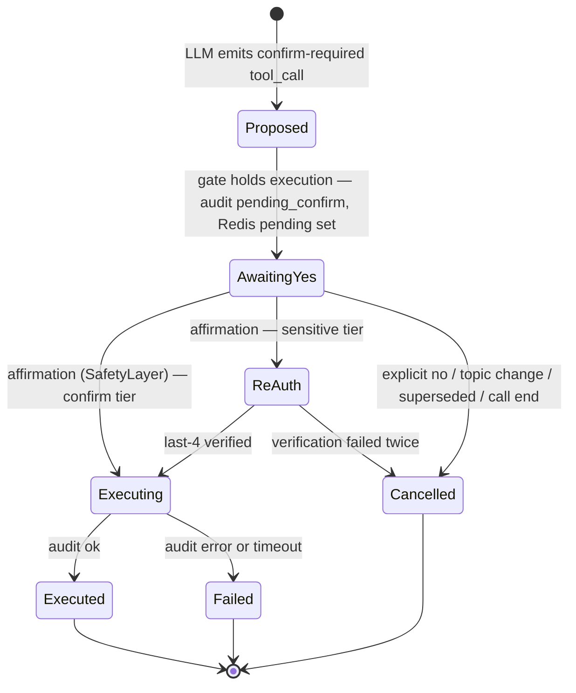

# Tool-Calling Architecture

This document owns the tool layer: the four invariants every tool obeys, the `ToolExecutor` pipeline from LLM `tool_call` to formatted result, the full 16-tool catalog with typed contracts, the voiced-confirmation state machine for mutating tools, the error surface the LLM recovers from, and the recipe for adding tool #17. The audit table these contracts feed (`tool_invocations`) is defined in [docs/12](12-data-models.md); the prompt slots that carry tool results are budgeted in [docs/11](11-prompt-engineering.md). Everything here is authoritative for tool names, tiers, schemas, and gating semantics.

**Read this with:** [docs/01](01-product-and-use-case.md) for the canonical transcript these tools serve, [docs/12](12-data-models.md) for the tables they read/write and the audit contract, [docs/14](14-security.md) for the threat model behind the authorization rules, and [docs/11](11-prompt-engineering.md) for how tool results are rendered into the prompt.

---

## 1. Four invariants

| # | Invariant | Enforced by |
|---|---|---|
| 1 | **No hallucinated account facts.** The LLM never states a balance, limit, status, or reference number that a read tool can fetch — it fetches it. | Prompt rule ([docs/11](11-prompt-engineering.md)) + eval assertion: every ₹ amount and reference id in agent output must appear in a tool result from the same session (CI replay fixtures, Phase 6) |
| 2 | **Typed contracts.** Every tool has a Pydantic input model and output model; nothing untyped crosses the boundary in either direction. | `ToolExecutor` validation stage; the 16 models also validate the `tool_invocations.input/output` JSONB writes ([docs/12 §6](12-data-models.md)) |
| 3 | **No principal in the arguments.** No tool accepts `user_id`/`merchant_id` as input. The executor injects the authenticated session user into every query. | `ToolExecutor` authorization stage |
| 4 | **Every invocation audited.** Success, error, denial, pending confirmation, cancellation — one synchronous row each in `tool_invocations`, written while serving the call. | Audit stage; write is inside the tool path (~1 ms), see [docs/12 §4.4](12-data-models.md) |

Invariant 3 deserves its sentence of why: screen content and user speech are untrusted ([docs/14](14-security.md)), so if the model could pass a `merchant_id`, a prompt injection in a screen label could read someone else's wallet. By construction the model can only ever act as the caller. The rejected alternative — validate a model-supplied `user_id` against the session — is one comparison away from a confused-deputy bug every time a new tool forgets it.

Invariant 1 is worth stating as an invariant rather than a guideline because it is *checkable*: turn 3 of the canonical call voices ₹18,450 and ₹24,890, and both strings exist in tool outputs logged two spans earlier. An agent that asserts numbers from parametric memory fails the eval even when the numbers happen to be right.

---

## 2. Execution pipeline



Stage notes, in execution order:

| Stage | What it does | Budget / limit |
|---|---|---|
| Registry lookup | Name must be in the 16-entry allowlist. Unknown names get `status=denied` audit rows — a signal worth recording, not an exception ([docs/12 §4.4](12-data-models.md) explains why this is code, not a DB `CHECK`) | ~0 ms |
| Schema validation | Pydantic `model_validate` on raw arguments; failures become structured error results (§5), never turn-killing exceptions | ~0 ms |
| Authorization | Session user injected as the principal; tier policy applied (read → proceed, confirm/sensitive → gate, control → proceed) | ~0 ms |
| Confirm gate | Mutating tools only; full state machine in §4 | 1 conversational round-trip, by design |
| Idempotency | Redis `GET idempotency:{key}`; hit returns the stored terminal result without re-executing | <1 ms |
| Execute | `asyncio.wait_for(handler, timeout=2.0)`. Seeded tools run 5–15 ms (reads) to ~40 ms (writes — the canonical `request_limit_increase` took 38 ms). The 2 s ceiling exists for the production evolution where a tool fronts a real bank API; blowing it produces a timeout result (§5), not a hung turn | 2 s hard |
| Audit | One `INSERT` into `tool_invocations`, synchronous, same transaction as the business write for mutating tools | ~1 ms |
| Format | List outputs truncated to 5 rows + `{"truncated": true, "total_available": n}`; each rendered result capped at ~120 tokens so two tool calls fit comfortably inside the turn's context share ([docs/11](11-prompt-engineering.md)) | ≤120 tokens/result |

**Parallel reads.** When one LLM response emits multiple read-tier calls, the executor runs them concurrently (`asyncio.gather`) — turn 3 of the canonical call runs `get_wallet_balance` and `get_payment_status` in parallel, so two reads cost one tool round-trip in the latency budget ([docs/06](06-voice-pipeline.md)). Mutating tools are never parallelized, and a mutating call in a batch serializes the whole batch: the interleavings are not worth reasoning about for a demo, and barely worth it in production.

**Async pattern.** `generate_invoice` is the one tool whose real work (render a month's GST invoice PDF) cannot fit a 2 s budget even in the demo. The synchronous call only *enqueues*: it returns `{job_id, status: "queued", eta_seconds}` in ~10 ms, the job runs in the background, and completion publishes to Redis, where the next turn's context assembly picks it up as an internal event — so Asha can say "your invoice is ready, check the app" before hang-up if the job beats the call. The rejected alternative was blocking with a filler utterance ("one moment while I generate that…"), which holds a voice channel hostage to a batch job and falls apart the moment a job takes 30 s.

---

## 3. Catalog

Sixteen tools, four tiers. Names are frozen (canon §6); each maps to a real screen ([docs/01 §5](01-product-and-use-case.md)) — none exists to pad the list. Amounts at the tool boundary are **integer rupees** (the LLM speaks and hears rupees); conversion to the database's paise happens inside each handler, in exactly one place per tool. Latency classes: `read-single` (one indexed row), `read-list` (indexed scan, truncated), `write` (one UPDATE/INSERT + audit), `async-enqueue` (job handle returned), `control` (immediate, side effect is a hand-off).

| Tool | Tier | Description | Input (compact) | Output (compact) | Latency class |
|---|---|---|---|---|---|
| `get_wallet_balance` | read | Current wallet balance | `{}` | `{balance, currency, updated_at}` | read-single |
| `get_transactions` | read | Recent transactions, filterable | `{type?, status?, limit? ≤10}` | `{items[], truncated, total_available}` | read-list |
| `get_payment_status` | read | One payment incl. decline detail | `{payment_id}` | `{status, decline_code?, limit_context?}` | read-single |
| `get_settlements` | read | Settlement batches | `{batch_date?, limit? ≤10}` | `{items[], truncated, total_available}` | read-list |
| `get_orders` | read | Device orders | `{status?}` | `{items[]}` | read-list |
| `track_device_order` | read | Courier tracking for one order | `{order_id}` | `{status, courier, tracking_id, eta_date}` | read-single |
| `get_refund_status` | read | Refund state for a transaction | `{txn_id}` | `{status, amount, expected_by?}` | read-single |
| `get_complaint_status` | read | Complaint state(s) | `{complaint_id?}` | `{items[]}` | read-list |
| `retry_payment` | confirm-required | Re-attempt a declined payment | `{payment_id}` | `{new_txn_id, status}` | write |
| `request_limit_increase` | confirm-required | Raise the daily bank limit | `{current_limit, requested_limit}` | `{request_id, status, eta_hours}` | write |
| `raise_complaint` | confirm-required | Open a support complaint | `{category, subject, detail?}` | `{complaint_id, sla_due_at}` | write |
| `update_business_address` | confirm-required | Change registered address | `{address_line, city, pincode}` | `{status, effective_at}` | write |
| `generate_invoice` | confirm-required | GST invoice for a month (async) | `{month}` | `{job_id, status, eta_seconds}` | async-enqueue |
| `block_card` | sensitive | Block the wallet debit card | `{reason, last4?}` | `{last4, status, blocked_at}` | write |
| `reset_pin` | sensitive | Trigger card PIN reset | `{last4?}` | `{status, channel}` | write |
| `escalate_to_human` | control | Hand off to a human agent | `{reason, urgency?}` | `{handoff_id, status, eta_minutes?}` | control |

Note what is *absent* from every input: no `user_id`, no `wallet_id`, no free-form SQL-ish filters. `get_wallet_balance` takes literally nothing — the session already knows whose wallet.

### 3.1 Expanded contracts

Five tools get full JSON Schema treatment: the two the canonical call exercises hardest, the two sensitive ones' representative, the async one, and the control one. The remaining eleven follow the same conventions; their Pydantic modules in [backend/app/tools/](../backend/app/tools/) are the source of truth, exported to [protocol/tools/](../protocol/) as JSON Schema in CI.

**`get_payment_status`** — the tool that resolves the wallet-vs-limit contradiction in turn 3:

```json
{
  "name": "get_payment_status",
  "input": {
    "type": "object",
    "properties": {
      "payment_id": {"type": "string", "pattern": "^txn_[a-z0-9_]+$"}
    },
    "required": ["payment_id"], "additionalProperties": false
  },
  "output": {
    "type": "object",
    "properties": {
      "payment_id":   {"type": "string"},
      "status":       {"enum": ["succeeded", "declined", "pending", "refunded"]},
      "amount":       {"type": "integer", "description": "INR whole rupees"},
      "counterparty": {"type": "string"},
      "decline_code": {"type": ["string", "null"]},
      "limit_context": {
        "type": ["object", "null"],
        "properties": {
          "limit": {"type": "integer"}, "used_today": {"type": "integer"},
          "resets_at": {"type": "string", "format": "date-time"}
        },
        "description": "Populated only when decline_code is limit-related"
      }
    }
  }
}
```

`limit_context` is a deliberate join: for `DAILY_LIMIT_EXCEEDED` the handler reads `merchant_limits` alongside `transactions`, so the LLM gets the explanation (₹25,000 limit, ₹24,890 used) in one call instead of needing a `get_limits` tool that exists only to complete this sentence.

**`request_limit_increase`** — the canonical mutation:

```json
{
  "name": "request_limit_increase",
  "input": {
    "type": "object",
    "properties": {
      "current_limit":   {"type": "integer", "minimum": 1},
      "requested_limit": {"type": "integer", "minimum": 1}
    },
    "required": ["current_limit", "requested_limit"], "additionalProperties": false
  },
  "output": {
    "type": "object",
    "properties": {
      "request_id": {"type": "string", "pattern": "^LMT-\\d{4}-\\d{4}-\\d{4}$"},
      "status":     {"enum": ["submitted"]},
      "eta_hours":  {"type": "integer"}
    }
  }
}
```

`current_limit` is required even though the server knows it: the model must state the limit it *believes* it is raising, and the handler rejects a mismatch (`STALE_LIMIT_VIEW`, §5). This catches the case where the limit changed mid-call and the voiced confirmation described a state that no longer exists — a cheap compare-and-swap on intent.

**`block_card`** — sensitive tier:

```json
{
  "name": "block_card",
  "input": {
    "type": "object",
    "properties": {
      "reason": {"enum": ["lost", "stolen", "suspected_fraud"]},
      "last4":  {"type": "string", "pattern": "^\\d{4}$",
                 "description": "Disambiguator if multiple cards; verified against DB"}
    },
    "required": ["reason"], "additionalProperties": false
  },
  "output": {
    "type": "object",
    "properties": {
      "last4":      {"type": "string"},
      "status":     {"enum": ["blocked"]},
      "blocked_at": {"type": "string", "format": "date-time"}
    }
  }
}
```

Note the output voices `last4` only — there is no PAN anywhere in the system to leak ([docs/12 §3.4](12-data-models.md): the column does not exist). The audit row records `blocked_by_session` provenance.

**`generate_invoice`** — the async job:

```json
{
  "name": "generate_invoice",
  "input": {
    "type": "object",
    "properties": {"month": {"type": "string", "pattern": "^\\d{4}-(0[1-9]|1[0-2])$"}},
    "required": ["month"], "additionalProperties": false
  },
  "output": {
    "type": "object",
    "properties": {
      "job_id":      {"type": "string"},
      "status":      {"enum": ["queued", "running", "done", "failed"]},
      "eta_seconds": {"type": "integer"}
    }
  }
}
```

**`escalate_to_human`** — control tier; full hand-off contract in §7:

```json
{
  "name": "escalate_to_human",
  "input": {
    "type": "object",
    "properties": {
      "reason":  {"enum": ["user_requested", "unresolved_after_attempts",
                           "policy_boundary", "negative_sentiment", "safety"]},
      "urgency": {"enum": ["normal", "high"], "default": "normal"}
    },
    "required": ["reason"], "additionalProperties": false
  },
  "output": {
    "type": "object",
    "properties": {
      "handoff_id":  {"type": "string"},
      "status":      {"enum": ["queued"]},
      "eta_minutes": {"type": ["integer", "null"]}
    }
  }
}
```

---

## 4. The confirm gate

Mutating tools cost real money movement or account state; a voice channel has no "Are you sure?" dialog box. The confirmation *is* the dialog box, spoken.



Mechanics, mapped onto the canonical call:

1. **Proposed** (turn 5): the LLM emits `request_limit_increase(current_limit=25000, requested_limit=50000)`. The gate does *not* execute. It writes an audit row with `status=pending_confirm`, stores the pending action in the Redis session hash (`session:{id}.pending_confirm = {"tool", "args", "proposed_turn", "invocation_id"}` — the field [docs/12 §7](12-data-models.md) reserves), and returns a structured result instructing the model to voice **the action and its consequence** before anything happens. Asha's turn-5 line does exactly that: what will be submitted, from what to what, and the 4-hour SLA.
2. **AwaitingYes** (turn 6): the user's next utterance is classified by the `SafetyLayer` — an explicit affirmation ("yes, do it"), not sentiment inference. "Hmm, maybe" is not a yes. "Yes but make it a lakh" is not a yes either — it supersedes the pending action (old one audited `cancelled`, new proposal cycle starts).
3. **Executing** (turn 7): with the affirmation flag set and a matching pending action in Redis, the executor proceeds through idempotency and execution. If the user says no, changes topic, or the call ends, the pending action is audited `cancelled` and the Redis field cleared. Exactly **one** pending action can exist at a time — a second proposal while one is pending cancels the first as superseded, because two half-confirmed mutations in flight is how "yes" executes the wrong one.

### 4.1 Sensitive tier: re-authentication

`block_card` and `reset_pin` add a **ReAuth** state between yes and execute: Asha asks the caller to speak the last 4 digits of the card, verified against `cards.last4`. Two failures → cancelled + offer of `escalate_to_human`.

Honesty first: voiced last-4 is a weak factor — the digits are printed on the card and visible on the card-detail screen, so anyone holding the unlocked phone passes. It exists in the demo to prove the *state machine slot* where step-up auth belongs, not as a security claim.

| | Demo | Production evolution |
|---|---|---|
| Sensitive-tier re-auth | Voiced last-4 vs `cards.last4`, 2 attempts | Step-up: push to the VyaparPay app → biometric confirm in-app; voice channel never carries the secret. Fallback OTP. [docs/14](14-security.md) owns the threat analysis |

### 4.2 Idempotency

Every mutating execution carries a deterministic key: **`{session_id}:{tool}:{turn}`** — the canonical execution's key is `a1f3c9:request_limit_increase:7`. Before executing, the executor checks Redis `idempotency:{key}` (24 h TTL); after a terminal result, it stores `invocation_id` + status there. The `UNIQUE` constraint on `tool_invocations.idempotency_key` is the durable backstop after the TTL ([docs/12 §4.4](12-data-models.md)): a replayed mutation cannot produce a second row, therefore cannot produce a second limit request.

Why turn number and not an args hash? The unit of exactly-once is **the confirmed decision**, and a decision is anchored to a turn:

- Transport replays — a LiveKit reconnect mid-execution (the [docs/01 §7](01-product-and-use-case.md) failure variant), an executor retry after a timeout — re-run the *same turn*, hit the same key, and get the stored result instead of a double submission.
- An args hash would make a deliberately repeated identical action later in the call (raise a second complaint with the same subject; retry the same payment tomorrow via a fresh confirmation) silently impossible — the hash collides, the dedupe eats a legitimate request.
- Debuggability: the key is greppable straight to the turn that caused it; a hash is not.

Semantic repeats are the *business layer's* job, not idempotency's: asking for a second limit increase at turn 9 is a new decision, gets a new key, executes — and the handler returns `LIMIT_REQUEST_ALREADY_PENDING` because `merchant_limits` allows one active request per limit row. Two layers, two different duplicates.

---

## 5. Error surface

Errors are **results, not exceptions**. A tool failure must never kill the turn — the LLM receives a structured error it can recover from conversationally, and the audit trail records what happened either way.

| Class | Produced by | Example code | LLM recovery | Audit status |
|---|---|---|---|---|
| Validation | Pydantic reject at the boundary | `SCHEMA_VALIDATION_FAILED` | Retry in-turn with corrected args (worked example in §6) | none — retried before audit; persistent failure audits `error` |
| Authorization | Scope/tier policy | `TOOL_NOT_ALLOWED`, `OUT_OF_SCOPE` | Apologize, offer an in-scope alternative or escalate | `denied` |
| Business | Handler domain logic | `LIMIT_REQUEST_ALREADY_PENDING`, `CARD_ALREADY_BLOCKED`, `STALE_LIMIT_VIEW`, `REFUND_WINDOW_CLOSED` | Explain the state conversationally; often the "error" *is* the answer | `error` (with `error_code`) |
| Timeout | 2 s execution ceiling | `TOOL_TIMEOUT` | "That's taking longer than it should" + retry once or fall back to screen-context-only answer | `error` |
| Async job failure | Background job completion event | `INVOICE_JOB_FAILED` | Offer retry or `raise_complaint` | `error` (on the job's row) |

The three shapes on the wire back to the LLM:

```json
{"ok": false, "error": {"type": "validation", "code": "SCHEMA_VALIDATION_FAILED",
  "fields": [{"loc": "requested_limit", "msg": "value is not a valid integer",
              "hint": "amounts are integer rupees, e.g. 50000"}], "retryable": true}}
```

```json
{"ok": false, "error": {"type": "business", "code": "LIMIT_REQUEST_ALREADY_PENDING",
  "detail": {"existing_request_id": "LMT-2026-0724-0913", "status": "submitted",
             "requested_at": "2026-07-24T09:16:04Z"}, "retryable": false}}
```

```json
{"ok": false, "error": {"type": "timeout", "code": "TOOL_TIMEOUT",
  "elapsed_ms": 2000, "retryable": true}}
```

Two design points. The `hint` field on validation errors is written for the *model*, not a human — "amounts are integer rupees, e.g. 50000" converts a retry loop into a single retry, which matters when every loop is ~450 ms of TTFT ([docs/06](06-voice-pipeline.md)). And business errors carry enough `detail` to *be voiced*: `LIMIT_REQUEST_ALREADY_PENDING` includes the existing reference id, so Asha's recovery is "you already have a request pending, reference ending 0913 — it's still in review", which is a resolution, not an apology.

---

## 6. Worked trace: `request_limit_increase`, end to end

The canonical call, turns 5–7, at wire level. One splice for pedagogy: in the recorded canonical run, turn 5 validated first try ([docs/01 §8](01-product-and-use-case.md) shows `llm.ttft` once); steps T5.1–T5.2 below are the validation-failure variant from eval fixture `tc-limit-07` — observed when STT hands the model a spelled-out amount — spliced in to show the recovery path. Everything else is the canonical run.

**T5.1 — LLM emits the call (invalid).** Rajesh said "get the limit increased"; the KB article names the ₹50,000 tier; the model, echoing the transcribed phrase, emits the amount as words:

```json
{"type": "tool_call", "name": "request_limit_increase",
 "arguments": {"current_limit": 25000, "requested_limit": "fifty thousand"}}
```

**T5.2 — Schema reject → structured error.** Pydantic refuses; nothing executed, nothing audited, no user-perceptible delay beyond one extra model iteration:

```json
{"ok": false, "error": {"type": "validation", "code": "SCHEMA_VALIDATION_FAILED",
  "fields": [{"loc": "requested_limit", "msg": "value is not a valid integer",
              "hint": "amounts are integer rupees, e.g. 50000"}], "retryable": true}}
```

**T5.3 — LLM retries (valid).**

```json
{"type": "tool_call", "name": "request_limit_increase",
 "arguments": {"current_limit": 25000, "requested_limit": 50000}}
```

**T5.4 — Gate holds.** Registry ok, schema ok, session user `usr_rajesh01` owns the `daily_txn` limit row, tier is confirm-required, no affirmation flag → the gate writes the pending state instead of executing:

```json
{"ok": false, "gate": {"status": "pending_confirm",
  "instruction": "State the action and its consequence, then ask for explicit confirmation. Do not treat this as executed.",
  "action": {"tool": "request_limit_increase",
             "summary": "raise daily limit from ₹25,000 to ₹50,000"}}}
```

Redis: `session:a1f3c9.pending_confirm = {"tool": "request_limit_increase", "args": {"current_limit": 25000, "requested_limit": 50000}, "proposed_turn": 5, "invocation_id": "…"}`. Audit row #1: `turn_no=5, status=pending_confirm, idempotency_key=a1f3c9:request_limit_increase:5`.

**T5.5 — Asha voices the confirmation** (canonical turn 5): *"…To confirm: I'll submit a request to raise your daily limit from ₹25,000 to ₹50,000. Shall I go ahead?"*

**T6 — Affirmation.** Rajesh: *"Yes, do it."* `SafetyLayer` classifies the utterance as an explicit affirmation of the pending action and sets the flag for the next executor pass.

**T7.1 — LLM re-emits; executor matches and executes.** Same tool, same args, pending action present, affirmation flag set. Idempotency: `GET idempotency:a1f3c9:request_limit_increase:7` → miss. Execution is one `UPDATE merchant_limits …` plus the synchronous audit `INSERT`, same transaction, 38 ms. Redis idempotency key set, 24 h TTL; `pending_confirm` cleared.

**T7.2 — Result to the LLM:**

```json
{"ok": true, "data": {"request_id": "LMT-2026-0724-0913",
                      "status": "submitted", "eta_hours": 4}}
```

**T7.3 — Asha voices it** (canonical turn 7): reference read back digit-grouped, SLA restated, retry path offered.

**The audit trail after the dust settles** — two rows in `tool_invocations` ([docs/12 §4.4](12-data-models.md) shows row 2 in full):

| turn_no | status | idempotency_key | latency_ms | note |
|---|---|---|---|---|
| 5 | `pending_confirm` | `a1f3c9:request_limit_increase:5` | 4 | gate only; `screen_ctx` archived — the IR the proposal was based on |
| 7 | `ok` | `a1f3c9:request_limit_increase:7` | 38 | the execution; `output` carries the reference id |

If the network had dropped between T6 and T7 (the [docs/01 §7](01-product-and-use-case.md) reconnect variant): on resume, the pending action is still in Redis, Asha restates it before executing; if execution had already committed, the turn-7 key replay returns the stored result and the merchant hears the same reference id, once.

---

## 7. `escalate_to_human`

The control-tier tool is deliberately **not** confirm-gated: when a caller asks for a human, making them confirm that they want what they just asked for is hostile. It executes immediately on `user_requested`; the agent also self-triggers it on two failed resolution attempts for the same intent, on `SafetyLayer` policy boundaries, or on a sustained negative-sentiment flag.

What it captures at the moment of hand-off — the things a human agent otherwise spends the first two minutes of every escalated call re-collecting:

```json
{
  "v": "handoff/v1",
  "handoff_id": "ho_a1f3c9_01",
  "session_id": "a1f3c9",
  "user_id": "usr_rajesh01",
  "reason": "unresolved_after_attempts",
  "sentiment": "frustrated",
  "summary": "₹245 vendor payment declined on DAILY_LIMIT_EXCEEDED; limit-increase submission failed twice on upstream timeout; merchant needs to pay today.",
  "screen_ctx": { "v": "screen_context/v1", "screen": "PaymentScreen", "…": "latest IR from ctx:a1f3c9" },
  "tools_attempted": [
    {"tool": "get_payment_status", "status": "ok"},
    {"tool": "request_limit_increase", "status": "error", "error_code": "TOOL_TIMEOUT"},
    {"tool": "request_limit_increase", "status": "error", "error_code": "TOOL_TIMEOUT"}
  ],
  "queued_at": "2026-07-24T09:19:41Z"
}
```

The `summary` is a fresh Haiku fold of the rolling summary plus the last turns — not the raw transcript, which respects the transcript-non-persistence stance ([docs/12 §4.2](12-data-models.md)). `screen_ctx` is the latest IR from `ctx:{session_id}`; `tools_attempted` is a digest of the session's `tool_invocations` rows.

Demo honesty: there is no human console. The tool writes the hand-off record, returns `{handoff_id, status: "queued", eta_minutes: null}`, and Asha voices a callback promise — the stub is marked as such in [docs/01 §9](01-product-and-use-case.md). The warm-transfer production evolution (human joins the same LiveKit room, agent whispers the briefing, then drops) is specified in [docs/17](17-roadmap.md); the hand-off contract above is designed so that evolution changes the *consumer* of the record, not its shape.

---

## 8. Adding tool #17

The extensibility claim in [docs/01](01-product-and-use-case.md) is only real if adding a tool is mechanical. It is four steps; worked example: `get_fee_summary` (per-batch fee breakdown — `settlements.fees_paise` already holds the data, and "why was I charged ₹97?" is a real contact reason).

1. **Schema in [protocol/](../protocol/).** Add `protocol/tools/get_fee_summary.json` — input/output JSON Schema in the §3.1 format. This is the language-neutral contract; CI verifies the Pydantic models round-trip against it.
2. **Pydantic module in [backend/app/tools/](../backend/app/tools/).** One file: input model, output model, async handler. The handler receives the injected principal — it never parses one:

   ```python
   @tool(name="get_fee_summary", tier=Tier.READ, latency_class="read-single")
   async def get_fee_summary(principal: SessionUser, args: GetFeeSummaryIn) -> GetFeeSummaryOut:
       row = await settlements.fetch(merchant_id=principal.user_id, batch_date=args.batch_date)
       ...
   ```

3. **Registry entry.** The `@tool` decorator registers name, tier, latency class, and (for mutating tiers) automatic idempotency keying and the confirm gate — a new mutating tool cannot opt out of the gate by forgetting it, because gating hangs off the tier, not the handler.
4. **Eval case.** A replay fixture in `tests/evals/`: a scripted transcript where the tool should fire, asserting (a) it fired with valid args, (b) every voiced number traces to its output — invariant 1 applied to the newcomer. No fixture, no merge. (These are CI replay tests, not an eval platform — that stays deferred per the observability ADR, [docs/16](16-tech-stack.md).)

Nothing else changes: the prompt's tool definitions are generated from the registry, the audit table takes any registered name, and the executor pipeline is tool-agnostic. Steps 1–4 for `get_fee_summary` are roughly 120 lines including the fixture.

---

## Decisions this document exports

| Fixed here | Value | Heaviest consumer |
|---|---|---|
| Tool tiers | read / confirm-required / sensitive / control; gating hangs off tier, not handler | [docs/14](14-security.md), registry |
| Principal injection | No tool accepts a user id; executor injects the session user | [docs/14](14-security.md) |
| Money at the tool boundary | Integer rupees in contracts; paise conversion inside handlers | [docs/12](12-data-models.md), [docs/11](11-prompt-engineering.md) |
| Confirm-gate mechanics | pending_confirm audit row + Redis pending action + SafetyLayer affirmation; one pending at a time, supersession cancels | [docs/01](01-product-and-use-case.md) transcript, [docs/14](14-security.md) |
| Idempotency key | `{session}:{tool}:{turn}`; Redis fast path, `UNIQUE` backstop; args-hash rejected | [docs/12](12-data-models.md) |
| Execution budget | 2 s hard timeout; parallel reads; async-enqueue pattern for `generate_invoice` | [docs/06](06-voice-pipeline.md) |
| Error-as-result contract | `{ok, error:{type, code, detail/fields, retryable}}`; model-facing hints | [docs/11](11-prompt-engineering.md) |
| Hand-off contract | `handoff/v1` shape, §7 | [docs/17](17-roadmap.md) |
| Result formatting | 5-row list truncation, ~120-token render cap | [docs/11](11-prompt-engineering.md) |
