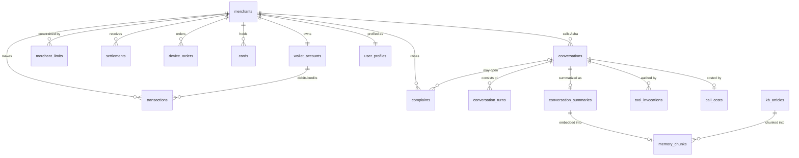

# Data Models

This document owns the persistent shape of the system: the full Postgres 16 DDL for the seeded VyaparPay business tables and the agent-side conversation/audit tables, the pgvector index choice, the JSONB usage policy (and why it killed MongoDB), the complete Redis keyspace, the seed fixtures that make the canonical Rajesh call reproducible byte-for-byte, retention per store, and the Alembic migration policy. Two schemas are reproduced rather than defined here — `user_profiles` and `memory_chunks` belong to [docs/09](09-memory-architecture.md) per canon §11 — everything else is authoritative in this file.

**Read this with:** [docs/09](09-memory-architecture.md) for the memory layers these tables serve, [docs/08](08-context-and-events.md) for the Redis context keys the turn path reads, [docs/10](10-tool-calling.md) for the tool contracts that `tool_invocations` audits, and [docs/16](16-tech-stack.md) for the cost model that `call_costs` records.

---

## 1. One picture

Sixteen tables in one Postgres 16 instance (pgvector extension loaded), split into three zones: the seeded **business zone** (the fake bank), the **agent zone** (real engineering), and the **vector zone** (semantic memory). Redis holds nothing durable — its keyspace is §7.



Who writes where — the [docs/02](02-system-architecture.md) placement rule, restated as a table because every schema below assumes it:

| Zone | Tables | Writer | When |
|---|---|---|---|
| Business (seeded) | `merchants`, `merchant_limits`, `wallet_accounts`, `transactions`, `settlements`, `device_orders`, `complaints`, `cards` | agent-api business endpoints; seed script | Seed time + when a tool mutates state |
| Agent | `conversations`, `conversation_turns`, `conversation_summaries`, `call_costs`, `user_profiles` | agent-api | Session creation (`conversations`) and post-call pipeline ([docs/09 §8](09-memory-architecture.md)) |
| Agent (audit) | `tool_invocations` | agent-api, **synchronously inside the tool call** | The one during-call Postgres write — see §4.4 |
| Vector | `kb_articles`, `memory_chunks` | Seed script (KB); post-call embed (summaries) | Deploy + post-call |

voice-worker never touches Postgres. It reads and writes Redis; every durable row is agent-api's, which keeps the turn path free of durable-write latency and gives right-to-delete a single service to reason about.

---

## 2. Conventions

| Convention | Rule | Why |
|---|---|---|
| Money | `BIGINT` paise, suffix `_paise`. ₹245 = `24500` | Integer arithmetic, no float drift, no NUMERIC scale bugs across app/JSON boundaries. Rejected: `NUMERIC(12,2)` rupees — correct but every serialization boundary becomes a rounding decision |
| IDs | `TEXT` with typed prefixes: `usr_`, `wal_`, `txn_`, `setl_`, `ord_`, `cmp_`, `card_`; sessions are LiveKit-derived short ids (`a1f3c9`) | Greppable in logs; a `txn_` id pasted into the wrong query fails loudly instead of joining silently. Rejected: `UUID` everywhere — opaque in traces, and the demo gains nothing from unguessability |
| Time | `TIMESTAMPTZ`, stored UTC, rendered IST at the edge | The incident is "2:14 PM" in Jaipur and `08:44Z` in the database; only one of those belongs in storage |
| Naming seam | Business tables say `merchant_id`; agent tables say `user_id`. Same value (`usr_rajesh01`) | The agent stack is product-agnostic ([docs/09](09-memory-architecture.md) already froze `user_id`); the business schema speaks its own domain language. The seam is documented rather than papered over with a rename |
| Enums | `TEXT` + `CHECK`, not Postgres `ENUM` types | Adding a state is an in-place `CHECK` swap in one migration; `ALTER TYPE ... ADD VALUE` has transactional sharp edges and can't be removed |

---

## 3. Business zone DDL

The seeded fake bank. Every column here exists because a tool in the [docs/10](10-tool-calling.md) catalog reads or writes it — no speculative fields.

### 3.1 merchants and wallet_accounts

```sql
CREATE TABLE merchants (
    merchant_id        TEXT PRIMARY KEY,              -- 'usr_rajesh01'
    business_name      TEXT NOT NULL,                 -- 'Kumar General Store'
    city               TEXT NOT NULL,
    account_type       TEXT NOT NULL CHECK (account_type IN ('Merchant Basic', 'Merchant Pro')),
    preferred_language TEXT NOT NULL DEFAULT 'English',
    merchant_since     DATE NOT NULL,
    kyc_status         TEXT NOT NULL DEFAULT 'verified'
                       CHECK (kyc_status IN ('pending', 'verified', 'on_hold')),
    created_at         TIMESTAMPTZ NOT NULL DEFAULT now()
);

CREATE TABLE wallet_accounts (
    wallet_id     TEXT PRIMARY KEY,                   -- 'wal_rajesh01'
    merchant_id   TEXT NOT NULL UNIQUE REFERENCES merchants(merchant_id),
    balance_paise BIGINT NOT NULL DEFAULT 0 CHECK (balance_paise >= 0),
    currency      CHAR(3) NOT NULL DEFAULT 'INR' CHECK (currency = 'INR'),
    updated_at    TIMESTAMPTZ NOT NULL DEFAULT now()
);
```

`UNIQUE` on `wallet_accounts.merchant_id` encodes the product fact (one wallet per merchant) that Meena's multi-store roadmap ([docs/01 §6](01-product-and-use-case.md)) would relax — dropping a constraint is a migration; retrofitting one onto dirty data is a project. The `currency = 'INR'` check looks silly until someone seeds a USD fixture in a test and a paise column silently means cents.

### 3.2 merchant_limits — the table the demo pivots on

```sql
CREATE TABLE merchant_limits (
    merchant_id     TEXT NOT NULL REFERENCES merchants(merchant_id),
    limit_type      TEXT NOT NULL CHECK (limit_type IN ('daily_txn', 'per_txn')),
    limit_paise     BIGINT NOT NULL CHECK (limit_paise > 0),
    used_paise      BIGINT NOT NULL DEFAULT 0 CHECK (used_paise >= 0),
    window_date     DATE   NOT NULL,                  -- day the used_paise counter refers to
    -- active limit-increase request, 0..1 per limit row (demo simplification):
    request_id      TEXT UNIQUE,                      -- 'LMT-2026-0724-0913'
    requested_paise BIGINT CHECK (requested_paise > limit_paise),
    request_status  TEXT CHECK (request_status IN ('submitted', 'approved', 'rejected')),
    requested_at    TIMESTAMPTZ,
    updated_at      TIMESTAMPTZ NOT NULL DEFAULT now(),
    PRIMARY KEY (merchant_id, limit_type),
    CHECK ((request_id IS NULL) = (request_status IS NULL))
);
```

The decline logic is one comparison in the seeded `POST /payments` handler: `used_paise + amount_paise > limit_paise → 402 DAILY_LIMIT_EXCEEDED`. Rajesh's row (`limit_paise = 2500000`, `used_paise = 2489000`) makes any payment over ₹110 fail — which is exactly what Asha says in turn 3 of the canonical transcript.

Folding the limit-increase request into this table instead of a separate `limit_change_requests` table is a deliberate demo trade: `request_limit_increase` becomes one `UPDATE`, and the seeded 4-business-hour auto-approve job is one `UPDATE ... WHERE request_status = 'submitted' AND requested_at < now() - interval '4 hours'`. Production evolution is the append-only request table — an audit trail of who asked for what, when, decided by whom — and the `CHECK` pair here is the migration seam.

### 3.3 transactions

```sql
CREATE TABLE transactions (
    txn_id       TEXT PRIMARY KEY,                    -- 'txn_0724_1414a'
    merchant_id  TEXT NOT NULL REFERENCES merchants(merchant_id),
    wallet_id    TEXT NOT NULL REFERENCES wallet_accounts(wallet_id),
    type         TEXT NOT NULL CHECK (type IN
                 ('vendor_payment', 'qr_collection', 'settlement_credit', 'refund')),
    amount_paise BIGINT NOT NULL CHECK (amount_paise > 0),
    counterparty TEXT NOT NULL,                       -- 'Amazon Business'
    status       TEXT NOT NULL CHECK (status IN ('succeeded', 'declined', 'pending', 'refunded')),
    decline_code TEXT,                                -- 'DAILY_LIMIT_EXCEEDED'
    http_status  SMALLINT,                            -- 402, as the app saw it
    created_at   TIMESTAMPTZ NOT NULL DEFAULT now(),
    CHECK ((status = 'declined') = (decline_code IS NOT NULL))
);

CREATE INDEX idx_txn_merchant_time ON transactions (merchant_id, created_at DESC);
```

`get_transactions` and `get_payment_status` read this table; the composite index serves the only query shape they issue ("this merchant, most recent first, LIMIT n"). The `CHECK` tying `status` to `decline_code` exists because the decline taxonomy *is* the domain ([docs/01 §3.1](01-product-and-use-case.md)) — a declined row with no reason is seed-data rot, and the constraint makes it unrepresentable. `http_status` is denormalized from the API layer on purpose: the ScreenContext IR carries `status: 402`, and letting the agent's tool result and the screen's claim be joined on one row is worth a redundant smallint.

### 3.4 settlements, device_orders, complaints, cards

```sql
CREATE TABLE settlements (
    settlement_id TEXT PRIMARY KEY,                   -- 'setl_0723_r1'
    merchant_id   TEXT NOT NULL REFERENCES merchants(merchant_id),
    batch_date    DATE NOT NULL,
    gross_paise   BIGINT NOT NULL CHECK (gross_paise >= 0),
    fees_paise    BIGINT NOT NULL CHECK (fees_paise >= 0),
    net_paise     BIGINT NOT NULL,
    status        TEXT NOT NULL CHECK (status IN ('processing', 'settled', 'failed', 'partial')),
    expected_by   TIMESTAMPTZ,                        -- the T+1 promise get_settlements voices
    utr           TEXT,                               -- bank reference, NULL until settled
    created_at    TIMESTAMPTZ NOT NULL DEFAULT now(),
    CHECK (net_paise = gross_paise - fees_paise),
    UNIQUE (merchant_id, batch_date)
);

CREATE TABLE device_orders (
    order_id    TEXT PRIMARY KEY,                     -- 'ord_sb_0712'
    merchant_id TEXT NOT NULL REFERENCES merchants(merchant_id),
    device_type TEXT NOT NULL CHECK (device_type IN ('soundbox', 'qr_kit')),
    status      TEXT NOT NULL CHECK (status IN
                ('placed', 'packed', 'in_transit', 'delivered', 'returned')),
    courier     TEXT,
    tracking_id TEXT,
    eta_date    DATE,
    ordered_at  TIMESTAMPTZ NOT NULL DEFAULT now()
);

CREATE TABLE complaints (
    complaint_id TEXT PRIMARY KEY,                    -- 'cmp_0724_01'
    merchant_id  TEXT NOT NULL REFERENCES merchants(merchant_id),
    category     TEXT NOT NULL CHECK (category IN
                 ('payment', 'settlement', 'refund', 'device', 'other')),
    subject      TEXT NOT NULL,
    detail       TEXT,
    status       TEXT NOT NULL DEFAULT 'open'
                 CHECK (status IN ('open', 'in_progress', 'resolved', 'closed')),
    opened_via   TEXT NOT NULL CHECK (opened_via IN ('app', 'agent')),
    session_id   TEXT,                                -- FK added in §4.1; NULL unless agent-opened
    sla_due_at   TIMESTAMPTZ,
    created_at   TIMESTAMPTZ NOT NULL DEFAULT now(),
    resolved_at  TIMESTAMPTZ,
    CHECK ((opened_via = 'agent') = (session_id IS NOT NULL))
);

CREATE TABLE cards (
    card_id            TEXT PRIMARY KEY,              -- 'card_rajesh01'
    merchant_id        TEXT NOT NULL REFERENCES merchants(merchant_id),
    last4              CHAR(4) NOT NULL,
    network            TEXT NOT NULL CHECK (network IN ('rupay', 'visa', 'mastercard')),
    status             TEXT NOT NULL DEFAULT 'active'
                       CHECK (status IN ('active', 'blocked', 'expired')),
    blocked_at         TIMESTAMPTZ,
    blocked_by_session TEXT                           -- provenance when block_card did it
);
```

Two rows worth defending: `cards` has **no PAN column** — not encrypted, not masked, absent. The canon §12 PII rule is easiest to enforce for data that was never stored; `last4` is all `block_card` and `reset_pin` ever need to voice ("the card ending 4417"). And `complaints.opened_via` with its `CHECK` gives `raise_complaint` provenance for free: every agent-opened complaint is joined to the exact conversation, which is the row a support-ops reviewer asks for first.

---

## 4. Agent zone DDL

### 4.1 conversations — the session anchor

```sql
CREATE TABLE conversations (
    session_id   TEXT PRIMARY KEY,                    -- 'a1f3c9', minted at POST /v1/sessions
    user_id      TEXT NOT NULL REFERENCES merchants(merchant_id),
    state        TEXT NOT NULL DEFAULT 'created'
                 CHECK (state IN ('created', 'in_call', 'wrap_up', 'ended')),
    livekit_room TEXT NOT NULL,
    started_at   TIMESTAMPTZ NOT NULL DEFAULT now(),
    ended_at     TIMESTAMPTZ
);

ALTER TABLE complaints ADD CONSTRAINT fk_complaint_session
    FOREIGN KEY (session_id) REFERENCES conversations(session_id);
```

Written by agent-api at session creation — the only agent-zone row that exists *before* the call ends. It is the FK anchor everything post-call hangs off; its `state` mirrors the Redis `session:{id}` hash's state machine ([docs/09 §3](09-memory-architecture.md)) and is updated once, at hang-up. During the call, Redis is the truth; this row is the durable stub.

### 4.2 conversation_turns — per-turn metrics, not transcript

```sql
CREATE TABLE conversation_turns (
    session_id    TEXT NOT NULL REFERENCES conversations(session_id),
    turn_no       INT  NOT NULL CHECK (turn_no > 0),
    role          TEXT NOT NULL CHECK (role IN ('user', 'agent')),
    latency_ms    INT,                    -- agent turns: endpoint → first audio; NULL for user
    input_tokens  INT,
    output_tokens INT,
    tool_calls    TEXT[] NOT NULL DEFAULT '{}',       -- names only; full audit in tool_invocations
    cost_usd      NUMERIC(10, 6),
    trace_id      TEXT,                               -- the turn's OTel trace, for Tempo lookup
    text          TEXT,                               -- ALWAYS NULL in demo — see below
    started_at    TIMESTAMPTZ NOT NULL,
    PRIMARY KEY (session_id, turn_no)
);
```

This table is honest about what it is not: **the demo never populates `text`.** Transcript non-persistence is a docs/09-exported decision — what survives a call is summary, resolution, profile delta, cost. The column exists because the production evolution (90-day encrypted transcript retention, explicit opt-in) needs a home, and adding a nullable column now costs nothing while adding it later under audit pressure costs a fire drill.

What the demo *does* populate is the metrics: `CostTracker` in voice-worker appends one compact JSON record per turn to the Redis list `session:{id}:turns` (§7), and the post-call pipeline's cost-finalization stage drains it into these rows alongside the `call_costs` write — same accounting, same stage, one pipeline extension. The turn-accounting table in [docs/01 §8](01-product-and-use-case.md) is literally:

```sql
SELECT turn_no, latency_ms, input_tokens, output_tokens, tool_calls, cost_usd
FROM conversation_turns WHERE session_id = 'a1f3c9' AND role = 'agent' ORDER BY turn_no;
```

`trace_id` is the join between this table and Tempo — a slow turn in SQL becomes a flame graph in one paste.

### 4.3 conversation_summaries

Schema owned by [docs/09 §8](09-memory-architecture.md); reproduced with the FK this doc adds:

```sql
CREATE TABLE conversation_summaries (
    session_id  TEXT PRIMARY KEY REFERENCES conversations(session_id),
    user_id     TEXT NOT NULL,
    summary     TEXT NOT NULL,                        -- final fold, ≤250 tokens
    resolution  TEXT NOT NULL CHECK (resolution IN
                ('resolved', 'escalated', 'pending', 'abandoned')),
    intents     TEXT[] NOT NULL,
    tools_used  TEXT[] NOT NULL,
    turn_count  INT NOT NULL,
    duration_s  INT NOT NULL,
    cost_usd    NUMERIC(8, 4) NOT NULL,
    created_at  TIMESTAMPTZ NOT NULL DEFAULT now()
);
CREATE INDEX idx_summaries_user ON conversation_summaries (user_id, created_at DESC);
```

`turn_count`, `duration_s`, `cost_usd` duplicate what `conversation_turns` and `call_costs` can derive. Deliberate: a summary row renders into the RAG slot self-contained, without a three-way join on the retrieval path. The duplication is written once, post-call, by one writer — the cheap kind.

Note the summary has **no `embedding` column.** The vector lives in `memory_chunks` (§5), written by the same pipeline stage. Keeping vectors out of the source-of-record tables means re-embedding (model swap, dimension change) is a rebuild of one derived table, not an `ALTER` on every table that owns text.

### 4.4 tool_invocations — the audit table

```sql
CREATE TABLE tool_invocations (
    invocation_id   UUID PRIMARY KEY DEFAULT gen_random_uuid(),
    session_id      TEXT NOT NULL REFERENCES conversations(session_id),
    turn_no         INT,
    tool_name       TEXT NOT NULL,                    -- allowlist enforced in code, not CHECK
    input           JSONB NOT NULL,
    output          JSONB,                            -- NULL on error/denied
    screen_ctx      JSONB,                            -- IR the turn saw; mutating tools only
    status          TEXT NOT NULL CHECK (status IN
                    ('ok', 'error', 'denied', 'pending_confirm', 'cancelled')),
    error_code      TEXT,
    latency_ms      INT NOT NULL,
    idempotency_key TEXT UNIQUE,                      -- NULL for read tools
    created_at      TIMESTAMPTZ NOT NULL DEFAULT now()
);
CREATE INDEX idx_tool_session ON tool_invocations (session_id, created_at);
```

The canonical row, written when turn 7 executed:

```json
{
  "session_id": "a1f3c9", "turn_no": 7,
  "tool_name": "request_limit_increase",
  "input":  {"current_limit": 25000, "requested_limit": 50000},
  "output": {"request_id": "LMT-2026-0724-0913", "status": "submitted", "eta_hours": 4},
  "status": "ok", "latency_ms": 38,
  "idempotency_key": "a1f3c9:request_limit_increase:7"
}
```

Design points that earn their keep:

- **Written synchronously by agent-api while serving the tool call** — the one exception to "durable writes are post-call." An audit row for `block_card` that depends on a pipeline that might retry tomorrow is not an audit row. The write is a single local insert (~1 ms) on the tool path, not the turn's 40 ms context path.
- **`tool_name` is `TEXT`, not a `CHECK` over the 16-name catalog.** The allowlist is enforced in `ToolExecutor` where it can return a typed refusal; a `CHECK` would turn "agent tried a non-existent tool" — a signal worth recording — into an insert failure that erases its own evidence. `status = 'denied'` rows are the [docs/14](14-security.md) reviewers' favorite query.
- **`idempotency_key` is deterministic** (`{session}:{tool}:{turn}`) and `UNIQUE`. The Redis `idempotency:{key}` entry (§7) is the fast-path dedupe; this constraint is the durable backstop after the 24 h TTL — a replayed mutation cannot produce a second row, therefore cannot produce a second limit request.
- **`screen_ctx` archives the ScreenContext IR the agent acted on** — for mutating tools only (~300 tokens of JSONB, [docs/07](07-ui-semantic-context.md) shape). When someone asks "why did the agent submit this?", the answer is the screen it saw, frozen at decision time.

### 4.5 call_costs

Columns mirror the [docs/16 §5](16-tech-stack.md) per-call cost table one-for-one, plus the usage drivers that produced them:

```sql
CREATE TABLE call_costs (
    session_id          TEXT PRIMARY KEY REFERENCES conversations(session_id),
    stt_usd             NUMERIC(10, 6) NOT NULL,      -- Deepgram Nova-3
    llm_dialogue_usd    NUMERIC(10, 6) NOT NULL,      -- Claude Sonnet 5 via OpenRouter
    llm_utility_usd     NUMERIC(10, 6) NOT NULL,      -- Claude Haiku 4.5
    embeddings_usd      NUMERIC(10, 6) NOT NULL,      -- text-embedding-3-small
    tts_usd             NUMERIC(10, 6) NOT NULL,      -- ElevenLabs Flash v2.5
    livekit_usd         NUMERIC(10, 6) NOT NULL DEFAULT 0,   -- self-hosted ≈ $0 marginal
    total_usd           NUMERIC(10, 6) NOT NULL,
    -- usage drivers, so the row is auditable against provider invoices:
    stt_seconds         INT NOT NULL,
    input_tokens        INT NOT NULL,
    cached_input_tokens INT NOT NULL,
    output_tokens       INT NOT NULL,
    tts_chars           INT NOT NULL,
    created_at          TIMESTAMPTZ NOT NULL DEFAULT now(),
    CHECK (total_usd = stt_usd + llm_dialogue_usd + llm_utility_usd
                     + embeddings_usd + tts_usd + livekit_usd)
);
```

`NUMERIC(10,6)` because the embeddings line is <$0.001/call and would vanish at the `NUMERIC(8,4)` precision `conversation_summaries.cost_usd` uses — that field is the rounded display copy; this table is the ledger. The `CHECK` on the total means the Grafana cost panel and the per-component drill-down cannot disagree. Unit prices themselves live in config (canon §5), not in this table — a price change must not rewrite history.

---

## 5. Vector zone: kb_articles and memory_chunks

`kb_articles` is the source of record for support knowledge; `memory_chunks` ([docs/09 §6.1](09-memory-architecture.md), reproduced) is the derived embedding store for both KB chunks and call summaries:

```sql
CREATE TABLE kb_articles (
    slug       TEXT PRIMARY KEY,                      -- 'kb_daily_limits'
    title      TEXT NOT NULL,
    body_md    TEXT NOT NULL,
    category   TEXT NOT NULL CHECK (category IN
               ('limits', 'settlements', 'refunds', 'devices', 'kyc')),
    version    INT NOT NULL DEFAULT 1,
    updated_at TIMESTAMPTZ NOT NULL DEFAULT now()
);

CREATE TABLE memory_chunks (
    id         BIGSERIAL PRIMARY KEY,
    kind       TEXT NOT NULL CHECK (kind IN ('kb_article', 'call_summary')),
    user_id    TEXT,                  -- NULL for KB; REQUIRED for call_summary (scoping)
    source_id  TEXT NOT NULL,         -- kb_articles.slug or conversations.session_id
    content    TEXT NOT NULL,
    embedding  vector(1536) NOT NULL, -- text-embedding-3-small
    created_at TIMESTAMPTZ NOT NULL DEFAULT now()
);
CREATE INDEX idx_chunks_embedding ON memory_chunks USING hnsw (embedding vector_cosine_ops);
```

**HNSW over ivfflat, in one line:** ivfflat must be trained on a representative sample and its list count re-tuned as the corpus grows — wrong assumptions for a table that starts at ~180 chunks and grows one summary per call — while HNSW builds incrementally, needs no training step, and holds better recall at small and streaming corpus sizes; its costs (slower writes, more memory) are irrelevant at one insert per call.

Articles have no embedding column by design: a ~40-article KB chunks into ~180 heading-aware ~300-token pieces, and retrieval quality lives at chunk granularity — a single article-level vector averages away exactly the section the query wanted. Re-chunking or re-embedding is `DELETE WHERE kind = 'kb_article'` + re-run the seed embedder; `kb_articles` itself never changes.

Honesty note, repeated from docs/09 because it belongs in the schema doc too: at ~200 rows the HNSW index is decoration — a sequential scan is sub-millisecond. The schema is production-shaped; the ADR flip condition ("pgvector until ~10M vectors") is when this table leaves Postgres.

---

## 6. JSONB policy — and why there is no MongoDB

JSONB appears in exactly four places, each passing the same three-part test: the shape varies by a discriminator, rows are read whole (never filtered by inner fields on a hot path), and a Pydantic schema validates every write at the boundary.

| Column | Discriminator | Validated by |
|---|---|---|
| `tool_invocations.input` / `.output` | `tool_name` — 16 tools, 16 Pydantic models ([docs/10](10-tool-calling.md)) | Tool contract models |
| `tool_invocations.screen_ctx` | `v` — `screen_context/v1` | IR schema ([docs/07](07-ui-semantic-context.md)) |
| `user_profiles.facts` / `.preferences` / `.open_issues` | Closed extraction schema | [docs/09 §5.2](09-memory-architecture.md) |

The negative rules matter more than the positive ones: **no money in JSONB** (amounts get `BIGINT` columns and `CHECK`s, always), **no FKs into JSONB** (if something needs joining, it gets promoted to a column — `tool_invocations.tool_name` and `status` were inner JSON fields in an early sketch and were promoted the first time a query needed them), and **no GIN index until a query exists that needs one** (currently none do; every JSONB read is by-row).

This policy is why MongoDB lost (canon ADR: "Postgres JSONB covers it"). The relational 90% of this system — money, limits, FK-linked audit trails, `CHECK`-enforced state machines — is non-negotiable in a payments domain; the document-shaped 10% is four columns. Running a second database for four columns buys a second backup story, a second connection pool, a second failure mode, and the loss of the one thing fintech data needs most: a transaction that covers the business row and its audit row together. `tool_invocations` inserting in the same transaction as the `merchant_limits` update is the whole argument in one sentence. Flip condition: a genuinely document-shaped, high-write-rate workload with no relational joins — nothing on the [docs/17](17-roadmap.md) roadmap qualifies.

---

## 7. Redis keyspace — complete

Every key the system creates, canon §11 prefixes. Nothing here is durable; §9 has the TTL rationale.

| Key pattern | Type | Contents | TTL | Writer → Reader |
|---|---|---|---|---|
| `session:{id}` | hash | Transcript window (8 turns), rolling summary, tool digests, `pending_confirm`, running cost — full shape in [docs/09 §3](09-memory-architecture.md) | 24 h | agent-api creates; voice-worker per turn → `ContextBuilder`, post-call pipeline |
| `session:{id}:turns` | list | One compact JSON metric record per turn (turn_no, role, latency_ms, tokens, cost) | 24 h | `CostTracker` (voice-worker) → post-call pipeline, drained into `conversation_turns` (§4.2) |
| `ctx:{session_id}` | string (JSON) | Latest merged ScreenContext IR + ingest metadata (`seq`, staleness) | 60 min | agent-api at session creation, then `SnapshotIngestor` (voice-worker) → `ContextBuilder` |
| `ctx:{session_id}:events` | list | Event timeline, `LTRIM` 200 ([docs/08 §4.1](08-context-and-events.md)) | 60 min | `SnapshotIngestor`/`EventLog` → `ContextBuilder` |
| `rate:{user_id}` | string counter | `INCR` + `EXPIRE` sliding window on `POST /v1/sessions` (5/min) | 60 s | agent-api middleware → itself |
| `idempotency:{key}` | string | `invocation_id` + terminal status of a mutating tool call | 24 h | agent-api tool endpoint → itself on replay; `tool_invocations.idempotency_key UNIQUE` is the post-TTL backstop |

The TTL split is intentional and asymmetric: screen state (60 min) is worthless within the hour; conversation state (24 h) is the post-call pipeline's retry window and the same-day debugging window; the rate window (60 s) is the limit itself. No key is ever `PERSIST`ed — if a fact matters past its TTL, it has a Postgres row, or it doesn't matter.

---

## 8. Seed data: making the demo deterministic

`scripts/seed.py` (idempotent, `--reset` truncates and re-inserts) writes fixtures such that the canonical call transcript in [docs/01 §8](01-product-and-use-case.md) is reproducible to the rupee. The two rows that carry the demo:

```sql
-- The wall Rajesh hits: ₹110 of headroom left on a ₹25,000 daily limit
INSERT INTO merchant_limits (merchant_id, limit_type, limit_paise, used_paise, window_date)
VALUES ('usr_rajesh01', 'daily_txn', 2500000, 2489000, '2026-07-24');

-- The declined payment Asha names in her opening line
INSERT INTO transactions (txn_id, merchant_id, wallet_id, type, amount_paise,
                          counterparty, status, decline_code, http_status, created_at)
VALUES ('txn_0724_1414a', 'usr_rajesh01', 'wal_rajesh01', 'vendor_payment', 24500,
        'Amazon Business', 'declined', 'DAILY_LIMIT_EXCEEDED', 402,
        '2026-07-24 14:14:00+05:30');
```

The rest of the fixture set, chosen so every read tool returns something worth voicing:

| Table | Seeded rows | The number that must be exact |
|---|---|---|
| `merchants` | `usr_rajesh01` — Kumar General Store, Jaipur, Merchant Pro, English, since 2022 | Canon §2 identity, verbatim |
| `wallet_accounts` | `wal_rajesh01` | `balance_paise = 1845000` — the ₹18,450 Asha quotes in turn 3 |
| `transactions` | 3 succeeded payouts today: ₹9,500 + ₹8,200 + ₹7,190, plus ~30 QR collections | Payouts sum to **₹24,890** = `used_paise` — CI asserts `SUM(vendor payouts today) = merchant_limits.used_paise`, so the two tellings of the story cannot drift |
| `settlements` | `setl_0723_r1` — yesterday's batch, `processing`, gross ₹41,230 − fees ₹97 = net ₹41,133, expected by 6 PM | Feeds the `SettlementsScreen` opening-line variant in docs/01 §7 |
| `device_orders` | One soundbox order, `in_transit` | Feeds the `OrdersScreen` variant |
| `cards` | `card_rajesh01`, last4 `4417`, rupay, `active` | Gives `block_card` a target |
| `complaints` | Empty for Rajesh | `raise_complaint` demonstrably creates, not updates |
| `kb_articles` | ~40 articles across the 5 categories; among them `kb_daily_limits`, `kb_limit_increase_sla`, `kb_decline_codes` | Those three are what the prefetch retrieves for `DAILY_LIMIT_EXCEEDED` — the RAG slot in turn 5 |
| `memory_chunks` | ~180 KB chunks, embedded at seed time | Corpus scale from docs/09 §6.1 |
| `user_profiles` | Rajesh's facts/preferences, `open_issues: []` | Empty issues → the canonical call *creates* `iss_071` |

**Demo-vs-production honesty:** the seed *is* the bank. `used_paise` is a column the seed sets and the fake rail increments; production derives it from the actual debit rail and reconciles nightly. The 4-business-hour limit-approval SLA is a seeded background job flipping `request_status`; production is a bank webhook. Timestamps are frozen to 2026-07-24 so the demo's "today" is stable — the reset script re-dates rows relative to `now()` when you run the demo live, which is the only part of the seed that is not a pure `INSERT`.

---

## 9. Retention per store

Extends the [docs/09 §10](09-memory-architecture.md) table to the full schema; [docs/14](14-security.md) owns the deletion legal bases.

| Store / table | Demo | Production evolution |
|---|---|---|
| Business zone (all 8 tables) | Reset script; no retention concept | The rail is the system of record; these become projections with RBI-aligned multi-year retention |
| `conversations`, `conversation_turns` | Indefinite — metadata only, `text` never populated | 24 months metadata; `text` (if the opt-in lands) 90-day encrypted |
| `conversation_summaries`, `memory_chunks` (`call_summary`) | Indefinite | 24-month retention config; delete cascades summary → chunk |
| `user_profiles` | Life of the account | Same |
| `tool_invocations` | Indefinite | 7 years — audit-basis retention, **exempt from right-to-delete**; PII is redacted at write time (canon §12), which is what makes the exemption defensible |
| `call_costs` | Indefinite | 24 months, then aggregated |
| Redis (all keys) | TTLs per §7 — 24 h / 60 min / 60 s | Same; TTLs are the retention policy |
| Tempo traces | Compose-local, 72 h | Sampling + 30-day retention |

Right-to-delete grows from docs/09's three-table transaction to a cascade over `conversations` → `conversation_turns`/`conversation_summaries`/`call_costs`/`memory_chunks`, still one function in agent-api, with `tool_invocations` retained under audit basis. Every deletable row is reachable from `user_id`/`merchant_id` by construction — that property is checked by a CI query, not a promise.

---

## 10. Migration policy (Alembic)

One Alembic environment in agent-api (`migrations/`), one head, no branches. Migration `0001` is `CREATE EXTENSION IF NOT EXISTS vector` plus the full schema above; seeds are **not** migrations — `scripts/seed.py` is re-runnable data, migrations are one-way schema history, and mixing them is how demo fixtures end up in production DDL. Autogenerate is a draft, never a commit: it reliably misses `CHECK` constraints, partial uniques, and the HNSW index, so every migration is hand-reviewed against the models in `app/models/`. One migration per PR, paired upgrade/downgrade through Phase 5; Phase 6 flips to forward-only (downgrades of destructive changes are fiction, and pretending otherwise is worse than admitting it). Production evolution notes: `CREATE INDEX CONCURRENTLY` for any index on a live table (the demo's tables are small enough not to care), and expand-migrate-contract for column renames so old and new code coexist during deploy.

---

## Decisions this document exports

| Fixed here | Value | Heaviest consumer |
|---|---|---|
| Money representation | `BIGINT` paise everywhere; no NUMERIC rupees, no money in JSONB | [docs/10](10-tool-calling.md), seed fixtures |
| Full business + agent DDL | §3–§4; `CHECK`-enforced state machines, decline taxonomy | [docs/13](13-api-contracts.md), [docs/10](10-tool-calling.md) |
| `tool_invocations` audit contract | Synchronous write, deterministic idempotency key, `screen_ctx` archive, `denied` rows recorded | [docs/14](14-security.md), [docs/10](10-tool-calling.md) |
| `call_costs` shape | Component columns mirror docs/16 cost table; sum `CHECK`; prices in config, not rows | [docs/16](16-tech-stack.md), Grafana panels |
| Transcript column stance | `conversation_turns.text` exists, demo-NULL — schema ready, data absent | [docs/09](09-memory-architecture.md), [docs/14](14-security.md) |
| Vector index | HNSW, cosine, on `memory_chunks` only; source tables carry no embeddings | [docs/09](09-memory-architecture.md) |
| JSONB policy | Four columns, three-part test, three negative rules; MongoDB flip condition | [docs/16](16-tech-stack.md) ADRs |
| Redis keyspace | §7 table incl. `session:{id}:turns` and `idempotency:{key}` | [docs/08](08-context-and-events.md), [docs/15](15-scalability-and-reliability.md) |
| Seed determinism | Payouts sum = `used_paise`, CI-asserted; ₹245/₹25,000/₹24,890/₹18,450 exact | Demo script, [docs/01](01-product-and-use-case.md) |
| Migration policy | Alembic single-head, hand-reviewed autogen, seeds ≠ migrations, forward-only from Phase 6 | [docs/15](15-scalability-and-reliability.md) |
