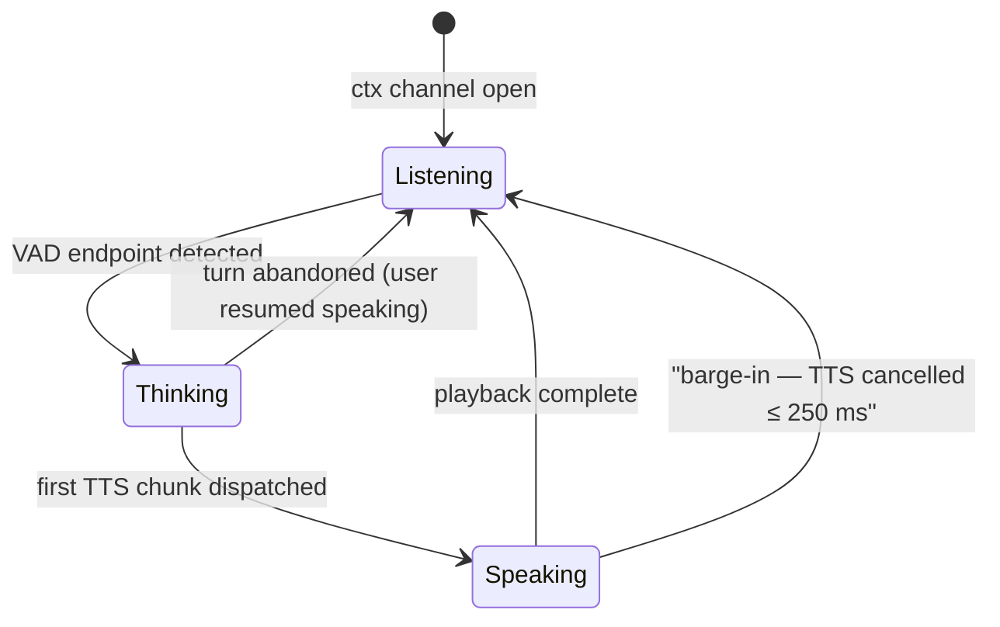
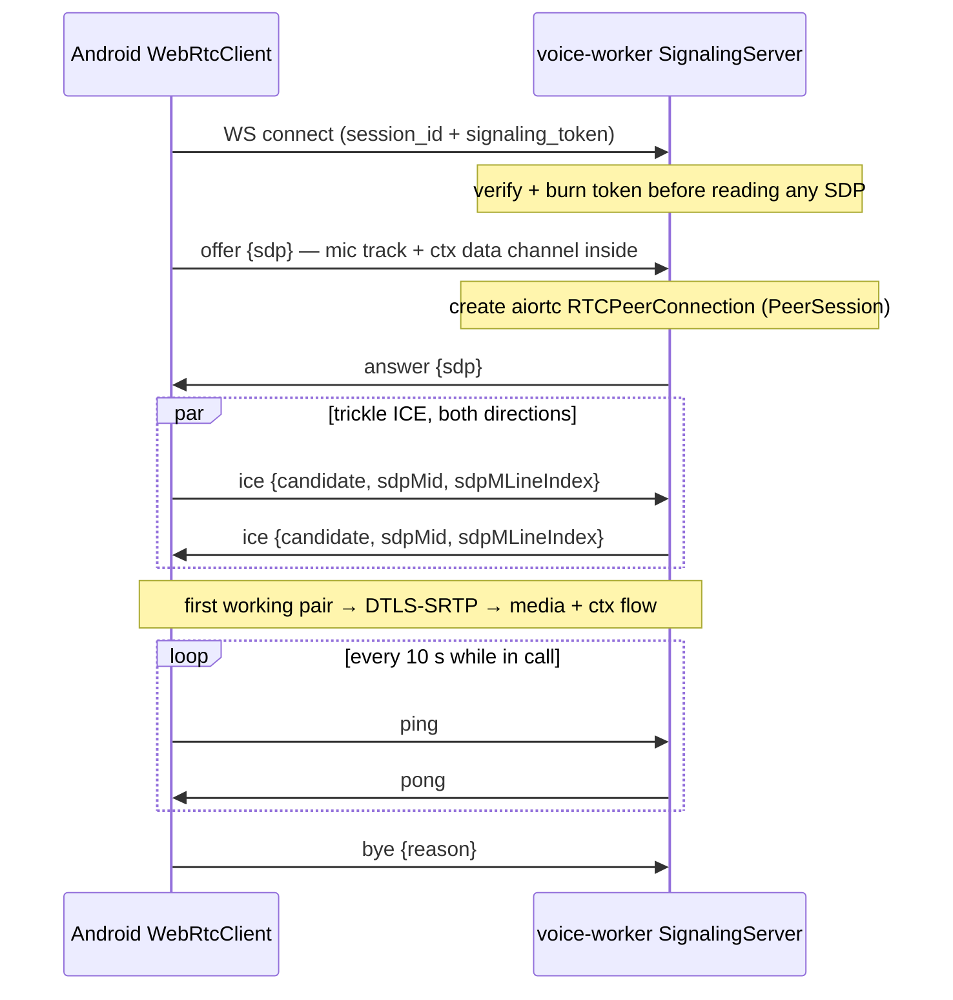

# API Contracts

This document is the reference for every contract a client can hit: the REST envelope and error taxonomy, the session lifecycle endpoints, the seeded business APIs that both the Android app and the tool layer consume, the WebSocket signaling protocol (SDP offer/answer, trickle ICE), the data-channel message types (context up, transcript and agent state down), the TURN credential contract, and the internal voice-worker ↔ agent-api seam. Wire-format authority is shared with [docs/07](07-ui-semantic-context.md) per the canon: the ScreenContext IR and delta semantics are defined there; this document defines everything that wraps and transports them. Where a payload appears in both, the [protocol/](../protocol/) schema is the tiebreaker.

**Read this with:** [docs/02](02-system-architecture.md) for the two-channel topology these contracts ride on, [docs/08](08-context-and-events.md) for what the backend does with context messages, [docs/10](10-tool-calling.md) for the tool contracts that front the business APIs, and [docs/12](12-data-models.md) for the tables behind them.

---

## 1. Conventions

Base path is **`/v1`** on agent-api. JSON only, UTF-8, `Content-Type: application/json`. Every REST response — success or failure, every endpoint — uses one envelope:

```json
{
  "success": true,
  "data": { },
  "error": null,
  "meta": null
}
```

| Field | Type | Rules |
|---|---|---|
| `success` | bool | `true` iff HTTP 2xx. Redundant with the status code on purpose — mobile HTTP stacks and interceptors mangle status codes often enough that the body carries its own verdict |
| `data` | object \| null | Payload on success; `null` on error |
| `error` | object \| null | `{"code", "message", "details"?}` on failure; `null` on success. `code` is a stable machine string; `message` is human-readable and safe to show in a snackbar; `details` is optional structured context |
| `meta` | object \| null | Pagination for list endpoints: `{"total", "limit"}`. `null` everywhere else — an empty object would invite junk drawers |

Three conventions that prevent recurring cross-doc confusion:

- **Money is integer paise on REST**, matching every `*_paise` column in [docs/12](12-data-models.md). The tool boundary speaks integer rupees ([docs/10 §3](10-tool-calling.md)); the conversion happens once, inside each tool handler. Two layers, two units, one conversion point — a float rupee amount never exists anywhere in the system.
- **Path spelling.** The canonical IR and event timeline record the failed call as `POST /payments` ([docs/08 §2.4](08-context-and-events.md)) while this document says `POST /v1/payments`. Both are correct: the Android `core:network` interceptor logs paths relative to the Retrofit base URL, which already carries `/v1`. The prompt sees the short form; the server logs the full form.
- **Error codes are one vocabulary.** The `error.code` strings below are the same strings that appear in tool error results ([docs/10 §5](10-tool-calling.md)) and in `api_error` timeline events. `DAILY_LIMIT_EXCEEDED` is spelled identically in the HTTP body, the ScreenContext IR, the event log, and Asha's reasoning — which is precisely what lets the agent connect a screen dialog to an API failure without a mapping table.

### 1.1 Error code taxonomy

| HTTP | Code | Raised when | Retryable |
|---|---|---|---|
| 400 | `VALIDATION_SCHEMA` | Body fails jsonschema/Pydantic validation; `details.fields` lists offenders | After fixing |
| 400 | `VALIDATION_UNSUPPORTED_VERSION` | `screen_context` or event payload carries an unknown schema version | No |
| 401 | `AUTH_MISSING_TOKEN` / `AUTH_INVALID_TOKEN` / `AUTH_EXPIRED_TOKEN` | JWT absent, bad signature, or past `exp` | After re-auth |
| 402 | `DAILY_LIMIT_EXCEEDED` | Payment exceeds the daily transaction limit (the canonical incident, §3.2) | Tomorrow, or after a limit increase |
| 402 | `INSUFFICIENT_BALANCE` | Wallet balance below payment amount | After top-up |
| 404 | `SESSION_NOT_FOUND` / `RESOURCE_NOT_FOUND` | Unknown id, or id owned by another user (deliberately indistinguishable — existence is information) | No |
| 404 | `SESSION_SUMMARY_PENDING` | Summary requested before the post-call pipeline finishes; `Retry-After: 2` | Yes |
| 409 | `SESSION_ALREADY_ENDED` | Operation on a session in a terminal state | No |
| 409 | `LIMIT_REQUEST_ALREADY_PENDING` / `CARD_ALREADY_BLOCKED` / `STALE_LIMIT_VIEW` / `REFUND_WINDOW_CLOSED` | Business-state conflicts; `details` carries the existing state ([docs/10 §5](10-tool-calling.md)) | No |
| 429 | `RATE_LIMITED` | `rate:{user_id}` window exceeded — 5 session creates/min ([docs/12 §7](12-data-models.md)); `Retry-After` header set | After the window |
| 500 | `INTERNAL` | Unhandled server error. Message is generic by policy — stack traces go to structlog, never to clients ([docs/14](14-security.md)) | Maybe |
| 503 | `SESSION_CAPACITY` | No voice-worker capacity to take the call | With backoff |

Codes are grouped by prefix class (`AUTH_*`, `VALIDATION_*`, `SESSION_*`) so clients can switch on the class when they do not care about the member. New codes may be added within a class without a version bump (§9); a code's meaning is frozen forever once shipped.

### 1.2 Authentication: demo JWT

Every `/v1` request carries `Authorization: Bearer <JWT>` — HS256, secret from `JWT_SECRET` env (canon: secrets via env only). The seed script mints one long-lived token per seeded merchant and prints them at startup; there is no login flow, because a login flow would be the least interesting code in the repo. Decoded, Rajesh's token:

```json
{
  "sub": "usr_rajesh01",
  "name": "Rajesh Kumar",
  "iss": "vyaparpay-demo",
  "iat": 1784536452,
  "exp": 1784622852
}
```

The `sub` claim is the only principal in the system: it becomes the session user, which the `ToolExecutor` injects into every tool call ([docs/10 §1](10-tool-calling.md), invariant 3). No request body anywhere accepts a `user_id` that the server trusts — `POST /v1/sessions` carries one, but the server verifies it equals `sub` and rejects a mismatch rather than honoring it.

| | Demo | Production evolution |
|---|---|---|
| Identity | Seeded HS256 JWT, 24 h expiry, no refresh | OAuth 2.1 + device binding; short access tokens with refresh; step-up (biometric) for sensitive tools ([docs/01 §9](01-product-and-use-case.md)) |
| Key management | One `JWT_SECRET` in compose env | Asymmetric keys (RS256/EdDSA) with rotation via JWKS, so agent-api never holds a signing secret shared with anyone |

---

## 2. Session endpoints

| Endpoint | Purpose |
|---|---|
| `POST /v1/sessions` | Mint a call session: validate + ingest the initial context, mint the signaling token and TURN credentials, return the connect bundle |
| `POST /v1/sessions/{id}/token` | Re-mint the signaling token and fresh TURN credentials after the 5-min connect window (reconnect; session state is intact in Redis) |
| `DELETE /v1/sessions/{id}` | Explicit hang-up; idempotent |
| `GET /v1/sessions/{id}/summary` | Post-call summary for the in-app summary card |

### 2.1 `POST /v1/sessions`

The one endpoint where context beats audio: the full ScreenContext IR and the last ~15 timeline events ride in the request body, so the agent is context-complete before the peer connection exists ([docs/02 §3.1](02-system-architecture.md)). The request, exactly as `VoiceCallService` sends it four seconds after Rajesh taps Call Support:

```json
{
  "user_id": "usr_rajesh01",
  "screen_context": {
    "v": "screen_context/v1",
    "screen": "PaymentScreen",
    "flow": "vendor_payment",
    "components": [
      {"role": "amount_field", "label": "Amount", "value": "₹245"},
      {"role": "recipient", "label": "To", "value": "Amazon Business"},
      {"role": "primary_cta", "label": "Pay Now", "enabled": true},
      {"role": "dialog", "label": "Daily Limit Exceeded", "visible": true},
      {"role": "snackbar", "label": "Payment Failed", "visible": true}
    ],
    "last_action": {"type": "tap", "target": "Pay Now", "ts": 1784536440000},
    "last_api": {"method": "POST", "path": "/payments", "status": 402,
                 "error_code": "DAILY_LIMIT_EXCEEDED"},
    "dirty_fields": [], "loading": false
  },
  "recent_events": [
    {"type": "nav",       "name": "PaymentScreen", "from": "DashboardScreen", "ts": 1784536395000},
    {"type": "input",     "name": "amount", "value": "₹245",                  "ts": 1784536417000},
    {"type": "tap",       "name": "Amazon Business", "screen": "PaymentScreen", "ts": 1784536428000},
    {"type": "tap",       "name": "Pay Now", "screen": "PaymentScreen",       "ts": 1784536440000},
    {"type": "api_error", "name": "POST /payments", "status": 402,
     "code": "DAILY_LIMIT_EXCEEDED",                                          "ts": 1784536440820},
    {"type": "dialog",    "name": "Daily Limit Exceeded", "visible": true,    "ts": 1784536440900},
    {"type": "nav",       "name": "HelpScreen", "from": "PaymentScreen",      "ts": 1784536452000},
    {"type": "tap",       "name": "Call Support", "screen": "HelpScreen",     "ts": 1784536458000}
  ]
}
```

Note the `screen_context` is `PaymentScreen`, not `HelpScreen` — support surfaces are excluded from capture and the publisher retains the last *operational* screen ([docs/07 §2.1](07-ui-semantic-context.md)). Response, `201`:

```json
{
  "success": true,
  "data": {
    "session_id": "a1f3c9",
    "signaling_url": "wss://voice.vyapar.local/v1/signal",
    "signaling_token": "st_hV4nQ9pXzL2mR8cT0kWyB6uJ",
    "ice_servers": [
      {"urls": ["stun:turn.vyapar.local:3478"]},
      {"urls": ["turn:turn.vyapar.local:3478?transport=udp",
                "turns:turn.vyapar.local:5349"],
       "username": "1784537062:a1f3c9",
       "credential": "kWx0mB4vQ2nT8hZJc6yUq1RfLpE="}
    ],
    "expires": "2026-07-24T14:19:22+05:30"
  },
  "error": null,
  "meta": null
}
```

The `ice_servers` array is passed verbatim to `PeerConnection` construction on the client — STUN first (credential-free), then the coturn TURN entry with its HMAC credential pair (§7). `expires` is the signaling token's connect deadline (5-min TTL, §6), not the session's lifetime. Server-side effects, in order: validate the snapshot and events against [protocol/](../protocol/) schemas (reject → `400 VALIDATION_SCHEMA`, whole body, never partial ingest), check `rate:usr_rajesh01` (`429 RATE_LIMITED` past 5/min), mint `a1f3c9`, write `ctx:a1f3c9` and the events list, create the `conversations` stub row, mint the one-time signaling token (stored hashed in Redis, 300 s key TTL) and compute the TURN credential pair (§7), kick off speculative context prefetch (profile + RAG on the error code), return. The failed-call ergonomics matter: a `429` or `503` here means the app shows "couldn't start the call" — no session row, no token, nothing on the voice-worker to clean up, because the worker learns a session exists only when its WebSocket connects.

### 2.2 `DELETE /v1/sessions/{id}`

Explicit hang-up from the in-call UI. Marks the session ending, tears down the peer connection and signaling WebSocket, and triggers the post-call pipeline (summarize, persist, embed, finalize cost — [docs/09 §8](09-memory-architecture.md)). Returns `200` with `{"session_id": "a1f3c9", "state": "ended"}`; a repeat call returns the same body, not a `409` — hang-up races the in-band `bye` (§6) and aiortc's connection-state teardown constantly, and every path converges on the same terminal state. `DELETE` on someone else's session is `404 SESSION_NOT_FOUND`, indistinguishable from a wrong id.

### 2.3 `GET /v1/sessions/{id}/summary`

Feeds the post-call summary card in the app. The post-call pipeline takes a few seconds (one Haiku fold plus writes); until it lands, the endpoint returns `404 SESSION_SUMMARY_PENDING` with `Retry-After: 2`, and the client polls once or twice. After:

```json
{
  "success": true,
  "data": {
    "session_id": "a1f3c9",
    "started_at": "2026-07-24T14:14:24+05:30",
    "duration_s": 316,
    "turn_count": 15,
    "summary": "₹245 vendor payment to Amazon Business declined: daily limit exceeded (₹24,890 of ₹25,000 used). Submitted a limit increase to ₹50,000, reference LMT-2026-0724-0913, ETA 4 hours.",
    "resolution": {
      "type": "limit_increase_requested",
      "reference": "LMT-2026-0724-0913",
      "eta_hours": 4
    },
    "actions": [
      {"tool": "get_payment_status", "status": "ok"},
      {"tool": "get_wallet_balance", "status": "ok"},
      {"tool": "request_limit_increase", "status": "ok"}
    ]
  },
  "error": null,
  "meta": null
}
```

What is deliberately absent: cost fields (`call_costs` is internal — merchants do not see what their call cost us) and the transcript (never persisted in the demo, [docs/12 §4.2](12-data-models.md); the summary *is* the record).

---

## 3. Business APIs

These are the seeded VyaparPay product APIs. They have **two consumers by design**: the Android app (Retrofit, normal product traffic) and the tool handlers in voice-worker ([docs/10](10-tool-calling.md)). One API, two callers — the screen and the agent can never disagree about a balance, because they read the same endpoint. Mutating `POST`s accept an `Idempotency-Key` header; the worker sets it to the `{session}:{tool}:{turn}` key from [docs/10 §4.2](10-tool-calling.md), the app sets a client-generated key on the pay flow, and the `UNIQUE` constraint in [docs/12 §4.4](12-data-models.md) is the durable backstop for both.

| Endpoint | Purpose | Fronted by tool |
|---|---|---|
| `GET /v1/wallet` | Balance + card summary | `get_wallet_balance` |
| `GET /v1/payments` | Transactions, filterable (`type`, `status`, `limit` ≤ 10) | `get_transactions` |
| `GET /v1/payments/{id}` | One payment incl. decline detail | `get_payment_status` |
| `POST /v1/payments` | Create a payment (the app's pay flow — the canonical 402 lives here) | — app only |
| `POST /v1/payments/{id}/retry` | Re-attempt a declined payment | `retry_payment` |
| `GET /v1/payments/{id}/refund` | Refund state | `get_refund_status` |
| `GET /v1/settlements` | Settlement batches | `get_settlements` |
| `GET /v1/orders`, `GET /v1/orders/{id}/tracking` | Device orders, courier tracking | `get_orders`, `track_device_order` |
| `GET /v1/complaints`, `POST /v1/complaints` | Complaint state, open complaint | `get_complaint_status`, `raise_complaint` |
| `POST /v1/limits/increase-requests` | Request a daily-limit raise | `request_limit_increase` |
| `POST /v1/cards/{last4}/block`, `POST /v1/cards/{last4}/pin-reset` | Card operations | `block_card`, `reset_pin` |
| `POST /v1/invoices` | Enqueue GST invoice job (async, returns `job_id`) | `generate_invoice` |

Compact examples for the ones the canonical call touches; the rest follow identically and live in the generated OpenAPI (§8).

### 3.1 `GET /v1/wallet`

```json
{
  "success": true,
  "data": {
    "wallet_id": "wal_rajesh01",
    "balance_paise": 1845000,
    "currency": "INR",
    "card": {"last4": "4417", "status": "active"},
    "updated_at": "2026-07-24T14:02:11+05:30"
  },
  "error": null, "meta": null
}
```

`balance_paise: 1845000` is the canonical ₹18,450 — the number Asha voices in turn 3, fetched through `get_wallet_balance`, never recalled from the prompt.

### 3.2 `POST /v1/payments` — the canonical 402

Request (the app's pay flow, 2:14 PM):

```json
{
  "type": "vendor_payment",
  "amount_paise": 24500,
  "counterparty": "Amazon Business",
  "source": "wallet",
  "client_ref": "andr-1784536440-8821"
}
```

Response, `402`:

```json
{
  "success": false,
  "data": null,
  "error": {
    "code": "DAILY_LIMIT_EXCEEDED",
    "message": "Daily transaction limit exceeded: limit ₹25,000, ₹24,890 already used today.",
    "details": {
      "txn_id": "txn_0724_1414a",
      "attempted_paise": 24500,
      "limit_paise": 2500000,
      "used_today_paise": 2489000,
      "resets_at": "2026-07-25T00:00:00+05:30"
    }
  },
  "meta": null
}
```

This body is the origin of the whole canonical incident: the interceptor turns it into the `api_error` timeline event, the declined `transactions` row (`txn_0724_1414a`, [docs/12 §8](12-data-models.md)) is what `get_payment_status` later reads, and `details` carries the same limit arithmetic that the tool's `limit_context` re-exposes to the LLM ([docs/10 §3.1](10-tool-calling.md)). One failure, one vocabulary, four consumers.

### 3.3 `GET /v1/settlements?limit=2`

```json
{
  "success": true,
  "data": {"items": [
    {"settlement_id": "setl_0723_t1", "batch_date": "2026-07-23", "gross_paise": 8123400,
     "fees_paise": 9700, "net_paise": 8113700, "status": "settled", "utr": "UTR2607231234"},
    {"settlement_id": "setl_0722_t1", "batch_date": "2026-07-22", "gross_paise": 6540000,
     "fees_paise": 7800, "net_paise": 6532200, "status": "settled", "utr": "UTR2607221198"}
  ]},
  "error": null,
  "meta": {"total": 34, "limit": 2}
}
```

(`fees_paise: 9700` is the ₹97 behind the `get_fee_summary` worked example in [docs/10 §8](10-tool-calling.md).)

### 3.4 `GET /v1/orders`, `POST /v1/complaints`, `POST /v1/limits/increase-requests`

```json
{"success": true, "data": {"items": [
  {"order_id": "ord_snd_0712", "item": "VyaparPay Soundbox", "status": "in_transit",
   "courier": "Delhivery", "tracking_id": "DLV88421907", "eta_date": "2026-07-26"}
]}, "error": null, "meta": {"total": 1, "limit": 10}}
```

```json
POST /v1/complaints
{"category": "settlement", "subject": "T+1 settlement not credited"}
→ 201 {"success": true, "data": {"complaint_id": "cmp_0724_0031", "status": "open",
       "sla_due_at": "2026-07-26T18:00:00+05:30"}, "error": null, "meta": null}
```

```json
POST /v1/limits/increase-requests
{"limit_type": "daily_txn", "current_limit_paise": 2500000, "requested_limit_paise": 5000000}
→ 201 {"success": true, "data": {"request_id": "LMT-2026-0724-0913",
       "status": "submitted", "eta_hours": 4}, "error": null, "meta": null}
```

A second submission while one is pending returns `409 LIMIT_REQUEST_ALREADY_PENDING` with `details.existing_request_id` — the same shape the tool layer voices as "you already have a request pending" ([docs/10 §5](10-tool-calling.md)). Note the rupee/paise seam in action: the *tool* took `requested_limit: 50000` rupees; the handler converted once and called this endpoint with `5000000` paise.

---

## 4. Data-channel protocol

Everything in-call rides one native `RTCDataChannel` — label **`ctx`**, reliable and ordered (default SCTP settings), opened by the client inside the offer so it is negotiated in the same SDP round trip as the audio and costs zero extra setup latency (canon §10, defined jointly with [docs/07 §6](07-ui-semantic-context.md)). Every message wears the canonical envelope:

```json
{"v": 1, "type": "<message type>", "seq": 42, "ts": 1784536440000, "payload": {}}
```

One channel, two streams, split by type prefix. The `ctx.*` types (client → server, plus the server's one recovery request) carry context; `transcript.*` and `agent.state` (server → client) drive the `ConversationOverlay`. Each direction runs its own `seq` counter, and the gap rules differ on purpose: the backend gap-checks the client's single counter across the `ctx.*` stream ([docs/08 §3.3](08-context-and-events.md)) because a lost delta corrupts merge state, while the client never gap-checks the server stream (a lost caption partial is repaired by the next partial; a lost `agent.state` by the next transition).

| Type | Direction | Cadence | Purpose |
|---|---|---|---|
| `ctx.snapshot` | client → server | 300 ms debounce; forced on screen change and gap recovery | Full IR, replaces server state wholesale |
| `ctx.delta` | client → server | 300 ms debounce | Changed components only, `base_seq`-verified merge |
| `ctx.event` | client → server | Immediate, no debounce | One `app_event/v1` timeline entry |
| `ctx.request_snapshot` | server → client | On sequence gap | Ask for a fresh capture, not a replay |
| `transcript.partial` | server → client | User side: STT interims throttled to ~5/s; agent side: per sentence, as dispatched to TTS | Live captions |
| `transcript.final` | server → client | Once per (turn, role) | Authoritative caption text |
| `agent.state` | server → client | On transition | Drives the overlay's listening/thinking/speaking indicator |

One example per type. A coherent mid-call moment — Rajesh dismisses the "Daily Limit Exceeded" dialog while Asha talks (snapshot at `seq` 42 already on the server):

```json
{"v": 1, "type": "ctx.event", "seq": 43, "ts": 1784536447150,
 "payload": {"type": "tap", "name": "Dismiss", "screen": "PaymentScreen", "ts": 1784536447102}}
```

```json
{"v": 1, "type": "ctx.delta", "seq": 44, "ts": 1784536447210, "payload": {
  "base_seq": 42,
  "changed": [{"role": "dialog", "label": "Daily Limit Exceeded", "visible": false}],
  "removed": [],
  "last_action": {"type": "tap", "target": "Dismiss", "ts": 1784536447102}
}}
```

Note `base_seq: 42`, not 43: events share the `seq` counter but do not advance screen state, so `base_seq` points at the last *snapshot or delta*, not the last message. The single counter buys cross-type ordering ([docs/08 §3.2](08-context-and-events.md)); `base_seq` is what keeps delta merging correct despite it.

```json
{"v": 1, "type": "ctx.snapshot", "seq": 45, "ts": 1784536455000,
 "payload": {"v": "screen_context/v1", "screen": "DashboardScreen",
             "…": "full IR — same shape as the session-create snapshot in §2.1"}}
```

```json
{"v": 1, "type": "ctx.request_snapshot", "seq": 7, "ts": 1784536455900,
 "payload": {"last_good_seq": 44}}
```

```json
{"v": 1, "type": "transcript.partial", "seq": 11, "ts": 1784536470400,
 "payload": {"turn": 2, "role": "user", "text": "haan, the two forty five one to"}}
```

```json
{"v": 1, "type": "transcript.final", "seq": 9, "ts": 1784536468200,
 "payload": {"turn": 1, "role": "agent",
   "text": "Hi Rajesh, I can see your ₹245 payment to Amazon Business didn't go through — your daily transaction limit was exceeded. Would you like me to request a limit increase, or retry the payment tomorrow?"}}
```

```json
{"v": 1, "type": "agent.state", "seq": 10, "ts": 1784536468900,
 "payload": {"state": "listening", "turn": 1}}
```

The overlay keys captions on `(turn, role)`: each `transcript.partial` replaces the previous partial for that key; `transcript.final` freezes it. Agent-side partials arrive sentence-by-sentence because that is the granularity the pipeline actually has — sentences are dispatched to TTS as they complete (canon §7) — so the caption naturally leads the audio by roughly the TTS TTFB, which reads as responsive rather than wrong.

Why server-rendered captions instead of client-side STT: the client has no STT, and more importantly the caption must show what the agent *actually heard and said*. If the transcript on screen came from a second recognition pass, every disagreement between caption and behavior would be undebuggable. With this design a caption bug is an agent bug, observable in the same trace. The rejected alternative — pushing transcripts over the signaling WebSocket, or opening a third connection for them — died with ADR-4 ([docs/16](16-tech-stack.md)): the data channel is already reliable, ordered, secured by the same DTLS handshake as the audio, and scoped to exactly the lifetime of the media it captions; the signaling WebSocket stays control-plane only.

`agent.state` transitions map directly onto pipeline events:



The overlay renders state, never infers it — inferring "speaking" from audio energy client-side breaks the moment the network hiccups, and the ≤ 250 ms barge-in cancel ([docs/06](06-voice-pipeline.md)) must visibly kill the indicator even if a final audio chunk is still draining the jitter buffer.

---

## 5. Internal contract: voice-worker ↔ agent-api

The demo ships **one image with two entrypoints** — `uvicorn` for agent-api, the asyncio voice-worker entrypoint (`SignalingServer` accepting `/v1/signal`, one `VoiceAgentWorker` task group per call) — both importing the same [backend/app/](../backend/app/) package. The module boundary is Python interfaces, not a network. The decision worth writing down is where the seam sits, so the production split is a config change instead of a refactor:

| Crossing | Demo binding | Production binding |
|---|---|---|
| Business data (tool handlers → business APIs) | **HTTP even in the demo** — handlers call `/v1/*` on localhost (~1–2 ms). [docs/02](02-system-architecture.md): "tool calls go to agent-api, not straight to tables" | Same HTTP, remote host, mTLS; or gRPC if the contract set grows past what OpenAPI comfortably describes |
| Session/context state | Shared Redis and Postgres — network-shaped by nature, schemas in [docs/12](12-data-models.md) | Unchanged; the datastores were always remote |
| Signaling token handoff | Shared Redis: agent-api writes the hashed one-time token at mint (§2.1); voice-worker verifies and burns it at WS accept (§6) | Unchanged mechanics; Redis was always the shared truth for session state |
| Internal auth | Service JWT (same HS256 secret) with `sub` = the session user and `act: "svc_voice-worker"`, so business endpoints authorize the *merchant* while logging the *actor* | OAuth 2 token exchange (RFC 8693) for the on-behalf-of pattern; workload identity (SPIFFE) + mTLS between services |
| Providers, memory, prompt code | In-process imports — these belong to the worker and never cross | Unchanged; they ship inside the worker deployable |

The tempting demo shortcut — import the business handlers directly into the worker and skip HTTP — was rejected deliberately. It saves one localhost round trip and costs the seam: worker code would grow silent imports into business internals, and the eventual split becomes an archaeology project. Paying ~2 ms per tool call to keep the boundary network-shaped is the cheapest insurance in the repo. The inverse shortcut (put everything behind gRPC now) fails YAGNI: two deployables, service discovery, and a protobuf toolchain for a system that runs on one docker-compose host.

The split, when it comes (Phase 6 territory), is therefore mechanical: build two images from the same repo, point the worker's business-API base URL at the agent-api service, swap the shared-secret JWT for exchanged tokens. No import moves.

---

## 6. Signaling protocol

The one `/v1` route that does not terminate on agent-api: `wss://<voice-worker>/v1/signal?session_id=<id>&token=<signaling_token>`, hosted by the voice-worker's `SignalingServer` — the WebSocket must land on the process that owns the aiortc `RTCPeerConnection`, so it cannot sit behind the REST service. It is **control plane only**: SDP, ICE, teardown, keepalive. Media and context never touch it (ADR-4). Every message wears one envelope:

```json
{"v": 1, "type": "offer | answer | ice | bye | error | ping | pong", "payload": {}}
```

| Type | Direction | Payload | Purpose |
|---|---|---|---|
| `offer` | client → server | `{sdp}` | Initial SDP offer; also re-sent (with `iceRestart: true` at `createOffer`) for ICE restart |
| `answer` | server → client | `{sdp}` | aiortc's answer to the current offer |
| `ice` | both | `{candidate, sdpMid, sdpMLineIndex}` | One trickled candidate; `"candidate": null` marks end-of-candidates |
| `bye` | both | `{reason}` | Clean teardown: `user_hangup`, `agent_hangup`, or `error` |
| `error` | server → client | `{code, message}` | §1.1 vocabulary — same code strings as REST |
| `ping` / `pong` | both | `{ts}` | 10 s keepalive; two missed pongs mark the WS dead |

One example per type:

```json
{"v": 1, "type": "offer", "payload": {"sdp": "v=0\r\no=- 4611731400430051336 2 IN IP4 127.0.0.1\r\ns=-\r\n…"}}
```

```json
{"v": 1, "type": "answer", "payload": {"sdp": "v=0\r\no=- 3958984660 3958984660 IN IP4 0.0.0.0\r\ns=-\r\n…"}}
```

```json
{"v": 1, "type": "ice", "payload": {
  "candidate": "candidate:842163049 1 udp 1677729535 49.36.112.8 61042 typ srflx raddr 10.0.4.17 rport 50213 generation 0",
  "sdpMid": "0", "sdpMLineIndex": 0}}
```

```json
{"v": 1, "type": "bye", "payload": {"reason": "user_hangup"}}
```

```json
{"v": 1, "type": "error", "payload": {"code": "AUTH_EXPIRED_TOKEN",
 "message": "Signaling token expired. Re-mint via POST /v1/sessions/{id}/token."}}
```

```json
{"v": 1, "type": "ping", "payload": {"ts": 1784536470000}}
{"v": 1, "type": "pong", "payload": {"ts": 1784536470000}}
```

### 6.1 Connect flow



Three deliberate choices in that flow:

- **The client is always the offerer.** It knows when mic permission landed and it creates the `ctx` data channel, so the offer describes everything the call needs in one SDP. The server never speaks first — `PeerSession` stays stateless until an offer arrives, which keeps reconnect logic single-sided and simple.
- **Trickle ICE, not gathered-then-send.** Candidates fly as `ice` messages the moment each side discovers them; media starts on the first working pair instead of after full gathering. This is most of the call-setup budget win — ≤ 1.5 s p50 to first media, TURN-relayed worst case ≤ 3 s ([docs/06](06-voice-pipeline.md)).
- **ICE restart rides the same protocol.** On network change (Wi-Fi ↔ cellular), `WebRtcClient` calls `createOffer({iceRestart: true})` and sends a plain `offer` over the same WebSocket; the server answers, fresh candidate pairs trickle, media resumes — the data channel and all session state survive untouched. If the network change killed the WebSocket too, the client first re-mints via `POST /v1/sessions/{id}/token` (tokens are one-time, §6.2) and reconnects — the `CallStateMachine`'s Reconnecting state in [docs/03](03-android-architecture.md).

The WebSocket stays open for the whole call. Its death does not end the call — media flows peer-to-peer regardless — but it must be re-established before any operation that needs signaling (ICE restart, clean `bye`), which is why the client treats two missed pongs as a prompt to reconnect early rather than discovering the corpse mid-handover.

### 6.2 Signaling token

| Property | Value | Why |
|---|---|---|
| Format | Opaque random (`st_…`), stored SHA-256-hashed in Redis under the session | Nothing to decode is nothing to forge offline; no second JWT contract to maintain |
| TTL | **5 minutes** (canon §12), enforced by the Redis key's own expiry | The deadline is structural, not procedural — no code path can forget to check it |
| Use | One-time: verified and burned at WS accept, before any SDP is read | A leaked or logged URL replays as a dead token; reconnect requires the re-mint endpoint |
| Bounds | The *connect window*, not the call | An accepted WebSocket outlives its token; `expires` in §2.1 is this deadline |

Verification order is a security invariant, not a style choice: token checked → burned → only then is SDP parsed ([docs/14](14-security.md)). An unauthenticated peer never reaches the SDP parser.

---

## 7. TURN credential contract

coturn runs with `use-auth-secret`: no user database, no provisioning calls — credentials are *computed*, by agent-api at session create, and *recomputed* by coturn at allocation time. The scheme is the standard TURN REST-API credential format:

```
username   = "<expiry_unix_ts>:<session_id>"          → "1784537062:a1f3c9"
credential = base64( HMAC-SHA1( TURN_SECRET, username ) )
```

coturn verifies the HMAC with the same shared `TURN_SECRET` (compose injects it into both containers; env only, per canon) and rejects both bad signatures and expired timestamps. The pair rides back to the client inside `ice_servers` (§2.1) and goes verbatim into `PeerConnection` construction.

| Property | Value | Why |
|---|---|---|
| Scheme | coturn `use-auth-secret` (HMAC time-limited credentials) | Zero credential state in coturn; agent-api mints, coturn verifies, nobody stores |
| Username | `<expiry_ts>:<session_id>` | Expiry travels inside the username; the session id makes relay usage attributable in coturn logs |
| TTL | **10 minutes** (canon §12) | Longer than the 5-min signaling TTL on purpose: the credential must stay valid through mid-call allocation refreshes, not just the connect window |
| URLs | `turn:…:3478?transport=udp` first, `turns:…:5349` fallback | UDP is the fast path; TLS on 5349 survives carrier NATs and firewalls that eat UDP ([docs/14](14-security.md)) |
| Rotation | Rotating `TURN_SECRET` invalidates all outstanding credentials | Acceptable blast radius at a 10-min TTL |

Honest demo note: a TURN-relayed call that outlives the 10-minute credential loses its relay when the next allocation refresh fails; recovery is the §6.1 ICE-restart path with freshly minted credentials from `POST /v1/sessions/{id}/token`. The demo accepts this — the canonical call runs ~5 minutes — and the client does not preemptively re-mint. Production evolution: sliding credential refresh pushed over the data channel before expiry, and the flip condition to managed TURN (global relay traffic) recorded in [docs/16](16-tech-stack.md).

---

## 8. OpenAPI and the `protocol/` authority

FastAPI generates OpenAPI from the same Pydantic models that validate requests; Swagger UI serves at `/docs`, the raw spec at `/openapi.json`. That artifact is a **view, not the truth**. The cross-language source of truth is [protocol/](../protocol/): JSON Schemas for `screen_context/v1`, `app_event/v1`, the data-channel and signaling envelopes, the session REST shapes, and the tool contracts, plus fixtures. CI round-trips both sides against it — Pydantic model exports are diffed against the schemas, Kotlin serializers are validated against the fixtures ([docs/02 §7](02-system-architecture.md)). If the generated OpenAPI and a `protocol/` schema disagree, the build fails; neither side gets to win silently. The rejected alternative — treat OpenAPI as the master spec — loses because half the contract surface (data-channel and signaling messages, tool schemas) never appears in OpenAPI at all, and a source of truth that covers 60% of the truth is a source of confusion.

---

## 9. Versioning and compatibility

**Additive within `/v1`.** Allowed without any version change: new endpoints; new optional request fields; new response fields; new error codes within an existing prefix class; new data-channel or signaling message types. This only works if clients hold up their half, so the client rules are part of the contract and coded from day one: ignore unknown response fields, ignore unknown envelope `type`s, switch on error-code prefix when the member is unknown.

**Breaking changes** — removing or renaming a field, changing a type or unit, changing the semantics of an existing code, making an optional field required — get `/v2` and a payload version bump in lockstep: `screen_context/v2`, `app_event/v2`, envelope `"v": 2`. The REST path version and the schema versions move together because a client speaking `/v2` REST but `v1` deltas is a support nightmare nobody should be able to construct.

Demo honesty: `/v2` will almost certainly never exist in this repo. The policy is still written down because its real payload is the *client-side ignore rules above* — those cost nothing now and are impossible to retrofit onto a fleet of installed Android builds later. What the demo skips, knowingly: deprecation headers (`Sunset`), overlap windows, and multi-version server support — production concerns for a server with more than one client version in the wild.

---

## Decisions this document exports

| Fixed here | Value | Heaviest consumer |
|---|---|---|
| Response envelope | `{success, data, error{code, message, details?}, meta}` on every endpoint | Android `core:network`, all business handlers |
| Error vocabulary | §1.1 taxonomy; one set of codes across REST, tool results, signaling `error`, and timeline events; prefix classes extensible, meanings frozen | [docs/10](10-tool-calling.md), [docs/08](08-context-and-events.md) |
| Units on the wire | Integer paise on REST (`*_paise`); rupees exist only at the tool boundary | [docs/12](12-data-models.md), [docs/10](10-tool-calling.md) |
| Session lifecycle | §2 endpoints; `expires` = signaling-token connect deadline; summary polled with `SESSION_SUMMARY_PENDING`; idempotent hang-up | Android `:feature:support`, [docs/09](09-memory-architecture.md) |
| Two-consumer business API | App and tools hit the same `/v1` endpoints; `Idempotency-Key` header carries the [docs/10](10-tool-calling.md) key | [docs/10](10-tool-calling.md), [docs/12](12-data-models.md) |
| Data-channel message set | One client-opened `RTCDataChannel`, label `ctx`; `transcript.partial` / `transcript.final` keyed on (turn, role); `agent.state` ∈ listening/thinking/speaking; client never gap-checks the server stream | `ConversationOverlay`, [docs/06](06-voice-pipeline.md) |
| Signaling protocol | `/v1/signal` WS on voice-worker; envelope `{v, type, payload}`; client offers (mic + `ctx` channel), trickle ICE, re-offer for ICE restart; ping/pong 10 s | [docs/03](03-android-architecture.md), [docs/02](02-system-architecture.md) |
| Token + TURN credentials | Signaling token opaque, 5-min TTL, one-time, Redis-burned; TURN via coturn `use-auth-secret`, username `<ts>:<session_id>`, 10-min HMAC credential | [docs/14](14-security.md) |
| Contract authority order | `protocol/` schemas > generated OpenAPI; CI fails on divergence | [docs/02](02-system-architecture.md), CI |
| Compatibility policy | Additive-within-v1 with mandatory client ignore-rules; breaking → `/v2` + schema bump in lockstep | Android app, [protocol/](../protocol/) |
