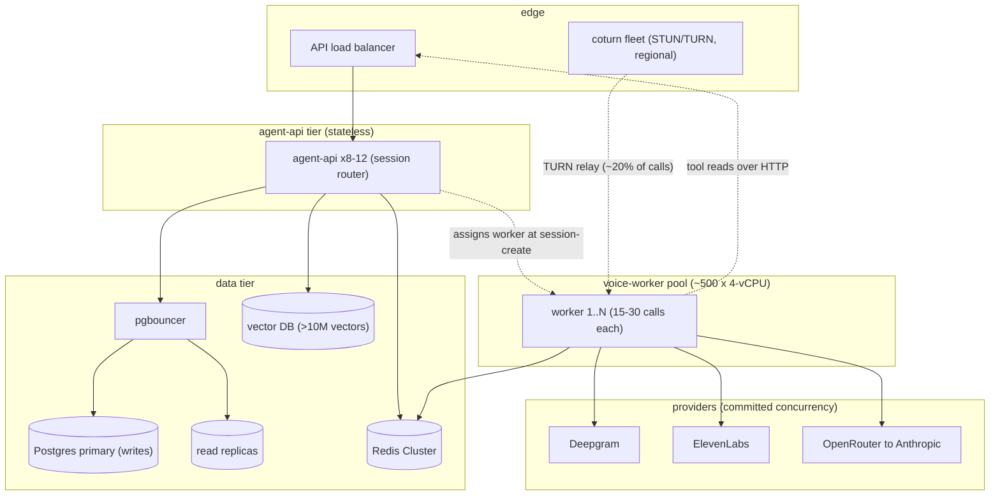
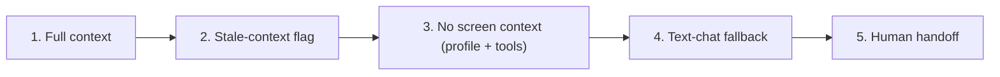
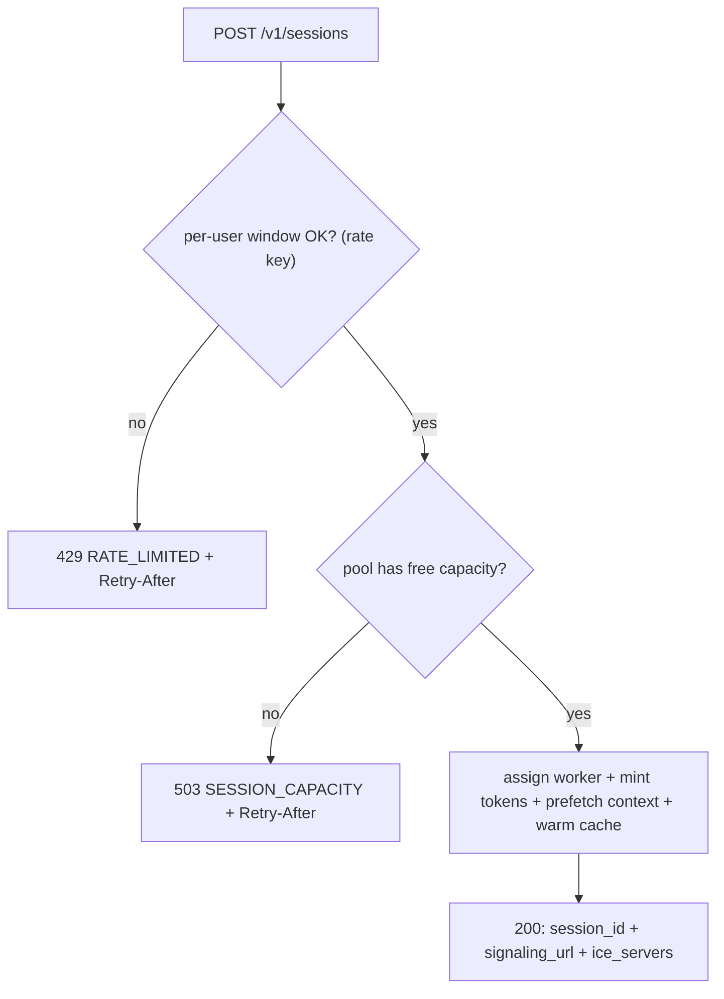

# Scalability & Reliability

This document owns how the system grows from one `docker compose up` to a real merchant base, and how it stays honest when a box, a network leg, or a provider fails underneath a live call. The scaling axis is not requests per second — it is **concurrent calls**, each one a long-lived, stateful, capacity-bound session pinning a worker for minutes ([docs/06 §8](06-voice-pipeline.md)). That single fact reshapes every component's growth path and makes the third-party providers, not our own compute, the real ceiling. This doc is also the **canonical home of the degradation ladder** — the five rungs Asha walks down as context, then voice, then the agent itself become unavailable — which every failure path in the doc set drops onto.

**Read this with:** [docs/06](06-voice-pipeline.md) for the reconnection layers and 30 s session grace this doc scales, [docs/04](04-backend-architecture.md) for the rate limiter, fail-closed policy, and per-turn spans the SLOs read from, [docs/16](16-tech-stack.md) for the ≈ $0.30/call figure and the pgvector-flip ADR this doc extrapolates, and [docs/02](02-system-architecture.md) for the two-channel topology the capacity model grows.

---

## 1. The scaling axis is concurrent calls

A REST API scales on requests per second; a stateful voice agent does not. One call holds an aiortc `RTCPeerConnection` (audio both directions plus the `ctx` data channel), a worker's asyncio task group, a `session:{id}` Redis hash, and an open turn loop for its **entire duration** — a 5-minute call is ~15 turns but one continuous resource reservation. Capacity planning is therefore *concurrent live calls*, and the derived rates (session creates/sec, post-call writes/sec) fall out of the call duration.

Two numbers anchor everything below: the **≈ $0.30 (~₹25) per-call** cost ([docs/16 §5](16-tech-stack.md), canon §9 — referenced, never re-derived here) and the **p50 ≤ 1.0 s / p95 ≤ 2.0 s turn budget** ([docs/06 §3](06-voice-pipeline.md), canon §7). Scaling must hold the second flat while the first multiplies by concurrency.

|  | Stateless REST | Voice agent |
|---|---|---|
| Unit of load | Request (ms-lived) | **Call** (minutes-lived, stateful) |
| Scale signal | Requests/sec, CPU | **Concurrent live calls** |
| Scale-in | Free — drain in-flight in ms | **Cordon-and-drain** over a call-duration (§2.3) |
| Cost driver | Compute | **Provider spend** (§3.3) |

Every row on the right is a consequence of one call being a minutes-long resource reservation, and each reshapes a component's growth path below.

---

## 2. Capacity model

Per component, what the demo ships versus what production needs, and the resource that actually bounds each one. The demo runs everything on a single compose host ([docs/04 §1](04-backend-architecture.md)); the production column is the evolution, not what this repo builds.

| Component | Demo (single compose host) | Production evolution | Bound by |
|---|---|---|---|
| **agent-api** | 1 `uvicorn` process | N stateless replicas behind an LB; horizontal-pod autoscale on RPS/CPU | Nothing structural — stateless, trivially horizontal ([docs/04 §1](04-backend-architecture.md)) |
| **voice-worker** | 1 worker sharing the host — effectively ~1 live call ([docs/06 §8](06-voice-pipeline.md)) | Worker pool; **est. 15–30 concurrent calls per 4-vCPU worker**; **session-sticky** — a call is pinned to the worker holding its `RTCPeerConnection`; agent-api's **session router** assigns a worker at session-create and the returned `signaling_url` targets it; autoscale on the concurrent-call gauge | CPU: Opus decode/encode, SRTP crypto + RTP packet handling (aiortc), Silero VAD — all in-process per call. Provider I/O is `async`, not the bound |
| **coturn (STUN/TURN)** | Single container in compose (canon §4.6) | Horizontal relay fleet sharing one `use-auth-secret` — any node validates any session's HMAC credential, so nodes need no coordination; regional siting; several entries in `ice_servers` | Relay **bandwidth**, not CPU — assume **~20% of calls TURN-relayed at ~100 kbps per relayed call** (both legs) |
| **Postgres 16 + pgvector** | Single container | Primary + read replicas + **pgbouncer**; pgvector until **~10M vectors**, then a dedicated vector DB (canon §4.3, [docs/09](09-memory-architecture.md)) | Write throughput (post-call batch) and connection count (a big worker pool = many connections) |
| **Redis 7** | Single container | Redis Cluster (sharded + replicas) | Ops/sec and HA — **not** memory; per-session state is small (§5) |
| **Providers** (Deepgram, ElevenLabs, OpenRouter) | Starter tiers, ~1 call | Enterprise / committed-throughput contracts | Provider concurrency + rate ceilings — **the binding constraint (§2.1)** |

The worker line reconciles with [docs/06 §8](06-voice-pipeline.md)'s "one call pins one worker": *pins* is now structural, not just affinity — the worker process **holds the call's `RTCPeerConnection`**, its DTLS keys, its jitter buffer, and its in-process turn state, so the call cannot exist anywhere else. That worker's event loop multiplexes 15–30 such calls before codec, SRTP, and VAD work saturate 4 vCPU. The 15–30 figure is an **estimate to be confirmed by the load harness (§8)**, not a measured number; the demo never runs more than one call, so this is exactly the axis the demo cannot exercise and the load test must.

### 2.1 Provider ceilings — the real bottleneck

Our compute scales linearly with money and instances. The providers do not: each enforces a concurrency and/or rate ceiling by plan tier, and those ceilings — not vCPU — are what cap concurrent calls first. The numbers below are **order-of-magnitude; verify against your actual tier**, because they move with plan and contract.

| Provider | What caps concurrency | Order-of-magnitude starter ceiling | To reach high concurrency |
|---|---|---|---|
| **Deepgram Nova-3** (STT) | Concurrent streaming connections per project/tier | Tens of concurrent streams on standard tiers | Enterprise committed concurrency; one open stream per live call |
| **ElevenLabs Flash v2.5** (TTS) | Concurrent-request cap per plan | Single- to low-double-digit concurrent syntheses on starter/creator tiers | The **tightest** standard-tier ceiling — needs enterprise/committed concurrency well before the others bite |
| **OpenRouter → Anthropic** (LLM) | Req/s + credit-based rate; upstream model-provider capacity | Tens of req/s per key | Provisioned/committed throughput on the upstream model behind the gateway |

The consequence is a procurement fact stated as an engineering one: **you will hit ElevenLabs' concurrency cap before you hit your worker CPU ceiling** on any non-enterprise tier. Scaling voice is negotiating provider contracts as much as adding pods, and the per-call cost (§1) is almost entirely provider spend, so the same ceilings that gate throughput also drive the bill (§3.3).

### 2.2 What consumes a worker's 4 vCPU

The 15–30 estimate is not arbitrary — it falls out of what is actually CPU-bound per call. The expensive intelligence runs on the *provider's* hardware; the worker streams tokens, moves audio, and — because there is no media server in front of it — **terminates the entire WebRTC stack in-process** (ICE, DTLS-SRTP, RTP, jitter buffer, codec) via aiortc.

| Per-call CPU cost | Weight | Notes |
|---|---|---|
| Opus decode (uplink) + encode (downlink) | Moderate, continuous | 20 ms frames both directions for the call's life ([docs/06 §2](06-voice-pipeline.md)), in-process via aiortc |
| SRTP encrypt/decrypt + RTP packet handling | Moderate, per-packet | ~50 packets/s each way per call; per-packet Python overhead is why this estimate sits below what a native media stack could carry |
| Resampling 48k↔16k (uplink) and TTS→48k (downlink) | Low | Fixed-ratio, sub-ms per chunk ([docs/06 §2.2](06-voice-pipeline.md)) |
| Silero VAD inference (onnxruntime) | Low–moderate, per 30 ms frame | Runs continuously on the decoded uplink ([docs/06 §4](06-voice-pipeline.md)) |
| Endpointing + barge-in bookkeeping | Negligible | Threshold logic over VAD output — silence/speech timers, cancellation tree |
| Orchestration / asyncio | Low | Context build, sentence chunking, span emission |
| Provider stream I/O (Deepgram, ElevenLabs, OpenRouter) | **Not CPU-bound** | Async network — this is precisely why one worker holds *many* calls |

The asymmetry — codec, crypto, and small-model inference on our CPU, the LLM on the provider's GPUs — is why a 4-vCPU worker multiplexes tens of calls rather than one. It is not unbounded, because that work accumulates linearly per call, and the async discipline is load-bearing: one accidental blocking call stalls *every* call on the loop ([docs/04 §1](04-backend-architecture.md)). The load harness (§8) is designed to surface that as a latency cliff before it reaches production.

### 2.3 Autoscaling a stateful pool

Scale-**out** is easy: a new worker boots, registers with the **session router** in agent-api (heartbeat + a concurrent-call gauge per worker), and the router starts assigning new sessions to it — existing calls never rebalance. Assignment happens exactly once per call, at `POST /v1/sessions`: the router picks a worker with free capacity and the response's `signaling_url` names that worker, so the client's signaling WebSocket, SRTP, and data channel all land on it for the call's lifetime. Scale-**in** is the hard direction a stateless service never faces — you cannot terminate a worker holding 25 live calls. The pool scales in by **cordon-and-drain**: the router stops assigning to the worker, its calls end naturally (bounded by the ~15 min max-call-duration watchdog, §6), then it terminates. Two consequences follow: scale-in lags a load drop by up to one call-duration, so off-peak savings arrive slowly; and because a call is **pinned** (§2), there is no live session migration — rebalancing means draining, not moving. Size the pool for the worst-case scale-in window, not the instantaneous minimum.

---

## 3. Worked scenario: 10,000 concurrent calls

Concrete target: **10,000 simultaneous live calls**, 5-minute average duration. Everything below is order-of-magnitude sizing to show *what changes*, not a deploy spec.

Derived rates (from concurrency ÷ duration): **~33 new sessions/sec** (10,000 ÷ 300 s), ~33 post-call write batches/sec, and ~500 turns/sec aggregate (~15 turns per 5-min call). These are the numbers each tier sizes against.

| Component | What changes at 10k concurrent |
|---|---|
| **voice-worker** | At 20 calls/worker → **~500 workers** (330–670 for the 15–30 range, plus headroom), ~2,000 vCPU. Autoscaled on the concurrent-call gauge; the session router spreads new sessions across the pool. This is the largest compute line and still small money (§3.3) |
| **agent-api** | Stateless, so scale to sustain ~33 session-creates/sec **plus** worker→API tool-read traffic (~500 turns/sec, a fraction hitting business reads). ~8–12 replicas behind the LB; session-create is the expensive path (assigns a worker, mints signaling token + TURN credentials, prefetch, warms cache — [docs/04 §6](04-backend-architecture.md)) |
| **coturn** | Single container → **relay fleet**. ~20% of 10k = **~2,000 relayed calls × ~100 kbps ≈ 200 Mbps aggregate relay bandwidth** — one saturated node's worth of traffic on a 1 Gbps NIC, so run **3–4 regional nodes** for redundancy and headroom. All share the `use-auth-secret`, so any node honors any session's HMAC credential with zero coordination |
| **Postgres** | Primary + **read replicas** (profile reads, pgvector KB retrieval, business tool reads at session-create rate) + **pgbouncer** (transaction pooling — 500 workers would otherwise exhaust connection slots). Writes (~33 batches/sec) stay on the primary |
| **pgvector** | Each call adds one summary embedding. 10k concurrent isn't 10M vectors, but sustained traffic crosses **~10M vectors** in weeks — the canon §4.3 flip point to a dedicated vector DB (Qdrant/Milvus/pgvector-scale) for the retrieval path |
| **Redis** | Single → **Redis Cluster** (sharded + replicas). Sized for ops/sec and HA, not memory — 10k `session:{id}` hashes are small (§5) |
| **Providers** | The binding tier: **~10k concurrent Deepgram streams, ~10k concurrent ElevenLabs syntheses, ~500 LLM turns/sec through OpenRouter** — all enterprise/committed. This is contracted capacity, not an autoscale group |

### 3.1 Deployment shape at 10k

Two routing notes. First, the worker→API tool-read arrow still routes over the LB even at scale — the `localhost` HTTP seam from the demo ([docs/04 §1](04-backend-architecture.md)) becomes a real network hop but the *code* does not change; that ~2 ms insurance is what makes this a topology change, not a refactor. Second, session-stickiness makes each worker **individually addressable**: the `signaling_url` minted at session-create names the specific worker that terminates that call's WebSocket and SRTP, so the worker tier sits behind per-worker routable endpoints (or a session-aware L4 pass-through), not a round-robin LB — clients whose direct path is blocked reach the same worker through the coturn relay.

### 3.2 What does **not** change

The admission-control 503, the per-call watchdogs (§6), the degradation ladder (§4), the reconnection policy and 30 s grace ([docs/06 §6](06-voice-pipeline.md)), and the `rate:{user_id}` sliding window ([docs/04 §6](04-backend-architecture.md)) are all identical from 1 call to 10k. They were designed as per-session or per-user primitives, so concurrency is a deployment number, not a rewrite.

### 3.3 Cost extrapolation

Using the canonical **≈ $0.30 (~₹25) per completed call** ([docs/16 §5](16-tech-stack.md) — not re-derived here):

| Quantity | Value |
|---|---|
| Throughput at 10k concurrent, 5-min calls | 10,000 ÷ 5 min = **~2,000 calls/min = ~120,000 calls/hr** |
| Variable provider + model cost | 120,000 × $0.30 ≈ **$36,000/hr** (STT + LLM + TTS) |
| Worker compute (~500 × 4-vCPU) | **~$150–250/hr** on-demand cloud |
| API + coturn + data tiers | a few hundred $/hr combined; TURN relay egress (~200 Mbps) is the only bandwidth line that grows with calls, and it stays in the tens of $/hr |

The punchline: **compute is under ~1% of the bill.** At voice-agent scale the cost is provider spend, which is why prompt prefix caching (LLM $0.10 vs $0.16/call, canon §9) and sentence-level TTS dispatch ([docs/06 §3.2](06-voice-pipeline.md)) are the highest-leverage cost levers — a 10% cut on the variable line dwarfs any infra optimization. Sustained 10k concurrent is a **peak** figure; real traffic is diurnal, so autoscaling the worker pool down off-peak is where compute savings actually live.

### 3.4 Regional siting and data residency

VyaparPay is an India-market product (canon §1), which turns "add regions" into hard constraints, not just latency tuning:

| Concern | Constraint at scale |
|---|---|
| Worker + TURN siting | Media terminates on the voice-worker itself — there is no media server in between — so workers **and** coturn relays sit in regional PoPs near callers; a Mumbai caller must not relay through Virginia ([docs/06 §8](06-voice-pipeline.md)) |
| Data residency | Merchant PII + transcripts stay in-region (Indian data-localization expectations for fintech); the Postgres primary and vector DB are region-pinned |
| Provider RTT | Region-pinned Deepgram/ElevenLabs/OpenRouter endpoints — the TTFT/TTFB budget lines ([docs/06 §3](06-voice-pipeline.md)) assume low provider RTT a single demo host only partly reflects |
| Cross-region writes | Regional primaries with per-region ownership; a multi-region active-active Postgres is explicitly **not** attempted |

The one thing multi-region does **not** change is the per-call brain: a call is served entirely within one region, so no turn ever crosses a region boundary mid-conversation.

**Replica-lag caveat.** The post-call summary + embedding write to the primary ([docs/04 §5](04-backend-architecture.md)); a follow-up call minutes later runs its pgvector retrieval against a read replica. If replication lags, the just-written summary is briefly not retrievable. This is acceptable by design — semantic memory is best-effort top-3 ([docs/09](09-memory-architecture.md)), and anything that must be immediately consistent (the current call's own state) lives in Redis, never a replica.

### 3.5 The flip condition this scale-out does not trigger

Everything above scales the strictly 1:1 topology — one merchant, one agent peer, more of both. The moment the product needs **multi-party media** — a supervisor whispering into a live call, three-way conferencing, silent call monitoring — the two-peer model stops working, and an SFU (LiveKit, mediasoup) re-enters the architecture as the media hub between N parties. That, plus per-node fan-out limits, is the flip condition recorded in the transport ADR ([docs/16](16-tech-stack.md), canon §4.1). Until it triggers, an SFU adds a hop and a service for zero benefit; when it does, the signaling protocol and voice pipeline this doc scales are the pieces that survive the flip, because we own them.

---

## 4. The degradation ladder

**This is the canonical definition; every failure path in the doc set terminates on one of these rungs.** The system's governing rule is *degrade the surface, never fake the call* ([docs/06 §7](06-voice-pipeline.md)). Asha walks down the ladder one rung at a time, and each rung is still a working support agent — just with less context or a narrower channel.

| Rung | What Asha still has | Trigger conditions |
|---|---|---|
| **1. Full context** | Screen-context IR + profile + memory + tools — the signature capability | Normal operation: fresh `ctx:{session_id}`, all providers healthy |
| **2. Stale-context flag** | Same, but the screen snapshot is marked *possibly out of date* — Asha stops asserting live UI state and confirms instead (*"are you still on the payment screen?"*) | Data-channel `seq` gap not recovered ([docs/02 §3.3](02-system-architecture.md)); snapshot age exceeds threshold; deltas stopped arriving mid-call |
| **3. No screen context** | Profile + tools only — Asha asks what the user sees rather than reading it; tools still resolve real account facts | Initial snapshot never ingested; `SnapshotIngestor` failure; client never opened the `ctx` channel |
| **4. Text-chat fallback** | The app's `HelpScreen` chat with the conversation context carried over — no voice, but the same brain and tools | Sustained packet loss > 15% ([docs/06 §7](06-voice-pipeline.md)); STT **or** TTS down with no provider fallback; media never establishes (ICE fails even through TURN — §5.1) |
| **5. Human handoff** | `escalate_to_human` — the terminal rung; full transcript + resolution state handed to a person | Agent cannot resolve; `SafetyLayer` trips; user asks for a human; repeated failures at any higher rung |

The ladder is **monotonic within a call** — the system does not silently climb back up mid-turn (a recovered snapshot resumes rung 1 on the *next* turn, cleanly), because flapping between "I can see your screen" and "I can't" is worse than staying honest one rung down. Rung 5 is always reachable from any rung: a human is never more than one tool call away.

### 4.1 Walking the ladder — the canonical call

Trace the canonical incident ([docs/01](01-product-and-use-case.md), canon §2) down the ladder as failures inject:

| Point in the call | Rung | What Asha does |
|---|---|---|
| Call opens, snapshot ingested | **1** | *"Hi Rajesh, I can see your ₹245 payment to Amazon Business didn't go through — your daily transaction limit was exceeded…"* — reads live screen state |
| App backgrounded mid-call; context channel silent, `seq` gap unrecovered | **2** | Stops asserting live UI: *"are you still on the payment screen?"* before acting on possibly-stale state |
| (Alt) snapshot never arrived at setup | **3** | Still greets Rajesh by name from profile, still calls `get_payment_status` / `get_wallet_balance` for real facts — but asks what he sees instead of reading it |
| 4G leg degrades past 15% loss ([docs/06 §7](06-voice-pipeline.md)) | **4** | Hands to the `HelpScreen` chat with the transcript intact — same brain and tools, no voice |
| Issue needs a person (or Rajesh asks) | **5** | `escalate_to_human` with the full transcript + the ₹245 / limit context |

At every rung Asha is still *doing her job* against real account data — she loses context fidelity and then the channel, never the ability to help or the honesty about what she can actually see.

---

## 5. Failure-mode tables

Doc-set convention: **Failure | Detection | Impact | Mitigation | Degradation** (canon §14). Pipeline-level (media/provider stream breaking mid-turn) failures live in [docs/06 §7](06-voice-pipeline.md); brain-level (LLM/tool timeout) in [docs/05 §6](05-agent-architecture.md). These are the **infrastructure and provider-outage** failures — whole subsystems degrading under load or loss.

### 5.1 Infrastructure

| Failure | Detection | Impact | Mitigation | Degradation |
|---|---|---|---|---|
| **voice-worker crash mid-call** | Worker heartbeat to the session router stops; clients see ICE `disconnected` → `failed` within seconds | That worker's 15–30 calls lose their peer — the `RTCPeerConnection`, its DTLS keys, and the `ctx` channel die with the process | ICE restart cannot help (the far peer is gone); the client's `CallStateMachine` enters Reconnecting and **re-sessions**: a fresh `POST /v1/sessions` inside the **30 s grace window** ([docs/06 §6.1](06-voice-pipeline.md)); the session router assigns a healthy worker, which rehydrates transcript window, rolling summary, and pending-confirm from the still-live `session:{id}` | Callers hear a hiccup, then Asha bridges back; a committed mutating tool stays committed and surfaces as a digest |
| **coturn outage** | TURN allocation requests fail or time out at call setup; relay-port health checks fail | P2P-reachable calls (the assumed ~80%) are unaffected; calls that need the relay fail ICE at setup, and live relayed calls drop when allocation refresh fails | Multiple coturn nodes behind the shared `use-auth-secret` — `ice_servers` lists several and ICE tries them all; regional redundancy; recovery is redeploying a credential-stateless container | Relay-dependent callers can't establish media → **rung 4** (text-chat fallback, context intact); everyone else unaffected |
| **Postgres failover** | Primary health check fails; writes error | Writes blocked during the promotion window (seconds–tens of seconds); business tool reads on the primary fail | Managed HA (replica promotion); reads continue on replicas; post-call writes retry with backoff; live-call hot path is Redis, not Postgres | Rung 2–3: a tool read that can't reach the DB → Asha says she can't fetch that *right now* rather than inventing it |
| **Redis eviction / outage** | `enforce_rate` raises on connect; session reads miss | New sessions can't be admitted; evicted `session:{id}` can't rehydrate on reconnect | **Fail closed** on session-create → `503 SESSION_CAPACITY` ([docs/04 §7.5](04-backend-architecture.md)); `noeviction` (or dedicated session DB) so live session hashes aren't evicted under memory pressure; cluster for capacity | In-flight calls **continue memory-light** on in-process short-term state — but lose cross-reconnect resume and summary persistence; new calls rejected |
| **Connection exhaustion** | Postgres `too many connections`; pgbouncer pool saturation | New DB work (tool reads, post-call writes) blocks | **pgbouncer** transaction pooling in front of primary/replicas; worker DB pools capped well below the server slot count | Tool reads queue then fail → rung 2–3; post-call writes retry after the call ends |
| **Autoscaler / assignment lag** | Concurrent-call gauge spikes faster than workers boot | Session-creates arrive and the session router has no free worker slot | Pool headroom buffer; a warm-pool of pre-booted workers; admission 503 (§6) sheds overflow rather than over-committing | New callers get `503 SESSION_CAPACITY` + `Retry-After` for seconds until the pool catches up |
| **Thundering herd on restart** | Deploy/crash → mass worker restart, mass client re-session, cache-warm storm, provider request spike | Re-session + cold-cache + provider-rate spike can cascade into a second outage | Rolling/staggered restarts; **jittered reconnect backoff**; readiness gate so the session router withholds assignments until a worker is warm; the router spreads re-sessions across surviving workers; connection-pool caps | Slower call-setup for a few seconds post-deploy; individual calls degrade per the ladder rather than the fleet browning out together |

### 5.2 Providers

Provider fallback is layered per canon §3 (every provider is pluggable behind a `Protocol`) and the OpenRouter `models: [...]` array ([docs/04 §4](04-backend-architecture.md)).

| Failure | Detection | Impact | Mitigation | Degradation |
|---|---|---|---|---|
| **Deepgram (STT) outage** | Stream connect fails / repeated close events | No transcription | Reconnect immediately ([docs/06 §7](06-voice-pipeline.md)); config'd fallback STT via `SttProvider`; per-call watchdog caps retries | One honest re-ask, then **rung 4** (text) if no STT path resolves |
| **ElevenLabs (TTS) outage** | 5xx / stream abort on `tts.first_byte` | Asha has no voice | Retry the sentence on a fallback voice id; fallback TTS provider via `TtsProvider`; per-sentence dispatch means only the failed sentence re-synths | Brief gap → backup voice; if none, **rung 4** with context intact |
| **OpenRouter model failure** | Primary model 5xx on the streaming call | One turn's generation fails | `models: [...]` **reroutes at the provider edge inside the same HTTP call** ([docs/04 §4](04-backend-architecture.md), [docs/05 §3.4](05-agent-architecture.md)); the fallback model's slug lands on the span as `model` | Silent, sub-turn reroute; a filler phrase covers a slow retry ([docs/06 §3.2](06-voice-pipeline.md)) |
| **OpenRouter *gateway* outage** | Connect failures to the gateway host itself | The `models: [...]` array **does not help** — same gateway | Honest limitation for the demo; production adds a **secondary gateway or direct-to-provider** fallback path behind `LLMProvider` | One filler, then a spoken apology → **rung 5** (human handoff) |

The gateway-outage row is the deliberate honest gap: the fallback array covers *model and upstream-provider* failures behind OpenRouter, not a failure of OpenRouter itself. A single gateway is a single point of failure the demo accepts and production removes.

---

## 6. Backpressure & admission control

Two guards keep load from becoming cost or collapse: an **admission gate** at session creation, and **per-call watchdogs** for the duration of each call.

**Admission at session-create.** Minting a session is the expensive act — the session router picks a worker with a free slot, agent-api mints the signaling token and TURN credentials, prefetches context, and warms the LLM cache ([docs/04 §6](04-backend-architecture.md)). agent-api tracks in-flight concurrency against the worker pool's registered capacity. When the pool has no free slot, agent-api does **not** hand out a `signaling_url` it can't serve — it returns **`503 SESSION_CAPACITY` with a `Retry-After` header**, and the app shows "we're busy, try again in a moment" with nothing to clean up. This is distinct from the per-user `429 RATE_LIMITED` sliding window ([docs/04 §6](04-backend-architecture.md)): the 429 stops one user abusing cost; the 503 stops the *fleet* over-committing. A short bounded queue may absorb a transient spike, but the queue has a hard depth and a deadline — a request that would wait past the caller's patience gets the 503 immediately rather than a stale worker assignment later.

The two gates run in order and for different reasons: the per-user check keys on the verified `sub` (it must run *after* auth, [docs/04 §4.1](04-backend-architecture.md)) and defends cost per caller; the capacity check defends the fleet and is the one that scales with §2. Neither gate ever leaves a half-minted session — both reject before any worker slot, prefetch, or cache warm is consumed.

**Per-call watchdogs.** Every live call runs two background guards; both wind the call down *gracefully* (spoken close + post-call pipeline), never a hard kill:

| Watchdog | Limit | Action on breach |
|---|---|---|
| **Max call duration** | ~15 min hard cap (`MAX_CALL_DURATION_SECONDS`) | A support call this long should be a human's — Asha wraps and offers `escalate_to_human` (rung 5) |
| **Cost cap** | `CALL_COST_CAP_USD` = **$1.00** ([docs/04 §3](04-backend-architecture.md), [docs/05 §3.8](05-agent-architecture.md)) | Running `cost_usd` in the `session:{id}` hash crosses the cap → wind down; a runaway loop can't burn unbounded provider spend |

The cost cap is the runaway backstop the whole cost story leans on: a single misbehaving call is bounded at ~3× the ≈ $0.30 expected cost, so no bug turns 10k healthy calls' economics upside down.

---

## 7. Service-level objectives (production evolution — future)

SLOs, alerting, and error budgets are **explicitly deferred** (canon §4.5: *"Deferred: eval platform, alerting/SLOs, session replay"*). The instrumentation to measure them ships in the demo — the per-turn OTel spans and structlog events ([docs/04 §7](04-backend-architecture.md)) — but the targets, alerts, and budgets are Phase 6 work. Stated here as the intended production contract, marked **future**:

| SLO | Target | Measurement source | Status |
|---|---|---|---|
| **Answer latency (turn)** | p95 ≤ 2.0 s (p50 ≤ 1.0 s) | `turn` span `turn_ms`, Tempo TraceQL quantile ([docs/06 §3](06-voice-pipeline.md), canon §7) | Future |
| **Call-setup latency** | p50 ≤ 1.5 s (TURN-relayed worst case ≤ 3 s) | Session POST timestamp → client first-media event (the canon §7 call-setup budget) | Future |
| **Call-setup success rate** | ≥ 99.0% | session-create logs × client media-established event; ratio of calls that reach first greeting | Future |
| **Mid-call drop rate** | ≤ 1.0% of calls | `call_ended` reason distribution in Loki — share ending `dropped` vs graceful | Future |

Each target has a canonical reference line the demo dashboard already draws ([docs/04 §7.3](04-backend-architecture.md)); the future work is attaching alerts and an error budget to them, not building new measurement. Once live, each target becomes an **error budget** — a 99.0% call-setup SLO permits ~1% of setups to fail per window, and that budget, not intuition, gates whether to ship a risky change or freeze and stabilize. The honesty caveat from [docs/06 §3.1](06-voice-pipeline.md) carries: the demo's latency numbers were measured on a LAN with providers over the public internet, so the p95 target becomes a real SLA only once measured against production traffic on Indian mobile networks.

---

## 8. Load-testing plan (Phase 6)

The demo runs one call, so the entire capacity model above (§2) is **unvalidated by construction** — the 15–30 calls/worker estimate, the ~20% relay share, and the provider ceilings are numbers the load harness exists to confirm. Sketch, marked **Phase 6** ([docs/16](16-tech-stack.md), canon §13):

- **Synthetic caller harness.** Spins up N headless WebRTC callers — aiortc-based synthetic clients — that mint real sessions (`POST /v1/sessions`), run the real signaling handshake (offer/answer + trickle ICE over `/v1/signal`), and stream **pre-recorded PCM audio fixtures** — the canonical call turns ([docs/04 §8](04-backend-architecture.md) e2e fixtures) played on a loop with realistic inter-turn pacing — over real `RTCPeerConnection`s. A configurable fraction of callers is **forced through TURN** (host/srflx candidates suppressed) to exercise the relay path and validate the ~20% share and the coturn bandwidth math (§2). Reuses the same seeded scenario so assertions are deterministic.
- **Assertions per synthetic call.** Turn latency against the budget (fail if p95 > 2.0 s), call-setup success and latency against the ≤ 1.5 s p50 setup budget (canon §7), correct resolution path (`request_limit_increase` → confirm → summary), and no dropped/interrupted turns beyond tolerance.
- **Ramp to the knee.** Increase concurrency stepwise to find (a) the **worker CPU knee** — where per-turn latency degrades as codec, SRTP, and Silero VAD work saturates 4 vCPU, confirming or correcting the 15–30 estimate — and (b) the **provider ceiling** — the concurrency where Deepgram/ElevenLabs/OpenRouter start returning rate-limit errors, confirming §2.1.
- **Run target.** Against a staging stack sized like §3.1 at a fraction of 10k; extrapolate the two knees to the full target. The output feeds the autoscaler thresholds and the admission-control capacity number (§6).

| Ramp step | What it finds |
|---|---|
| 0 → worker saturation | The **worker CPU knee** — concurrency where turn p95 degrades, confirming/correcting 15–30 calls/worker (§2.2) |
| worker-knee → provider errors | The **provider ceiling** — concurrency where Deepgram/ElevenLabs/OpenRouter return rate-limit errors, confirming §2.1 |
| soak at ~80% of the knee | Slow creep — memory growth, connection-pool drift, span/log backpressure over a long run |

The harness deliberately drives **real audio through the real signaling path, real coturn relays, and real providers**, not mocks — mocking any of them would hide exactly the ceiling the test exists to find.

---

## Decisions this document exports

| Fixed here | Value | Heaviest consumer |
|---|---|---|
| Scaling axis | Concurrent calls, not RPS; derived rates fall out of call duration | [docs/02](02-system-architecture.md), [docs/16](16-tech-stack.md) |
| Worker capacity estimate | ~15–30 concurrent calls / 4-vCPU worker (load-test to confirm); session-sticky — a call is pinned to the worker holding its `RTCPeerConnection` | [docs/06](06-voice-pipeline.md), autoscaler |
| Worker assignment | Session router in agent-api picks the worker at session-create; `signaling_url` targets it; cordon-and-drain scale-in | [docs/04](04-backend-architecture.md), [docs/13](13-api-contracts.md) |
| coturn sizing assumption | ~20% of calls TURN-relayed at ~100 kbps each — bandwidth-bound; horizontal fleet on one shared `use-auth-secret` | [docs/16](16-tech-stack.md), [docs/14](14-security.md) |
| Provider ceilings as the bottleneck | ElevenLabs concurrency binds first; enterprise/committed throughput required at scale | [docs/16](16-tech-stack.md) |
| **Degradation ladder** (canonical home) | full → stale-flag → no-screen → text → human; monotonic within a call | [docs/05](05-agent-architecture.md), [docs/06](06-voice-pipeline.md), [docs/02](02-system-architecture.md) |
| Admission control | `503 SESSION_CAPACITY` + `Retry-After` when pool exhausted; distinct from `429` per-user | [docs/04](04-backend-architecture.md), [docs/13](13-api-contracts.md) |
| Per-call watchdogs | ~15 min max duration; `CALL_COST_CAP_USD` = $1.00; graceful wind-down | [docs/04](04-backend-architecture.md), [docs/05](05-agent-architecture.md) |
| SLO targets (future) | turn p95 ≤ 2.0 s; setup p50 ≤ 1.5 s; call-setup ≥ 99.0%; drop ≤ 1.0%; measured via OTel/Loki | Phase 6 |
| Load-harness contract | Synthetic aiortc callers through real signaling/coturn/providers; forced-TURN fraction; ramp to worker + provider knees | Phase 6 |
