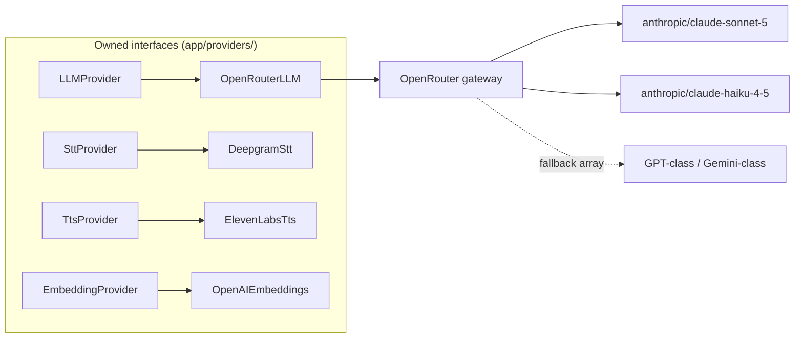

# Technology Stack & Decision Records

This document justifies every technology in the stack — one summary table, six full architecture decision records (ADRs), a table of things we deliberately did *not* use with the conditions that would flip each decision, and the authoritative cost-per-call model that every other doc references. The ADRs here are locked per the canon: sibling docs cite them, they do not relitigate them.

**Read this with:** [docs/02](02-system-architecture.md) for where each piece sits, [docs/06](06-voice-pipeline.md) for the latency budget these choices must hit, [docs/09](09-memory-architecture.md) for how the data layer is used, and [docs/17](17-roadmap.md) for when the deferred pieces arrive.

---

## 1. Stack summary

| Layer | Choice | Why (one line) |
|---|---|---|
| Android language | Kotlin | The author's home turf; the Android app is the Kotlin showcase of this portfolio |
| Android UI | Jetpack Compose | The semantics tree Compose maintains for accessibility is exactly what `UiTreeCollector` mines for ScreenContext ([docs/07](07-ui-semantic-context.md)) |
| Android DI | Hilt | Boring, standard, lets `VoiceCallService` and `AppStateManager` share scoped state without ceremony |
| Android WebRTC | libwebrtc via `org.webrtc` (maintained artifact `io.github.webrtc-sdk:android`) | ADR-001: `WebRtcClient` owns `PeerConnection`, `createOffer`, trickle ICE, and the data channel directly — no platform SDK in between |
| Backend language | Python 3.12 | Voice-AI ecosystem gravity, and aiortc — see §4 for the honest version |
| Backend web | FastAPI | Async-native, Pydantic-integrated request validation at the boundary, OpenAPI for free on the seeded business APIs |
| Backend WebRTC peer | aiortc | ADR-001: full native-Python WebRTC — SDP, ICE, DTLS-SRTP, SCTP data channels — terminating media in the worker's own asyncio loop |
| Voice pipeline | Hand-rolled asyncio (`app/voice/`) | ADR-002: `VadEndpointer`, `AudioIngress`/`AudioEgress`, barge-in cancellation — the pipeline is a headline artifact, not framework internals |
| VAD | Silero VAD (onnxruntime) | ADR-002: 30 ms frames feeding own endpointing (≥250 ms trailing silence) and barge-in detection |
| STUN/TURN | coturn (self-hosted) | ADR-006: one compose container; HMAC time-limited credentials via `use-auth-secret` |
| ORM / migrations | SQLAlchemy 2.0 async + Alembic | One async session per request/turn; migrations as code from day one, not "later" |
| Config | pydantic-settings | Typed env parsing; missing secrets fail at startup, not at first call ([docs/14](14-security.md)) |
| Logging | structlog | JSON logs with bound `session_id`/`turn_id` on every line; greppable, trace-correlated |
| STT | Deepgram Nova-3 (streaming) | ~$0.0077/min, streaming partials, 80/150 ms finalization after endpoint (canon latency table) |
| TTS | ElevenLabs Flash v2.5 | Lowest-latency tier (~75 ms model latency); TTFB 120/250 ms is the second-largest turn cost after the LLM |
| LLM gateway | OpenRouter | One API key, one wire format, per-request fallback arrays; no vendor SDK sprawl behind `LLMProvider` |
| Dialogue model | Claude Sonnet 5 — `anthropic/claude-sonnet-5` | $3.00/M input, $15.00/M output; the quality bar for tool-calling + tone in a support call |
| Utility model | Claude Haiku 4.5 — `anthropic/claude-haiku-4-5` | $1.00/M input, $5.00/M output; summarization every 6 turns, intent classification, context compression |
| Embeddings | OpenAI `text-embedding-3-small` | $0.02/M tokens, dim 1536; cheap enough that embedding every call summary costs fractions of a cent |
| Primary store | Postgres 16 + pgvector | ADR-003: one durable store for fixtures, profiles, summaries, *and* vectors |
| Cache / session | Redis 7 | ADR-003: `session:{id}` hot state read inside the 15/40 ms context-assembly budget |
| Tracing | OpenTelemetry → Tempo | ADR-005: one trace per conversation turn, spans matching the canon names |
| Dashboards | Grafana | The 90-second demo ends on a Grafana trace and a cost row — observability is a feature, not plumbing |
| Runtime | Docker Compose | Whole stack on one machine; Kubernetes deliberately deferred (§3) |

Model IDs are **config-driven current defaults**, not constants: `OPENROUTER_DIALOGUE_MODEL` and `OPENROUTER_UTILITY_MODEL` in env, fallback models in the OpenRouter request's `models: [...]` array. Every vendor sits behind an owned interface:

The interfaces are not speculative generality: the embedding provider has three plausible successors (Voyage, local BGE), the TTS provider two (Cartesia, Azure), and the swap cost with the interface is one file per provider.

---

## 2. Decision records

Format per record: Context / Decision / Consequences / Rejected alternatives / **Flips when** — the last field is the honesty check. A decision without a flip condition is a belief, not a decision.

### ADR-001 — Transport: raw WebRTC, two direct peers, no media server

**Context.** The call is bidirectional low-latency audio between an Android app and a Python worker, plus a reliable ordered data channel for ScreenContext deltas. The topology is strictly 1:1 — one merchant, one agent — for every call this product can make. The canon latency budget allots the transport chain (Opus encode + network path, P2P or TURN relay, + client jitter buffer) 75 ms p50 / 140 ms p95, and call setup (session POST + WS connect + SDP exchange + trickle ICE to first media) ≤ 1.5 s p50. Separately, this is a portfolio project: the protocol-level engineering — offer/answer, trickle ICE, DTLS-SRTP, NAT traversal — is signal, not overhead. Team size: one.

**Decision.** Two direct WebRTC peers, no media server between them. The Android app uses libwebrtc via the maintained `org.webrtc` artifact (`io.github.webrtc-sdk:android`); `WebRtcClient` owns the stack directly — `PeerConnectionFactory`, `createOffer`/`setLocalDescription`, `onIceCandidate`, ICE restart on network change, hardware AEC/NS via `JavaAudioDeviceModule`. The backend `voice-worker` runs **aiortc**, the native Python WebRTC implementation — SDP, ICE, DTLS-SRTP, and SCTP data channels, all asyncio — one `RTCPeerConnection` per call wrapped in `PeerSession`. Signaling is an owned WebSocket protocol at `/v1/signal` (offer/answer + trickle ICE, envelope and flow in [docs/13](13-api-contracts.md)); NAT traversal is self-hosted coturn (ADR-006).

**Consequences.** No media server in the path: one fewer hop, one fewer stateful service, and media flows handset → worker directly (or via TURN relay when NAT demands it). Every protocol layer is owned, readable code — `SignalingServer`, the ICE lifecycle, the DTLS handshake sit in the repo, not behind an SDK. Trickle ICE means media starts on the first working candidate pair, which is how the ≤ 1.5 s setup budget is met. Costs: we own ICE edge cases, reconnection (ICE restart re-offer), and Android↔aiortc interop testing — engineering a managed platform amortizes across thousands of customers; mitigated by the strictly-1:1 topology (no simulcast, no subscription logic) and by libwebrtc shipping client-side AEC/NS/AGC and jitter buffering for free. A real structural cost: the worker Opus-decodes and encodes every call, so per-node call fan-out is bounded by CPU — acceptable at demo scale, and the flip condition below is the honest ceiling.

**Rejected alternatives.**
- *Managed WebRTC platforms (Daily, Agora, and similar)*: they work, and that is the problem — the SDK hides exactly the engineering this project showcases (signaling, ICE, media lifecycle), adds a heavyweight infra dependency or a per-minute bill, and "integrated a platform SDK" is weaker portfolio signal than "implemented offer/answer and trickle ICE against a hand-run aiortc peer."
- *An SFU of any kind (open-source or hosted)*: an SFU exists to fan media out to N subscribers. At N=1 it adds a hop, a stateful service, and a room/participant abstraction the product has no use for.
- *libwebrtc via NDK on the server*: a C++ build and deployment tax with no asyncio integration; aiortc gives the same protocols in the language the rest of the worker already speaks.

**Flips when:** the call stops being 1:1 — multi-party (supervisor whisper, conference) — or per-node fan-out limits bite at real traffic. Both are precisely the problems SFUs solve; a self-hosted open-source SFU (e.g. mediasoup) would be the first candidate, and the provider seams (`WebRtcClient` on Android, `PeerSession` on the backend) are where the cut would land.

### ADR-002 — Voice pipeline: hand-rolled asyncio + Silero VAD

**Context.** The voice loop — VAD, endpointing, turn detection, barge-in within 250 ms, streaming STT/TTS glue — is subtle asyncio engineering, and frameworks in this space (Pipecat and similar voice-agent frameworks) exist because it is hard. But with ADR-001 removing the managed transport, the pipeline is no longer plumbing around someone else's media loop: it is one of the two headline engineering artifacts of the project (the other is ScreenContext). Hiding it inside a framework would delete the thing the repo exists to show.

**Decision.** Hand-roll the pipeline in `app/voice/`, on top of raw aiortc frames. `AudioIngress` decodes the remote Opus track and resamples to 16 kHz mono PCM; `VadEndpointer` runs Silero VAD via onnxruntime on 30 ms frames with own endpointing (≥ 250 ms trailing silence ends the turn, 200 ms minimum speech) and barge-in detection (≥ 200 ms of speech while the agent is speaking); `AudioEgress` resamples TTS PCM to 48 kHz onto an aiortc `AudioStreamTrack` with playout cancellation for barge-in; `VoiceAgentWorker` wires ingress, VAD, the agent brain (`app/agent/`), and egress into one per-call asyncio task group. Providers (`DeepgramStt`, `ElevenLabsTts`, `OpenRouterLLM`) plug into that loop; full mechanics in [docs/06](06-voice-pipeline.md).

**Consequences.** The barge-in cancellation tree, the endpointing thresholds, and the pacing/jitter handling are ours to tune, instrument, and demonstrate — every stage of the docs/06 budget maps to an owned span, not a framework internal. Costs: the tuning burden is real (the canon thresholds are engineered starting points, not battle-tested defaults), and mature frameworks embody years of edge-case fixes we now re-earn one bug at a time. Mitigations are scope discipline: one language (English), one codec path (Opus 48 kHz ↔ 16 kHz PCM), strictly 1:1 audio — the narrow pipeline is tractable where a general one would not be.

**Rejected alternatives.**
- *Voice-agent frameworks that bundle a managed transport*: they re-introduce the managed media loop ADR-001 removed and would re-hide the VAD/endpointing/barge-in engineering we now deliberately own.
- *Pipecat*: transport-flexible and genuinely good, but its pipeline abstraction sits exactly on the layer this project exists to demonstrate, and it brings its own frame/processor model where we want aiortc frames and plain asyncio.

**Flips when:** the hand-rolled pipeline measurably fails the docs/06 budget after honest tuning (endpointing accuracy or barge-in > 250 ms), or scope multiplies (languages, codecs, telephony legs) — at that point a framework's accumulated edge-case maturity earns its coupling, and the provider interfaces survive the swap.

### ADR-003 — Data: Postgres 16 + pgvector + Redis 7, nothing else

**Context.** The data needs, enumerated: relational seeded business fixtures; durable user-profile memory; conversation summaries; vector search over summaries + KB articles (cosine top-3, 1536-dim, [docs/09](09-memory-architecture.md)); per-session hot state readable inside the 15 ms p50 context-assembly budget; and an event stream for context ingestion. Demo scale: thousands of vectors, tens of concurrent sessions.

**Decision.** One Postgres 16 instance carries everything durable — relational tables, JSONB where shapes vary, pgvector with an HNSW index for semantic memory. Redis 7 carries the hot path: `session:{id}` hashes, `ctx:{session_id}`, `rate:{user_id}`, and Redis Streams where fan-out is needed.

**Consequences.** Two containers, one backup story, and SQL joins across business data and memory (e.g., "summaries for merchants with open complaints" is one query, not an API stitch). Summary + embedding write in one transaction. At demo scale, pgvector HNSW answers top-3 in single-digit milliseconds. Costs: pgvector degrades past ~10M vectors under high QPS; Redis Streams lack Kafka's replay and partitioning semantics; JSONB invites schema rot without discipline.

**Rejected alternatives.**
- *Pinecone/Qdrant*: a third stateful system, a network hop in the turn path, and (Pinecone) a bill — to serve fewer than 10k vectors. Runs afoul of the same test everything here faces: does it earn its container?
- *Kafka*: event-bus semantics with no second consumer to justify them; the compose footprint and ops surface are wildly out of proportion at one-node scale.
- *MongoDB*: every document-shaped need is covered by JSONB, and choosing it would sacrifice the joins above.

**Flips when:** vector count approaches ~10M or recall/latency SLOs fail under load → Qdrant behind the existing `SemanticMemory` retriever interface. Multiple services need replayable event fan-out → Kafka or Redpanda. Neither flip touches calling code; that is what the interfaces bought.

### ADR-004 — Context transport: the call's own RTCDataChannel, not another socket

**Context.** ScreenContext deltas and app events must flow app → backend *during* the call, ordered, and correlated with the audio session; transcript and agent-state events flow the other way. The initial snapshot has a different constraint: the greeting is composed from it before any audio flows, so it must arrive at session creation, before the peer connection exists. Two other channels already exist in the architecture and could plausibly carry context: the signaling WebSocket, or a dedicated third socket.

**Decision.** Split by lifecycle. The initial full snapshot rides `POST /v1/sessions` (REST, before connect). In-call traffic uses one native WebRTC `RTCDataChannel` — reliable + ordered, label `ctx`, opened by the client in the offer so it is negotiated in the same SDP round trip as audio. Envelope `{"v":1, "type":..., "seq":..., "ts":..., "payload":...}` with client-monotonic `seq`; the backend detects a `seq` gap and sends `ctx.request_snapshot` for a fresh full snapshot ([docs/07](07-ui-semantic-context.md)). The signaling WebSocket stays control-plane only: SDP, ICE, `bye`, keepalive.

**Consequences.** Context shares the media session's lifecycle and its DTLS encryption: if the call is alive, context flows; if the peer connection drops, stale context is impossible by construction. SCTP provides ordering and reliability as transport guarantees; gaps are detectable, not silent. Costs: reliable data-channel messages have a ~15 KB practical payload ceiling — which is a feature, since it enforces the compact ≤ 300-token IR rather than permitting raw-tree dumps — and the channel dies with the peer connection, which is why the pre-call snapshot had to go over REST.

**Rejected alternatives.**
- *Reusing the signaling WebSocket for context*: context belongs to the media session's lifecycle, not the signaling connection's — the WS can drop and reconnect mid-call (ICE restart re-offer) while media keeps flowing, which would silently interleave a context outage with a healthy call. It would also bloat a deliberately minimal control-plane protocol.
- *A separate dedicated WebSocket*: a third connection to authenticate, keep alive, reconnect, and correlate with the call by session ID — double the failure modes, purchasing nothing SCTP does not already guarantee.
- *REST polling for deltas*: latency floor and mobile battery cost, plus server-side ordering bookkeeping the data channel gives for free.

**Flips when:** context needs to outlive calls — e.g., ambient pre-call context streaming so the agent is warm before the user taps Call Support. That is a persistent-channel requirement no call-scoped transport can meet; it would justify a standalone WebSocket/gRPC stream, added alongside, not replacing, this design.

### ADR-005 — Observability: structlog + OpenTelemetry + Grafana/Tempo, evals deferred

**Context.** A voice agent's two falsifiable claims are latency and cost. The docs/06 budget decomposes a ~1.0 s turn into seven stages; the cost model below claims ≈ $0.30/call. Neither claim is honest without per-turn instrumentation. Separately, there is a whole industry of LLM eval/observability platforms asking to be adopted on day one.

**Decision.** structlog JSON logs with bound session/turn context; one OpenTelemetry trace per conversation turn with the canon span names — `turn` → `stt.final`, `context.build`, `llm.ttft`, `llm.total`, `tool.exec.<name>`, `tts.first_byte` — carrying latency ms, input/output tokens, and cost USD as attributes; exported to Tempo, viewed in Grafana, all inside compose. `CostTracker` finalizes a per-call cost row at hang-up.

**Consequences.** Every latency number in this doc set is reproducible from a trace, and the demo's closing shot (Grafana trace + cost row) costs zero SaaS spend and zero vendor lock. Costs: no transcript-level quality scoring, no regression suites, no alerting/SLOs — all deferred to Phase 6 deliberately, because traces answer "where did the second go" and evals answer "is the agent good," and this phase's claims are all of the first kind.

**Rejected alternatives.**
- *Langfuse / Arize Phoenix / Braintrust now*: adopting an eval platform before there is an eval set is cargo-culting; Phase 6 adds one alongside OTel (not replacing it) once there are transcripts worth scoring.
- *Datadog*: a SaaS bill and vendor lock on a portfolio repo whose reviewers should be able to `docker compose up` the entire observability story.
- *Plain logs only*: cannot decompose a 1,000 ms turn into seven stages without becoming a bespoke worse tracer.

**Flips when:** Phase 6 begins (eval platform lands per [docs/17](17-roadmap.md)); alerting and SLOs when there are real users to page for — paging a solo developer about a demo is theater.

### ADR-006 — NAT traversal: self-hosted coturn with HMAC time-limited credentials

**Context.** Two direct peers must find a media path across mobile NAT. Indian mobile carriers — the demo's target network — commonly deploy CGNAT and symmetric NAT, where STUN-derived reflexive candidates fail and only a TURN relay connects. The call-setup budget is ≤ 1.5 s p50, with a TURN-relayed worst case of ≤ 3 s (canon; [docs/06](06-voice-pipeline.md)). And a TURN server with static credentials is an open relay waiting to be found.

**Decision.** One self-hosted coturn container in compose serves both STUN and TURN, with UDP, TCP, and TLS (`turns:` on 5349) fallback. agent-api mints per-session time-limited TURN credentials using coturn's `use-auth-secret` HMAC scheme: username `<expiry-ts>:<session_id>`, credential = HMAC of the username with the shared secret, 10-minute TTL — returned in the `POST /v1/sessions` response `ice_servers` array alongside the STUN URL ([docs/13](13-api-contracts.md), [docs/14](14-security.md)).

**Consequences.** Calls survive symmetric NAT via relay, and the reviewer can `docker compose up` the entire NAT-traversal story. The HMAC scheme means no per-user credential provisioning, nothing stored, and a leaked credential expires in minutes. Costs: one more container; a TLS cert for the `turns:` fallback; relayed calls pay extra RTT (inside the 75/140 ms transport allotment, and the ≤ 3 s setup worst case); relay bandwidth becomes the scaling cost — negligible at demo scale (§5), real at production volume.

**Rejected alternatives.**
- *Public STUN only (e.g., Google's)*: free, and fails exactly where the demo lives — symmetric NAT on Indian mobile carriers. A voice product that cannot connect on Jio is not a product.
- *Managed TURN (Twilio NTS, Cloudflare)*: works, but one more vendor, one more bill, and one more piece of the story a reviewer cannot run locally — for a demo.

**Flips when:** global production traffic — geo-distributed relay PoPs start mattering for RTT, and coturn fleet ops exceed a managed-TURN bill. Then Twilio NTS (or a relay fleet behind the same `ice_servers` contract) earns its cost; the session API shape does not change.

---

## 3. Deliberately not used

This table is a feature, not a list of omissions. Each row was considered, priced, and cut with a named flip condition — the difference between a small stack and a naive one.

| Technology | Why it is absent | Flips when |
|---|---|---|
| Managed WebRTC platforms (Daily, Agora, …) | The transport *is* the portfolio artifact; a platform SDK hides signaling, ICE, and the media lifecycle, and adds a heavy dependency or per-minute bill (ADR-001) | PSTN dial-in/out lands (bridge or platform SIP), or transport ops outgrow a solo maintainer at real traffic |
| SFU / media server (any, open-source or hosted) | Built to fan media out to N subscribers; at strictly 1:1 it is a hop and a stateful service for zero benefit (ADR-001) | Multi-party calls — supervisor whisper, conference — or per-node fan-out limits |
| Voice-agent frameworks (Pipecat, transport-bundled ones) | Their pipeline abstractions sit exactly on the VAD/endpointing/barge-in layer this project hand-rolls to demonstrate (ADR-002), and transport-bundled ones also couple to a media loop ADR-001 removed | The hand-rolled pipeline fails the docs/06 budget after honest tuning, or scope multiplies (languages, codecs, telephony) |
| Kafka | Event-bus semantics with one producer and one consumer; Redis Streams cover the demo (ADR-003) | A second service needs replayable, partitioned event fan-out |
| MongoDB | Postgres JSONB covers every document-shaped need without giving up joins (ADR-003) | Never, on current evidence — this one is a rejection, not a deferral |
| Pinecone / Qdrant | A third stateful system to serve < 10k vectors; pgvector answers top-3 in single-digit ms (ADR-003) | ~10M vectors or failed recall/latency SLOs → Qdrant behind `SemanticMemory` |
| Kubernetes | One machine runs the whole stack; K8s would triple the ops surface to demonstrate deployment skills this project is not about | Multi-node scale, rolling deploys, or an SRE audience; compose files are written to translate cleanly |
| LangChain / agent frameworks | The agent loop is ~200 lines of owned code — prompt build, LLM call, tool dispatch, safety gate. A framework would hide exactly the engineering this project exists to demonstrate, behind abstractions sized for problems we do not have | The loop grows genuine multi-agent orchestration needs (parallel sub-agents, complex graphs) — not before |
| Eval platform (Langfuse / Phoenix) | No eval set exists yet to run on it (ADR-005) | Phase 6, by plan, with a transcript corpus to score |

---

## 4. Why Python on the backend, from a Kotlin developer

The honest answer is ecosystem gravity, not language preference. The author's production experience is Kotlin/Android, and a Ktor backend was the comfortable option — but the deciding fact is **aiortc**: the only credible native WebRTC implementation outside C++ and the browser is a Python library, asyncio end to end, which lets the voice-worker terminate SDP, ICE, DTLS-SRTP, and the data channel in the same event loop that runs Silero VAD, the Deepgram stream, and the agent brain. There is no JVM equivalent — a Kotlin backend would have meant wrapping libwebrtc over JNI on a server, a C++ build-and-deploy tax with no maintained server-side story. The rest of the ecosystem points the same way: Silero VAD ships as an ONNX model with Python-first tooling, and Deepgram, ElevenLabs, and OpenRouter all treat their Python SDKs as the reference implementation, so streaming-audio interop bugs get debugged against examples, issues, and fixes written for Python. Two smaller reasons made it easier to accept: a portfolio that shows Compose semantics-tree work on Android *and* an async Python service demonstrates range that a single-language repo cannot, and the Android app remains the Kotlin showcase — `:core:screencontext` and the `SemanticSnapshotBuilder` are the most original Kotlin in the project. The known cost is that async Python punishes the unwary (one blocking call in the event loop stalls every session on the worker — and now the media path itself lives in that loop); the mitigations are structural — SQLAlchemy async end-to-end, no sync HTTP clients, and the per-turn OTel spans from ADR-005, which make an accidental stall show up as an anomalous `context.build` span rather than a mystery.

---

## 5. Cost per call — the authoritative table

This section owns the canonical number every other doc cites: **≈ $0.30 (~₹25) per call** with prompt caching. Pricing verified 2026-07 against vendor pages: [OpenRouter model listings](https://openrouter.ai/models), [Anthropic pricing](https://www.anthropic.com/pricing), [Deepgram pricing](https://deepgram.com/pricing), [ElevenLabs pricing](https://elevenlabs.io/pricing), [OpenAI API pricing](https://openai.com/api/pricing/). Claude Sonnet 5 carries an intro price of $2/$10 per M through 2026-08-31; the model below budgets at **list** ($3/$15) so the numbers survive September.

### Assumptions (the canonical 5-minute call)

| Assumption | Value | Source |
|---|---|---|
| Call length / agent turns | 5 min / 15 turns | Canon; [docs/06](06-voice-pipeline.md) |
| Dialogue LLM invocations | ~20 (15 turns; ~5 tool turns add a second invocation for the tool loop) | Transcript pattern in [docs/01](01-product-and-use-case.md) §8 |
| Avg input / output per invocation | ~2,200 / ~80 tokens | Budget ≤ 2,500 in, ≤ 150 out ([docs/11](11-prompt-engineering.md)) |
| Cached prefix per invocation | ~1,400 tokens (stable slots ordered first) | [docs/11](11-prompt-engineering.md) |
| Cache pricing | reads 10% of input price, writes 1.25× | Anthropic prompt-caching rates via OpenRouter |
| Utility calls | 2 Haiku summarizations + classification, ~10k tokens total | Summarize every 6 turns ([docs/09](09-memory-architecture.md)) |
| Agent speech | ~2.5 of 5 minutes ≈ 2,300 TTS characters | Half-duplex conversation, short voiced answers |

### Per-call cost

| Component | Basis | Without caching | With caching |
|---|---|---|---|
| STT — Deepgram Nova-3 | 5 min × $0.0077/min | $0.04 | $0.04 |
| LLM dialogue — Claude Sonnet 5 | ~44k in / ~1.6k out across 20 invocations | $0.15 | $0.09 |
| LLM utility — Claude Haiku 4.5 | ~10k tokens across summaries + classification | $0.01 | $0.01 |
| Embeddings — text-embedding-3-small | Post-call summary + retrieval queries, ~2k tokens | <$0.001 | <$0.001 |
| TTS — ElevenLabs Flash v2.5 | ~2,300 chars at starter-tier rates | $0.15 | $0.15 |
| coturn (self-hosted) | Amortized compute ≈ $0; TURN relay bandwidth negligible at demo scale | $0.00 | $0.00 |
| **Total** | | **≈ $0.35** | **≈ $0.30 (~₹25)** |

Caching mechanics: the stable prefix (system + persona + business rules, byte-identical across turns — see the turn accounting in [docs/01](01-product-and-use-case.md) §8) is written once at 1.25× and read 19 times at 10% of input price, cutting dialogue input cost by ~45%. The remaining per-turn variable tail (screen context, window, utterance) is uncacheable by nature.

Three observations the table forces:

1. **TTS is the biggest line item (50% of the cached total), not the LLM.** Every "LLM costs will kill voice agents" take has this backwards at current prices; the first cost negotiation at scale is with ElevenLabs, not Anthropic.
2. **Caching is worth ~$0.06/call — 17%** — and costs nothing but slot ordering discipline in the prompt builder. It is the cheapest optimization in the entire system.
3. **Embeddings are a rounding error.** Any architecture debate about embedding costs at this scale is procrastination.

### Monthly projection — 1,000 calls/day

Straight multiplication (30,000 calls/month), then honest adjustments:

| Component | Monthly (list prices, cached) | Note at volume |
|---|---|---|
| STT | $1,160 | Deepgram growth tier (~$0.0058/min) → ~$870 |
| LLM (dialogue + utility) | $2,900 | Sonnet 5 intro pricing (through 2026-08) would cut ~33% |
| TTS | $4,500 | Business-tier per-char rates are the single biggest lever; realistic target ~$2,500–3,000 |
| Embeddings | ~$5 | — |
| Self-hosted infra (voice-worker + coturn) | $200–400 | Worker VMs (Opus decode/encode per call) + coturn TURN relay egress — infrastructure, not per-call |
| **Total** | **≈ $8,800/mo ≈ ₹7.4 lakh** | ≈ $0.29/call before volume discounts; plausibly ≈ $0.21 after |

For calibration: a human support agent handling the same 5-minute call costs an Indian BPO roughly ₹80–150 fully loaded. At ₹25 list — before volume discounts — the agent is 3–6× cheaper *and* answers at second zero with the screen already read. That arithmetic, not the technology, is the business case; the demo/production honesty caveat is that these are list-price projections from a seeded demo, and production would add real-rail costs (PSP fees, telephony if PSTN lands) that belong to VyaparPay's P&L, not the agent's.

### Demo vs production cost handling

| Aspect | Demo (this repo) | Production evolution |
|---|---|---|
| Cost tracking | `CostTracker` writes a per-call row from provider usage fields; shown in Grafana | Same rows feeding budget alerts and per-merchant unit-economics dashboards |
| Pricing data | Constants in config, verified 2026-07 | Pulled from vendor billing APIs; alert on unit-price drift |
| Volume pricing | List prices assumed | Negotiated tiers (Deepgram growth, ElevenLabs business, OpenRouter volume) |
| Cost attribution | Per call | Per call, per tool, per model — the OTel span attributes already carry the split |

---

## 6. What this document exports

| Fixed here | Value | Heaviest consumer |
|---|---|---|
| ADR-001..006 | Locked; sibling docs cite, never relitigate | [docs/02](02-system-architecture.md), [docs/06](06-voice-pipeline.md) |
| Model defaults + pricing | Sonnet 5 $3/$15, Haiku 4.5 $1/$5, embeddings $0.02/M — config-driven | [docs/11](11-prompt-engineering.md), [docs/09](09-memory-architecture.md) |
| Canonical cost per call | ≈ $0.30 (~₹25) cached; ≈ $0.35 uncached | Every doc that mentions cost |
| The not-used table | Each absence has a named flip condition | [docs/17](17-roadmap.md) |
