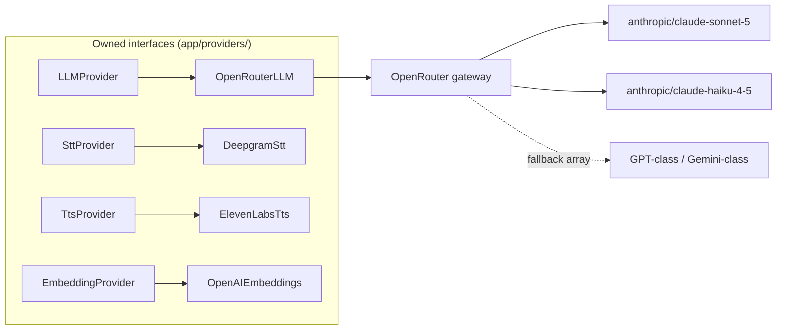

# Technology Stack & Decision Records

This document justifies every technology in the stack — one summary table, five full architecture decision records (ADRs), a table of things we deliberately did *not* use with the conditions that would flip each decision, and the authoritative cost-per-call model that every other doc references. The ADRs here are locked per the canon: sibling docs cite them, they do not relitigate them.

**Read this with:** [docs/02](02-system-architecture.md) for where each piece sits, [docs/06](06-voice-pipeline.md) for the latency budget these choices must hit, [docs/09](09-memory-architecture.md) for how the data layer is used, and [docs/17](17-roadmap.md) for when the deferred pieces arrive.

---

## 1. Stack summary

| Layer | Choice | Why (one line) |
|---|---|---|
| Android language | Kotlin | The author's home turf; the Android app is the Kotlin showcase of this portfolio |
| Android UI | Jetpack Compose | The semantics tree Compose maintains for accessibility is exactly what `UiTreeCollector` mines for ScreenContext ([docs/07](07-ui-semantic-context.md)) |
| Android DI | Hilt | Boring, standard, lets `VoiceCallService` and `AppStateManager` share scoped state without ceremony |
| Android RTC | LiveKit Android SDK | Client half of ADR-001; wrapped in `WebRtcClient` so the app never imports LiveKit types outside `:voice` |
| Backend language | Python 3.12 | Voice-AI ecosystem gravity — see §4 for the honest version |
| Backend web | FastAPI | Async-native, Pydantic-integrated request validation at the boundary, OpenAPI for free on the seeded business APIs |
| Voice orchestration | LiveKit Agents (Python) | ADR-002: the framework moves audio; we own the intelligence |
| ORM / migrations | SQLAlchemy 2.0 async + Alembic | One async session per request/turn; migrations as code from day one, not "later" |
| Config | pydantic-settings | Typed env parsing; missing secrets fail at startup, not at first call ([docs/14](14-security.md)) |
| Logging | structlog | JSON logs with bound `session_id`/`turn_id` on every line; greppable, trace-correlated |
| WebRTC SFU | LiveKit (self-hosted OSS) | ADR-001; one compose container replaces months of aiortc plumbing |
| STT | Deepgram Nova-3 (streaming) | ~$0.0077/min, streaming partials, 80/150 ms finalization after endpoint (canon latency table) |
| TTS | ElevenLabs Flash v2.5 | Lowest-latency tier (~75 ms model latency); TTFB 120/250 ms is the second-largest turn cost after the LLM |
| LLM gateway | OpenRouter | One API key, one wire format, per-request fallback arrays; no vendor SDK sprawl behind `LLMProvider` |
| Dialogue model | Claude Sonnet 5 — `anthropic/claude-sonnet-5` | $3.00/M input, $15.00/M output; the quality bar for tool-calling + tone in a support call |
| Utility model | Claude Haiku 4.5 — `anthropic/claude-haiku-4-5` | $1.00/M input, $5.00/M output; summarization every 6 turns, intent classification, context compression |
| Embeddings | OpenAI `text-embedding-3-small` | $0.02/M tokens, dim 1536; cheap enough that embedding every call summary costs fractions of a cent |
| Primary store | Postgres 16 + pgvector | ADR-003: one durable store for fixtures, profiles, summaries, *and* vectors |
| Cache / session | Redis 7 | ADR-003: `session:{id}` hot state read inside the 15/40 ms context-assembly budget |
| Tracing | OpenTelemetry → Tempo | ADR-005: one trace per conversation turn, spans matching the canon names |
| Dashboards | Grafana | The 90-second demo ends on a Grafana trace and a cost row — observability is a feature, not plumbing |
| Runtime | Docker Compose | Whole stack on one machine; Kubernetes deliberately deferred (§3) |

Model IDs are **config-driven current defaults**, not constants: `OPENROUTER_DIALOGUE_MODEL` and `OPENROUTER_UTILITY_MODEL` in env, fallback models in the OpenRouter request's `models: [...]` array. Every vendor sits behind an owned interface:

The interfaces are not speculative generality: the embedding provider has three plausible successors (Voyage, local BGE), the TTS provider two (Cartesia, Azure), and the swap cost with the interface is one file per provider.

---

## 2. Decision records

Format per record: Context / Decision / Consequences / Rejected alternatives / **Flips when** — the last field is the honesty check. A decision without a flip condition is a belief, not a decision.

### ADR-001 — WebRTC transport: self-hosted LiveKit

**Context.** The call is bidirectional low-latency audio between an Android app and a Python worker, plus a reliable ordered data channel for ScreenContext deltas. The canon latency budget allots the entire transport chain (Opus encode + SFU forward + client jitter buffer) 75 ms p50 / 140 ms p95. That requires production-grade ICE/TURN traversal, echo cancellation, adaptive jitter buffering, and session resume on network change — on mobile, over Indian cellular networks. Team size: one.

**Decision.** Self-host the LiveKit OSS server in compose. The Android app connects via the LiveKit Android SDK (wrapped in `WebRtcClient`); the backend `voice-worker` joins the same room as a participant via the LiveKit Agents SDK. Tokens are server-minted, room-scoped, 5-minute TTL ([docs/14](14-security.md)).

**Consequences.** SFU, TURN, Opus, jitter buffering, reconnection, token auth, and data channels arrive as one container instead of five subsystems. The room/participant model gives audio and context a shared lifecycle (exploited by ADR-004). Costs: one more stateful service in compose, a learning curve on LiveKit's room semantics, and protocol-level coupling to LiveKit — mitigated by confining the dependency to `WebRtcClient` on Android and `VoiceAgentWorker` on the backend; nothing above those two classes knows LiveKit exists.

**Rejected alternatives.**
- *Raw aiortc* (Python WebRTC): you own ICE edge cases, TURN deployment, echo cancellation, jitter tuning, and Android interop testing. For a solo builder that is months of plumbing before the first conversation — the option that never ships.
- *libwebrtc via NDK directly*: same problem plus a C++ build tax on the Android side.
- *Pipecat*: an orchestration framework, not a transport — it still needs LiveKit/Daily/WebSocket underneath, so it does not answer this question (it answers ADR-002's, where it is also rejected).
- *Managed CPaaS (Agora, Twilio Voice)*: per-minute fees, closed source, and "integrated a CPaaS" is weaker portfolio signal than "ran an SFU."

**Flips when:** PSTN dial-in/out becomes a requirement (add LiveKit SIP or a Twilio bridge), or self-hosting ops cost exceeds the LiveKit Cloud bill at real traffic — the SDKs are identical either way, which is half the reason LiveKit won.

### ADR-002 — LiveKit Agents runs the media loop; the intelligence stays custom

**Context.** The voice loop — VAD, endpointing, turn detection, barge-in within 250 ms, streaming STT/TTS glue — is subtle asyncio engineering with years of tuning baked into good implementations. But this project's thesis lives one layer up: context, memory, tools, prompting, routing. Frameworks in this space tend to swallow both layers; hand-rolling tends to ship neither well.

**Decision.** Use LiveKit Agents for exactly the media loop: Silero VAD, the LiveKit turn detector, interruption mechanics, audio track plumbing — confined to `app/voice/VoiceAgentWorker`. Our providers (`DeepgramStt`, `ElevenLabsTts`, `OpenRouterLLM`) plug in as custom nodes. Everything above — `SessionManager`, `ConversationManager`, `PromptBuilder`, `ContextBuilder`, `ToolExecutor`, `LLMRouter`, `SafetyLayer` — is framework-agnostic owned code. The framework's own agent/function-calling abstractions are deliberately not used.

**Consequences.** Barge-in ≤ 250 ms comes from battle-tested code rather than a semester of tuning; the docs/06 budget assumes mature VAD and would be dishonest otherwise. Costs: one adapter layer to maintain, framework version churn to track, and constant discipline to keep intelligence out of `app/voice/` — the module boundary is the enforcement mechanism, and code review treats an import of `livekit` outside it as a defect.

**Rejected alternatives.**
- *Hand-rolled asyncio pipeline*: educational, and the endpoint-detection tuning alone would eat the schedule while demoing worse latency than the framework's defaults.
- *Pipecat*: a real alternative, but its pipeline abstraction sits exactly on the layer we want to own (the agent loop), and it couples orchestration to transport choices we already made in ADR-001.
- *LiveKit Agents' built-in `Agent` class end-to-end*: its LLM loop, tool dispatch, and prompt management would hide the ~200 lines of engineering this project exists to demonstrate.

**Flips when:** the framework's node API stops exposing something the latency budget needs (e.g., per-token TTS scheduling or custom endpoint heuristics). Then the media loop gets hand-rolled and the providers survive unchanged — justified post-Phase 6, not before.

### ADR-003 — Data: Postgres 16 + pgvector + Redis 7, nothing else

**Context.** The data needs, enumerated: relational seeded business fixtures; durable user-profile memory; conversation summaries; vector search over summaries + KB articles (cosine top-3, 1536-dim, [docs/09](09-memory-architecture.md)); per-session hot state readable inside the 15 ms p50 context-assembly budget; and an event stream for context ingestion. Demo scale: thousands of vectors, tens of concurrent sessions.

**Decision.** One Postgres 16 instance carries everything durable — relational tables, JSONB where shapes vary, pgvector with an HNSW index for semantic memory. Redis 7 carries the hot path: `session:{id}` hashes, `ctx:{session_id}`, `rate:{user_id}`, and Redis Streams where fan-out is needed.

**Consequences.** Two containers, one backup story, and SQL joins across business data and memory (e.g., "summaries for merchants with open complaints" is one query, not an API stitch). Summary + embedding write in one transaction. At demo scale, pgvector HNSW answers top-3 in single-digit milliseconds. Costs: pgvector degrades past ~10M vectors under high QPS; Redis Streams lack Kafka's replay and partitioning semantics; JSONB invites schema rot without discipline.

**Rejected alternatives.**
- *Pinecone/Qdrant*: a third stateful system, a network hop in the turn path, and (Pinecone) a bill — to serve fewer than 10k vectors. Runs afoul of the same test everything here faces: does it earn its container?
- *Kafka*: event-bus semantics with no second consumer to justify them; the compose footprint and ops surface are wildly out of proportion at one-node scale.
- *MongoDB*: every document-shaped need is covered by JSONB, and choosing it would sacrifice the joins above.

**Flips when:** vector count approaches ~10M or recall/latency SLOs fail under load → Qdrant behind the existing `SemanticMemory` retriever interface. Multiple services need replayable event fan-out → Kafka or Redpanda. Neither flip touches calling code; that is what the interfaces bought.

### ADR-004 — Context transport: LiveKit data channel, not a second socket

**Context.** ScreenContext deltas and app events must flow app → backend *during* the call, ordered, and correlated with the audio session. The initial snapshot has a different constraint: the greeting is composed from it before any audio flows, so it must arrive at session creation, before the room exists.

**Decision.** Split by lifecycle. The initial full snapshot rides `POST /v1/sessions` (REST, before connect). In-call deltas and events use the LiveKit data channel — reliable + ordered, topic `ctx`, envelope `{"v":1, "type":..., "seq":..., "ts":..., "payload":...}` with client-monotonic `seq`; the backend detects a `seq` gap and requests a fresh full snapshot ([docs/07](07-ui-semantic-context.md)).

**Consequences.** One connection, one auth artifact (the room token), one reconnect story: if the call is alive, context flows; if the call drops, stale context is impossible by construction. Ordering is a transport guarantee; gaps are detectable, not silent. Costs: reliable data-channel messages have a ~15 KB practical payload ceiling — which is a feature, since it enforces the compact ≤300-token IR rather than permitting raw-tree dumps; and the channel dies with the room, which is why the pre-call snapshot had to go over REST.

**Rejected alternatives.**
- *Separate WebSocket*: a second connection to authenticate, keep alive, reconnect, and correlate with the room by session ID — double the failure modes (socket up / call down, and vice versa) purchasing nothing the data channel lacks.
- *REST polling for deltas*: latency floor and mobile battery cost, plus server-side ordering bookkeeping the data channel gives for free.

**Flips when:** context needs to outlive calls — e.g., ambient pre-call context streaming so the agent is warm before the user taps Call Support. That is a persistent-channel requirement no room-scoped transport can meet; it would justify a standalone WebSocket/gRPC stream, added alongside, not replacing, this design.

### ADR-005 — Observability: structlog + OpenTelemetry + Grafana/Tempo, evals deferred

**Context.** A voice agent's two falsifiable claims are latency and cost. The docs/06 budget decomposes a ~1.0 s turn into seven stages; the cost model below claims ≈ $0.30/call. Neither claim is honest without per-turn instrumentation. Separately, there is a whole industry of LLM eval/observability platforms asking to be adopted on day one.

**Decision.** structlog JSON logs with bound session/turn context; one OpenTelemetry trace per conversation turn with the canon span names — `turn` → `stt.final`, `context.build`, `llm.ttft`, `llm.total`, `tool.exec.<name>`, `tts.first_byte` — carrying latency ms, input/output tokens, and cost USD as attributes; exported to Tempo, viewed in Grafana, all inside compose. `CostTracker` finalizes a per-call cost row at hang-up.

**Consequences.** Every latency number in this doc set is reproducible from a trace, and the demo's closing shot (Grafana trace + cost row) costs zero SaaS spend and zero vendor lock. Costs: no transcript-level quality scoring, no regression suites, no alerting/SLOs — all deferred to Phase 6 deliberately, because traces answer "where did the second go" and evals answer "is the agent good," and this phase's claims are all of the first kind.

**Rejected alternatives.**
- *Langfuse / Arize Phoenix / Braintrust now*: adopting an eval platform before there is an eval set is cargo-culting; Phase 6 adds one alongside OTel (not replacing it) once there are transcripts worth scoring.
- *Datadog*: a SaaS bill and vendor lock on a portfolio repo whose reviewers should be able to `docker compose up` the entire observability story.
- *Plain logs only*: cannot decompose a 1,000 ms turn into seven stages without becoming a bespoke worse tracer.

**Flips when:** Phase 6 begins (eval platform lands per [docs/17](17-roadmap.md)); alerting and SLOs when there are real users to page for — paging a solo developer about a demo is theater.

---

## 3. Deliberately not used

This table is a feature, not a list of omissions. Each row was considered, priced, and cut with a named flip condition — the difference between a small stack and a naive one.

| Technology | Why it is absent | Flips when |
|---|---|---|
| Kafka | Event-bus semantics with one producer and one consumer; Redis Streams cover the demo (ADR-003) | A second service needs replayable, partitioned event fan-out |
| MongoDB | Postgres JSONB covers every document-shaped need without giving up joins (ADR-003) | Never, on current evidence — this one is a rejection, not a deferral |
| Pinecone / Qdrant | A third stateful system to serve < 10k vectors; pgvector answers top-3 in single-digit ms (ADR-003) | ~10M vectors or failed recall/latency SLOs → Qdrant behind `SemanticMemory` |
| Kubernetes | One machine runs the whole stack; K8s would triple the ops surface to demonstrate deployment skills this project is not about | Multi-node scale, rolling deploys, or an SRE audience; compose files are written to translate cleanly |
| Pipecat | Orchestrates the layer we want to own, and couples to transport choices already made (ADR-001, ADR-002) | LiveKit Agents dies as a project and a migration target is needed |
| Raw aiortc | Months of transport plumbing before the first conversation; the option that never ships (ADR-001) | Never for this project; it is the right tool for protocol research, not products |
| LangChain / agent frameworks | The agent loop is ~200 lines of owned code — prompt build, LLM call, tool dispatch, safety gate. A framework would hide exactly the engineering this project exists to demonstrate, behind abstractions sized for problems we do not have | The loop grows genuine multi-agent orchestration needs (parallel sub-agents, complex graphs) — not before |
| Eval platform (Langfuse / Phoenix) | No eval set exists yet to run on it (ADR-005) | Phase 6, by plan, with a transcript corpus to score |

---

## 4. Why Python on the backend, from a Kotlin developer

The honest answer is ecosystem gravity, not language preference. The author's production experience is Kotlin/Android, and a Ktor backend was the comfortable option — but in voice AI, Python is where the ecosystem actually lives: LiveKit Agents is Python-first (the Node port trails it; there is no JVM port), Silero VAD ships as a Python-consumable model, and Deepgram, ElevenLabs, and OpenRouter all treat their Python SDKs as the reference implementation. Choosing Kotlin for the backend would have meant hand-porting the media loop that ADR-002 explicitly decided not to write, and debugging streaming-audio interop against SDKs whose examples, issues, and fixes are all written for Python. Two smaller reasons made it easier to accept: a portfolio that shows Compose semantics-tree work on Android *and* an async Python service demonstrates range that a single-language repo cannot, and the Android app remains the Kotlin showcase — `:core:screencontext` and the `SemanticSnapshotBuilder` are the most original Kotlin in the project. The known cost is that async Python punishes the unwary (one blocking call in the event loop stalls every session on the worker); the mitigations are structural — SQLAlchemy async end-to-end, no sync HTTP clients, and the per-turn OTel spans from ADR-005, which make an accidental stall show up as an anomalous `context.build` span rather than a mystery.

---

## 5. Cost per call — the authoritative table

This section owns the canonical number every other doc cites: **≈ $0.30 (~₹25) per call** with prompt caching. Pricing verified 2026-07 against vendor pages: [OpenRouter model listings](https://openrouter.ai/models), [Anthropic pricing](https://www.anthropic.com/pricing), [Deepgram pricing](https://deepgram.com/pricing), [ElevenLabs pricing](https://elevenlabs.io/pricing), [OpenAI API pricing](https://openai.com/api/pricing/). Claude Sonnet 5 carries an intro price of $2/$10 per M through 2026-08-31; the model below budgets at **list** ($3/$15) so the numbers survive September.

### Assumptions (the canonical 5-minute call)

| Assumption | Value | Source |
|---|---|---|
| Call length / agent turns | 5 min / 15 turns | Canon; [docs/06](06-voice-pipeline.md) |
| Dialogue LLM invocations | ~20 (15 turns; ~5 tool turns add a second invocation for the tool loop) | Transcript pattern in [docs/01](01-product-and-use-case.md) §8 |
| Avg input / output per invocation | ~2,200 / ~80 tokens | Budget ≤ 2,500 in, ≤ 150 out ([docs/11](11-prompt-engineering.md)) |
| Cached prefix per invocation | ~1,400 tokens (stable slots ordered first) | [docs/11](11-prompt-engineering.md) |
| Cache pricing | reads 10% of input price, writes 1.25× | Anthropic prompt-caching rates via OpenRouter |
| Utility calls | 2 Haiku summarizations + classification, ~10k tokens total | Summarize every 6 turns ([docs/09](09-memory-architecture.md)) |
| Agent speech | ~2.5 of 5 minutes ≈ 2,300 TTS characters | Half-duplex conversation, short voiced answers |

### Per-call cost

| Component | Basis | Without caching | With caching |
|---|---|---|---|
| STT — Deepgram Nova-3 | 5 min × $0.0077/min | $0.04 | $0.04 |
| LLM dialogue — Claude Sonnet 5 | ~44k in / ~1.6k out across 20 invocations | $0.15 | $0.09 |
| LLM utility — Claude Haiku 4.5 | ~10k tokens across summaries + classification | $0.01 | $0.01 |
| Embeddings — text-embedding-3-small | Post-call summary + retrieval queries, ~2k tokens | <$0.001 | <$0.001 |
| TTS — ElevenLabs Flash v2.5 | ~2,300 chars at starter-tier rates | $0.15 | $0.15 |
| LiveKit (self-hosted) | Amortized compute, ≈$0 marginal per call | $0.00 | $0.00 |
| **Total** | | **≈ $0.35** | **≈ $0.30 (~₹25)** |

Caching mechanics: the stable prefix (system + persona + business rules, byte-identical across turns — see the turn accounting in [docs/01](01-product-and-use-case.md) §8) is written once at 1.25× and read 19 times at 10% of input price, cutting dialogue input cost by ~45%. The remaining per-turn variable tail (screen context, window, utterance) is uncacheable by nature.

Three observations the table forces:

1. **TTS is the biggest line item (50% of the cached total), not the LLM.** Every "LLM costs will kill voice agents" take has this backwards at current prices; the first cost negotiation at scale is with ElevenLabs, not Anthropic.
2. **Caching is worth ~$0.06/call — 17%** — and costs nothing but slot ordering discipline in the prompt builder. It is the cheapest optimization in the entire system.
3. **Embeddings are a rounding error.** Any architecture debate about embedding costs at this scale is procrastination.

### Monthly projection — 1,000 calls/day

Straight multiplication (30,000 calls/month), then honest adjustments:

| Component | Monthly (list prices, cached) | Note at volume |
|---|---|---|
| STT | $1,160 | Deepgram growth tier (~$0.0058/min) → ~$870 |
| LLM (dialogue + utility) | $2,900 | Sonnet 5 intro pricing (through 2026-08) would cut ~33% |
| TTS | $4,500 | Business-tier per-char rates are the single biggest lever; realistic target ~$2,500–3,000 |
| Embeddings | ~$5 | — |
| LiveKit self-hosted infra | $200–400 | 2 media VMs + TURN egress — infrastructure, not per-call |
| **Total** | **≈ $8,800/mo ≈ ₹7.4 lakh** | ≈ $0.29/call before volume discounts; plausibly ≈ $0.21 after |

For calibration: a human support agent handling the same 5-minute call costs an Indian BPO roughly ₹80–150 fully loaded. At ₹25 list — before volume discounts — the agent is 3–6× cheaper *and* answers at second zero with the screen already read. That arithmetic, not the technology, is the business case; the demo/production honesty caveat is that these are list-price projections from a seeded demo, and production would add real-rail costs (PSP fees, telephony if PSTN lands) that belong to VyaparPay's P&L, not the agent's.

### Demo vs production cost handling

| Aspect | Demo (this repo) | Production evolution |
|---|---|---|
| Cost tracking | `CostTracker` writes a per-call row from provider usage fields; shown in Grafana | Same rows feeding budget alerts and per-merchant unit-economics dashboards |
| Pricing data | Constants in config, verified 2026-07 | Pulled from vendor billing APIs; alert on unit-price drift |
| Volume pricing | List prices assumed | Negotiated tiers (Deepgram growth, ElevenLabs business, OpenRouter volume) |
| Cost attribution | Per call | Per call, per tool, per model — the OTel span attributes already carry the split |

---

## 6. What this document exports

| Fixed here | Value | Heaviest consumer |
|---|---|---|
| ADR-001..005 | Locked; sibling docs cite, never relitigate | [docs/02](02-system-architecture.md), [docs/06](06-voice-pipeline.md) |
| Model defaults + pricing | Sonnet 5 $3/$15, Haiku 4.5 $1/$5, embeddings $0.02/M — config-driven | [docs/11](11-prompt-engineering.md), [docs/09](09-memory-architecture.md) |
| Canonical cost per call | ≈ $0.30 (~₹25) cached; ≈ $0.35 uncached | Every doc that mentions cost |
| The not-used table | Each absence has a named flip condition | [docs/17](17-roadmap.md) |
