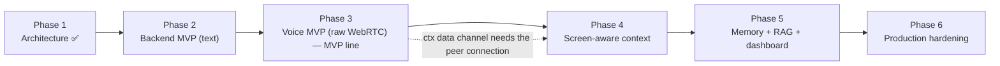

# Roadmap & Future Enhancements

This document is the build plan and the wish list, kept honestly apart. The first half is the six-phase implementation roadmap — what gets built, in what order, and the checkable condition that closes each phase — sized in the only unit that is true for a solo portfolio project: evenings and weekends. The second half is the future-enhancements catalog: the features this architecture was shaped to make cheap later, each tied to the seam it plugs into. Phase 1 (this doc set) is done; everything after it is planned, and this doc says so plainly rather than describing unbuilt code in the present tense.

**Read this with:** [docs/01](01-product-and-use-case.md) for the product and the canonical incident every phase is measured against, [docs/16](16-tech-stack.md) for the locked stack and the deferred-tech table whose flip conditions this roadmap schedules, and [docs/05](05-agent-architecture.md) for the agent loop that Phases 2–6 progressively fill in.

---

## 1. How to read this roadmap

### 1.1 The unit is an evening, not a sprint

This is a one-person project built around a job. Sizing it in "story points" or "weeks" would be theatre. The honest units:

- **1 evening** ≈ 2 focused hours on a weeknight.
- **1 weekend** ≈ 6 hours across Saturday/Sunday (never a clean 12 — there is a life attached).

Estimates below are ranges, and they are the estimates of someone who has been wrong about estimates before. The Android/Kotlin work is home turf ([docs/16](16-tech-stack.md) §4) and estimated tighter; the async-Python voice worker is newer ground and padded accordingly.

| Phase | Goal in one line | Rough effort | Cumulative |
|---|---|---|---|
| 1 — Architecture | The doc set you are reading | ~15 evenings | ~15 ev |
| 2 — Backend MVP | The brain works over text | ~6 weekends + ~8 ev | +~44 h |
| 3 — Voice MVP (raw WebRTC) | It is a real voice agent, on a transport we own | ~12 weekends | +~72 h |
| 4 — Screen-aware context | The signature capability | ~5 weekends | +~30 h |
| 5 — Memory + RAG + dashboard | It remembers and it is observable | ~4 weekends | +~24 h |
| 6 — Production hardening | Evals, load, CI, security pass | ~5 weekends | +~30 h |

Total after Phase 1: roughly **220 hours** of evenings and weekends — call it five to six calendar months at a sustainable part-time pace. That number is deliberately unglamorous; a roadmap that claims a screen-aware voice agent on a hand-rolled WebRTC stack ships in three weekends is lying to the reviewer reading it. Phase 3 in particular is priced for owning signaling, NAT traversal, and the VAD/endpointing pipeline ourselves (ADR-001, ADR-002) — the three problem classes a managed platform would otherwise have absorbed.

### 1.2 Why this order

The dependency spine is not arbitrary. Two ordering choices carry the most weight and both are defended here.

**Text agent before voice (Phase 2 before Phase 3).** The entire thesis of this project lives above the media loop — context assembly, prompt building, tool dispatch, safety gating, LLM routing ([docs/05](05-agent-architecture.md), ADR-002 in [docs/16](16-tech-stack.md)). That logic is identical whether the transport is a WebSocket text frame or an Opus audio stream. Building it first against a text harness means every bug is a *logic* bug reproduced instantly and deterministically, not a heisenbug hiding behind audio flakiness, VAD timing, and a 1-second turn budget. Debugging a hallucinated balance is hard; debugging it while also fighting jitter buffers is masochism. So the brain gets built and proven in a REPL-speed loop, then the voice pipeline wraps a component that already works.

**Voice before screen-context (Phase 3 before Phase 4).** This is the counter-intuitive one — the screen-aware opener is the headline capability, so why not build it first? Because it is a *multiplier on a working call*, not a prerequisite for one. A voice call that greets Rajesh with profile context alone already demos as a competent agent; the screen-aware cold-open makes that same call extraordinary. Sequencing puts the highest-risk, everything-depends-on-it integration (signaling, ICE/NAT traversal, the latency budget, barge-in) first, so it is de-risked while the schedule still has slack, and layers the signature capability onto a proven call rather than betting the signature capability on an unproven transport. There is also a hard dependency: the in-call ScreenContext delta channel is the native `RTCDataChannel` (label `ctx`, ADR-004), which does not exist until the peer connection does — Phase 3 has to establish the call before Phase 4 can stream context through it.

Each phase below ends with a **portfolio milestone**: a demo artifact worth recording, because a phase that produces nothing showable is a phase that is easy to abandon.

### 1.3 Component build matrix

The components are frozen by name in the canon before any of them exist; this maps each to the phase it first comes alive, so "which phase am I in" has an unambiguous answer at the module level. A component appearing in a later phase does not mean it is untouched earlier — `SafetyLayer`, for instance, exists in Phase 2 but only gains PII redaction in Phase 6.

| Component group | Phase 2 (text) | Phase 3 (voice) | Phase 4 (screen) | Phase 5 (memory) | Phase 6 (harden) |
|---|---|---|---|---|---|
| Agent loop ([docs/05](05-agent-architecture.md)) | `SessionManager`, `ConversationManager`, `ContextBuilder`, `PromptBuilder`, `ToolExecutor`, `LLMRouter`, `SafetyLayer`, `CostTracker` | — | context slots wired | `Summarizer` | eval hooks, redaction |
| Providers ([docs/16](16-tech-stack.md)) | `OpenRouterLLM` | `DeepgramStt`, `ElevenLabsTts` | — | `OpenAIEmbeddings` | fallback arrays proven |
| Voice ([docs/06](06-voice-pipeline.md)) | — | `SignalingServer`, `PeerSession`, `AudioIngress`, `VadEndpointer`, `AudioEgress`, `VoiceAgentWorker` (the `voice-worker` service) | data-channel deltas | — | load-tested |
| Android call ([docs/03](03-android-architecture.md)) | — | `SupportButton`, `VoiceCallService`, `SignalingClient`, `WebRtcClient`, `CallStateMachine`, `ConversationOverlay`, `PermissionManager` | — | — | debug-build polish |
| Android context ([docs/07](07-ui-semantic-context.md)) | — | — | `UiTreeCollector`, `SemanticSnapshotBuilder`, `NavigationTracker`, `EventTracker`, `ScreenContextPublisher`, `AppStateManager` | — | injection hardening |
| Backend context ([docs/08](08-context-and-events.md)) | — | — | `SnapshotIngestor`, `EventLog`, `ContextCompressor` | — | — |
| Memory ([docs/09](09-memory-architecture.md)) | `ShortTermMemory`, `SessionMemory` | — | — | `UserProfileMemory`, `SemanticMemory`, `ConversationSummaryStore` | — |

Two things this matrix makes honest. First, Phase 3 is the widest column on *both* sides — seven new Android components and the entire hand-rolled `voice/` package at once — which is why it is the largest effort estimate. Second, the memory subsystem is genuinely absent until Phase 5; the earlier phases run on `SessionMemory` (a Redis transcript window) alone, and the docs that describe the full memory model are describing a Phase 5 target, not Phase 2 reality.

### 1.4 Not on this roadmap at all

Distinct from the future-enhancements catalog (§4, things the architecture invites *later*), these are things deliberately excluded from the whole plan — they appear in [docs/01](01-product-and-use-case.md) §9's non-goals and stay out here so no phase quietly absorbs them.

| Excluded | Why it is not even in §4 | Reconsidered only if |
|---|---|---|
| Real payment execution | The agent is the project; a real rail adds risk and zero demo signal | VyaparPay becomes a real product, not a portfolio piece |
| iOS app | One client proves the platform-neutral screen-context contract; a second is duplicated effort | A reviewer specifically needs cross-platform evidence |
| Multi-store accounts (Meena, [docs/01](01-product-and-use-case.md) §6) | Tool contracts already permit the filters; building the UI now is speculative | A concrete multi-store demo scenario is scripted |
| In-app text chat as a shipped surface | Text mode is the Phase 2 harness only, never a product surface | Never — it would dilute the voice thesis |
| Kubernetes / multi-region | One machine runs the whole stack ([docs/16](16-tech-stack.md) §3) | The §2.7 flip condition (multi-node scale) actually arrives |

The line between §1.4 and §4 is the line between "the architecture forbids the assumption that this is coming" and "the architecture left a seam for it." Everything in §4 has a seam; nothing in §1.4 does, by choice.

---

## 2. The six phases

### 2.1 Phase 1 — Architecture ✅ (complete)

**Goal.** A design a reviewer can audit before a line of application code exists: names frozen, numbers owned by exactly one doc, the canonical incident traceable end to end.

**Delivered.**

- The document set in [docs/](.) — product selection, system and per-layer architecture, voice pipeline, screen context, memory, tools, prompting, data models, API contracts, tech stack and ADRs, and this roadmap.
- The single source of truth (`CANON.md`) that every doc is checked against — one owning doc per number (latency [docs/06](06-voice-pipeline.md), tokens [docs/11](11-prompt-engineering.md), cost [docs/16](16-tech-stack.md)).
- Six locked ADRs ([docs/16](16-tech-stack.md)) with explicit flip conditions.

**Out of scope.** Any runnable code. The repo skeleton and module layout exist; the modules are empty shells.

**Exit criteria (met).** Every canonical number resolves to one owning doc; the canonical incident (Rajesh, ₹245 → Amazon Business, `402 DAILY_LIMIT_EXCEEDED`) traces cleanly from screen capture through tool call to cost row across the set; cross-doc links resolve; no doc contradicts the canon.

**Effort.** ~15 evenings.

**Key risks.** The main risk is over-designing ahead of code — writing contracts that implementation cannot honour. Mitigation: every doc carries a Demo vs Production split and a failure-mode table, which forces the design to stay honest about what will actually be built versus what is aspirational.

### 2.2 Phase 2 — Backend MVP (text agent, no voice)

**Goal.** The full intelligence loop working over text, resolving the canonical scenario against seeded data.

**Scope.**

- Docker Compose stack up: `agent-api` (FastAPI), Postgres 16 + pgvector, Redis 7 ([docs/16](16-tech-stack.md), ADR-003).
- Seeded business fixtures — Rajesh, Kumar General Store, the ₹18,450 wallet, the declined ₹245 payment — with a reset script ([docs/01](01-product-and-use-case.md) §5, [docs/12](12-data-models.md)).
- Business APIs returning scripted state, including `POST /payments` → `402 DAILY_LIMIT_EXCEEDED`.
- The agent loop: `SessionManager`, `ContextBuilder`, `PromptBuilder`, `LLMRouter` → `OpenRouterLLM` (Sonnet 5), `ToolExecutor`, `SafetyLayer`, `CostTracker` ([docs/05](05-agent-architecture.md)).
- The read tools and at least one confirm-gated write: `get_wallet_balance`, `get_payment_status`, `request_limit_increase` ([docs/10](10-tool-calling.md)).
- A text harness (WebSocket or CLI) that stands in for the voice front end — the Phase 2 development surface only, never a shipped feature ([docs/01](01-product-and-use-case.md) §9).
- Per-turn OpenTelemetry spans emitting from day one (ADR-005), so latency instrumentation predates the latency-sensitive code.

**Out of scope.** The WebRTC transport (signaling, coturn, aiortc), STT, TTS, the Android app, screen context, RAG retrieval, the memory subsystem beyond a transcript window in Redis.

**Exit criteria.** A scripted text conversation resolves the canonical scenario end to end: the agent explains the wallet-vs-bank-limit contradiction using **real** `get_wallet_balance` + `get_payment_status` tool calls against seeded Postgres data (no hallucinated figures — the canon rule holds), then executes `request_limit_increase` only after an explicit confirmation, and returns a reference number. Each turn emits one OTel trace with the canon span names.

**Effort.** ~6 weekends + ~8 evenings.

**Key risks.**

- *Tool-loop correctness* — the LLM calling a tool, receiving the result, and composing a grounded answer is the loop everything else rides on; getting the message-format and idempotency plumbing right is fiddly. Mitigation: build it against text where a failed loop is visible in one scrollback.
- *Async Python foot-guns* — one blocking call stalls every session ([docs/16](16-tech-stack.md) §4). Mitigation: SQLAlchemy async end to end, no sync HTTP clients, watch the `context.build` span for anomalies.

**Portfolio milestone.** A screen recording of a text chat (or terminal) resolving Rajesh's incident with real tool calls, ending on the Grafana trace for the turn. Proves the brain works before any audio exists.

### 2.3 Phase 3 — Voice MVP (raw WebRTC) — the MVP line

**Goal.** Turn the text agent into a real phone call on a transport we own end to end: the merchant taps a button and talks to Asha, who answers with **profile** context. This is the [minimal demo-able product](#3-mvp-what-the-minimum-viable-demo-is) — see §3.

**Scope.**

- Signaling and NAT traversal: `SignalingServer` hosting the `/v1/signal` WebSocket (offer/answer, trickle ICE, `bye`, keepalive — [docs/13](13-api-contracts.md)); **coturn** in compose serving STUN+TURN with UDP/TCP/TLS fallback (ADR-006); `POST /v1/sessions` minting the one-time signaling token plus 10-min HMAC TURN credentials in `ice_servers`.
- The backend peer: aiortc `PeerSession` per call — SDP answer, trickle ICE, DTLS-SRTP, audio tracks in/out, the `ctx` data channel accepted for later phases (ADR-001).
- The hand-rolled pipeline (ADR-002, [docs/06](06-voice-pipeline.md)): `AudioIngress` (Opus → 16 kHz PCM) → `VadEndpointer` (Silero VAD, endpointing, barge-in detection) → `DeepgramStt` (Nova-3 streaming) → the Phase 2 agent loop → `ElevenLabsTts` (Flash v2.5) → `AudioEgress` (48 kHz outbound track, playout cancellation), all wired by `VoiceAgentWorker` in one asyncio task group.
- Android call surface: `SupportButton`, `VoiceCallService` (foreground), `SignalingClient` (OkHttp WS), `WebRtcClient` (`org.webrtc` directly — `PeerConnection`, `createOffer`, trickle ICE, ICE restart on network change), `CallStateMachine`, `ConversationOverlay` with live transcript, `PermissionManager` for mic ([docs/03](03-android-architecture.md)).
- Streaming discipline throughout: STT partials, LLM tokens, sentence-level TTS dispatch, barge-in ([docs/06](06-voice-pipeline.md)).

**Out of scope.** Screen context (Phase 4) — the opening line is a profile-aware greeting ("Hi Rajesh, how can I help?"), not the screen-aware cold-open yet. RAG, semantic memory, multi-turn summarization beyond the raw window.

**Exit criteria.** On a side-loaded debug APK, Rajesh taps `SupportButton`, the overlay opens, and the canonical 9-turn conversation ([docs/01](01-product-and-use-case.md) §8) completes over real bidirectional audio — the merchant *speaks* the problem, the agent answers with tool-fetched figures, the confirm-gated `request_limit_increase` executes, and the call ends on a summary card. The call connects **both** peer-to-peer via STUN **and** with the client forced to relay-only, proving the coturn path works before a symmetric-NAT carrier network forces it in a live demo. Call setup (session POST → first media) lands within the ≤1.5 s p50 budget ([docs/06](06-voice-pipeline.md)), barge-in stops TTS within the ≤250 ms target **measured** from the `VadEndpointer` trigger to the last emitted audio frame, and a demo run holds turn p50 ≤ 1.0 s / p95 ≤ 2.0 s.

**Effort.** ~12 weekends — the largest single phase by a wide margin, and honestly larger than a managed-platform build would have been. The premium is the point of ADR-001: signaling, ICE/NAT traversal, and VAD/endpointing/barge-in are problems a platform SDK would have absorbed, and here each is owned, debugged, and tunable code. Roughly a third of the estimate is the WebRTC plumbing (signaling protocol, coturn, aiortc session lifecycle), a third the pipeline (`AudioIngress`/`VadEndpointer`/`AudioEgress` and their tuning), and a third the Android call surface.

**Key risks.**

- *The latency budget is a claim that can fail.* Seven stages must sum under ~1 s p50, and call setup has its own ≤1.5 s budget ([docs/06](06-voice-pipeline.md)). Mitigation: the OTel spans from Phase 2 decompose any miss into a stage; prompt-prefix caching, speculative prefetch, and trickle ICE (media on the first working candidate pair) are in the design, not bolted on.
- *NAT traversal is now ours to get wrong* — symmetric NAT on Indian mobile carriers, TURN credential expiry mid-call, ICE restart on Wi-Fi↔cellular handoff. Mitigation: coturn's TCP/TLS fallback, the forced-relay exit criterion above, and `WebRtcClient`'s ICE-restart re-offer path exercised deliberately (airplane-mode toggles), not discovered in a demo.
- *Hand-rolled barge-in and endpointing tuning* — the Silero thresholds (≥250 ms trailing silence, 200 ms min-speech, ≥200 ms barge-in) interact with TTS already in flight, and bad tuning reads as an agent that interrupts or dawdles. Mitigation: thresholds are config, not constants; the barge-in cancellation tree is a single owned code path in `VadEndpointer`/`AudioEgress` ([docs/06](06-voice-pipeline.md)), measured per-turn by the same spans that police latency.

**Portfolio milestone (the MVP demo).** A phone-screen recording of a genuine voice call resolving the incident. This is the first artifact that reads as "a working AI voice agent" to a non-technical viewer.

### 2.4 Phase 4 — Screen-aware context (the signature capability)

**Goal.** Replace the profile-only greeting with the screen-aware cold-open that names the amount, payee, and root cause before the merchant says a word — the thing the whole project exists to prove.

**Scope.**

- Android capture: `UiTreeCollector` (Compose semantics tree) → `SemanticSnapshotBuilder` (raw tree → ScreenContext IR — the signature transform), `NavigationTracker`, `EventTracker` ring buffer, `ScreenContextPublisher`, `AppStateManager` ([docs/03](03-android-architecture.md), [docs/07](07-ui-semantic-context.md)).
- The `:core:screencontext` module producing `screen_context/v1` and `app_event/v1` payloads.
- Backend ingestion: `SnapshotIngestor`, `EventLog`, `ContextCompressor` ([docs/08](08-context-and-events.md)); the snapshot slot wired into `PromptBuilder`.
- Two-channel delivery per ADR-004: the initial full snapshot on `POST /v1/sessions`; in-call deltas/events over the native `RTCDataChannel` (label `ctx`, client-monotonic `seq`, gap detection) that Phase 3's peer connection already carries.
- Support-screen capture exclusion so the agent sees the *problem* screen, not the Help menu ([docs/01](01-product-and-use-case.md) §7, [docs/07](07-ui-semantic-context.md)).

**Out of scope.** Semantic memory / RAG (Phase 5). Emotion, multilingual, intent prediction (future enhancements).

**Exit criteria.** The canonical opening line — "…your ₹245 payment to Amazon Business didn't go through — your daily transaction limit was exceeded…" — is generated at t=0 from a **live** ScreenContext snapshot captured on a real device, delivered through `POST /v1/sessions`, with the raw-tree→IR compression measured and landing in budget (≈4,000+ tokens → ≤300 tokens, the signature before/after pair). A mid-call navigation produces a `ctx.delta` the backend applies, and an induced `seq` gap triggers a full-snapshot re-request.

**Effort.** ~5 weekends — most of it in `SemanticSnapshotBuilder`, the most original Kotlin in the project.

**Key risks.**

- *The compression is where the value is and where the bugs are.* A tree that compresses to noise produces a wrong opener. Mitigation: role-based IR ([docs/07](07-ui-semantic-context.md)) with a golden-snapshot test per screen.
- *Screen text is untrusted input* — prompt-injection surface ([docs/14](14-security.md)). Mitigation: screen content is data-fenced in the prompt, never interpreted as instructions.

**Portfolio milestone.** The signature cut: Asha opens with the screen-aware line before Rajesh speaks. This is the 15 seconds the whole portfolio is built to earn.

### 2.5 Phase 5 — Memory, RAG, and the observability dashboard

**Goal.** The agent remembers past calls and retrieves knowledge; the operator can see every turn's latency and cost on a dashboard.

**Scope.**

- The full memory model ([docs/09](09-memory-architecture.md)): `SessionMemory` (Redis), `UserProfileMemory` (Postgres), rolling `ConversationSummaryStore` (Haiku every 6 turns), `SemanticMemory` (pgvector, cosine top-3, `text-embedding-3-small`, 1536-dim).
- Post-call pipeline: `Summarizer` writes the conversation summary + resolution to Postgres and embeds it; `CostTracker` finalizes the per-call cost row.
- RAG retrieval populating the knowledge slot ([docs/11](11-prompt-engineering.md)) — top-3 KB snippets for the incident's error code, prefetched at call setup.
- Grafana dashboards over Tempo traces: per-turn latency waterfall, per-call cost, token budgets against the ≤2,500-in / ≤150-out targets ([docs/11](11-prompt-engineering.md)).

**Out of scope.** Hybrid (BM25+vector) retrieval, dashboard v2 unit-economics panels, eval scoring — all future enhancements (§4).

**Exit criteria.** A returning caller's prior-call summary is retrieved from pgvector and referenced in-call ("last week we raised your limit to ₹50,000…"); the RAG slot is populated from the KB on the live error code; the rolling summary fires at turn 6 of a longer call and reclaims window tokens; the Grafana dashboard shows latency and cost per turn for a completed call, matching the ≈$0.30 (~₹25) canonical figure ([docs/16](16-tech-stack.md)).

**Effort.** ~4 weekends.

**Key risks.** Retrieval quality on a tiny seeded KB can look better than it is; mitigation is to keep the corpus honest and note it as demo-scale. Summary drift over long calls — mitigated by the every-6-turns cadence being a budget decision, not a guess.

**Portfolio milestone.** A returning-caller moment plus the observability dashboard — the two artifacts that separate "a demo" from "a system."

### 2.6 Phase 6 — Production hardening

**Goal.** Make the falsifiable claims defensible: evals, load, security, CI, and doc polish.

**Scope.**

- Evaluation pipeline: a set of golden conversations, an LLM-judge scoring transcripts for correctness/tone/groundedness, wired into CI with **latency and cost regression gates** ([docs/16](16-tech-stack.md), ADR-005 flip; §4 below).
- Load test: sustain a target of concurrent calls, watching the media VMs and the turn budget under contention.
- Security pass ([docs/14](14-security.md)): prompt-injection fence verification, PII redaction (card/Aadhaar/PAN) before LLM and in logs, signaling-token and TURN-credential TTL enforcement, WS origin/auth checks before SDP acceptance, tool allowlist + per-session authorization, secrets-via-env audit.
- CI/CD: test suites (unit/integration/E2E) at the coverage bar, container builds, `docker compose up` reproducibility for reviewers.
- Docs polish: reconcile any drift between the built system and this set; fill the `escalate_to_human` handoff stub note ([docs/10](10-tool-calling.md)).

**Out of scope.** Everything in §4 — those are post-Phase-6 by definition.

**Exit criteria.** The eval suite runs in CI and **fails the build** on a correctness regression or a latency/cost breach past threshold; a load test sustains the target concurrency without violating p95; the security checklist ([docs/14](14-security.md)) passes including an attempted prompt-injection through screen text that the fence blocks; a fresh clone reaches a working demo via `docker compose up` plus a side-loaded APK.

**Effort.** ~5 weekends.

**Key risks.** Evals are the deferred item most likely to be skipped under fatigue; the mitigation is that ADR-005 already committed to them with a named trigger, so skipping is a visible broken promise, not a silent omission.

**Portfolio milestone.** The eval report, the load-test graph, and a green CI run with the regression gates — the artifacts that answer a senior reviewer's "but is it actually good, and does it stay good?"

### 2.7 Deferred-tech flip schedule

[docs/16](16-tech-stack.md) §3 lists technologies deliberately not used, each with a named flip condition. This roadmap is where those conditions get a home: either a phase builds the trigger, or the trigger lives in the post-Phase-6 catalog (§4), or it is a genuine "never on current evidence." Nothing flips inside Phases 2–5; the deferrals are real, not procrastination dressed as planning.

| Deferred tech ([docs/16](16-tech-stack.md) §3) | Flip condition | Where it lands |
|---|---|---|
| Eval platform (Langfuse / Phoenix) | A transcript corpus exists to score | **Phase 6** — by plan |
| Kubernetes | Multi-node scale or an SRE audience | Post-Phase 6, not scheduled |
| Pinecone / Qdrant | ~10M vectors or failed recall SLOs | §4.2 hybrid RAG is the precursor; swap is post-6 |
| Kafka / Redpanda | A second service needs replayable fan-out | §4.3 session replay tests the seam; swap is post-6 |
| LangChain / agent frameworks | Genuine multi-agent orchestration need | §4.2 multi-agent is the trigger, `LLMRouter` the seam |
| PSTN bridge (Twilio SIP trunk / media gateway) | Outbound or dial-in calling required | §4.4 proactive support |
| SFU / managed WebRTC platform (Daily, mediasoup, …) | Multi-party calls (supervisor whisper, conference) or per-node fan-out limits — the ADR-001 flip | Post-Phase 6, not scheduled; 1:1 topology holds |
| Managed TURN (Twilio NTS) | Global production traffic — the ADR-006 flip | Not scheduled; self-hosted coturn suffices |
| MongoDB | Never on current evidence | Not scheduled — a rejection, not a deferral |

The pattern is deliberate: the hard scaling flips (dedicated vector DB, Kafka, a framework) are each preceded by a lighter enhancement (§4) that exercises the *seam* before committing to the swap — hybrid RAG before Qdrant, session replay before Kafka, a router before a framework. That is what the interfaces in [docs/16](16-tech-stack.md) §1 bought: the ability to test the pressure before paying for the migration.

---

## 3. MVP: what the minimum viable demo is

**The MVP is the end of Phase 3: a real voice call, answered by Asha, with profile context and working confirm-gated tools — but not yet screen-aware.** That is the smallest slice that is both *demo-able to a non-technical viewer* and *architecturally honest*: it exercises the whole intelligence loop (Phase 2) through the whole voice pipeline (Phase 3), and it resolves the canonical incident end to end. It is deliberately drawn *before* the signature capability, because the signature capability is worthless if the call underneath it does not work — and a working call already clears the "is this real?" bar that most portfolio agents never reach.

The demo video grows one headline per phase. Framing each phase as a recordable milestone is what keeps a months-long solo build from stalling:

| Phase end | What the demo video shows | Headline it proves |
|---|---|---|
| 2 — Backend MVP | Text/terminal chat resolves Rajesh's incident with real tool calls; ends on a Grafana turn trace | The brain works |
| **3 — Voice MVP (MVP)** | **Phone recording: tap Call Support → talk to Asha → tool-fetched explanation → confirm-gated limit increase → summary card** | **It is a real voice agent** |
| 4 — Screen-aware context | The same call, but Asha opens with the amount, payee, and root cause *before* Rajesh speaks | The thesis — screen-aware support |
| 5 — Memory + dashboard | A returning-caller moment ("last week we…") and the live observability dashboard | It remembers and it is observable |
| 6 — Hardening | Eval report, load-test graph, green CI with regression gates | Production credibility |

The Phase 4 cut is the one that goes at the top of the README and the top of the portfolio. The MVP (Phase 3) is what makes that cut believable.

### 3.1 What the MVP is real about, and what it fakes

The honesty contract from [docs/01](01-product-and-use-case.md) §5 applies to the roadmap too: at the MVP line, some things are genuine engineering and some are staged, and a reviewer deserves to know which is which without asking. The rule for the whole build is that the *agent stack* is real and the *business it serves* is seeded.

| At the Phase 3 MVP | Real engineering | Staged / faked | Becomes real in |
|---|---|---|---|
| Voice transport | Raw WebRTC peer link (libwebrtc ↔ aiortc), owned signaling, self-hosted coturn, real Opus over DTLS-SRTP, hand-rolled barge-in | — | — |
| STT / LLM / TTS | Live Deepgram, Sonnet 5 via OpenRouter, ElevenLabs | — | — |
| Agent loop | Real context build, prompt, tool dispatch, safety gate | — | — |
| Business data | — | Seeded Postgres fixtures, reset script | Production: real merchant DB ([docs/01](01-product-and-use-case.md) §5) |
| Payment rail | — | `POST /payments` returns scripted decline codes | Production: PSP/bank integration |
| Limit increase | Real confirm-gated tool call + idempotency | Auto-approves after a seeded SLA | Production: real bank workflow |
| Greeting context | Real profile lookup | Screen context not yet wired (Phase 4) | Phase 4 |
| Auth | Real one-time signaling token + HMAC TURN credentials, session scoping | Demo JWT, no device binding | Production: OAuth + step-up |

The point of publishing this at the MVP line rather than burying it at Phase 6 is that the most common way portfolio demos mislead is by letting a seeded backend read as a real one. Stating the split up front is what lets the *real* parts — the voice pipeline, the tool safety gate, the latency budget — be taken at face value.

---

## 4. Future enhancements catalog

Everything here is **post-Phase 6**, out of scope for the build above, and included because the architecture was shaped to make each one cheap. Every entry names the seam it plugs into — that seam existing already is the argument that the design earned its complexity. Grouped by the layer they extend.

### 4.1 Voice UX

**Emotion / prosody detection.** Read acoustic features (pitch, pace, energy) to detect frustration or urgency, and let the `SafetyLayer` lower its escalation threshold and the persona soften its tone when a merchant is angry about stuck money. Impressive because it moves the agent from *what* the user said to *how* they said it — the difference between a script and a conversation. It builds on the `SttProvider` seam (prosody rides alongside the transcript) and the persona/style slot in [docs/11](11-prompt-engineering.md); it extends the voice pipeline in [docs/06](06-voice-pipeline.md).

**Hinglish / multilingual.** Add Deepgram and ElevenLabs locale configuration plus a Hindi/Hinglish persona variant, so Rajesh can be answered in the language he actually curses in. Impressive in the Indian fintech context specifically, where English-only support is a real gap. The provider interfaces (`SttProvider`, `TtsProvider`) are already pluggable and config-driven ([docs/16](16-tech-stack.md) §1), so this is locale config and a persona variant rather than a rewrite — it extends [docs/06](06-voice-pipeline.md) and the persona definition in [docs/01](01-product-and-use-case.md), and it is the enhancement most explicitly promised in the canon.

**Personalized voice.** Let a merchant pick Asha's voice, or match voice to region, via ElevenLabs voice IDs held in config per user preference. Modest but delightful, and a clean demonstration that voice identity is a swappable parameter, not hardcoded. It extends the TTS provider in [docs/06](06-voice-pipeline.md) and reuses `UserProfileMemory` ([docs/09](09-memory-architecture.md)) for the stored preference.

### 4.2 Intelligence

**Intent prediction — act before the user speaks.** Use the event timeline and screen context to compute the *likely* intent at t=0 and speculatively pre-fetch the tool results that intent would need, so the answer is ready before the question finishes. Impressive because it turns the event timeline from a logging artifact into a predictive signal — and the timeline making this tractable is exactly why it was built as a structured ring buffer, not a log. It builds on `EventLog` and `ContextBuilder` and extends [docs/08](08-context-and-events.md) and [docs/05](05-agent-architecture.md).

**Hybrid RAG (BM25 + vector).** Add lexical BM25 retrieval alongside the pgvector cosine search and fuse them (reciprocal-rank fusion), so exact-match terms like error codes and reference numbers are not lost to embedding fuzziness. A well-understood, credible retrieval upgrade that reviewers recognize as a real system's next step. It slots behind the existing `SemanticMemory` retriever interface and extends [docs/09](09-memory-architecture.md).

**Multi-agent — specialist agents behind a router.** Route a call to a payments specialist, a settlements specialist, or a card-security specialist — each with its own tool subset and prompt — with a lightweight router in front. Impressive because it is the natural scaling story for tool sprawl, and it is the one enhancement the stack already reserved a seam for: `LLMRouter` is that seam, and the LangChain flip condition in [docs/16](16-tech-stack.md) §3 names "genuine multi-agent orchestration" as the trigger to reconsider a framework. It extends [docs/05](05-agent-architecture.md).

**Agent reasoning trace in a debug overlay.** Surface the live context slots, the tool calls in flight, and the per-turn token budget in a developer build of `ConversationOverlay`, so you can *watch the agent think* during a call. Impressive as an engineering-credibility artifact — it shows the internals are legible, not a black box. It is nearly free: the OTel spans (ADR-005) already carry the data; this is a rendering surface over them, extending [docs/05](05-agent-architecture.md) and [docs/03](03-android-architecture.md).

### 4.3 Ops

**AI evaluation pipeline.** Golden conversations, an LLM-judge scoring transcripts, and latency/cost regression gates in CI. This is Phase 6's own deliverable pulled forward into a permanent practice: once the corpus exists, every prompt or model change runs against it before merge. It formalizes ADR-005's deferred eval commitment ([docs/16](16-tech-stack.md)) and is the precondition for the next item.

**Prompt versioning workflow.** Version prompts as artifacts, A/B two versions on live traffic, and track each version's eval scores and cost over time — so a prompt change is a measured experiment, not a vibe. It formalizes the prompt-versioning sketch in [docs/11](11-prompt-engineering.md) §7 and depends on the eval pipeline above for its scoreboard.

**Session replay.** Reconstruct any past call deterministically from what was already captured — the event timeline, the ScreenContext snapshots, and the memory state at each turn. Impressive because it is nearly *free by construction*: the event timeline plus snapshots plus per-turn state were captured for the agent's benefit, and replay falls out of them. It extends [docs/08](08-context-and-events.md) and [docs/09](09-memory-architecture.md), and it makes the eval corpus above cheap to grow from real calls.

**Observability dashboard v2.** Per-merchant unit economics, a call-resolution funnel, SLO panels, and per-tool/per-model cost attribution. The OTel span attributes already carry the cost split ([docs/16](16-tech-stack.md) §5), so this is dashboarding, not new instrumentation. It extends the observability story in [docs/16](16-tech-stack.md).

**Cost optimizer v2 — dynamic model routing by turn complexity.** Route simple turns (greetings, acknowledgements) to Haiku and reserve Sonnet 5 for turns that need real reasoning or tool use, deciding per turn instead of per call. Impressive as a concrete cost lever with a measurable payoff against the ≈$0.30/call baseline. `LLMRouter` is again the seam, and the utility/dialogue model split already exists in config ([docs/16](16-tech-stack.md)); it extends [docs/05](05-agent-architecture.md).

### 4.4 Product

**Automatic bug reporting.** When the agent detects a recurring app-error pattern in the screen context (repeated `api_error` events on the same flow), have it file a ticket with the ScreenContext IR attached — the agent becomes a QA reporter with a perfect repro. Impressive because it inverts support: the app tells the team it is broken, with structured evidence. It builds on `SnapshotIngestor` and `EventLog` and extends [docs/07](07-ui-semantic-context.md) and [docs/08](08-context-and-events.md).

**Human handoff console — warm transfer.** Give `escalate_to_human` (a stub in the demo, per [docs/10](10-tool-calling.md)) a real destination: a live agent console that receives the conversation summary, the screen context, and the tool history, so the human starts warm instead of asking the merchant to repeat everything. Impressive because warm transfer is the single feature customers notice most in real support. It extends the `escalate_to_human` contract in [docs/10](10-tool-calling.md) and reuses the summary from [docs/09](09-memory-architecture.md).

**Proactive support — outbound calls.** Have the agent place *outbound* calls: "your settlement failed — here is what happened and what I can do." This flips support from reactive to proactive and is the highest-value product move in the catalog. It requires a PSTN leg — a Twilio SIP trunk or media gateway bridging phone audio into the aiortc peer, a deliberately deferred item in [docs/16](16-tech-stack.md) §3 — and it extends the product surface in [docs/01](01-product-and-use-case.md). The architecture already supports outbound *reasoning*; only the telephony transport is missing, and the deferral said so in advance.

### 4.5 Prioritizing the catalog

If I picked up this project again after Phase 6, I would not build the catalog in the order it is written. Ranked by portfolio return on effort — impact is "does a reviewer's eyebrow go up," effort is in the same evenings/weekends unit as §1:

| Enhancement | Impact | Effort | Seam already exists? | Do first? |
|---|---|---|---|---|
| Hinglish / multilingual | High | ~2 weekends | Yes — provider config | **Yes** — canon-promised, high India signal |
| Agent reasoning debug overlay | High | ~1 weekend | Yes — OTel spans | **Yes** — near-free, high engineering signal |
| AI evaluation pipeline | High | ~3 weekends | Partly — Phase 6 seed | **Yes** — unblocks prompt versioning |
| Multi-agent router | High | ~4 weekends | Yes — `LLMRouter` | Later — highest effort of the "high" tier |
| Intent prediction | Medium-High | ~3 weekends | Yes — `EventLog` | Later — flashy but subtle to demo |
| Session replay | Medium | ~2 weekends | Yes — timeline + snapshots | Later — ops value, low demo punch |
| Hybrid RAG | Medium | ~2 weekends | Yes — retriever interface | Later — quality, hard to show on tiny KB |
| Proactive outbound | High | ~4 weekends | No — needs PSTN | Later — gated on the deferred PSTN bridge |
| Emotion / prosody | Medium | ~3 weekends | Partly — STT seam | Later — evaluation surface is large |
| Human handoff console | Medium | ~4 weekends | Partly — stub tool | Later — a second product, effectively |

The top three share a property: high signal, low effort, and a seam that already exists — which is the whole thesis of the catalog restated as a sort order. The two most *impressive-sounding* items (proactive outbound, multi-agent) are deliberately not first, because "sounds impressive" and "cheap to prove" are different axes, and a portfolio optimizes the second.

---

## 5. What I would demo to a recruiter

A 3-minute cut, built from the Phase 4 + Phase 5 system, hitting the signature moments in order. No narration should be required for any beat to land — that self-explaining property is the whole point.

| Clock | On screen / audio | Signature moment |
|---|---|---|
| 0:00–0:20 | Rajesh pays ₹245 to Amazon Business on `PaymentScreen`; the "Daily Limit Exceeded" dialog drops while ₹18,450 sits visible in the wallet | The contradiction the user cannot self-diagnose |
| 0:20–0:35 | Help → **Call Support**; `ConversationOverlay` opens with a live transcript | One-tap voice entry, foreground call service |
| 0:35–0:50 | **Asha speaks first**, naming the amount, the payee, and the real cause before Rajesh says anything | **Screen-aware context — the headline** |
| 0:50–1:30 | "Wait, I have money in my wallet" → Asha explains bank-limit vs wallet using `get_wallet_balance` + `get_payment_status`, figures read from tools | Live tool calls, zero hallucinated numbers |
| 1:30–2:00 | Rajesh: "raise the limit" → Asha voices the confirmation, waits for "yes", runs `request_limit_increase`, reads back the reference | Confirm-gated mutation, idempotency, safety gate |
| 2:00–2:20 | Call ends; summary card; a returning-caller aside showing the prior summary was retrieved from memory | Memory that closes the loop |
| 2:20–2:45 | Cut to Grafana: the per-turn trace waterfall, the p50 ≤ 1.0 s turn, and the ≈$0.30 (~₹25) cost row | Latency and cost are measured, not claimed |
| 2:45–3:00 | Closing card: the ScreenContext before/after — raw Compose tree ≈4,000+ tokens → semantic IR ≤300 tokens | The signature transform, on one slide |

The opening 15 seconds (0:35–0:50) is the sentence the entire architecture exists to produce; the closing 15 seconds (2:45–3:00) is the number that explains how. Everything between them is proof that the two are connected by real engineering — the exact case this doc set was written to make.

What I would *not* do in the demo is hide the seam. If a recruiter asks "is that a real bank?", the answer is on the screen a beat later: the seeded-fixtures caveat from §3.1, stated plainly. A demo that survives the "what's fake here?" question is worth more than one that dodges it — and this one is built to survive it, because the parts that matter (the voice pipeline, the grounded tool calls, the confirm gate, the measured latency and cost) are exactly the parts that are real.

---

## 6. What this document exports

| Fixed here | Value | Heaviest consumer |
|---|---|---|
| Phase numbering | 1–6 as in canon §13; other docs reference by number | Every doc that cites a phase |
| The MVP line | End of Phase 3 — voice call with profile context, no screen context yet | [docs/01](01-product-and-use-case.md), [docs/16](16-tech-stack.md) |
| Deferred-tech schedule | Each [docs/16](16-tech-stack.md) §3 flip condition mapped to a phase or the §4 catalog | [docs/16](16-tech-stack.md) |
| Future-enhancement seams | Each enhancement tied to an existing interface (`LLMRouter`, provider seams, `EventLog`, OTel spans) | [docs/05](05-agent-architecture.md), [docs/09](09-memory-architecture.md) |
| The recruiter demo script | The 3-minute cut and its signature beats | Root README |
